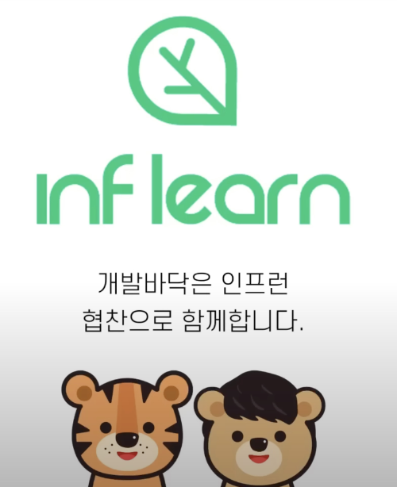
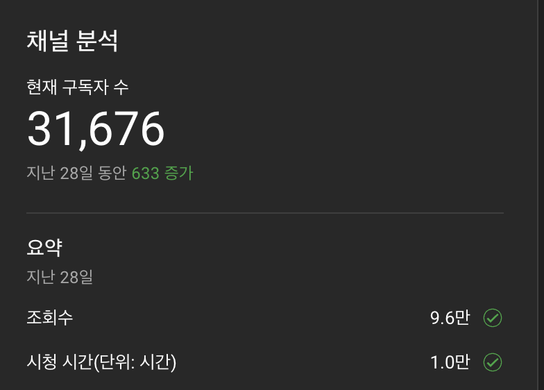
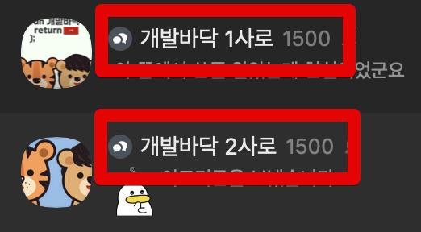

# 2022 개인 회고

2021년엔 개인 회고를 작성하지 않았다.  
일기장에 있는 내용들을 모아서 2021년부터 작성할까 하다가, 그럼 또 2022년 개인 회고를 미루게 될 것 같았다.  
  
회사와 관련된 [2022 CTO 회고](https://jojoldu.tistory.com/694)는 이미 작성했기 때문에,  
회사가 아닌 개인 생활를 정리했다.  
  
새로운 회사의 적응을 마침과 동시에 개인 생활을 점검해본 한해였다.  

## 생활

07~08 시에 출근해서 22~23시에 퇴근하는 생활을 한동안 계속 했다.  
아침 일찍 아무도 없는 회사에 와서 책을 보거나 개인 일정을 진행하면 참 기분이 좋았다.  
특히 유스페이스 스타벅스점은 **아침 7시부터 오픈**을 해서, 커피사서 회사 타운홀 창가에 앉아서 책을 보거나 코드를 작성하면 오늘 하루가 참 잘될것 같다는 느낌을 받곤 했다.  

올해 사무실을 이사한 날, 처음으로 출근했을때 **뭔가 선물 포장지를 내가 뜯는듯한 느낌**이 들어서 유별나게 사내 채팅방에 첫 사진을 공유하기도 했다.

나쁘지 않은 생활이였지만, 어느덧 그 오전시간이 온전히 내 시간은 아니게 되었다.  
일찍 오는 팀원이 있으면 같이 수다를 떨고, 개발 & PO 등을 비롯해서 많은 분들이 그 시간에도 여러 질문들을 한다.  
그러다보니깐 온전히 나홀로 즐기던 아침 시간이 온데간데 사라졌다.  
  
회사에 있으니 당연한 일이긴한데, 문제는 **하루의 업무를 시작하기 전 충전을 하는 시간이 사라지는 것**이였다.  
  
원래 하려던 일들을 오전에 달성 못하면, 많이(?) 힘들어하는 편이라서 이 부분을 어떻게 좀 해결하고 싶었다.  
그래서 한동안은 집 근처 까페에서 개인적인 용무를 다 보고 에너지 충전을 한 뒤에 출근을 하는 걸로 변경했다.  
  
까페에서 하는 것도 오래가지 못했다.  
몇가지 문제가 있었다.

- 집 근처 카페들은 모두 아침 8시부터 오픈인데, 회사 출근시간을 고려하면 9시에는 카페에서 출발해야되서 정작 **집중 시간을 매일 1시간**밖에 가져가지 못했다. 
- 11월이 되니 오픈 시간에 맞춰 가면 **너무 손이 시렸다**.

생각보다 아침 기온이 낮아서, 손을 벌벌 떨면서 키보드를 치는데 이래서는 오래 못할것 같았다.  
  
그래서 찾아보던 중 집에서 500m도 안되는 거리에 [집무실](https://www.jibmusil.com/)이 있는 것을 발견했다.

### 집무실

로켓펀치가 운영하는 집무실은 월정액제 혹은 시간제로 **24시간** 출입이 가능한 무인 공유 오피스이다.  

  

기본적으로 커피머신과 원두, 간단한 다과, 얼음 정수기, 공기청정기, 창가뷰의 책상, 적정온도, 깔끔한 화장실 등 공유 오피스의 기본적인 옵션들을 다 제공한다.  
특히 적당한 볼륨의 재즈 음악이나 적당한 조명, 적정 온도 등을 24시간 제공한다는게 너무 좋았다.  
  
그래서 현재까지는 만족도가 너무 높다.
회사 업무 때문에 부득이하게 회사에 남아서 일할때도 있지만, 가능하면 저녁에 집무실로 바로 달려가서할까도 고민하고 있다.

> 하지만 그럴일이 1월 현재에도 없다...
> 운동하고, 야근하다보니 저녁에는 얄짤없이 사무실이다.

여튼 출근 전 집무실에서의 1~2시간으로 일상이 다시 회복되었다.  
다시 즐겁게 출근전 에너지를 충전하고, 회사에서 즐겁게 업무를 볼 수 있게 되었다.

## 블로그

2022년은 블로그 성적표가 많이 아쉽다.
조회수나 이런것 보다는 내가 발행한 글 자체가 적다는게 **나를 위한 시간을 올 한해는 많이 만들지 못했다**는 것을 표현하는 것 같았다.  
  
블로그에 글쓰기가 나를 지켜주는 여러 자존감의 기둥들중 하나인데, 이게 2022년에는 단단하지 못했다는 생각이 들었다.  
물론 다른 여타 기둥들이 있어서 큰 문제는 없었지만, 그럼에도 가장 큰 기둥 중 하나라서 집무실을 계기로 다시 열심히 블로그에 쓸 글과 코드를 작성하고 있다.  
  
(아쉬웠던) 2022 블로그 성적표는 다음과 같다.

(GA에서 잠재고객 -> 개요로 가면 항목을 볼 수 있다.)

* 전체 사용자수: 49.9만
  * 2021년: 46.6만 (+3.3만)
* 최대 MAU: 6.1만
  * 2021년: 6.4만 (-0.3만)
* 최대 월 PV: 20만
  * 2021년: 34만 (-14만)
* 전체 페이지뷰: 202만
  * 2021년: 258만 (-56만)
* 세션당 페이지수: 1.78
  * 2021년: 2.43 (-0.65)
* 이탈율: 79.04%
  * 2021년: 55.78% 

**MAU 6만, 연 User 50만, 연 PV 200만**의 기술 블로그라는 것인데, 이 지표가 작년보다 후퇴한것이라서 아쉽다.  
신규 사용자를 비롯해 전체 사용자가 소폭 증가한것에 비해 **모든 수치가 떨어졌다**.  
  
원인은 되게 명확하다.  
6,7,8월에 글을 거의 발행하지 못했기 때문이다.

(티스토리 월별 글 발행수는 [여기서](https://tistory-ppm.netlify.app/) 확인해볼 수 있다)  
  

- 6월엔 2개
- 7월엔 1개
- 8월엔 0개

  
특히 **이탈율이 55.78% -> 79.04%** 가 된 게 뼈아프다.  
구글 검색으로 블로그를 방문은 하지만, 그다음에 볼만한게 없는 블로그가 된것처럼 느껴졌다.  

6~8월에는 사내에 여러 일들이 있었다.  
상반기 워크샵을 비롯해서 인프콘, 검색엔진 프로젝트 등 여러 프로젝트들이 겹치기도했고, 외부와 협의하는 일들이 많기도 했다.  
그리고, 개인사에서 큰일이 생겨 그걸 회복하고 다시 일상으로 돌아가는데 꽤 시간이 필요했다.  
  
이때 너무 바빠서 블로그 글을 거의 쓰지 못했고, 실제로 개인 커밋양도 굉장히 줄었다.  
올 하반기가 어떤 의미에서는 나에겐 **가장 개인적인 성장은 못한 시기가 아닌가** 하는 생각도 들었다.  

물론 나는 엔지니어이기 때문에 블로그가 얼마나 잘되고 있느냐가 핵심은 아니긴하지만, 어떤 의미에서는 **컨텐츠 업계에서 일을 하면서 이 작은 블로그 조차 제대로 하지 못하는데** 어떻게 컨텐츠 서비스를 할까 하는 생각도 들었다.  
  
어디까지나 블로그는 내가 공부한 것들, 내 고민들을 정리하는 공간이다.  
1순위는 나를 위한 블로그가 되어야한다.  
다만, 2022년의 성적표는 **개인 학습에 게을렀던 나를 표현**하는것처럼 보였고, 꾸짖는것처럼 보였다.  
그래서 반성할 지점이 많았던 것 같다.

기술 블로그로는 드물게 **연간 200만 조회수**가 꾸준히 나오고 있다.
대략 6개월에 100만정도 조회수라서, 작년 12월에 드디어 누적 조회가 800만이 되었다.

**700만**

 
 

**800만**

(아쉽게 800만 딱 되었을때를 찍지 못했다.)  
  
아마 2023년 12월에는 **조회수 천만 기술 블로그**가 될 수 있을것 같다.  
9월이나 10월쯤, 더 빠르게 달성하면 좋겠다는 작은 소망이 생겼다.  
  
2022년 가장 조회수가 많았던 Top5 는 다음과 같다.

1. [2021년 CTO 회고](https://jojoldu.tistory.com//626)
2. [[mysql] 인덱스 정리 및 팁](https://jojoldu.tistory.com//243)
3. [(2021) 1. 비전공자로 자바 백엔드 개발자 시작하기](https://jojoldu.tistory.com//505)
4. [Swagger로 API 문서 자동화하기](https://jojoldu.tistory.com//31)
5. [IntelliJ 디버깅 해보기](https://jojoldu.tistory.com//149)

[2021년 CTO 회고](https://jojoldu.tistory.com//626)가 이렇게 많이 조회될줄은 몰랐다.  
"기존에도 계속 회고는 작성했는데, 2021년 CTO회고만 왜이렇게 조회수가 높을까?" 생각을 해봤다.  
딱히 글빨(?)이 더 좋아진것도 아닌데 말이다.  
  
정말 컨텐츠는 어디서 터질지 모르니, 꾸준히 작성하는게 왕도라는게 새삼 느껴졌다.  
단순히 블로그 조회수를 높이기 위해 조회수가 터질것 같은 글 위주로 쓰진 않을것이다.  
다만, 개인적인 성장과 블로그의 성장 두마리 토끼를 다 잡으려면 결국엔 꾸준히 학습하고 기록하는 습관과 그 양을 늘리는 것 뿐인것 같다.  

## 일일커밋

올해 개인 프로젝트에 대한 커밋은 809개 밖에 하지 못했다.

나는 일단 회사 계정과 개인 계정을 분리해서 사용한다.  
그래서 회사의 커밋과 개인 프로젝트/학습에 대한 커밋은 구분이 되어서 이렇게 회고할때 도움이 많이 된다.  
올 한해 내가 얼마나 개인 공부에 시간을 쓰지 않았는지를 직관적으로 보여주기 때문이다.  
  
물론 어느정도 연차가 쌓이기 시작하면 **커밋의 양과 학습의 양은 전혀 상관관계가 없다**.  
실제로 무의미한 커밋 여러개가 쌓인 것 보다는, 많은 고민 끝에 작성된 커밋 1개가 훨씬 더 좋은 성장이기 때문이고 이 부분에 대해서는 여러 채널에서 언급했다.  
  
하지만, 현실에는 게임 속 Level처럼 능력치를 볼 수 있는 방법이 없기 때문에 **꾸준히 성장하고 있다를 체크해볼 수 있는 객관적인 방법이 없다**.  
그래서 일일커밋을 유지하는 것은 엄청난 성장을 한 것을 표현하진 못해도, 그래도 매일 의식적으로 개인적인 성장을 위해 하고 있는 일을 나타내는 지표로 사용하고 있다.

그리고 이제는 **일상을 지켜주는 하나의 루틴**이기도 하다.  
일상이 무너지려고 할때 어떻게든 한 줄의 글을 쓰고, 한 줄의 코드라도 쓴다.  
정갈한 밥상 한그릇을 먹고, 깨끗하게 샤워를 하고, 집 근처를 산책하는 것처럼 일상을 회복하고 지키는 루틴 중 하나가 된 것이기 때문에 이게 무너지고 싶지는 않았다.  
그래서 매일 아주 작은 코드라도 커밋을 하려고 한다.  
    
그걸 고려해보면 2021년, 2020년에 비해 2022년에 얼마나 내 개인 시간을 확보하고 활용했는지가 비교가 많이 된다.

**2021**

**2020**

블로그도 그렇고, 커밋도 그렇고 **회사일을 한다는 핑계로 개인 학습에 도망친건 아닐까** 하는 생각을 했다.  
실제로 그런 순간도 있었다.  
회사일이 익숙해지는 시점이 왔을때가 그랬다.  
  
회사일을 하고 있으면 내가 헛되이 시간을 쓰고 있는게 아니라는 안심이 되기도 한다.  
그래서 마음 편하게 회사일 한다는 핑계로 최소한의 학습, 코드만 작성하는 날도 많았다.  
하지만 정작 그때 했던 그 회사일은 **지금 당장 해야하는 일은 아니였다**.  
그렇다고 굉장히 중요한 일도 아니였다.  
짜투리 시가에 짬짬이 해도 되는 일들이 많았는데, 그런 일들을 중요한 일처럼 처리하고 있었다.  
중요하지도, 급하지 않은 일에 너무 많은 시간을 썼다.  
그리고는 정작 중요한 나를 위한 시간을 만들지 못했다.  
  
현재의 우리 개발팀은 빠르게 성장중이다.  
그래서 그들을 위한 좋은 결정을 내리기 위해서는 나 역시 개발팀의 성장에 맞게 성장해야 한다.  
(이런 문장들이 성장라이팅처럼 될까봐 조심스럽지만)  
  
꾸준히 성장하는 리더의 모습을 팀원들에게 보여주고 싶다.  
과거에 쌓아놓은 재산을 기반으로 야금야금 쓰기만 하다가 결국은 밑천이 다 드러나는 건 아닐까 하는 생각을 했다.  
  
그들이 나를 좋은 리더로 봐주는것처럼,  
그 기대에 부응하고 싶다.
  
## 개발바닥

2021년 회고를 안쓴 것 중 가장 아쉬웠던 것이 [개발바닥](https://www.youtube.com/@devbadak)이다.  
아마 이건 나중에 다른 글에서 좀 더 자세히 쓸 것 같다.  
(개발바닥을 하게 된 계기, 그당시 나와 호돌맨의 생각들 등등)  
  
2021년 11월 [영한님의 영상](https://www.youtube.com/watch?v=l0h1pQ96u2g)을 마지막으로 2월까지 휴식기를 가졌다.  
거의 3개월을 쉬었다.  
휴식 사유는 간단했는데, **편집을 담당하는 호돌맨에게 번아웃**이 왔다.  
당시엔 토요일에 2시간 촬영을 하면, 호돌맨이 일요일에 6~8시간동안 영상 편집을 진행했다.  
영상 컷, 편집, 자막까지 모두 하고 우리가 촬영한 2시간 중 살릴 것과 날릴것을 구분하기 위해 2시간 영상을 다시 봐야하는 등으로 매주 일요일이 호돌맨에게는 영상 편집만 하는 시간이 되었다.  
  
누가봐도 무리하는게 보였고, 호돌맨도 힘들어했기 때문에 잠시 겨울방학을 가지기로 했다.  
  
겨울방학으로 쉬던 중에 대표인 쭈가 "근데 왜 개발바닥 겨울방학해요?" 라고 물어봤다.  
그래서 호돌맨이 편집하느라 너무 힘들어서 그렇다고 이야기를 하자, "인프런에서 편집자 비용 지원해서 개학하는거 어때요?" 라고 의견을 주셨다.  
(호돌맨은 겨울방학 동안 많은 일들이 풀려서, 개발바닥이 호돌맨의 운을 먹고 있던게 아닌가 하는 합리적 의심을 하던 때였다.)
  
그래서... **개발바닥은 인프런의 후원으로 시즌 2를 시작하게 되었다**.

이제는 매주 토요일에 영상을 찍고, 편집자분께 영상을 전달드리면 된다.  

인프런이라는 서비스와 개발바닥이라는 유튜브 채널이 같이 협력한다는 모습이 좋았다.  
결국 내가 인프랩을 퇴사해도, 이 관계는 회사x채널의 관계이기 때문에 좀 더 건강한 모습이지 않을까 싶었다.  
  
2021년 1월 15일에 첫 영상을 올렸으니, 2년이 채 안되서 **구독자 3만**을 달성했다.  

물론 이것보다 훨씬 더 빠르게 성장하는 IT 채널들이 많지만, 뭔가 우리만의 생각이나 대화를 좋아하는 분들이 이렇게 많이 있다는게 놀라웠다.  
어찌됐든 이 채널은 호돌맨과 나와의 대화가 주력 컨텐츠인데, 그러다보니 아무래도 대중적인 성향을 보이기 보다는 우리와 성향이 맞는 분들이 구독할 수 밖에 없다.  
그래서 3만이라는 숫자가 개인적으로는 놀라운 수치이다.  
**우리랑 취향이 맞는 사람이 이렇게 많다구**?와 같은 느낌이였다.  
그러다보니 조금씩 더 욕심이 나는것 같다.     

호돌맨의 아이디어로 오픈 카톡방을 만들었다.  
처음엔 가볍게 시작했다.  
호돌맨이 카톡방 이름을 **개발바닥 1사로** 라고 지었다.  
"아니 무슨 ㅋㅋㅋ 1500명 넘을 일도 없는데 웬 1사로 ㅋㅋㅋ 2사로 나오겠나 ㅋㅋ" 라는 이야기를 나눴다.  
  
근데 실제로 그런일이 벌어졌네?

500명, 1000명, 1500명 늘어나더니 결국엔...

1500명 Full 방으로 1사로, 2사로가 생겼다.  
**3000명이 개발바닥 오픈 카톡방**에 참여한셈이다.  
그러다보니 퇴근후 집 가는길에 밀린 카톡방 대화를 보는게 솔솔한 재미가 되었다.  
어떻게 보면 우리와 취향이 비슷한 사람들끼리 매일 개발 혹은 그게 아닌 다른 주제로 계속 이야기가 되는 것을 볼 수 있다는게 매일의 소소한 재미가 되었다.  
  

아참, 우리는 모르는 털보방, 향로방도 생겼다. ㅋㅋㅋ

(출처: [디시인사이드](https://gall.dcinside.com/board/view/?id=programming&no=2294410))

개발바닥이 단순히 유튜브 채널이 아니라, 커뮤니티가 되어가는것처럼 느껴졌다.  
그러다보니 주변에서도 유튜브를 더 확장할 계획이 있는지를 여쭤보신다.  
이 부분에 대해서 그렇게 진지하게 고민해보진 않았다.  
이게 너무 일처럼 되면 오래하기 힘들것 같았다.  
  
그래도 우리가 더 재밌기 위해서라도 호돌맨과는 앞으로 어떤 포맷으로 영상을 계속 올릴까에 대해서 종종 이야기를 나눈다.  
"우리둘의 사담으로만 계속 하는 것 보다는 조금 더 다채로우면 좋지 않을까?" 와 같은 이야기도 나누고 있다.  
[개면활성제](https://www.youtube.com/watch?v=Gng65OMKysc)가 그 대표적인 새로운 포맷이 될 것 같다.  
이외에도 우리도 재밌고, 커뮤니티분들도 좋아할만한 여러 포맷들을 시도해볼 것 같다.
  
2022년에 올린 영상 중 가장 조회수가 높은 영상은 [인프런 백엔드 Node 개발자 채용](https://www.youtube.com/watch?v=yNch4mLDZV4)이다.

채용 공고 소개하고 읽어주는게 이렇게 반응이 좋을지 몰랐다.  
  
요즘은 스타트업 혹한기라서 적극적으로 개발자를 채용하는 회사들이 많지 않은데, 주변 평판이 좋고 개발문화에 적극적인 스타트업들의 채용 공고를 리뷰하는 시간을 가져보면 어떨까? 하는 이야기도 나눴다.  
(아직 하겠다 안한다 와 같이 뭔가 결정된건 없다.)  
  
2023년에도 개발바닥 커뮤니티분들로 매일 재미를 얻어가야겠다.

## 외부활동

CTO로서의 외부활동 외에 개인적인 외부활동으로 크게 2가지를 진행했다.

### 디지털 청년 고민해결단 온라인 멘토링

과학기술정보통신부가 주관하는 디지털 청년 고민해결단에 참여해 온라인 멘토링을 진행했다.  
해당 부서 담당자분의 전화를 받고나서 "왜 나..?" 라는 생각을 했다.  
평일은 어차피 우리팀을 위한 시간이라서 안될것 같아서 거절하려고 했는데, **주말에 멘토링을 해도 된다**는 의견을 주셨다.  
더군다나 아직 회사에 합류한지 1년즘 해서 연락을 받았던터라 회사에 조금이라도 득이 되는 일이라면 다 할려는 때라 "**과기부가 진행한다는데, 하면 회사에 도움이 도움이 되지 않을까**?" 와 같은 마음으로 하기로 결정했다.  
  
매달 1회 주기로 작게는 3분 많게는 7분의 취준생, 퇴사자 분들을 대상으로 멘토링을 진행했다.  
이왕하는김에 좀 더 잘하고 싶어서 슬랙도 하나 만들어서 "어떻게 하면 멘토링 시간을 더 알차게 쓸 수 있을지"를 공유하고 추가적인 정보를 드리기도 했다.  

취준생분들과 주니어 퇴사자분들이 어떤 고민들을 하고 계신지 알 수 있는 좋은 시간들이였다.  
특히 내 일정상 토요일에 모든 멘토링이 진행되었는데, 주말에 어디 놀러가지도 않고 멘토링에 참여해서 이런 저런 고민들을 나누고 내 이야기를 들어주신다는 것에 감사했다.  
  
하지만 2023년에는 참여하지 않을 예정이다.  
  
최대한 **담당 매니저님이 배려**해주셨지만, 어찌됐든 정부에서 하는 프로그램이다보니, 멘토링이 끝날때마다 보고서를 작성해서 제출해야만 했다.  
더군다나 `.hwp` 로 드렸어야만해서... 나에겐 너무 힘들었다.  
  
약속된 시간에 참여하지 않는 멘티분들이 계시기도 했다.  
그들의 주말 시간이 중요하듯, 나의 주말 시간도 중요한데 참여하지 않는 분들이 계실때면 살짝 멍해지곤 했다.  
이런 멘토링은 무료로 해서는 절대 안되겠다는 생각을 했다.  
나는 멘토링비를 소정 지급 받았지만 참가하시는 멘티분들은 별도로 지불하는 것이 없는 것으로 알고 있다.  
무료라는 것은 참여자들의 허들을 낮추는 것이기도 하지만,  
정말 필요한 분들과 그냥 신청해보는 사람들을 구분짓지 못하게 만들기도 하는것 같다.
  
물론 너무 좋은 멘티분들도 계셔서, 멘토링 하는 시간이 즐거울때도 많았다.  
그래서 나쁜 기억 보다는 좋은 기억이 많았던 프로그램이다.  
다른 분들이 한다고 하면 적극 추천할것 같다.

### 공저

공저인 [개발자 원칙](https://jojoldu.tistory.com/686)을 출간했다.  

출간에 대한 메일이 왔을때는 처음에 거절하려고 했다.  
아직 끝나지 않은 집필이 있는데 (ㅠㅠ) 굳이 다른 책을 하는건 예의가 아니라고 생각했다.  
그러다 존경하는 리더중 한분이신 [성철님](https://www.facebook.com/fupfin) 주도하신다는 이야기와 **그동안 블로그에 썼던 이야기들을 소개하는게 어떻겠냐**는 의견에 참여를 하게 되었다.  
  
참여하신 저자분들 중에서는 내가 경력이 가장 짧기 때문에 "참여하는게 맞나?" 라는 생각도 많이 했다.  
그래도 언제 이 분들과 함께 내가 이름을 올려볼까 싶기도 했고, 나를 포함해서 9분이 참여하다보니 **20페이지만 작성해도 된다**는게 확실히 부담이 없었다.  
  
나를 제외한 다른 분들은 어떤 주제로 글을 쓰실까 궁금했는데, **초안이 완성되기 전까지 절대 공유가 안되었다**.  
그래서 글을 쓰면서도 "9명 중에 한명이라도 원칙이 겹치면 어떡하지?" 와 같은 걱정을 많이 했는데, 신기하게 **9명중 그 누구도 원칙이 겹치지 않았다**.  
정말 다들 각자의 경험내에서 가장 중요한 원칙들이 다 다르구나 라는 생각을 했던 기억이 난다.  
  
완성된 책을 받아서 읽어보고 나서는 정말 참여하길 잘했다는 생각이 들었다.  
[프로그래머로 산다는 것](https://product.kyobobook.co.kr/detail/S000001624658) 등의 국내 선배님들이 이야기하는 책들이 최근에 많이 없었다.  
최근에는 이런 선배 개발자분들의 이야기가 대부분 해외서적의 번역본들이 많아서 국내 선배님들의 이야기가 그리웠다.  
그러던 차에 이 주제로 된 국내 선배님들의 이야기가 책으로 나오게 되었고, 그 부분에 내 글이 실린다는게, 더군다나 좋아하는 분들과 함께라는 점이 참 영광스러웠다.  
  
몸담고 있는 서비스가 영상 교육을 주로 하기 때문에 가능하다면 회사에서 컨텐츠를 만드는 것에 더 관심이 많겠지만, 그럼에도 이번에 참여하길 잘했다는 생각이 든다.

## 아버지

> 이걸 블로그에 쓸까말까 고민을 많이 했었는데, 그래도 올해의 가장 큰 일이였기 때문에 남겨둔다.

2022년 5월, 아버지가 돌아가셨다.  
아버지는 내가 3~4세? 기억도 안나던 시절에 회사에서 일을 하시다 뇌졸증으로 한번 쓰러지셨다.  
다행히 회복하셔서 거동하시는데는 큰 문제가 없었지만, 1급 판정을 받아서 정상적으로 일을 할 수는 없는 상태셨다.  
그래서 어머니께서 실질적 가장 역할을 30년 넘게 해오셨다.  
유치원에 가기전부터 주변의 가정과는 조금 다른 환경에 있었던것 같다고 생각을 했는데, 막상 보면 모든 가정에는 그 나름의 걱정과 어려움이 있었던 것 같다.  
그래서 특별하다는 생각을 하지는 않았던것 같다.  
  
다만, "돈"에 대해서 자주 생각을 했다.  
가능하면 학비가 저렴한 국립대를, 직업은 꼭 경제적 자립이 가능한 것을 등등 어떤 선택을 할 때 가능하면 돈에 대한 기준을 꼭 세웠다.  
(물론 공부안하고 게임을 많이 하는 학생 시절이 길었다.)  
  
그러다 2019년 설 연휴에 집에서 쉬고 있다가 갑자기 쿵 하는 소리가 방에서 들렸다.  
가보니 아버지가 쓰러져 계셨고, 2번째 뇌졸증이였다.  
의사 선생님은 아버지가 다시는 예전으로 돌아가지는 못할것이다 라는 이야기를 해주셨고, 아버지는 쭉 병원에 눈만 뜬 상태로 누워만 계셨다.  

인프랩의 합류 제안을 2019년 가을에 받았지만, 거절했다.  
거절한 여러 이유중 하나에 아버지의 병원비가 있었다.  
우아한 형제들에서는 양가 부모님의 실손 보험을 지원했기 때문에 병원비 지원을 많이 받을 수 있었기 때문이다.  
물론 이것만이 100% 이유는 아니다.  
다만 여러 큰 이유중 하나였다.  

이 시기가 정신적인 스트레스가 심했다.  
회사내에서는 티를 안내려고 노력한것과 별개로 앞으로 어떡해야하나를 정말 고민 많이 했다.  
  
개인사에 대해 누군가 배려를 해주는 것을 좋아하지 않는다.  
내 일은 내가 다 끝내고 싶기 때문이기도 하고,  
그런 사유로 배려를 받으면 오히려 더 일상이 아닌 느낌을 계속 받게 되는 것 같았다.  
가능하면 일상이 무너지는 일은 피하는걸 선호해서 팀장님께만 공유 드렸다.  
그 시기에는 코로나까지 터져서 병원 방문도 안되고 하니 더 일에 몰두만 했던 것 같다.  
  
2022년 5월부터 병원에서 자주 호출을 했다.  
갑자기 휴가를 쓰고 대구를 내려가는 일이 잦았다.  
그러면서 마음의 준비를 계속 하다가, 어느날 어머니가 뭔가 기분이 이상하다고 하셔서 내려갔고, 그날 저녁에 아버지가 돌아가셨다.  
장례식과 발인은 어떻게 지나갔는지 잘 모르겠다.  
다만, 아무 생각 없이 노트북에 코드를 쳤던 기억은 난다.  
  
대구까지 멀리 와준 친구들, 동료들이 고마웠다.  

최근에 사주를 봤더니 "어머니를 더 사랑하지만, 아버지에게 인생의 영향을 많이 받았다." 라는 이야기를 해주었다.  
  
"불효자가 성공한다" 생각을 하고 있지만, 인생 전체의 결정들을 보면 그 결정들을 내리는 기반이 되어준 가치관들은 대부분 부모님의 영향을 받았던것 같다.  
그래서 사주의 결과를 보고 되게 신기해 했던 기억이 난다.

더 많은 이야기는 일기장에 해야겠다.

## 산만함 관리하기 

하반기에 들어서면서 집중력이 너무 떨어져있던 것을 발견했다.  
출근하면 **30분에 1번씩 Context 전환과 의사결정**을 해야만 했다.  
그리고 그런 일상을 1년 넘게 보냈다.  
그러다보니 어떤일을 하는데 있어서 **긴 시간을 집중하지 못하게 되었다**.  
2~3시간의 자유시간이 있는데, 예전처럼 그 시간에 집중하기 보다는 자꾸 산만해지고, 하나에 집중하지 못한다는 느낌을 계속 받았다.  
이래서는 안된다고 정말 위기감이 느껴졌다.  
    
성인 ADHD는 아닐까 우려도 되었는데, 병원에 가기전에 일단 내가 할 수 있는 것 부터 하자는 생각을 했다.  
  
크게 3가지를 시도했다.

* 집무실
* 모니터 1대 쓰기
* 리디 페이퍼 사용하기

이 중 집무실은 위에서 한번 언급했으니 모니터 1대 쓰기와 리디 페이퍼에 대한 것만 나눠본다.

### 모니터 1대 쓰기

회사에서 모니터를 2대를 쓰다가 1대로 변경했다.  
위에서 언급했지만 30분? 1시간? 마다 Context 전환이 계속 진행하다보니, 대화가 끝나고 다시 모니터를 볼때면 "내가 모니터 2대 중 어디를 보고 있었지?" 를 떠올리는 일이 잦아졌다.  
한 쪽의 IDE에서 코드를 작성하던 중이였는지,
한 쪽의 브라우저에서 자료를 찾아보던 중이였는지와 같이 잠깐 잠깐 생각하는 일이 계속 잦아졌다.  
  
대화가 끝나고 나서도 바로 하던 일을 이어가면 좋을것 같은데, 이래서는 안될것 같았다.  
  
그러다 어느날은 타운홀에서 모니터 1대만 두고 업무를 보는 날이 있었다.  
그 날은 희안하게 몰입도가 잘 유지되었다.  
Context 전환 후에 돌아와도 몰입도가 쉽게 흩어지진 않았다.  
대화 하고 돌아서면 바로 **가장 최근까지 작업하던 화면만 보였으니깐** 말이다.  
그래서 그 이후로 모니터를 1대만 쓰는 것을 해보고 있다.
  
조엘 온 소프트웨어가 언급했듯이 모니터 2대의 생산성을 반박하고자 하는 것은 아니다.  
다만, 지금 나에게는 **생산성 보다는 산만함이 더 중요한 관리요소**였다.  
  
대략 2개월 정도 해본 결과로는 의도한대로 몰입도를 어느정도 유지하고 있는 것 같다.  
  
물론 이게 **플라시보 효과**일 수도 있다.  
하지만 산만함이 인지되서 스트레스 받는 것 보다는 현재 상태가 더 좋은 것은 확실하게 긍정적인 효과다.  
  
올해는 이 1대 모니터를 계속 유지해보면서 나 자신을 지켜봐야겠다.

### 리디 페이퍼

가능하면 휴대폰을 사용하지 않으려고 예전에 쓰던 [리디 페이퍼 PRO](https://namu.wiki/w/%EB%A6%AC%EB%94%94%EB%B6%81%EC%8A%A4%20%ED%8E%98%EC%9D%B4%ED%8D%BC%20%ED%94%84%EB%A1%9C) (2017년형)를 다시 꺼냈다.  

식사시간, 이동시간등 짜투리 시간에 트위터, 링크드인, 페이스북, 아웃스탠딩, 미디엄 등 텍스트 컨텐츠를 읽는 것을 좋아한다.  
  
이런 정보들은 시간 내서 보기 보다는, 이렇게 짜투리 시간을 내서 보는게 효율적이다.  
근데 이게 어느 순간 서늘할 정도로 위기감을 느끼게 했다.
**더이상 새 글이 없는데도 다시 저 앱들을 실행하고 있던 나를 보았을 때**였다.  
유튜브를 볼때도 짬짬이 시간이 나면 **Shorts 위주로** 보고 있었다.  
20~30초의 서로 다른 주제의 짧은 영상들을 정말 아무 생각없이 계속 넘기면서 보고 있었다.  
  
이 행위가 내 산만함을 증폭시키는 가장 큰 원인이라고 생각됐다.  
SNS를 보는 시간, 유튜브 Short를 보는 시간이 30초정도인데, 30초마다 다른 주제의 컨텐츠를 계속 보는 것이기 때문이다.  
  
내가 이런 분야의 전문가는 아니지만, 이건 너무 당연하게 문제가 된다고 생각했다.  
  
이걸 해결하려면 **휴대폰을 멀리 둬야겠다**는 생각을 했다.  
(물론 장애 대응을 위해 항상 지참해야하지만.)  
  
그렇지만, 짜투리 시간에 텍스트를 보는 것을 멈추고 싶진 않았다.  
그래서 Context 교체 되는 일 없이 긴 컨텐츠를 다루는 책을 봐야겠다는 생각이 들었다.  
  
그리고 책 한권 보다 가벼우면서도 많은 책을 담을 수 있으면서도, **단일 앱밖에 사용이 안되는** EBook 리더기인 리디 페이퍼였다.  
  
아이패드 프로가 있지만, SNS나 유튜브 같은 소셜 앱을 언제든 설치할 수 있고, 눈의 피로도를 심하게 만들기 때문에 (리디 페이퍼는 E-link 방식이라 눈의 피로가 덜하다)  
  
물론 루팅 같은 것을 통해 리디 페이퍼에도 다른 앱을 설치할 수 있겠지만, 애초에 그러면 내 원래 목적에서 벗어나기 때문에 루팅을 할 생각은 전혀 없고, 리디 앱 하나만 있는 현 상태가 지금의 내 문제를 해결하는 가장 좋은 방법이라고 생각되었다.  

> 루팅이 합법이 아니라고 알고 있기도 하고.

식사할때나 이동중일때 항상 리디페이퍼를 들고 다니면서 책을 본다.  
자기전 침대에서도 리디 페이퍼를 보다가 잠이 든다.  
  
현재까지의 만족도는 높다.  
특히 쉬는 시간에도 잦은 Context 전환이 발생하던 생활 패턴에서, 이제는 하나의 긴 컨텐츠를 짬짬이 시간마다 보는 패턴으로 변경되어서 스트레스가 덜하다.  
  
만족도가 높아서 2023년에도 별 문제가 없다면 이 생활 패턴은 계속 유지될 것 같다.

## 마무리

2022년에는 여러 일들이 많기도 했고, 일상이 무너질뻔 하기도 했고, 기존의 생활 패턴에서 변화를 주기도 했다.  
이번엔 이런 시도를 해봐야지, 이 부분은 내가 좀 부족했는데 좀 더 좋은 방법이 없을까? 등등을 고민하고 시도하는 일들이 많았던 해였다.  

어떤 면에서는 너무 많은 변화에 스트레스가 될 수도 있겠지만, 의외로 이렇게 계속 시도하는 것들 때문에 마치 육성 게임 (프린세스 메이커..?) 같이 느껴진 1년이였다.  
  
고민 없는 성실함은 편견의 벽만 두텁게 만든다고 생각한다.  
가장 좋은 방법을 계속해서 단련하는 것이 맞지만, 잘못하면 정답이 1개 뿐이라는 벽에 갇힐 수도 있다는 생각이 들었다.  
그래서 기존의 방식이 계속 잘못된건 아닐까 의심하고 다른 방법을 시도하는게 좋다는 생각을 하게 된 것 같다.  
  
대구의 자랑 (난 대구 출신이다) 양신 양준혁 선수는 기존에 익숙한 타법을 버리고 만세 타법을 개발했다.

양준혁 선수는 굉장히 많은 타격폼을 변경한 선수이다.  
우리나라 최고의 타자인데도 말이다.  
나는 이런 이야기를 참 좋아한다.  
그래서 나도 그런 사람이 되어야지라는 생각을 자주 한다.
그 동안의 내가 잘 사용했던 방법들을 언제든 과감하게 버리고 새로운 방식을 시도하는 그런 모습말이다.  
  
2023년에도 그런 모습이 되어야겠다.