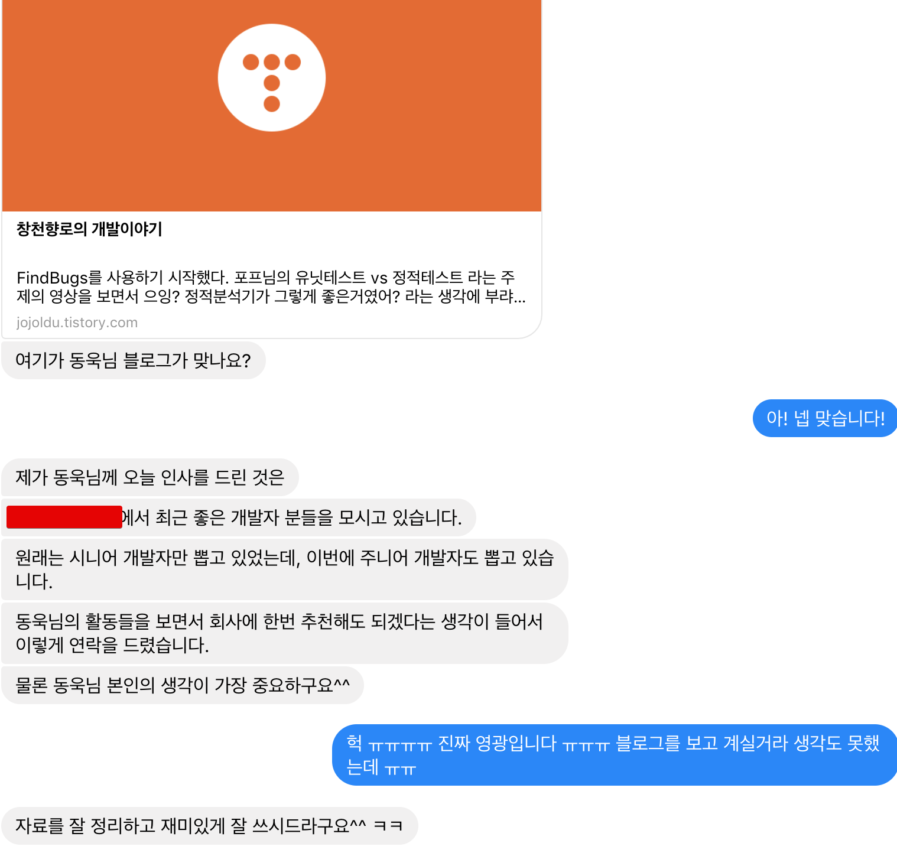

# 3번째 직장

## 3. 직장1 - SI

**매출액 1천억이 넘는 SI회사**였습니다.  
웃픈 얘기지만, 당시에 연봉 계약서에 2400만원이 적혀있었는데 "저렇게 큰 회사가 설마 이 연봉이겠어? 수습 급여겠지" 라고 생각했다가 첫 월급 받고 깜짝 놀랬습니다.  
2400이 진짜 정식 연봉이였습니다.  

> 2400만원이면 세전 월 급여가 200이며 수습기간동안은 80%인 160만원이 세전 월급이라, 실제 첫 급여는 **160의 10%를 뗀 144만원**이 들어왔었습니다.  
만약 연봉이 중요하시면 이런 계산은 어느정도 하고 지원하시면 좋습니다.  

새벽 4시에 회식이 끝나고 자취방에 들어오며 갑자기 너무 화가나서 집 벽을 때렸습니다.  

## 4. 직장2 - 포털 서비스

리눅스를 한번도 안쓰다가 
회사다니면서 

주니어 일때는 그 무엇보다도 **코드리뷰** 문화가 있는 회사를 가는게 가장 중요함을 깨달았다.  
회사복지, 회사 크기, 연봉 등을 코드리뷰와 동일선상에서 비교하면 절대 안된다고 생각한다.  
최우선 조건이 **코드리뷰**다.  
개인적으로는 주니어일때는 서비스 성공여부/서비스의 트래픽/기술스택 보다도 코드리뷰 문화가 있냐 없냐가 더 중요하다고 생각한다.  
누군가에겐 너무 당연한 얘기인데, 

당시에 코드리뷰를 같이 했던 친구들이 다 원하는 회사로 이직하는걸 보면 그 무엇보다도 중요한것 같다.

2016년 6월부터 본격적으로 [블로그](http://jojoldu.tistory.com/)를 시작하게 되었다.

## 돌아보며

돈은 쓴만큼 돌아오는것 같습니다.  
지금 부족한 영역이 있는데, 이 부분을 100~200만원으로 빠르게 습득할 수 있다며 
첫 직장은 다른 조건은 다 제쳐두고, **코드리뷰 하는 팀**에 입사하는게 가장 좋습니다.  
여기서 **팀**이란 단어에 주목하셔야 하는데요.  
같은 회사라도 개발환경은 
A 회사의 개발환경이 좋다고 소문났지만 그건 A회사의 특정 팀만  
