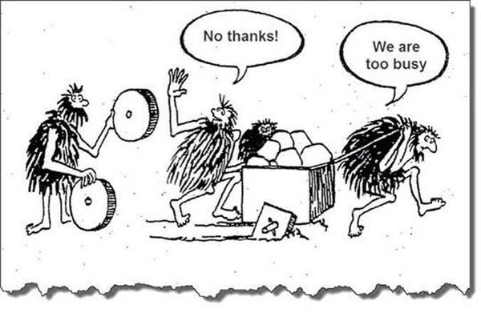

# 루비콘 프로젝트 (랠릿 서비스 Ver 1) 소감

[랠릿 서비스](https://www.rallit.com/) 를 오픈하고 참여자들의 개인 소감을 다들 작성하는 시간을 가졌다.  
실제 프로젝트의 프로세스 방식, QA 방식등을 전체적인 업무 회고는 내일 (2022.03.02) 진행할 예정인데, 그 전에 각자 어땠는지 소감을 작성하는 시간을 2월에 가졌다.  
  
이번 글은 사내에 공유한 소감글을 블로그로 옮겼다.  
  
루비콘 프로젝트에서 진행한 프로젝트 방식 / 백엔드 프로젝트 방식 등은 TF 회고가 끝나고 올라갈 예정이다.  
이건 프로젝트에 참여한 개인적인 짧은 생각들만 정리했다.

> 프로젝트 구성원들의 전체 소감은 3월안에 링크로 공유될 예정이다.

## 일정

프로젝트는 **7월에 시작되어, 1월 27일에 정식 오픈**하였다.  
중간 투입된 분들은 잘 모르실 수 있지만, 초기에 대표님과 PO 1분이 같이 사용자 스토리 잡는 것이 7월부터였다.

* 7 ~ 8월: 사용자스토리, 와이어프레임
* 9월: 디자인 구체화 / 도메인 & 개발환경 설계
* 10월 ~ 12월: 개발
* 12월 ~ 1월: QA 및 남은 기능 구현
  
공식적으로는 **약 7개월**간 진행된 것이다.  
  
다만, 본격적으로 **개발은 9월부터** 진행되어 3개월간 개발하여 **12월부터 QA**를 하게 됐다.  

(9월 2일, 3일에 시작된 첫커밋)  
  
개발 기간만 보면 짧았지만, 전체 일정을 보면 결코 짧은 일정은 아니였다.  
7개월이란 시간이 빡빡하게 느껴진 것은 이 기간 안에서 비효율적으로 낭비되는 시간이 많았기 때문이다.  
당장 생각나는것들만해도 다음과 같다.

* BE 파트에서 TypeScript로 직접 구성하는 것과 NestJS를 사용하는 것 사이 비교 검증 시간을 좀 더 짧게 가져갔다면
* FE 파트에서 아키텍처에 대한 논의를 좀 더 빨리 결정 났다면
* 개발 파트 전체적으로 기술의 숙련도가 어느정도 갖춰져있는 상태였다면
* PO, 개발의 신규 입사자분들의 투입을 좀 더 빨리했다면
* B2C 기획 & 디자인을 할때 개발이 같이 들어갔다면
* 와이어프레임을 PO & 디자인 & 개발이 함께 들어가고 기간을 단축시켰다면

등등 이외에도 정말 많은 부분에서 시간을 활용할 수 있는 여지가 많았다.  
  
반대로 얘기하면 다음엔 이것보다 훨씬 더 효율적으로 기간을 이용할 수 있는 여지가 많다.  
  
12월이 되어 QA를 시작하면서 QA 지원분들부터 시작해서 TF 멤버까지 **오픈하지 못하는건 아닐까** 하는 걱정이 퍼지기 시작했다.  
  
1개를 해결하면 2개가 추가로 생성되는 현상은 당사자에게는 끝나지 않는 터널 같은 느낌이기 때문이다.  
이럴때 어떻게든 오픈하기 보다는 **작게라도 마침표를 찍고**가는게 좋다고 생각했다.  
그래서 B2B 의 오픈은 전체 기능의 30~40%를 차지하는 **지원자 관리** 기능을 1월로 연기했다.  
그리고 12월에 60~70%의 기능이라도 마침표를 찍도록 했다.  
  
물론 이 결정은 1월의 일정을 더 타이트하게 한것이긴 했지만, 그 당시 12월달의 B2B 파트 일정 압박 스트레스가 너무 심했기 때문에 1월달을 고려할 수가 없었다.  
  
모든 프로젝트와 개발이 마찬가지이지만,  
**현재도 못하면서 미래를 이야기하는건** 낭만가나 할 이야기이다.  

다행히 JIRA 티켓처리를 시각화해서 QA 처리에 대한 모니터링을 지속적으로 할 수 있었다.

일자별 생성된 티켓수와 처리된 티켓수를 비교하면서 게속 일정을 체크했다.

## 위기

11월 5일 새벽 6시에 주스(TF멤버)에게 전화가 왔다.  
샤워를 하던 중에 이시간에 왜 주스가 전화를? 하면서 급하게 받았는데, "중환자실에 입원해서 쭈에게 대신 이야기해달라"는 연락이였다.  
  
병원에서 얘기하기로는 타이레놀을 너무 자주 복용해서 몸에 무리가 왔다고 한다.  
  
그 전부터 주스의 표정이 그렇게 밝지 못했었다.  
특히나 그 전날에 개발파트 스터디 완료 회식을 할때 주스만 먼저 퇴근할때도 안색이 너무 좋지 못해서 걱정이 되서 다음날 오면 티타임을 해야겠다는 생각을 하던차에 바로 입원 얘기를 듣게 된 것이다.  
  
주스가 하던 일은 바로 다른 분이 맡아서 진행했다.  
이미 **ERD, 코드 컨벤션이나 API 스펙**등이 전부 Confluence에 정리가 된 상태라서 인수인계는 별도로 필요하지 않았다.  
  
업무에 복귀한 주스는 TF에는 더이상 참여하지 않고, 기존 인프런 서비스를 담당하기로 했다.  
  
이때부터 좀 강하게 **TF멤버들의 건강을 살피게 됐다**.  
특히 **고카페인 음료 섭취를 제한**했다.  
  
이 프로젝트 하고 다들 해산할것도 아니고,  
몇년을 같이 할 멤버들의 건강을 망치면서까지 성공시켜야할 프로젝트는 아니다.  
이제는 몬스터 같은 고카페인 음료는 냉장고에서 볼 수가 없게 됐다.

## 기술스택

입사후에 느낀 외부와 내부의 가장 큰 온도차이가 기술 스택에 관한 것이였다.  
PO & 디자인 파트도 그렇겠지만, 개발 파트 역시 전문성에 대한 목마름이 강하다.  
  
입사후 1 on 1을 하고, 외부의 개발자들과 이야기하면서 들었던 아쉬움이 **개발파트의 기술적 욕망을 거세당한것**이다.  

* A라는 문제를 해결할 수 있는 방법이 있는데, 우린 그걸 쓸 수 없어.
* 다른 회사에서 좋은 방법을 공유했는데, 우린 그걸 쓸 수 없어.
* 면접관으로 들어가서 지원자들과 같은 공감대를 형성해서 질문을 할 수가 없어

등등 **기술적으로 성장할 수 있는 욕망들을 현재의 상황에 의해 저지**당한 경험을 다들 갖고 있었다.  
  
아래는 채용공고를 공유하기 시작할때쯤 커뮤니티 여론을 조사하던 중에 보게 된 글이다.

(디시인사이드에서 인프런 채용 공고 검색시)  
  
바깥에서 보던 사람도 그랬는데, 내부에서는 오죽했을까 라고 생각해보면 쉽다.
비단 FE 파트 뿐만 아니라 BE 파트에서도 많은 고민들이 있었다.
미드레벨 개발자로 가기 위해 뭐가 있는지 조차 모르고 단순 기능만 구현하다보니 **입사전 같이 공부했던 타사 친구와 이야기하면 힘들어하는 분**도 있었다.
  
그래서 이번 프로젝트는 성장의 재료로 써야하는 상황이였다.

(바퀴가 네모난데도, 동그란 바퀴로 교체하지 않고 힘으로 끌고가는 모습이 기술 부채를 나타낸다)  
  
단순히 인프런 서비스의 기술 부채를 떠나, 성장하기 위한 욕망을 분출하기 위한 프로젝트가 되어야만 마음속 부채가 해소되기 때문이다.  
  
그래서 FE와 BE에 새로운 방법을 도입했다.  
다만, FE파트와 BE 파트의 전략은 다르게 가져갔다.  
  
두 파트의 상황이 다르기 때문이다.

* FE 파트는 모던 (Modern) 기술 스택 (React, Vue, TypeScript) 등을 경험을 해보셨던 분들이 계셨다.  
* BE 파트는 NodeJS의 모던 기술 스택 (NestJS, TypeORM, TypeScript) 를 경험하신분이 한 분도 없었다.  
  * BE파트의 경우 **테이블 설계가 아니라 도메인 설게** 라는 관점의 전환과 **테스트 코드는 어떻게 작성하는지** 등에 대한 경험이 필요한데 이것 역시 없었다. 
  
그래서 BE 파트는 규칙을 내가 직접 다 정하고, 자율성을 좀 제한하더라도 좋은 코드, 좋은 프로젝트의 맛을 보는 방향으로 진행했다.  
  
반면 FE 파트는 Modern 스택을 알고 있는 상황에서 또 자율성을 제한하는 것은 **기술 욕망 거세 시즌2**가 되는 것이라 보고, 최대한 자율성을 존중하는 방향으로 결정했다.  
  
뭐가됐든 본인의 생각을 실전에서 써보고 넘어지고 깨져봐야 성장이 되기 때문이다.  
그래서 이게 다 좋은 결과를 냈냐는건, TF 회고때 이야기해볼 주제라서 회고가 끝나고 추가 작성할 예정이다.

## 프로젝트 부검 회고

프로젝트가 끝나고, TF 멤버분들께 전달드린 설문지가 있다.  
전체 TF 분들께 전달드린 질문은 다음과 같다.

* 이번 프로젝트 회고에서 이야기했으면 하는 주제가 있나요?
* 이번 프로젝트 회고에 대해 궁금한 점/기대하는 점은 어떤게 있나요?
* 이번 프로젝트를 하면서 기억에 남는 일들이 있나요?
* 이번 프로젝트를 하면서 가장 의욕/퍼포먼스가 높았을때는 언제인가요? 그땐 왜 의욕/퍼포먼스가 높았었나요?
* 이번 프로젝트를 하면서 가장 의욕/퍼포먼스가 낮았을때는 언제인가요? 그땐 왜 의욕/퍼포먼스가 낮았었나요?
* 과거로 돌아갈 수 있다면, 이번 프로젝트 기간 중 언제로 돌아가고 싶으신가요? 왜 그때로 돌아가고 싶으신가요?
* 제가 한 질문 이외에 더 물어봤으면 하는 질문이 있나요? 있다면 그 질문에 대한 여러분의 대답은 어떤게 될까요? 

이 질문에 대한 답을 가지고 다같이 회고를 할 예정이다.  
제출하신 분들의 답변을 보면 솔직하게 다들 작성해주셔서 회고할게 참 많을것 같다.

## 총평

루비콘 프로젝트는 그간 커리어를 봤을때 완성도가 높다고 볼 순 없다.  
다만, 인프랩 조직원으로서는 좋은 프로젝트이다.  
조직이 가지고 있던 프로덕트 관점에서의 많은 문제점들을 수면위로 올려주었기 떄문이다.  
  
회사의 프로젝트를 개인의 성취용으로 쓰는걸 선호하진 않는다.  
하지만, 이번 프로젝트는 그래야만 했다.  
우리가 제대로 프로덕트를 만들어 본 경험치가 압도적으로 부족하기 때문이다.  
  
그게 꼭 이번 프로젝트였냐 하면 회사관점에서는 안그래도 된다.  
외부의 좋은 시니어들이 합류하고 시작하면 리스크가 최소화 되고, 이번 처럼 고생할 일도 적었을 것이다.  
그 시니어들의 경험을 토대로 그대로하면 되기 때문이다.  
  
근데 그 방법이 **지금의 인프랩 멤버에게도 도움이 될지는 미지수다**.  
왜냐면, 우리는 그 시니어들의 경험치를 제대로 흡수할 수 없을 정도로 경험치가 너무 적기 때문이다.  
  
최근에 본 유튜브 영상 중에 "왜 중국은 세계에서 가장 많은 돈을 축구에 투자하는데, 아직도 축구를 못하냐" 에 대한 내용이 있다.  

* [관련 유튜브 영상(6분 15초부터)](https://youtu.be/JDLQlNVps_U?t=375)

중국의 축구 프로리그에는 유럽, 남미의 슈퍼스타들을 연봉 몇백억씩을 주면서 데려왔다.  
근데 중국은 이번 월드컵도 결국 베트남에 1:3 완패해서 본선 진출을 실패했다.  
**슈퍼스타들과 프로리그를 함께 뛰고 그 선수들의 기량을 바로 옆에서 보고** 있는데도 말이다.  
  
프로리그에만 투자해서 프로 축구리그는 외부 용병들로 오고, 전체 연봉도 커졌지만, **유소년 시스템이 부실해서 자국 선수들의 역량이 향상되지 못했기 때문이다** 라고 영상에서는 그 이유를 소개한다.  
  
마찬가지로, 외부의 시니어가 합류한다고 해도 우리가 충분히 그 사람들의 경험치를 흡수할 정도의 **최소한의 레벨이 되지 못한다면** 조직은 성장하지 못한다.  

특히 당장의 **프로젝트를 아무리 많이 해도, 기능을 아무리 많이 개발해도 역량 향상과는 무방하다**.  
(프로젝트 오픈 많이 해서 성장할 수 있다면 3~4개월 단기 SI 프로젝트만 계속 한 사람이 Guru가 되었겠지)  
  
한번은 제대로 프로젝트를 진행해보고, 본인들이 지식으로만 알고 있던 내용들을 실제로 적용해보면서 호된 경험도 해보면서 **매번 같은 방식을 쓰던 방식에서 탈피**해봐야 한다.  
  
리눅스 토발즈의 말 "Talk is cheap. Show me the code" 처럼 수많은 아티클과 도서에서 나온 이야기들, 본인의 뇌피셜로 있는 내용들을 실제로 한번 해봐야 진짜 실무에서 쓸 경험치로 정제가 된다.  
  
그래서 이번 프로젝트에는 각 파트별로 하고 싶었던 많은 부분들이 추가/개편되어서 진행되었다.  
  
문제가 있는건 문제가 아니다.  
문제가 있는데, 그걸 모르는게 문제다.  
그런면에서 이번 프로젝트는 인프랩 프로덕트 파트가 가지고 있는 수많은 문제점들을 수면위로 올리게 한것만으로도 큰 성과라고 생각한다.  
  