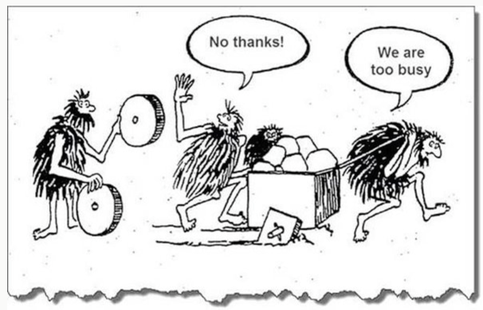
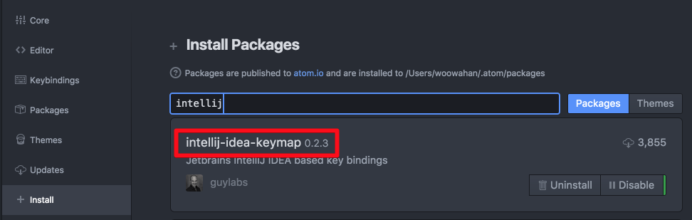

# 기술부채 (기업이 아닌 개인의)

최근에 8퍼센트의 CTO이신 [이호성님의 글](https://brunch.co.kr/@leehosung/2)을 보게 됐다.  
기술 부채에 대해 이야기하고 있는 글이였는데, 많은 공감이 갔었다.  
혹시나 기술부채란 단어에 대해 생소하신 분들을 위해 간단하게 소개하자면,  
  
**기술적으로 해결되어야 할 문제들을 뒤로 미루고, 비즈니스 문제를 해결하는 시점을 당기는 것**이라고 보면 된다.   (이호성님의 글에서 발취)

(출처: https://christierney.com/2015/12/04/technical-debt-in-an-image/)

아마 대부분의 IT기업에서 일하시는 분들은 어떤 내용인지는 쉽게 짐작이 되실것 같다.  
보통은 기업의 기술부채에 대해 많이 이야기를 하지만, 기술부채가 비단 기업에만 있는 것일까 라는 생각이 불쑥 들었다.  
  
"개발자 개인에게도 기술부채란 존재하는 것이 아닐까?"  
  
예전에 티스토리에 공부한 것만 올리다가 내 생각을 한번 정리한 적이 있었다.  
별거아니지만, 일기 작성하듯이 쭉 작성하던 중 흐름이 자꾸 끊기는 것을 느꼈다.  
  
사진을 추가하고,  
강조체를 지정하고,  
제목과 본문을 분리하는 등의 행위를 할때마다 흐름이 끊기는 것이였다.  
  
몇번 하다보니 그 이유를 깨닫게 되었는데,  
마우스에 손이 갈때마다 생각의 흐름이 끊기게되서 작성하고 싶었던 내용들이 조금씩 흩어지는 것이였다.  
  
이 때문에 Github에 올릴 코드외에도 단순한 생각정리 같은 내용들도 마크다운으로 작성하게 되었다.  
마크다운은 마우스없이 완성된 문서를 작성할 수 있기 때문이다.  
  
마찬가지로 개발을 하는 과정에서도,  
톰캣을 구동시키기 위해 마우스에 손을 올릴때,  
방금 전 열었던 클래스를 다시 열기 위해 마우스에 손을 올릴때,  
Refactor 기능을 사용하기 위해 우클릭을 할때마다 코딩의 흐름이 끊기는건 아닐까 생각하게 되었다.  
  
즉, **마우스에 손을 올릴때마다 생산성이 떨어지는** 느낌이였다.  
  
당시에는 내가 하는 클릭들의 단축키를 찾는 것이 더 시간 아깝다란 생각 혹은 이게 낭비라는 생각도 들지 않아서 찾아보지 않았다.  
  
그리고 계속해서 마우스로 해결을 해왔다.  
이렇게 **비효율적이지만 익숙한 방법을 고수**하는것.  
이게 바로 기술부채가 아닐까란 생각이 문득 들었던 것이다.  
  
개발자는 끊임없이 자기 개발을 해야하는 직업이라고 얘기한다.  
  
* 사이드 프로젝트
* 새로운 개발언어
* 새로운 프레임워크
* 등등..

다들 여러 방법으로 학습하고 자기 개발을 한다.  
  
근데 이런 것들이 가장 중요할까  
물론 이런 내용들이 나쁘다는 이야기가 아니다.  
다만 트렌드만 쫓고, 본인의 생산성은 낮은 상황이라면 조금은 공부 방향에 대해 고민해봐야 하지 않을까 라는 것이다.  
  
이때부터 조금씩 단축키만 사용하여 코드를 작성하려고 노력하게 되었다.  
(물론 지금도 단축키를 잘 사용한다는 건 아니다. 여전히 마우스를 빈번하게 쓰고 있다. 다만 전과 달리 최대한 단축키를 찾아서 적응하려고 노력하고 있다.)  
  
단축키를 외우는 것은 당연한 것이고, 부수적으로 개발도구인 IntelliJ **단축키를 디폴트 버전**으로 사용하고 있다.  
  
IntelliJ를 올해 초부터 사용하기 시작하다보니 그전까지 사용했던 이클립스가 아무래도 익숙해서 IntelliJ의 단축키를 이클립스 모드로 변경해서 사용하고 있었다.  
  
처음에는 그전까지와 동일한 단축키 환경이라 적응하는데 시간이 들지 않아 좋았는데, 시간이 갈수록 원하는 기능의 단축키를 검색할때마다 현재 내 환경과 일치하지 않아 이중으로 찾는 시간이 들었던 것이다.  
  
이것 역시 부채라는 생각에 이후로 디폴트 모드로만 사용하고  있다.  
  
또 한번 외운 단축키를 여러 도구에서 사용하기 위해 부수적으로 사용하는 에디터인 Atom 역시 동일한 단축키를 적용하였다.  
  
Atom의 경우 IDE의 keymap 을 적용시켜주는 플러그인들이 많아서, IntelliJ keymap 플러그인을 설치하였다.  

> 이클립스, 인텔리제이, 넷빈즈 등 다있으니 적용해보시면 좋을것 같다.  

왜 Atom은 디폴트모드로 안쓰냐고 생각할 수 있는데,  
Atom은 개발용이 아니라 **마크다운 작성/간단한 텍스트 작성 등이 전부**라 많은 단축키가 필요하지 않아서 오히려 같은 기능에 다른 단축키가 더 혼란을 일으킬것 같았기 때문이다.

> 최근엔 Atom -> VS Code로 전환함  

그리고 작업 환경을 맥북으로 옮기면서 OS의 특수키부터 단축키까지 다 다른 상황이라 빨리 적응하기 위해 단축키를 정리하고 있다.  
막 각잡고 하는건 아니라서 느리지만, 계속해서 채워나갈 예정이다.  
  
전 직장에서 내 첫 사수셨던 선배 개발자분이 하셨던 말씀이 문득 떠올랐다.  

**귀찮음을 감수할수록 나쁜 개발자에요**.  
  
그땐 무슨말인지 정확히 이해 못했는데, 이제 어렴풋이 이해하게 된 것 같다.  
  
만약 본인이 IDE에서 코드를 작성하는 과정에서 마우스를 사용하는 빈도가 높으면 기술부채가 있다는 것을 의심해보는것도 좋을것 같다.  
  
그리고 마우스로 하는 행위들을 단축키로 해결할 수 있도록 검색하고, 정리하여, 적응하는것을 추천드린다.  
  
나도 아직 많이 부족하기 때문에 같이 노력하면 좋을것 같다.