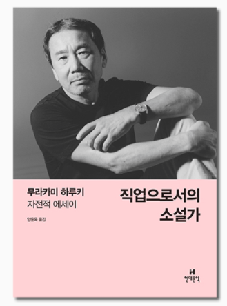

# 장편소설 쓰기

> 이 글은 [작년에 브런치에 쓴 글](https://brunch.co.kr/@jojoldu/23) 을 블로그로 옮겼습니다.

설 연휴 동안 무라카미 하루키의 "직업으로서의 소설가"를 읽었다.  
6장 시간을 내 편으로 만든다 - 장편소설 쓰기 챕터에 보면 다음과 같은 대목이 나온다.  
  

> 좀 더 쓰고 싶더라도 20매 정도에서 딱 멈추고,  
오늘은 뭔가 좀 잘 안된다 싶어도 어떻게든 노력해서 20매까지는 씁니다.  
왜냐하면 장기적인 일을 할때는 규칙성이 중요한 의미를 갖기 때문입니다.  
쓸 수 있을때는 그 기세를 몰아 많이 써버린다,  
써지지 않을 때는 쉰다,  
라는 것으로는 규칙성은 생기지 않습니다.  
그래서 타임카드를 찍듯이 하루에 거의 정확하게 20매를 씁니다.  
.....  
이사크 디네센은 '나는 희망도 절망도 없이 매일매일 조금씩 씁니다' 라고 했습니다.  
.....  
아침 일찍 일어나 커피를 내리고 네 시간이나 다섯 시간, 책상을 마주합니다.  
하루에 20매의 원고를 쓰면 한 달에 600매를 쓸 수 있습니다.  
단순 계산하면 반년에 3,600매를 쓰게 됩니다.  
구체적인 예를 들자면, "해변의 카프카"라는 작품의 초고가 3,600매였습니다.  
  
  
실력 있는 개발자의 모습을 혼자서 상상하곤 했다.  
문제를 해결하다가 의자에서 잠들기도 하고,  
한번 집중하면 새벽까지도 개발하는 등.  
  
반대로 나는 항상 정해진 시간에 기상하고, 정해진 시간에 잠든다.  
주말에도 개인적으로 코딩하는 시간을 정해놓고 진행했다.  
  
돌이켜보니 내가 상상했던 개발자의 모습과 하루 하루의 내 모습엔 큰 갭이 있었다.  
그래서 학습 방법에 대해서 계속 의심하게 된다.  
  
"저 친구는 한번 집중하면 새벽까지 하는데, 나도 저렇게 해야 하지 않을까?"  
"좀 더 코딩할 수 있음에도 내일이 피곤할것 같아 멈추는게 맞을까?"  
"내일은 여기까지 집중력이 올라오지 않으면 어떡하지?"  
"이쯤에서 잠드는게 맞나?"  
"잠자는 시간을 좀 더 줄여야하지 않나?"  
  
주변의 많은 동생들이 짧은 시간에도 깜짝 깜짝 놀랠만큼 잘해내는 걸 볼때마다 더 의심하게 된다.  
  
**재주가 변변찮음에도 이렇게 지루한 방법을 계속 선택해도 될까?**  
  
이런 저런 생각이 계속 오가는 지금, 이 책을 만나 정말 다행이다.  
  
아침에 1시간, 저녁에 2시간 매일 정해진 시간에 학습하는 걸 지속해도 괜찮을것 같다.  
12시가 되기전에 잠들고, 매일 6시간씩 잠자는 생활 패턴을 유지해도 괜찮을것 같다.  
  
천재 개발자의 생활과는 많이 다르겠지만,  
지루하고 재미없는 생활 패턴이겠지만,  
이런 생활을 지속해도 좋은 개발자가 될 수도 있겠다는 생각이 들었다.  
  
7장의 중간 부분에 다음과 같은 문장이 나온다.  

> 당신에게 필요한 것은  
과묵한 집중력이며  
좌절하는 일 없는 지속력이며  
어떤 포인트까지는 견고하게 제도화된 의식입니다.
  
좀 더 내 삶을 "따분하게" 만들어도 괜찮겠다는 위로를 받았다.
