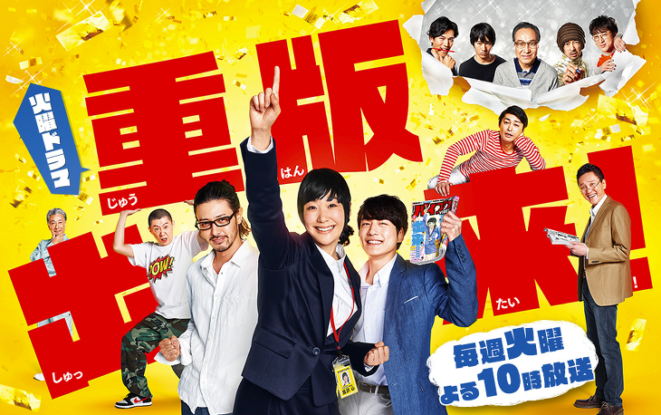
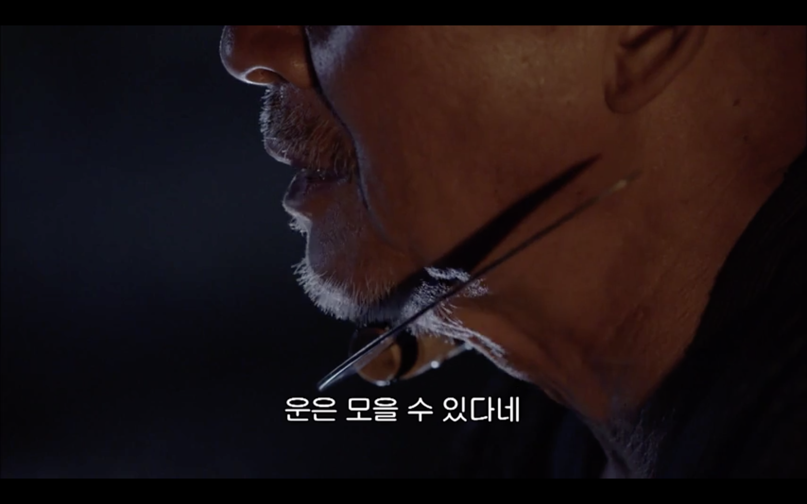
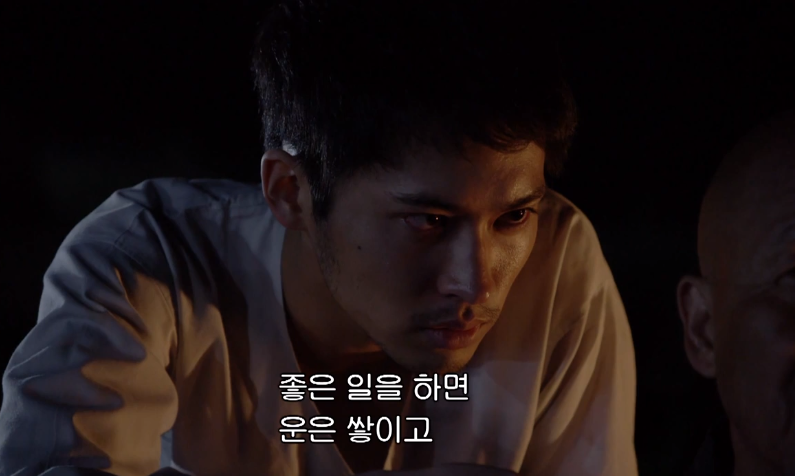
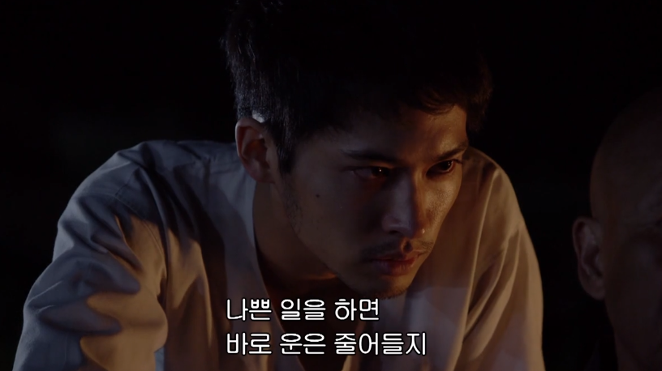
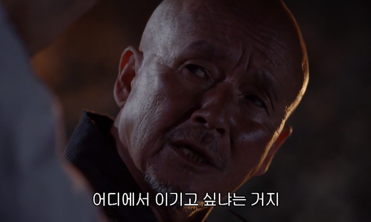
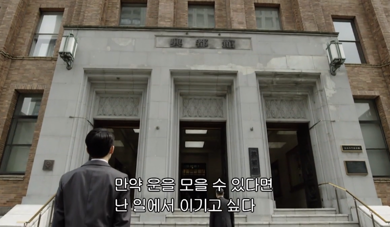

# 중쇄를 찍자 5회 - 한점 돌파

최근에 중판 출래 (중쇄를 찍자) 라는 일본드라마를 정주행 했다.



> [POOQ](https://www.wavve.com/)에 가시면 현재 자막 버전을 볼수 있습니다.

유도부 출신의 주인공이 "바이브스" 라는 만화 출판사에 취직하여 편집자로서 하나씩 성장해가는 성장드라마다.  
일본 특유의 화이팅이나 너무나 착한 사람들만 모인 주,조연 케릭터들을 보고 현실감이 떨어지는걸 느끼긴 했다.  
  
그럼에도 와닿는 내용들이 많았다.  
  
이번에 소개할 내용은 중판출래의 5회 이야기다.  
(총 10부작이다)  

> 내 생각엔 중판출래에 대한 이야기를 하시는 블로거 분들이 가장 많이 언급한 회차이지 않을까 싶다.

주인공이 일 하고 있는 바이브스는 코토칸 이란 출판사의 계열사 잡지이다.  
코토칸 출판사의 사장님은 그 큰 회사의 사장님이지만 검소하게 생활을 한다.  
  
매일 지하철로 출퇴근을 하고,  
술/담배/도박도 전혀 하지 않고,  
잔돈은 항상 불우이웃모금함에 넣고,  
셋방살이를 하면서 최소한의 수준으로 생활 한다.  
  
주인공은 본인의 사수인 오디기리 죠에게 왜 사장님은 그런 생활을 하는지 물어본다.  

<br/>
<br/>
  
젊은 시절 사장님은 도박을 하던 중 대박 패를 얻게 된다.  
주변에서 "운이 좋은데" 라는 이야기를 계속 하며 마지막으로 **이렇게 운이 좋으면 조만간 죽는대** 라는 말을 한다.  


찜찜하게 생각 하던중 갑자기 전화로 연락이 왔다.  
옆집 불이 옮겨져 사장님의 가족이 살고 있는 아파트가 전부 불에 탔다는 것이다.  


와이프와 딸이 안전한 것을 보고 사장님은 어린 시절 만난 어르신과의 이야기를 회상한다.  
  
그 어르신은 다음과 같이 이야기를 한다.









이 일을 계기로 사장님은 **함부로 운을 사용하지 않기 위해 모든 생활을 최소화** 한다.  
  
아래는 사장님의 회상 대사

```
난 도박을 그만뒀다. 
술과 담배도 끊었다. 
취미는 산책과 청소. 
집은 세 들어 살면서 차도 소유하고 있지 않는다. 
사치 부리지 않고 최소한의 생활을 유지했다. 

그렇게 일년이 지날 무렵, 
우연히 구매한 무명작가의 해외 미스터리가 큰 성공을 거두게 되고 연이은 중판출래, 중판 출래 

만약 운을 모을수 있다면 난 일에서 이기고 싶다. 
모든 운을 책이 잘팔리는데 쏟아붓고 싶다. 
그러기 위해 난 계속 운을 모으고 있다.
```



5화 마지막 쿠키영상을 보면 사장님이 복권에 당첨되는 이야기가 나온다.  
1등 복권에 되자 사장님은 당황하며 이 **당첨된 복권을 버린다**.  
**여기에 내 운을 다 쓸수 없다**라고 말하면서 말이다.  

<br/>  
<br/>

중쇄를 찍자는 각 회마다 던지는 메세지가 있다.  
이번 5화는 **한점 돌파**라는 단어가 떠올랐다.  
  
뭔가 이 드라마를 보고 소년 만화의 주인공처럼 각성하게 되었다 뭐 이런 이야기는 아니다.  
  
다만 개발자라는 직업을 위해 나는 얼마나 집중하고 있나 다시 한번 생각하게 되는 계기가 된 것 같긴 한다.  
  
노력한 것에 비해 결과가 좋지 않다면 운을 저축했다고 생각하게 되었다.  
노력한 것에 비해 결과가 좋다면 그간 모아둔 운을 사용한 것이라고 생각하게 되었다.  
  
이렇게 생각하니 조금 마음에 여유가 생기는 것 같다.

> 여담이지만 오다기리 죠 진짜 잘생겼습니다.


