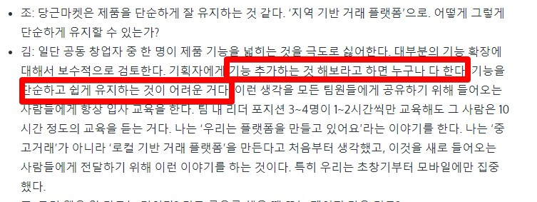
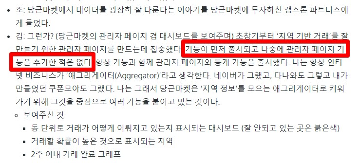

# 2.0 까지 해본 개발자

> 아래 글은 제 페이스북에 올렸던 글을 기록 차원에서 블로그로 옮긴 글입니다.

예전에 [99콘 세미나](https://gwonsungjun.github.io/articles/2019-09/99con-resume) 에서 [7개의 타이틀, 7번의 기회](https://speakerdeck.com/weirdx/99kon-7gaeyi-taiteul-7beonyi-gihoe-coejiho) 라는 주제로 최지호 님이 발표해주셨던 내용 중에 가장 와닿는 문장이 있다.  
  
"2.0까지 해본 사람이 진짜 기획자다"  
(지호님 말씀주셔서 감사합니다!)  
  
그러니깐 어떤걸 런칭을 했는게 중요한게 아니라,  
그걸 실제로 런칭해서 사용자 피드백을 받고 **운영/개선**을 계속 해본 사람이 진짜라는 의미였다.  
  
이건 꼭 기획자만 포함되는게 아니라 개발자도 포함된다고 생각한다.  
  
신규 프로젝트를 오픈하거나 신규 서비스를 런칭하는것도 대단한 일이고 어려운일을 해낸거지만,  
기존에 있던 운영 업무의 비효율화를 얼마나 효율적으로 개선해나갔는지도 그만큼 중요한 일이다.  
  
비단 개발자들의 테스트 자동화나 도구 자동화를 이야기하는게 아니다.  
우리팀의 관리자 페이지를 사용하는 **운영자 분들의 시간을 얼마나 아껴드릴수 있냐**를 얘기하는것이다.  
  
여러 서비스 회사의 무용담을 듣다보면 신규 서비스 런칭에 대한 이야기가 압도적인데,
이거 실제로 런칭하고 1년정도 지나서 보면 **운영자 분들이 뒤에서 엄청나게 몸빵**하는걸 목격하게 된다.  
  
당연히 그럴수밖에 없는게 모든 신규 프로젝트 런칭에는 메인 기능만 집중하기 때문이다.  
상대적으로 덜 중요하다고 판단되는 (사업과 상관없어 보이니깐) 어드민은 항상 후순위로 밀리게 된다.  
  
그러다보니 실제로 해당 어드민으로 운영 이슈를 처리해야하는 담당자들은 불편해도/비효율적이라도 참고 업무를 진행하게 된다.  
  
아래는 당근마켓 김재현 대표님의 인터뷰이다.

> [조직의 실행 속도를 높일 수 있는 천억짜리 조언 – 당근마켓 김재현 대표님과의 대화](http://www.ingray.net/2019/12/17/a-billion-dollar-advice-to-speed-up-your-team/?fbclid=IwAR1XpjefI0jr4ZbM65DqX7tqirH3xPJSvqfkqFLH3Tuw98_2QJ5dyLAcQDg)

여기에서 너무너무 감동받은 2개의 문장이 있다.  

> "대부분의 기능 확장에 대해서 보수적으로 검토한다.  
> 기획자에게 기능 추가하는 것 해보라고 하면 누구나 다 한다.  
> 기능을 단순하고 쉽게 유지하는 것이 어려운 거다"

> "기능이 먼저 출시되고 나중에 관리자 페이지 기능을 추가한 적은 없다.  
> 항상 기능과 함께 관리자 페이지와 통계 기능을 출시했다"

팀의 관리자 페이지를 돌아보면 진짜 불편한게 많다.  
근데 대부분의 개발자들이 그런걸 신경 안쓸때가 많다.  
어드민 개선건은 이력서 쓰기에도 뭔가 작아보이고, 화려해보이는 작업은 아니기 때문이다.  
레거시 개편 / 신규 서비스 런칭 같은게 좋은 평가를 받을 수 있는 방법으로 보이는 것도 이유라고 생각된다.  
  
팀의 관리자 페이지를 지속적으로 개선하고 운영하시는 분들의 운영 비효율화를 개선하는 것은 일종의 돼지 저금통 저금이다.  
  
큰돈이 쌓이는건 아니지만,  
100원 300원 쌓인 돈으로 필요할때 요긴하게 사용하듯이  
5분 10분씩 개선된 생산성으로 진짜 집중해야할 때 집중할 수 있다.  
  
한달에 한번 정도는 운영하시는분들이 어떻게 관리자 페이지를 통해 운영업무를 진행하시는지 개발자들이 옆에서 지켜보는게 필요한것 같다.  
그렇게 보면 현재 관리자 페이지가 얼마나 노후화되어있는지 확인할 수 있다.  
  
Modal 화면에서 입력 항목 채우고 저장 버튼을 누르는 것을 하루에도 수십번/수백번 하는걸 옆에서 한번이라도 보면 눈물난다.  
  
관리자 페이지에서 엑셀 업로드만 지원하면 엑셀 시트에 데이터 다채우고 한번에 업로드만 하면 끝날 일인데 말이다.  
  
운영하시는 분들이 개발자들을 배려해서 데이터를 요구하는 경우도 있다.  
실제로는 "이정도만 뽑아주면 내가 엑셀 함수와 매크로를 이용해서 가공하고 검수해서 볼 수 있다"가 숨겨진 경우가 많다.  
  
새로운 기술 도입을 검토하는 것 만큼이나 우리 팀의 운영 리소스 낭비를 체크하고 개선하는 것도 굉장히 중요한 일이다.  
  
운영 하시는 분들이 어떻게 운영하는지 개발자들이 정기적으로 옆에서 지켜봐야한다.  
그래서 운영하시는 분들이 하루에 6시간 걸리는 작업을 4시간으로, 2시간으로, 1시간으로 계속해서 **생산성을 개선해나가는게 팀의 정말 중요한 과제**이다.  
  
이거 진짜 중요한건데,
신규 서비스 런칭, 레거시 개편, 기타 등등 새로운 무언가에만 목 메는 개발자분들 이야기를 들을때면 사실 깜짝 놀랄때가 많다.  
본인은 노가다 그렇게 싫어하면서 왜 다른 직군분들은 노가다를 감수하는게 당연한건가 싶어서 말이다.  
  
레거시 개편/신규 서비스 런칭에 대한 이야기만 무용담처럼 계속 공유되기 보다는 어드민이라도 계속해서 개선을 해서 얼마나 운영 리소스 낭비를 줄였는지도 많이 공유되고 관심 받을수 있었으면 좋겠다.