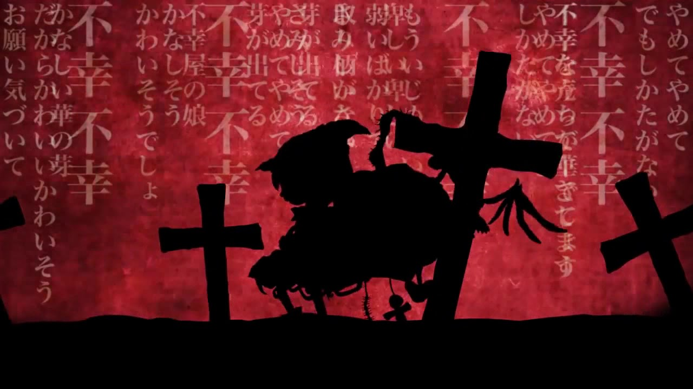

# 불행한 천국

> 아래 글은 [제 브런치에 올렸던 글](https://brunch.co.kr/@jojoldu/17)을 기록 차원에서 블로그로 옮긴 글입니다.



주변의 많은 지인들이 좋은 회사에 취업하고 이직하는 것을 본다.  
  
좋은 회사에 합격할만큼 충분히 노력한 친구들이라고 생각해서 굉장히 기쁘고 뿌듯했다.  
  
같이 축배를 들고 즐기다가 꽤 시간이 흘렀다.  
  
입사일 이후로 몇 주가 지났는데 그 친구의 Github 커밋이 올라오지 않았다.  
  
단체 카톡방에서 재밌게 이야기는 계속 하고 있던터라 농담 삼아 주말인데 카페에서 코딩 안하냐고 물어보니 다음과 같은 답이 왔다.  
  
**그동안 너무 고생했는데 이젠 좀 쉬어야지**  
  
전에 다니던 회사는  
야근 안하는 날이 더 적었고,  
야근 하지 않는 날이면 회식을 하고,  
토/일 중 하루는 꼭 나갔어야 했던 상황이였다.  
그럼에도 그 친구는 어떻게든 시간을 내서 커밋을 했었다.  
  
주말에 쉬고 있을때면 그 친구가 카페 코딩 인증샷을 보내서 오히려 자극 받아 다시 밖으로 나갔었다.  
  
그런 친구가 더이상 뭔가를 하지 않는걸 보게 되니 기분이 뭔가 싱숭생숭했다.  

* 좋은 복지
* 좋은 문화
* 좋은 동료
* 높은 연봉
* 회사의 유명세 등등

외적으로 너무나 좋은 회사에 입사하게 되니 더이상 개인이 이전과 같이 노력 하지 않는걸 종종 보게 된다.  

> 노력이란 단어가 좀 징그럽긴 하지만 마땅히 떠오르는 단어가 없다.


천국이지만, "**불행한 천국**" 이라고 생각했다.  
  
물론 계속해서 채찍질 하려는건 아니다.  
난 그럴 자격이 없다.  
다만 아직 경기가 끝나지 않았음을 얘기하고 싶었다.  
  
가장 애정하는 만화책인 "소라의 날개" 에서 기억나는 장면이 있다.


> 슬램덩크, H2보다 더 애정한다.  
  
매번 지기만 하던 주인공 팀이 어쩌다 경기에서 이기는 중이였다.  
  
시합 시간이 많이 남지도 않아 승리가 거의 눈앞에 있었다.  
  
다들 화기애애하고, 축하할 준비를 하고 있던 상황에서 팀의 정신적 지주가 마지막 작전 타임때 이런 이야기를 한다.  

```
"중학교때 250 대 8인 게임(농구)을 본적이 있어.
지고 있는 팀이 중간에 시합을 포기했는지도 모르지만,
굉장한 건 끝까지 최선을 다해 점수를 내려고 뛴 승리팀이야.
모두가 하나가 되어 끝까지 결코 힘을 빼지 않았어.

그 해 그 팀은 전국의 정점에 섰어.
우리도 그런 팀이 되자."
```

아쉬울때 노력 하는건 누구나 할 수 있다고 생각한다.

* 낮은 연봉
* 열악한 개발환경
* 못마땅한 직장 동료
* 무의미한 업무 등등

이런 **결핍이 있는 상황**에선 누구든 어떻게든 탈출하려고 노력한다.  
  
하지만, 시쳇말로  
  
**배부를때 노력하는건 정말 어렵다**.  
  
나도, 내 주변 사람들도 남들보다 더 좋은 위치에, 더 앞선 위치에 도착해서도 결코 힘을 빼지 않는 사람들이었으면 좋겠다. 