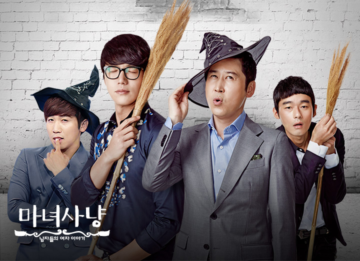
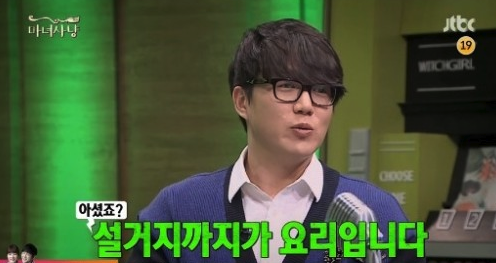

# 설거지까지가 요리다

한참 마녀사냥을 재밌게 볼 때가 있었다.  
  
그린라이트라는 희대의 유행어를 만든 프로인데, 남녀사이의 고민을 4명의 남자 MC의 입담으로 풀어나가는 재미가 대단한 프로였다. 

당시 기억에 남는 회차가 있었는데, 일일 MC로 조정치씨가 나와서 신혼 생활의 고충을 얘기하던 회차였다.  
와이프인 정인씨가 요리 초보다 보니 설거지 거리가 잔뜩 나와 조정치씨가 결혼 후 주부습진이 생겼다는 것이다.  
  
어디서나 흔하게 볼 수 있는 이야기인데, 여기서 성시경씨가 한 답변이 몇 년이 지난 지금에도 계속 머릿속에 남아있다.  
  
**이별까지가 사랑이라는 말이 있듯이 설거지까지가 요리다**  
  

똑같은 음식을 만들더라도,  
  
누군가는 음식 만들면서 주방을 난장판으로 만든 사람이 있고,  
누군가는 음식 만들면서 뒤처리 생각해서 틈틈이 뒷정리, 설거지해서  끝나면 치울게 거의 없는 사람이 있다.  
  
누군가에게 요리를 맡겨야 한다면 당연히 후자에게 맡기고 싶다.  
전자에게 맡기면 결국 **뒤처리와 설거지를 해야할 사람이 따로 필요하기 때문**이다.  
  
개발도 마찬가지다.  
  
누군가는 일정 맞춰 feature 개발만 하는 사람이 있고,  
누군가는 요구사항에 대한 테스트코드 다 작성하고(꼭 TDD가 아니더라도),  
이슈 대비해서 로그 잘 남기고,  
Jira & Wiki 에 해당 feature에 대한 description과 업무 내용 상세히 작성하고,  
커밋 메세지와 주석으로 코드에 대한 설명을 남기는 사람이 있다.  
  
해당 기능을 누가 개발해줬으면 할까 생각해보면 답은 뻔하다.  
  
당연히 개발하는 도중에 저것들 다 못할 수 있다.  
다만 요리가 끝나면 설거지 하듯이, 개발이 끝났을때라도 저 일들을 해야한다는 것이다.
**다음 개발(요리)할거리 찾을게 아니라**.  
  
음식만드는 사람, 설거지하는 사람이 분리 되어있으면 지속 가능한 팀이 되긴 어렵다.  
개발만 계속 할 수 있다면 그건 누군가가 뒤에서 설거지하고 뒤치닥거리 하고 있다고 생각해야 한다.  
  
이걸 누군가는 **개발 도피**라고 하는데,  
개발만 주구장창하고 나머지에 대해 전혀 하지 않으면 5년, 10년 가는 제품을 운영할 수는 없다고 생각한다.  
  
그래서 항상 설거지/뒤처리도 신경쓰고 챙기는 사람과 함께 하고 싶다.  
 
> 물론 내가 이걸 잘해서 쓰는것은 아니고, 저런 사람이 되어야지란 생각으로 쓰게 되었다.

성시경씨가 마지막에 남긴 말이 콕 와닿는다.  
  
"정인씨는 지금 요리를 하는 게 아니다.  
취미생활을 하고 있다.  
요리는 조정치 씨가 하고 있다"