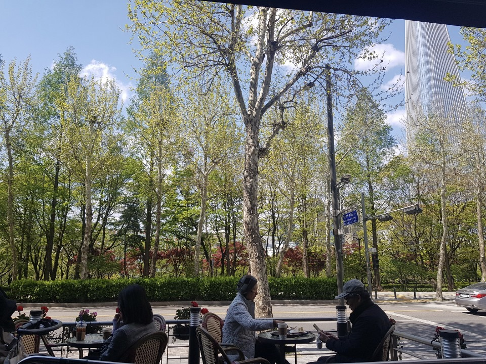

# 팀에서 얻을 수 있는 것

> 아래 글은 제 페이스북에 올렸던 글을 기록 차원에서 블로그로 옮긴 글입니다.

오늘 오후 날씨가 너무 좋아서 오랫만에 개발하지 않고 책만 봤다.  
  
곧 있으면 맡고 있던 정산시스템이 개편된지 만 3년이 된다.  
확인해보니 당시 하루 바로결제 주문건이 10만 ~ 20만건 정도 되었다.  
지금은 5 ~ 10배정도 급 성장한걸 보면 새삼 놀랍기도 하다.  
(딱 3주년 되는 시점에 사내 블로그에 회고록 같은걸 써봐도 좋겠다는 생각이 든다)  
  
그렇게 급성장하는 기간에, 펌뱅킹으로 하는 직접 정산부터 일정산/광고정산/배민오더정산, 그리고 이번 광고비 지원까지 다 "시스템 개편 없이" 되는거 보면 초기 설계가 얼마나 잘되었는지도 새삼 많이 느끼기도 한다.  
(은경님/혜미님/영한님 리스펙합니다)  
  
갑자기 왜 이런 생각을 했냐면, 우리 팀의 개발자분들은 팀에서 뭘 얻어갈수 있을까 생각이 들었기 때문이다.  
(우리 팀은 개발/기획/운영이 모두 같이 있고, 팀장님은 이들을 다 매니징하신다)  
  
도메인 특성이기도 한데, 우리팀의 개발 그룹이 Geek 집단이 되기는 어렵다고 생각한다.  
Geek한 기술 선택 보다는 안정적인걸 계속 선택해야 하는데, 그럼 여기서 무얼 얻어갈수 있을까? 라는 고민을 할 수 밖에 없다.  
  
카페에서 멍 때리다가 **원금 갚는 방법**을 많이 얻어가실수 있지 않을까 문득 생각이 들었다.  
  
누군가는 **점진적 개선**이라고 표현하기도 하는데, 나는 이걸 원금갚기라고 표현을 한다.  
  
당장의 주어진 과제를 하는건 이자를 갚는것이고,  

* 자동화
* 리팩토링
* 누락된 테스트코드 추가
* 도메인 개선
* 문서작성 등 

혹은 개인의 기술 역량을 향상시키는것까지 포함해서 이들을 원금을 갚는 것이라고 표현한다.  
  
이번에 넣은 한 줄의 테스트 코드가, 한 개의 위키 문서가 다음에 같은 일을 할때 훨씬 더 적은 시간만으로 해결이 되는걸 조금씩 경험하고 있지 않나 싶다.  
  
어느 회사의 어느 팀 출신 개발자분들이 탄탄하더라 혹은 믿을만하다 라는 소문이 나는 경험을 되게 좋아한다.  
  
우리팀이 그 소문의 주인공이 되면 좋겠다.