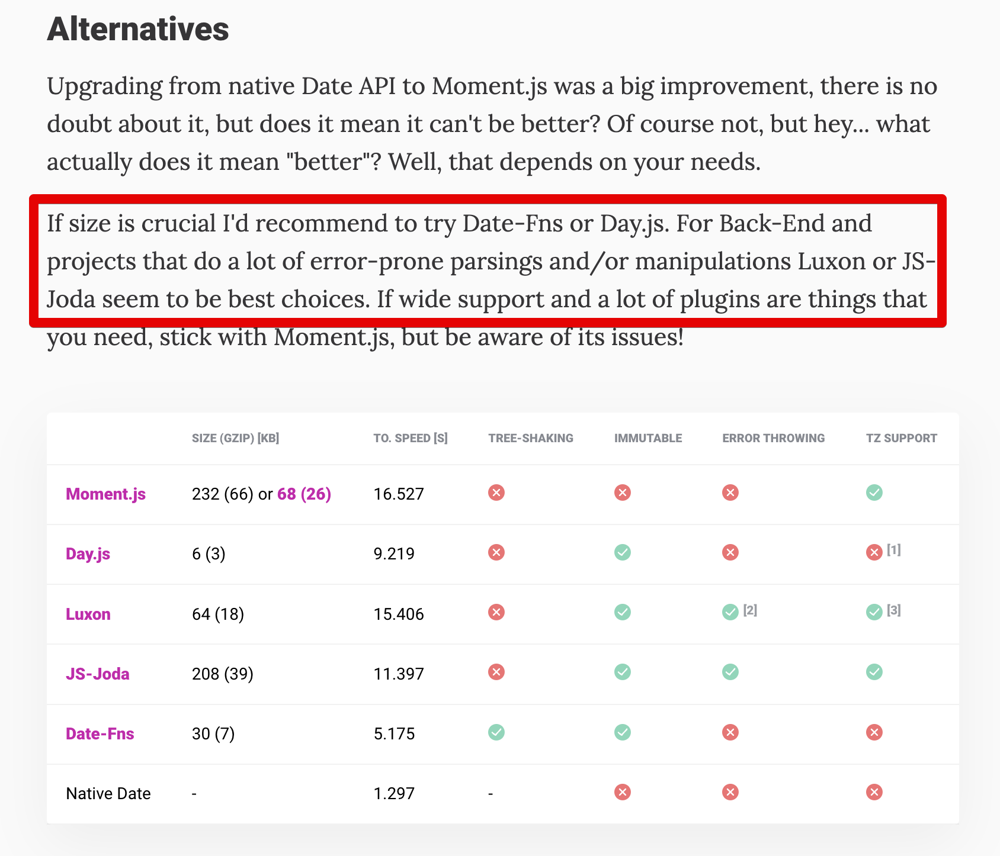

# 람보르기니와 지프랭글러

슈퍼카의 대명사인 람보르기니는 오프로더의 대명사인 지프랭글러 보다 더 빠른 자동차일까?

이 질문에 대해 당연하게 답을 내리는 사람이 있고, 답을 할 수 없는 사람도 있다.  
이 주제에 대해 한번 이야기해보고 싶다.  
    
개발을 시작하고, 그간 사용하던 언어들이 항상 **2가지 영역**에서 같이 쓰다보니 오해를 일으킬때가 있다.  
  
주로 사용하던 **Java**의 경우 **서버 백엔드**에서 사용되지만, **안드로이드** (클라이언트) 에서도 사용 된다.  
지금 주력으로 사용중인 **JS & TS**는 **Node 백엔드**에서도 사용되지만 **웹 프론트** (클라이언트) 에서도 사용 된다.  
  
**똑같은 언어 (Java, TS) 지만 구동되는 장소는 완전히 다르다**.  
구동되는 장소가 다르면 용도도 달라진다.

* 디바이스당 단일 사용자 (모바일기기, 브라우저)를 처리하기 위한 용도냐 
* 디바이스 하나당 다중 사용자 (서버) 를 처리하기 위한 용도냐

이 용도의 차이 외에도 몇가지 차이가 더 있다.

* 사용자마다 패키지 (앱, 웹)을 받아야 하느냐 vs 리눅스 서버에서 한번만 프로젝트를 받으면 되느냐
* 전역 상태를 사용해도 되느냐 vs 전역 상태를 절대 사용하면 안되냐

이로인해 **똑같은 Java, TS 환경이라도 지향하는 방향, 선호도가 다를 수 있다**.  
  
가끔 몇몇 분들을 보면 **그 언어가 어디서 구동되는지는 고려하지 않은채 정답이 정해져있는것처럼** 이야기하는 분들을 종종 보게 된다.

예를 들어, 내가 Node.js 백엔드에 [moment](https://momentjs.com/) 를 대신할 새로운 날짜 라이브러리로 [js-joda](https://js-joda.github.io/js-joda/) 를 선택했을때 주변에서 나온 이야기는 다음과 같았다.  

* Java하던 사람이라 그런지 역시 Joda 계열을 선택하네?
* JS/TS에서는 js-joda 누가 쓰냐, 다 [dayjs](https://day.js.org/) 혹은 [date-fns](https://date-fns.org/) 쓰지

이 의견을 듣고, 봤을때 굉장히 의아했다.  
  
[dayjs](https://day.js.org/) 나 [date-fns](https://date-fns.org/)는 **다운로드 용량이 중요한 웹 프론트엔드에서 선호**되는 라이브러리인것이지, 다운로드 용량이 크게 중요하지 않고, 트리쉐이킹이 핵심 요소가 아닌 백엔드에서는 1옵션이 아니라고 생각했기 때문이다.   
  
내가 [js-joda](https://js-joda.github.io/js-joda/) 를 선택한 이유는 그게 **Node.js 백엔드에서는 훨씬 더 적합**했기 때문이다.

(출처: https://inventi.studio/en/blog/why-you-shouldnt-use-moment-js#fnref2)  
  
* 불변 지원
* `ERROR THROWING`
* 타임존을 비롯한 풍부한 기능
* 명료한 사용성

용량이 가벼운 것이 큰 장점인 `Day.js`와 `Date-fns`는 백엔드 개발에 있어서는 큰 장점으로 다가오지 않는다.  
  
실제로 그 2가지 라이브러리를 주력으로 사용했던 우리 백엔드팀 조차 `js-joda`의 사용성과 풍부한 기능, 명료한 사용성에 반하기도 했다.  
  
라이브러리 선택할때 외에 언어의 문법을 사용할때도 비슷한 상황을 겪었다.  
  
예를 들어 나는 `Enum`을 객체로서 활용하는 것이 **백엔드 개발**에서 굉장히 유용함을 많이 느끼고 많은 문제들을 해결해왔다.  
  
* https://techblog.woowahan.com/2527/

> 참고로 `Enum`에 관한 것은 [개발자를 위한 최고의 책을 뽑아서 선정하는 Jolt Award](https://www.informationweek.com/enterprise-applications/jolt-awards-the-best-books-for-developers) 를 받은 [이펙티브 자바](https://www.kyobobook.co.kr/product/detailViewKor.laf?mallGb=KOR&ejkGb=KOR&barcode=9788966262281) 에서도 비슷하게 언급한 패턴이다.

Java 백엔드와 반대로 **안드로이드에서는 성능이 중요한 곳에서는 권장하지 않는다**고 알고 있다.  

> 실제로 저 글이 SNS상에 퍼지고나서 "백엔드와 안드로이드가 서로 다른점이 많네요" 리는 페이스북 DM을 받기도 했다. 

그래서 **Enum은 서버 백엔드에서는 권장**한다고 이야기하지, Java 개발 전체에서 권장한다고 이야기하지는 않는다.    
  
백엔드 개발에 있어서는 JS/TS 환경도 `Enum`을 객체로 활용하는 방법을 적극 권장한다.  

> 물론 TS의 `Enum`은 JVM 계열의 `Enum`과는 완전히 다르긴 하다.  
> 그래서 [ts-jenum](https://www.npmjs.com/package/ts-jenum) 같이 `Enum`을 객체로서 다룰 수 있는 우회방법을 선택하는 것이기도 하다.
> Enum을 객체로 다룰때의 장점은 위에서 언급한 [배민 기술 블로그 글](https://techblog.woowahan.com/2527/)을 참고하면 좋다.

대신 웹 프론트엔드에서는 어드민 같이 **트리쉐이킹과 다운로드 속도에 크게 민감하지 않는 영역에서만** 사용하거나 아에 사용하지 않는 것을 권장하는 편이다.  
  
근데 이걸 "**백엔드/웹프론트엔드 상황을 무시한채** JS/TS에서는 무조건 Enum을 쓰면 안돼" 이런 식의 대화 흐름은 좋아하지 않는다.  
  
보통 이 의견을 내시는 분들의 주력 근거는 **라인 엔지니어링 블로그의 글**이다.

* https://engineering.linecorp.com/ko/blog/typescript-enum-tree-shaking/

글 내용이 너무나 좋은 반면에, 이게 무적의 논리로 사용되는 것에 대해서는 의아할때가 많다.  

글 제목에서도 나와있지만 **트리쉐이킹 관점**에서의 주제이다.  
즉, 트리쉐이킹이 그렇게 중요하지 않는 영역에서 굳이 `Enum`의 장점을 버릴 필요가 전혀 없다는 것이다.  
  
우리 팀 역시 백엔드 개발에서의 **상태에 따라 다르게 작동하는 로직들**에 대해서 `Enum`을 객체로 다루는 패턴으로 정말 쉽게 해결한 사례가 많다.  
그리고 이 방식은 많은 백엔드 교육 과정에서도 코드 리뷰시 권장하고 있고, 실제로 여러 규모 있는 회사에서도 이러한 패턴으로 복잡한 문제들을 해결한 사례들이 많다.     
  
**웹 프론트엔드 TS 환경에서 권장하지 않는 방식이라고 해서,  
Node 백엔드 TS 환경에서 권장하지 않는 방식이라고 할 수는 없다**.
  
내가 만드는 자동차가 아우토반에서 주행할지, 험지에서 주행할지에 따라 자동차라는 카테고리는 같지만 구현 방법과 설계가 달라질 수 있다.  
  
마찬가지로,  
똑같은 언어라도 그 언어가 구동되는 위치가 어디인지에 따라 사용 방법이 다를 수 있다.  
이걸 배제한채로 **언어가 똑같다고 모든 방법론을 똑같이 적용할 수는 없다**.  
  
> 이 글을 쓰면서 예전에 유튜브로 이야기한 리액트와 의존성 주입에 관한 주제가 다시 생각이 났다.  
> 같은 내용과 의도는 아니지만, 오해할 수는 있을것 같다.  
> 의존성 주입에 관해 이야기할때면 **합성 (Composition) 과 의존성 주입 (Dependency Injection) 을 구분하지 않고** 이야기 나올때가 있어서 이것도 영상이 아닌 글로 한번 정리해야겠다는 생각이 들었다.  
> 관련해서는 [stackoverflow](https://stackoverflow.com/questions/21022012/difference-between-dependency-and-composition) 에서도 자주 올라오는 것 같다.

이 글 초반부에 있던 질문을 다시 보자.  

"슈퍼카의 대명사인 람보르기니는 오프로더의 대명사인 지프 랭글러 보다 더 빠른 자동차일까?"  
  
그럴 수도 있고, 아닐 수도 있다.  
두 자동차가 달리는 곳이 어딘지에 따라 말이다.