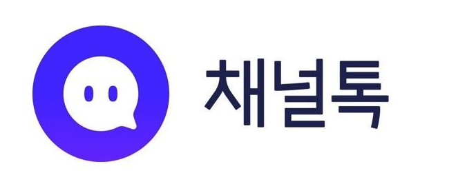

# 지금이 유튜브나갈때냐?

> 월/화 장애가 이젠 완전히 해소된 것 같아서 회고 정리중에

이번주 월/화동안 고객센터(채널톡) 에서 내 이름이 꽤 언급되었다.

내용은 다음과 같은 유형이다.

"직장인들 퇴근하고 가장 많이 공부하는 시간에 접속이 안되네요
이동욱씨 유튜브에서 좋은 개발자 어쩌구 하기전에 서비스부터 좋게 만드셨으면 하네요"

> 비슷한 건들이 몇개 더 있다

이틀 연속 동일한 시간대에 몇시간씩 장애가 났기때문에,
유료 서비스를 사용중인 고객분들 입장에서 화 나는건 당연하다고 생각한다.  

과거의 코드가 서비스의 발목잡는건 너무 흔한일이고,  
인프런 합류할때 어느정도 예상한 일이기도 했지만,  
그걸 핑계로 고객분들 사용하시는데 불편을 드리는게 당연한 일은 아니라고 생각한다.  
그래서 죄송한 마음 뿐이다.  
  
> 아 물론 이걸로 화 안나냐고 하실분도 계시는데, 이런것에 상처 받거나 하진 않는다.
이미 2019년에 배민 다닐때 EO 유튜브 영상 올라간 뒤로 배민 장애가 나거나 뉴스기사 뜰때마다 이것보다 더 화가 담긴 댓글들을 보기도 해서 이정도에 화날건 아니다.  

모니터링/로깅 기반의 데이터로 얼마나 시스템이 견고해졌는지 측정할 수도 있겠지만,
좀 더 현실적으로는 **얼마나 CS 메신저에서 내 이름이 적게 거론되는지**를 보는게 더 명확하겠다는 생각도 들었다.
  
이번에 난 장애에 대한 회고를 개인블로그에도 쓰겠지만,
인프런 서비스 공지에도 한번 정리해보면 어떨까 싶었다.  
다른 서비스에서는 굳이 그런 치부를 회사 공지에까지 올려야하나 싶겠지만,  
인프런은 그런걸 하면 오히려 더 좋은 브랜딩이 되지 않을까 싶다.  

어찌됐든!
올해는 최대한 고객센터에서 내 이름이 최대한 덜 언급되는걸 목표로 해야겠다.  
  
월~화까지 서비스 이용하시느라 불편하셨던 분들 정말 죄송합니다.
점점 더 발전하는 인프런이 될게요!!
항상 고맙습니다!

> 요 장애로 인해서 기술 선택에 조금 자율성을 얻었습니당!