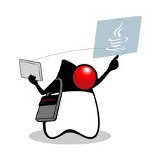

# 자바 공화국

오늘 교보에서 주문한 [단위 테스트](https://www.kyobobook.co.kr/product/detailViewKor.laf?ejkGb=KOR&mallGb=KOR&barcode=9791161755748) 책을 받았다.

[Xunit 테스트 패턴 책](http://www.kyobobook.co.kr/product/detailViewKor.laf?ejkGb=KOR&mallGb=KOR&barcode=9788960771253&orderClick=LAG&Kc=#N) (번역이 별로다 ㅠ) 이후에 테스트와 관련해서는 되게 오랫만에 본 재밌는 책이여서 이건 우리팀 위키에 정리해서 공유해야겠다는 생각이 들었다.  
  
이 생각으로 최근의 채용 과정을 떠오르게되니 조금 우울해졌다.  

과제형 프로젝트를 채용 과제로 삼으면서 많은 분들의 프로젝트 결과물도 보고, 관련해서 면접도 본다.  
  
면접에서 과제에 대한 코드리뷰를 하다보면 지원자분들이 항상 물어보는게 있다.  
  
"피드백 주신 그걸 좀 더 깊게 배우려면 어떤 책이나 영상을 보면 되나요?"  
  
이 질문을 항상 받는데, 대답해주기가 애매하다.
왜냐면 우리나라의 대부분의 좋은 개발 컨텐츠가 **Java**를 기반으로 나왔기 때문이다.  
  
(우리 회사는 NodeJS이고, 지원자분 역시 대부분은 NodeJS만 해보신 분들이다.)  
  
예를 들어, 테스트 코드가 미흡하신 분께 테스트 코드와 관련해서 피드백을 드릴려고 하면 추천해드릴 NodeJS 컨텐츠가 거의 없다.  
  
짧은 블로그 컨텐츠 (이것도 틀린 내용이 꽤나 많은), 혹은 E2E 테스트만 있는 컨텐츠 등 뿐이다.
  
반면에 Java를 보면 정말 양질의 컨텐츠들이 있다.  
  
먼저 책을 보면

* [단위 테스트](http://www.kyobobook.co.kr/product/detailViewKor.laf?ejkGb=KOR&mallGb=KOR&barcode=9791161755748&orderClick=LEa&Kc=)
* [Xunit 테스트 패턴](http://www.kyobobook.co.kr/product/detailViewKor.laf?ejkGb=KOR&mallGb=KOR&barcode=9788960771253&orderClick=LAG&Kc=#N)
* [Effective Unit Testing](http://www.kyobobook.co.kr/product/detailViewKor.laf?ejkGb=KOR&mallGb=KOR&barcode=9788968480621&orderClick=LAG&Kc=)
* [테스트 주도 개발](http://www.kyobobook.co.kr/product/detailViewKor.laf?ejkGb=KOR&mallGb=KOR&barcode=9788966261024&orderClick=LAG&Kc=)
  * 예제코드가 파이썬과 자바가 챕터별로 나눠져있지만

등이 번역되어 나왔다.  
  
영상은 또 어떨까?

* 패스트캠퍼스의 The Red 시리즈
  * [이규원님 강좌](https://fastcampus.co.kr/dev_red_ygw) 
  * [최범균님/백명석님 강좌](https://fastcampus.co.kr/dev_red_bcr)
* 오랫동안 사랑 받은 클린 코드 & TDD 유튜브 영상인 [백명석님의 클린 코더스](https://www.youtube.com/watch?v=60lLSe1phks) 
* 인프런의 영한님 / 기선님 강의는 모두 테스트 코드를 기반으로 설명한다. 
  * 단순하게 API E2E 테스트로 설명하는 식이 아니다.

책 / 영상 외에도 코드리뷰 기반으로 클린코드와 TDD를 교육해주는 [박재성님의 Next Step](https://edu.nextstep.camp/) 이 또한 든든하게 버티고 있다.  
  
이 외에도 다양하고, 퀄리티가 뛰어난 컨텐츠는 넘친다 (C++ 도 섞여있지만)

* [엔터프라이즈 애플리케이션 아키텍처 패턴](http://www.kyobobook.co.kr/product/detailViewKor.laf?ejkGb=KOR&mallGb=KOR&barcode=9791158390174&orderClick=LAG&Kc=)
* [오브젝트](http://www.kyobobook.co.kr/product/detailViewKor.laf?ejkGb=KOR&mallGb=KOR&barcode=9791158391409&orderClick=LAG&Kc=)
* [클린 소프트웨어](http://www.kyobobook.co.kr/product/detailViewKor.laf?ejkGb=KOR&mallGb=KOR&barcode=9791185890852&orderClick=LEa&Kc=) / [클린 아키텍처](http://www.kyobobook.co.kr/product/detailViewKor.laf?ejkGb=KOR&mallGb=KOR&barcode=9788966262472&orderClick=LAG&Kc=)
* [레거시 코드 활용 전략](http://www.kyobobook.co.kr/product/detailViewKor.laf?ejkGb=KOR&mallGb=KOR&barcode=9791161752075&orderClick=LAG&Kc=)
* [도메인 주도 설계](http://www.kyobobook.co.kr/product/detailViewKor.laf?ejkGb=KOR&mallGb=KOR&barcode=9788992939850&orderClick=LAG&Kc=)
* [클라우드 네이티브 자바](http://www.kyobobook.co.kr/product/detailViewKor.laf?ejkGb=KOR&mallGb=KOR&barcode=9791196203733&orderClick=LAG&Kc=)
* [토비의 스프링](http://www.kyobobook.co.kr/product/detailViewKor.laf?ejkGb=KOR&mallGb=KOR&barcode=9788960773431&orderClick=LEa&Kc=) / [자바 ORM 표준 JPA 프로그래밍](http://www.kyobobook.co.kr/product/detailViewKor.laf?ejkGb=KOR&mallGb=KOR&barcode=9788960777330&orderClick=LAG&Kc=)
  * java 생태계의 책이지만, 실무 코드를 제외한 배경과 코어 설명은 정말 모든 개발자들이 보면 좋다고 생각한다

이러다보니, 지원자분들의 질문에 Java 컨텐츠를 소개할 수 밖에 없다.  
(내가 Java 컨텐츠를 추천하다면 NodeJS 지원자들은 무슨 생각을 할까?)  
  
요즘의 웹 애플리케이션 개발에서는 위에서 언급한 지식들을 몰라도 원하는대로 작동하는 웹 애플리케이션을 만드는데는 큰 어려움이 없다.  
  
근데 그 다음이 문제다.
  
그 다음 레벨로 가기 위해서 쌓아야할 지식들이 **한국 내에서는 Java / C++ / C# 기반으로 된 컨텐츠가 대다수다**.  
  
출판사분들이 가져오는 번역책들 역시 대부분 JVM 기반의 서적들이다.  
  
그러다보니 좋은 시니어를 만난 사람과 아닌 사람간의 격차가 심하게 나타난다.  
  
특히 우리같이 작은 회사에서는 신규 입사자가 올때 마땅히 추천해드릴게 없어서 **모든걸 사내 온보딩과 위키문서만으로 기술 격차를 해소**해야만 한다.  
  
이건 정제된 지식 뿐만 아니라, 실무 노하우에서도 차이가 난다.

* 네이버의 D2
* 카카오의 ifkakao
* 쿠팡의 Reveal
* 배민의 Woowacon
* 토스의 Slash

매일 수천만 트래픽을 받는 회사들이 **매년 컨퍼런스와 기술 블로그에서 자신들이 해결한 노하우를 끊임없이 쏟아낸다**.  
  
이와 반대로, 최근의 모 부트캠프에서는 NodeJS 백엔드 리뷰어가 없어서 **프론트엔드 리뷰어분들이 NodeJS 백엔드 멘티생들을 코드리뷰** 해줬다는 웃픈 이야기도 들린다.  
  
우리 회사가 노력한다한들, **우리나라 IT회사 1~10위의 회사들이 매일 쏟아내는 노하우보다 더 나을 수 있을까?**  
그게 합리적인 선택일까?  
  
그냥 Java를 배워서 Node에 잘 녹여내는걸 가이드 하는게 어떨까? 라는 생각이 들었다.  
  
**좋은 아키텍처 / 코드 디자인 / 레거시 리팩토링 / 도메인 개발 / 테스트코드 등등의 지식들은 레벨이 오를수록 무시할 수 없다**.  
  
그러다보니 요즘은 팀 분들께 "**Java와 스프링을 사용하진 않더라도 최소한 사용법 정도는 배우는게 어떨까요?**" 라고 제시할까 고민한다.  

> 아직 이야기 한건 아니다

그래야만 특정 누군가가 없더라도 국내의 좋은 자료들을 참고하여 좋은 지식과 노하우를 습득하고 이를 기반으로 계속해서 성장하기가 상대적으로 수월하기 때문이다.  
  
흔히들 **자바 공화국**이라고 얘기한다.  
  
공화국은 주권이 국민에게 있는 나라를 말한다.  
군주제처럼 1인이 최고 권력을 가진게 아니라는 뜻이다.  
개인의 독단이 아닌, 시민 사회의 합의에 의하여 통치되는 것이다.  
  
그런 점에서, 자바 공화국이 맞다.  
자바만큼은 국내의 수많은 개발자들이 생태계를 구축하고 지식을 전파하고 방향을 설정하기 때문이다.  
  
**특정 개인이 전파하는 지식은 절대 수많은 회사와 개발자들이 쏟아내는 지식보다 나을 수 없다**.  
  
> 물론 여기서의 자바 공화국 해석은 일반적인 해석과는 다르지만.

Java 라는 언어가 좋고 말고를 떠나서,  
**국내에서 백엔드 개발자가 좋은 지식들을 쌓기 위해서는** 최소한의 Java 코드를 볼 수준까지는 배워야하는건가 하는 생각이 요즘 쓸쓸하게 든다.  
  
