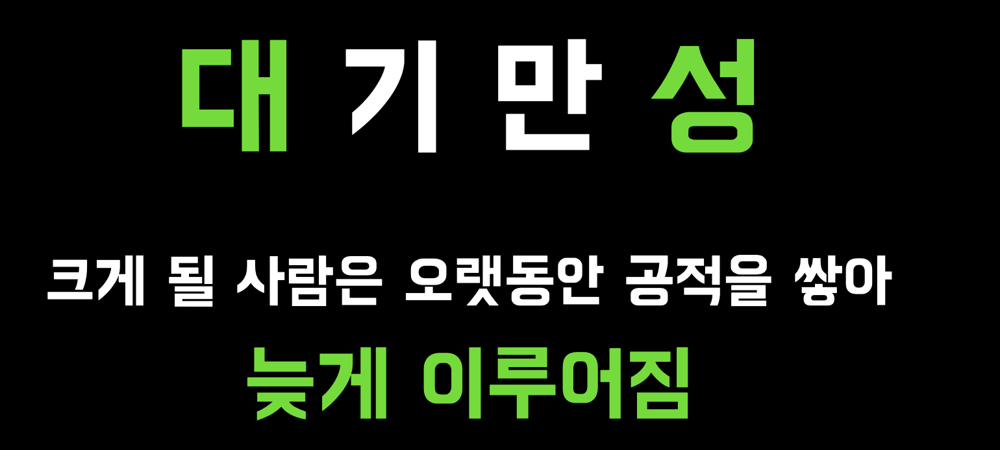

# 100미터 17초에 달리기
  
최근에 교육생분들을 대상으로 신입 개발자를 준비할때 있었던 일들에 대해 이야기를 나누는 시간을 가졌다.  
이제막 개발을 시작하게된 분들도 계시고, 컴퓨터 공학을 전공했지만 계속해서 취업에 실패해서 교육기관에 참여하신분들도 계시고 다양했다.  

공통된 질문 기저에 깔린 걱정은 "내가 다른 사람에 비해 부족한데 어떻게 극복하느냐" 였다.  
그래서 그에 대한 내 생각을 전달드렸다.

국비교육기관이나 부트캠프에서 여러 동기들과 함께 개발을 하거나, 신입 개발자로 입사하여 비슷한 연차의 다른 개발자들과 같이 일을 하다보면 내가 썩 영민하진 못하다는 생각을 하게 된다.  
  
- 이클립스는 커녕 Java도 처음 하는 신입 개발자분이 나보다 훨씬 더 좋은 퀄리티로 과제를 해결한다던가
- 중학교부터 코딩을 시작해서 나와 같은 나이에 이미 개발 팀장을 하고 있다던가

처음으로 내가 주도적으로 선택한 업이였기 때문에 그 안에서는 잘 하고 싶었다.  
근데 더 영민하지 못하고, 더 일찍 시작도 못한 내가 이 시장에서 어떻게 경쟁력을 가져야하나 고민을 많이 했었다.  
  
내 100m 최고 기록은 17초인데, 다른 사람들은 이미 10초의 기록을 가지고, 9초의 벽을 넘으려고 준비하고 있는 것 같았다.  
  
나의 1개월과 저 사람의 1주가 비슷한 효율을 가진다거나, 이미 저 사람은 몇년전에 이해하고 넘어간 내용이라면 계속해서 공부하기가 쉽지 않다.  

당시에 이런 저런 커뮤니티를 돌아다니다가 마라톤 선수들에 대한 글을 보게 되었다.  
  
42.195km 의 최고 신기록은 2시간즘인데, 이는 **100m 를 17초로 42km 내내 달리는 것**과 똑같다는 것이다.    
  
시간을 되돌릴 수는 없다.  
갖고 있지 못한 것에 대한 아쉬움은 어쩔 수 없지만, 다르게 바라보고, 행동으로 옮기는 것은 할 수 있다.  
  
그래서 내 경기장을 바꿨다.  
단기전이 아니라 장기전으로.  
  
남들에 비해선 느리지만, 내가 가진 최고속도를 계속해서 유지하고 개선하는 것을 오랫동안 꾸준히 한다면 **단거리에선 별로인 나도 마라톤에선 괜찮은 선수이지 않을까** 하는 것이다.  
  
순간적으로 얼마나 영민한 사람이냐 보다는, **얼마나 오랫 동안 한결 같은 태도를 유지 할 수 있느냐**를 목표로 삼게 되었다.  
  

대기만성이란 단어를 좋아한다.  
"**크게 될 사람은 오랫동안 공적을 쌓아 늦게 이루어진다**"

큰 사람이 되는 것이 목표는 아니지만,  
괜찮은 사람이 되는 것을 목표로 꾸준히 오랫 동안 한다면 결국은 결실이 맺어질거라 믿고 있다.
## 함께 보면 좋은 글

- [나를 위해 남을 도와주기](https://jojoldu.tistory.com/715)
- [한점돌파](https://jojoldu.tistory.com/453)