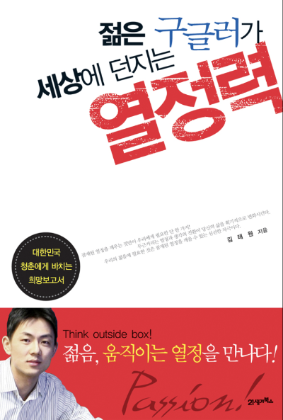

# 두근두근

대학교를 다닐때 학교 공부는 하지 않고, 도서관에서 자기계발서를 한참 읽던 시기가 있었다.  
그때 읽었던 책 중에 하나가 [젊은 구글러가 세상에 던지는 열정력](https://ridibooks.com/books/117000162)이라는 책이었는데, 200X년에 구글코리아에 입사하신 김태원님이 쓰신 책이다. 

각 챕터마다 김태원님의 생각이 적힌 책인데, 그 중에서 "두근두근" 챕터에는 수잔 베이츠의 "[사람을 움직이는 리더의 대화법](https://product.kyobobook.co.kr/detail/S000001301432)" 의 내용이 담겨 있었다.

> 교회는 이미 사람들로 꽉 차 있었고, 사진기자와 나는 교회 뒷문에 진을 칠 계획으로 언덕에 올랐다.   
> 그때 나는 마침 따르는 기자들 없이 경호원 두 명과 걸어가는 지미 카터를 보았다.  
> 그들은 막 교회로 들어가려던 참이었고, 내 심장은 빠르게 뛰었다.  
> 이런 기회가 오리라고 예상하지 못했던 나는 아무런 준비도 되어 있지 않은 상황이었다.   
> 하지만 이것이야말로 절호의 기회였다.  
> 나는 하이힐을 신은 채 잔디 위를 뛰었고, 전직 대통령과 일대일 인터뷰를 따냈다.  
> 기회는 생기게 마련이다.  
> 심장이 두근거리다고 해서, 긴장된다고 해서 그 기회를 놓쳐서는 안 된다.  
> => 수잔 베이츠 [사람을 움직이는 리더의 대화법](https://product.kyobobook.co.kr/detail/S000001301432) (더난, 71p)

그리고 이와 관련된 김태원님의 대학 시절 이야기가 있었는데, 다른 내용보다 위 수잔 베이츠의 글이 계속 기억에 남았다.  
  
내용을 좀 더 찾아보니
지미 카터 전 대통령은 연설 전후에 기자회견을 따로 하지 않는다고 한다.  
그래서 기자들이 지미 카터와 인터뷰를 하는 것이 쉬운 일이 아니었다.  
수잔 베이츠는 아무런 준비가 되어 있지 않았고, 가슴은 두근거렸다.  
그녀는 이것이 기회라고 생각했고 카터를 향해 무조건 뛰어갔다.  
그리고 인터뷰는 성공했다.

이 "두근두근" 이야기를 보고 난 뒤부터는 발표에 대한 두려움이 꽤 많이 사라졌다.  
두근하다는 것은 기회니깐 말이다.
살면서 많은 사람들이 내말에 모두가 집중하는 기회가 몇 없다.  
"내가 하고싶은 이야기를 방해 없이 많은 사람들이 집중해서 들어준다는게 얼마나 좋은 일인가" 라는 생각을 해보면 컨퍼런스 등에서 발표하는 것은 너무 괜찮은 기회이다.

발표 외에도 
많은 사람들이 보는데서 궁금했던 것을 질문하는 것이나,  
높은 직책자에게서 질문을 받고, 그에 대한 긍정적인 답변을 하는 것이나,  
두근두근 한 일은 너무나 많았고,  
그건 다 기회였었다.

떨리거나 긴장될때가 항상 기회이다.
기회를 놓치지말자.
