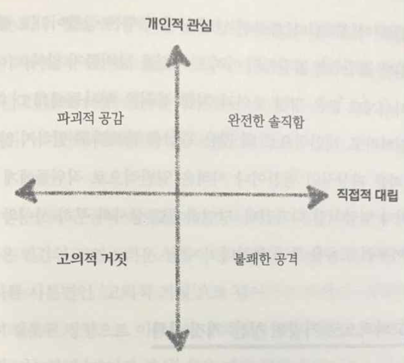
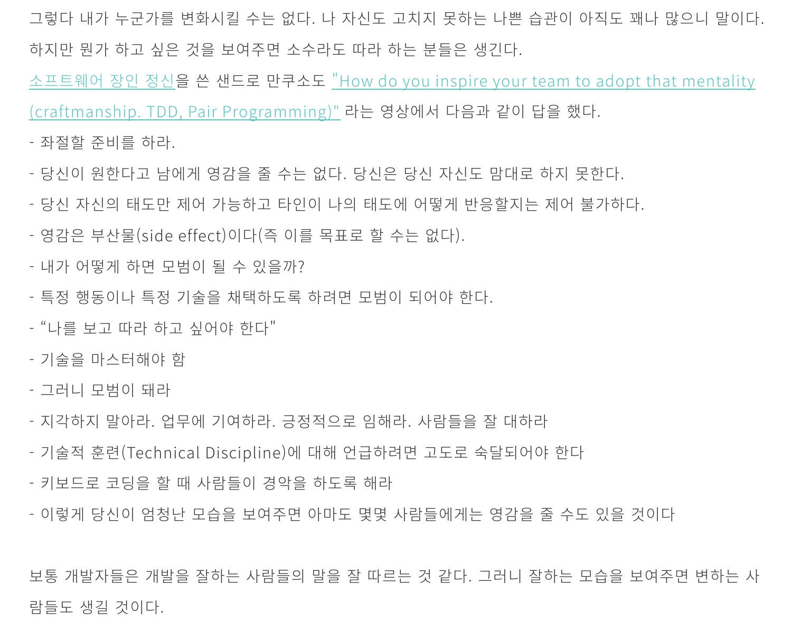
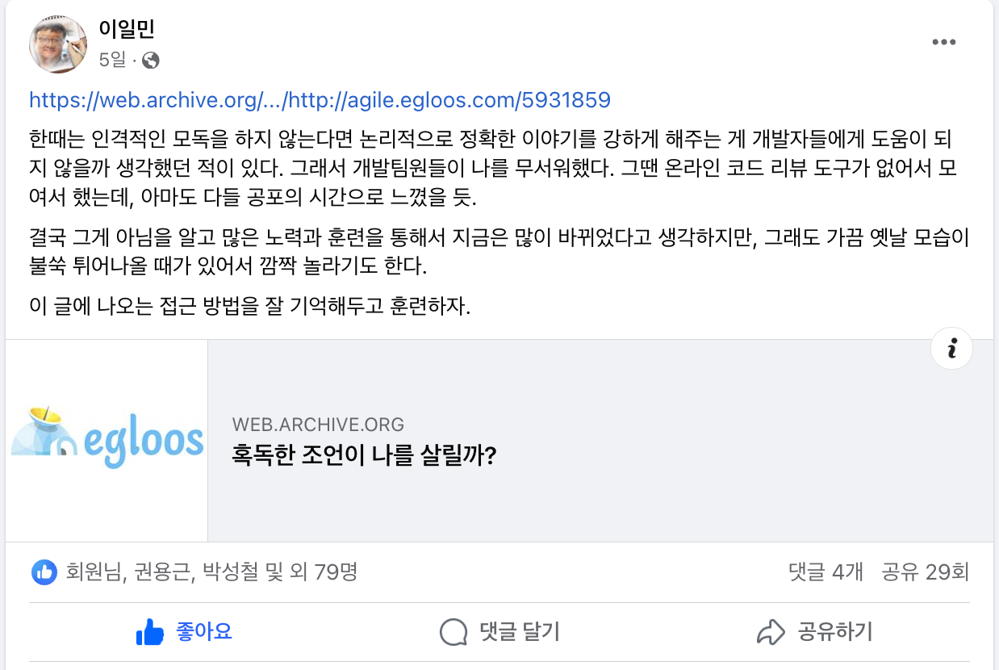

# 좋은 피드백

최근에 "왜 혹독한 조언 혹은 높은 프레셔 등 개발팀원들의 성장에 대한 강한 피드백을 하지 않느냐" 에 대한 질문을 들었다.  

그에 대해 다음과 같이 답변을 드렸다.  

“여러 회사를 거치면서 어떤 것이 진짜 성장인지 명확하지 않다는 생각을 하게 되었고,
지금 우리 팀에 필요한 것은 대기업에서 사용하는 기술을 적용하느냐 마느냐가 아니다.  
특히 어떠한 한명의 슈퍼맨에 의지해서 조직의 기술력이 높아지는 것 역시 필요하지 않다.
그렇게 해도 팀 전체는 전혀 성장하지 못한 불안한 성장이기 때문이다.  
가능하면 다 같이 성장해서 모두가 조직의 졸업까지 이탈자 없는 성장을 바라고 있다.”   

만약 현재 우리 팀원들이 제대로 된 성과를 내지 못하고 있다면,  당연히 피드백을 했을 것이고, 잘못된 방향으로의 성장에 대해서는 충분히 피드백을 하고 있다.  
(그게 혹독한 조언은 아니라서 나온 이야기겠지만 말이다.)  
  
현재 우리 팀원들은

- 쉬는 시간과 학습 시간의 밸런스를 지키고 있으면서
- 거대한 레거시 앞에서 용기를 내면서 하나씩 개선해나가고 있으며
- **제약 조건이 가득한 환경** 내에서도 **약속한 일정을 지키며 프로젝트 성과**를 계속해서 내고 있다.

특히 거대한 레거시와 함께 하면서 계속해서 일정을 지키면서 성과를 낸다는 것은 충분한 성장과 실력이 없다면 불가능하다.  
레거시를 그대로 두지 않고,  
그 안에서 할 수 있는 가장 최선의 선택들을 계속하고 있고,  
더 나은 방법들은 계속 찾고 있으니 말이다.  
  
나는 강한 피드백, 동료들간의 높은 피어프레셔 등이 **진짜 개발자의 성장에 도움이 된다는 것에 의구심**을 많이 갖고 있다.    

근 10년내 폭발적으로 성장한 스타트업들을 보면 성장 과정에서 많은 개발 팀원들의 이탈이 있었다.  
빠르게 성장하는 회사의 성장 속도를 기존 개발팀원들이 못쫓아가면서 이에 적응을 못하고 떠나는 것이다.  
그리고 이들을 어떻게든 성장시키기 위해 주변에서 **혹독한 조언을 한다**는 이야기도 많이 들었다.  
(특정 1~2개 회사들의 이야기가 아니다.)  

"당신과 비슷한 다른 연차의 사람들은 지금 얼마나 잘하는지 아느냐."  
"이렇게 계속 있으시면 지금 들어오는 재능 있는 신입 개발자들에게 금방 자리를 뺏길것이다."  
"그 연차에 그정도 해서는 앞으로 정말 위험하게 될 것이다."  
  
등등의 표현들이였다.  
  
근데 그 강한 피드백을 들은 사람들 중에서 **그 조언과 프레셔 덕분에 정신 차리고 개발 공부를 열심히 하게 되었다는 이야기를 들은적이 없다**.  
  
이게 나한테는 되게 중요했었는데,  
**팀원들의 성장에 진짜 도움이 되는 방식은 무엇인가**에 대해 진지하게 고민하게 된 것이다.  
혹독한 조언, 절벽으로 몰아세우는 듯한 강한 프레셔에 그동안 사실 굉장히 환상을 갖고 있던게 아닐까 하는 것이였다.  
사실은 **피드백을 주는 사람이 가장 편한 방식으로 주는 것이 혹독한 조언과 강한 프레셔 아닌가**라는 생각을 그때부터 많이 하게 되었다.  
  
아래는 함께 자라기의 저자이신 김창준님의 옛 블로그이다.  
> 창준님은 다들 아시다시피 객관적인 자료와 연구결과, 논문등을 토대로 항상 글을 쓰기 때문에 다른 분들보다는 훨씬 더 객관성을 가진 의견을 내신다고 생각합니다
 
- [혹독한 조언이 나를 살릴까?](https://web.archive.org/web/20200227120819/http://agile.egloos.com/5931859)

내용 중 일부를 발췌하면 다음과 같다.

- 영상을 보면 알겠지만 펄스는 글로리아를 화나게, 그리고 복종적으로 만들었습니다.
- 10년도 넘어서 글로리아는 당시 상담에 대해 이런 의견을 남겼습니다.
“짧은 세션 끝에서 저는 자신의 일부가 파괴된다고 느꼈어요. 그 세션 후에 저의 온전한 자아가 어떻게 산산히 부서졌는지요”
- 그 상담 이후 **진정 글로리아를 성장하게 한 것은 칼 로저스와의 15년 동안의 애정 어린 서신 교환** 덕분이며, **글로리아를 비난하는 조언은 그녀를 성장시키지 못했습니다**.
- 코칭을 하면서 이런 환상을 갖고 있는 사람을 종종 보게 됩니다. 뭔가 자신의 잘못된 점을 공격 받아야 나에게 실제로 도움되는 걸 했다는 느낌을 받는 것.
- **내담자를 존중하지 않는 방식은 장기적으로 효과가 없거나 부정적**이었다는 것이고, 동시에 내담자들은 이 방식에 현혹될 수도 있다.
- 쓰다고 꼭 몸에 좋은 것은 아니라는 것, 또 그걸 통한 폭력성을 정당화하는 것을 경계해야 한다

혹독한 조언과 강한 프레셔에 대한 환상을 다시 한번 생각해볼 필요가 있다.  
  
물론 이 글이, **동료들이 잘못된 방향으로 가는 것에 대해 전혀 피드백을 하지 말라는 것은 아니다**.  
피드백과 조언을 할 때 **진짜 그 사람을 변화시키고 싶은 것인지, 단순히 내 화를 못이겨서 상대에 대한 존중없이 그냥 내뱉기만 하는 것인지** 구분할 필요가 있다는 것이다.  
  
[실리콘벨리의 팀장들 (완전한 솔직함)](https://product.kyobobook.co.kr/detail/S000000600520)이라는 제목의 리더십 책에는 이에 대해 지금 내가 하고 있는 조언이 어떤 것인지 4분면을 소개한다.

  
  
지금 내가 하고 있는 조언이 정말 그들에 대한 존중과 이해를 가지고 하는 조언인지 아닌지 분명히 구분해야한다.  
그리고 그 조언이 정말 그 사람의 성장을 위한 것인지,  
내 답답함을 표현하는 것인지 다시 한번 생각해야한다.  
  
그리고 완전한 솔직함 그 이상으로 동료들을 변화시키는게 큰 효과가 있던 것은 **모범을 보이는 것**이다.  
  
**동료들이 닮고 싶은 롤모델이 되어 보자**.  
당신을 닮고 싶어하는 동료들이 전염되듯이 하나둘씩 생기게 될 것이다.  
그리고 그들은 당신처럼 되고 싶어서 그간 원했던 방향으로 움직이게 될 것이다.  
  

> 존경하는 개발자분들인 백명석님과 토비님의 최근 글도 함께 보면 좋다.  

([백명석님의 브런치 글](https://brunch.co.kr/@cleancode/67))

([토비님의 포스팅](https://www.facebook.com/tobyilee/posts/pfbid0Hzn2KHQpiA7NxFdf9EQWPW5q9n98GeAUUCqmDSvesrhbPMPSMBjXdew8dc35ysqYl))