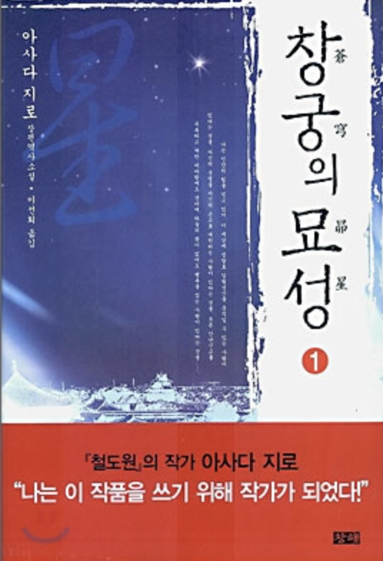
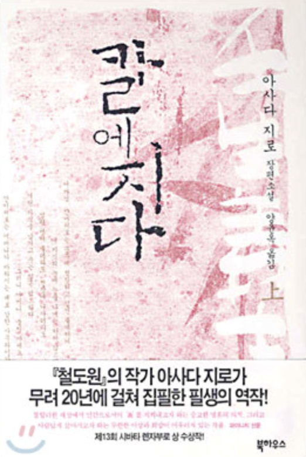
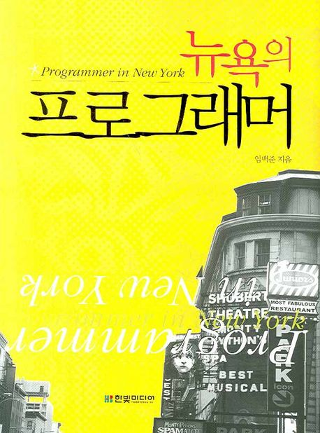
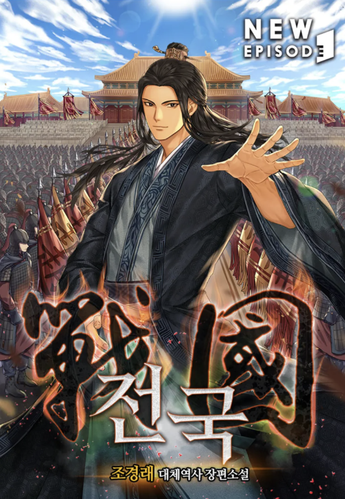
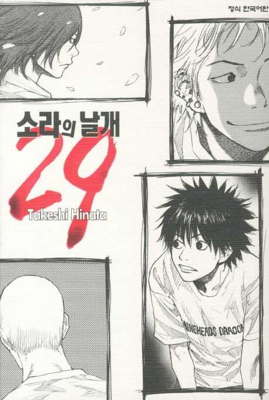

# 주인공에 대입하기

고민 상담을 하다보면 자존감에 대한 고민을 많이 듣는다.  

- 타인과의 비교
- 타인의 비난, 시기, 질투
- 내가 어쩔 수 없는 상황에 대한 불안감

등등 부정적인 감정을 만나게 될 때가 많다.  
  
그래서 나는 그 감정과 그 상황을 어떻게 잘 넘기는지에 대한 질문이 이어졌다.  
  
부정적인 기분을 잘 처리하는 사람인가? 하는 생각이 드는 것과 별개로 남들이 보기에 그랬다면 어떻게 그랬을까? 곰곰히 생각해봤다.  

그러다가 [도둑맞은 집중력](https://product.kyobobook.co.kr/detail/S000201621022)의 내용을 보고 답을 찾을 수 있었다.
  
> 우리는 소설을 읽을 때 다른 사람의 머릿속에 있는 경험에 푹 빠져든다.  
> 사회적 상황을 그려보고, 깊고 복잡하게 타인과 그들의 경험을 상상한다.  
> ...
> 키스 오틀리 교수는 소설을 많이 읽으면 책 밖에서도 **실제로 타인을 더욱 잘 이해할 수 있을지 모른다고 말했다**.  
> ...
> 실험 결과는 명확했다.
> **소설을 많이 읽을수록 다른 사람의 감정을 잘 읽어냈다**.  
> 이것은 그저 교육을 잘 받았다는 증거가 아니었다.
> 비소설 독서는 공감 능력에 영향을 미치지 못했기 때문이다.

도둑맞은 집중력에서는 타인에 대한 공감을 이야기했지만, 나에게는 타인의 부정적인 감정에 대한 적응력을 높여준다고 해석되었다.  
  
타인에 대한 질투 혹은 타인의 비난 등의 부정적인 감정을 처음 겪을때와 이미 몇번 경험하고, 이에 대해 나는 어떻게 대할까 등을 미리 고민해볼 수 있다면 어떨까?  
  
실제 나에게 그런 일이 닥쳐도 이미 익숙한 상태라서 조금 더 여유있게 상황을 지켜볼 수 있다고 생각한다.  
  
어디까지나 처음하는 경험이냐는 것이다.  
나 자신에 대한 부정적인 감정이나 타인에 대한 부정적인 감정은 처음일땐 낯설고 두렵다.
이걸 낯설지 않게 하는건 미리 경험하는것이고 그건 소설책을 통해 간접 경험 할 수 있었다.  

특히 역경을 이겨내는 주인공의 이야기,  
복잡하게 엮인 여러 정치적 상황에서 실타래 풀듯이 하나하나 해결해나가는 과정 등을 보면서 몰입하는 것이 생각보다 도움이 되었던것은 아닐까 생각하게 되었다.  
  
삼국지, 춘추 전국 시대 등 여러 인물들의 갈등과 정치적인 공작들을 풀어낸 역사속 이야기를 좋아한다.  
특히 이를 재해석한, 추가적인 상상력을 더한 이야기들을 좋아한다.
  
"아니 뭐 저런 사람이 있어?"
"내가 저런 말도 안되는 상황이라면 어떻게 했을까?"  
"나라면 저렇게 재능이 없을때 저렇게 할 수 있을까?"

등등 여러 상상의 나래속에 나를 대입하게 된다.  
그러면서 역경을 이겨내는 주인공에, 여러 갈등속 등장 인물들에 대입하면서 **감정 맷집을 늘려줬던건 아닐까?** 하고 생각해본다.  
  
그래서 주변에 여러 재밌게 본 소설책들을 추천한다.
지금 당장 떠오르는 소설책들을 몇가지 추천해보고싶다.

#### 창궁의 묘성 (아사다 지로)

청나라 말기 서태후 시대의 이야기를 그린 역사 소설이다.

이 책에는 2명의 주인공이 나오는데, 

- 가난한 집안에서 끝날 운명인 '이춘운' 은 점술가의 **가짜 예언**인 '이 세상의 모든 보물을 가질 것' 을 믿고 본인의 운명을 개척해나간다
- 세상을 호령할 운명인 '양문수'는 점술가의 **진짜 예언**에 따라 고난과 역경을 이겨내면서 본인의 운명을 가져온다. 

각자가 자신의 운명을 개척해나가는 과정이 굉장히 몰입되었다.  
흔히 만화에서 나오는 [왕도물 / 사도물](https://namu.wiki/w/%EC%99%95%EB%8F%84%EB%AC%BC) 을 한번에 볼 수 있는데, 이 과정에서 각각의 등장인물들의 속마음 묘사도 좋아서, **왜 사람들은 바보 같은 행동들을 하게 되는가?** 에서 한번 더 생각하게 만들었다.

> 중국의 관점에서 쓴 소설임에도 **이토 히로부미에 대한 미화가 녹여져있다**. 
> 당연하지만, **일본에 대한 소설속 해석은 가려서 읽어야 한다**.

#### 칼에지다 (아사다 지로)

도쿠가와 막부 시대 신선조의 한 사무라이의 이야기이다.  

가족과 아버지에 대한 내용이 주 내용처럼 다가오지만, 읽다 보면 **조직 사회의 갈등 이야기가 더 크게 와닿는다**.

- 카리스마 넘치고 유능하지만, 사람 보는 눈이 종종 어두워 아첨꾼을 불러들이는 리더
- 그런 아첨꾼들을 싫어하고 암살을 하려는 기존 조직원들
- 아첨꾼들과 기존 조직원들 사이에서 수습하느라 고생하는 중간 리더

리더에게서 말도 안되는 명령을 받은 조직원의 입장에서 나라면 어떻게할까? 같은 생각을 소설속에서 계속 느끼게 된다.  
  
물론 읽다보면.. 눈물 펑펑 나는 경험을 계속 하는 것도 이 소설이 주는 매력이다.

#### 뉴욕의 프로그래머 (임백준)

개발자 중 가장 글을 잘쓴다고 생각하는 임백준님의 개발자를 위한 소설이다.  

> 알고리즘 하시는 최백준님과 다른 인물이시다.
> 종종 동일인물로 생각하시는 분들이 많으셔서...

(지금은 절판되었지만) 뉴욕 월스트리트 금융회사에서 근무하는 프로그래머들의 이야기를 소설 형식으로 그렸다보니, **멋진 프로그래머들은 저런 삶을 사는구나** 라는 상상을 하게 해줬다.

특히 **개발 공부 보다는 프레젠테이션 역량을 더 쌓으라는 이야기를 계속 듣던 시기**에 이 소설이 정말 많은 힘이 되었다.  
나도 저런 프로그래머들과 저런 대화를 하면서 회사 생활을 하고 싶다는 생각을 하면서 계속 공부를 했기 때문이다.  
  
지금은 절판되어서 도서관에 가야만 볼 수 있는데, 척박한 개발환경에서 동기부여가 어려운 개발자라면 꼭 보길 추천한다.

#### 전국 (조경래) 

웹소설에 대한 내 생각을 정말 많이 깬 조경래 작가님의 [전국](https://series.naver.com/novel/detail.series?productNo=3966055)이다.  
전국시대 말기부터의 이야기를 다루고 있다.

전국 시대 최고 간신인 조나라의 곽개의 막내 아들로 환생한 주인공이 진시황제의 전국 통일을 막기 위해 노력하는 이야기이다.

- 진나라의 통일을 막으려면 조국인 조나라가 망하지 않아야함
- 그럴려면 최고 간신인 아버지 (곽개)와 형들을 모두 없애야함
- 이를 위해 충신들과 연합하고 싶은데, 최고 간신의 아들이라 모두가 의심부터 시작

레고 블럭 쌓듯이 하나씩 자신의 기반을 만들어나가는 과정, 그 과정에서 겪는 어려움을 해결해나가는 과정등을 보면 '이걸 어떻게 풀어나가냐' 하는데, 그걸 풀어내가는 과정에서 이런 저런 생각을 많이 하게 됐다.

#### 소라의 날개 (히나타 타케시)

소설책 이야기하다가 갑자기 만화책을 이야기해서 이상하지만 그래도 주변에 가장 많이 추천하는 책이라고 넣게 되었다.  
  
일반 소설책 보다는 그래도 읽기 쉬운 책들을 많이 추천하는 편인데, 그래서 대체 역사 소설이나 만화책을 많이 추천한다.  
  
일반적인 열혈 스포츠 만화에서 보기 힘들 정도로 재능적으로, 인격적으로 아직은 부족함이 많은 주인공과 농구부원들의 이야기인데 진짜 있을법한 내용들이라는 생각이 들 정도로 등장인물들이 입체감이 있었다. 

실제 농구부에서 일어난듯한 사건들을 하나씩 대입해서 풀어내는데 정말 현실적인 인물들이 많았다.

- 항상 중요한 순간마다 도망치는 것을 선택하는 동료
- 엄한 체벌로 농구부원들을 떠나게 만드는 코치
- 새로 입부하는 1학년 신입생의 실력에 질투가 나서 결국 퇴부하는 동료
- 연습 경기에서 많은 승리를 하면서 자신감이 생겼지만, 실제 대회 1회전에서 탈락하는 팀

당연하지만, 그렇게 부족한 사람들끼리 모여서 갑자기 전국 강팀이 되는 이야기가 절대 나오지 않는다.  
'지독하게도 못이기네' 하는 생각을 하게 만들 정도로 패배의 이야기만 가득한데, 그럼에도 조금씩 팀이 더 나아가고 있는 과정이나, 개성있는 동료들간에 갈등을 풀어내가는 과정등이 와닿았다.

## 마무리

누가보면 이런 소설속 주인공에 자신을 대입하는 것이 중2병이 아닌가 싶을수도 있다.  
그래도 이런 상상 하는데 돈이 드는 것도 아닌데 뭐 어떤가 싶다.  
나도 **소설속 주인공처럼 역경과 고난을 이겨내는 스토리를 쓴다고 생각한다면 모든 문제는 다 스토리의 일부분**일 뿐인데 말이다.

최근에 팀 동료와 1 on 1을 하면서 **너무 기술책만 보지 말라**는 이야기를 했다.  
현실에서는 기술로만 풀 수 있는 문제가 그렇게 많지 않기 때문이고, **기술력만 좋으면 조직의 모든 문제를 풀 수 있다고 믿고 있으면 안되기 때문**이다.  
날씨도 좋아진 요즘, 주말 아침에 재미난 소설책을 보고 있기를 바래본다.

  

