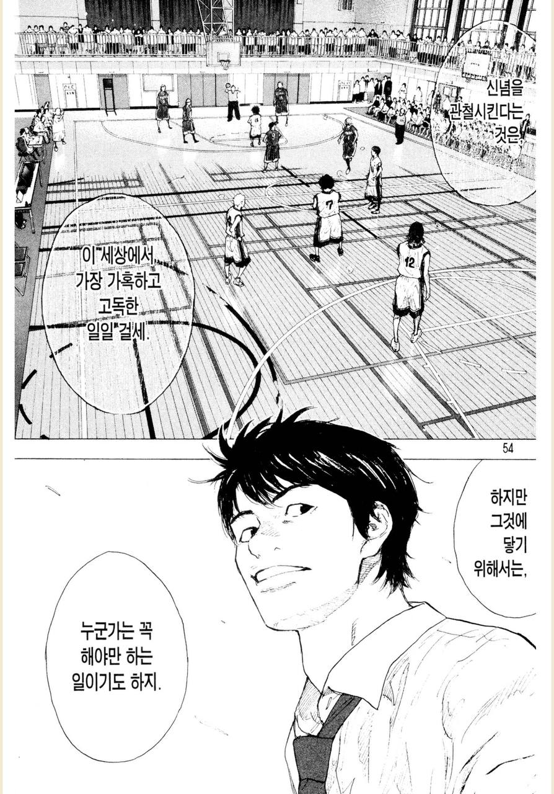
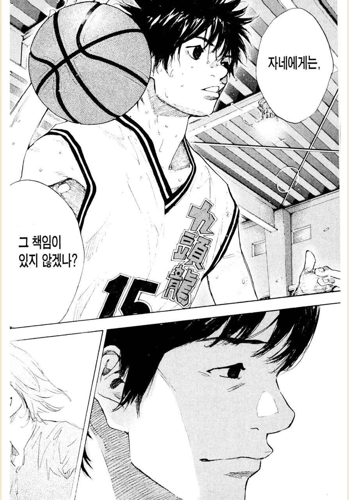

# 미움 받을 용기

주선님, 유진님과 함께 하는 [트레바리 - 독서모임](https://m.trevari.co.kr/product/5f97ae9d-1a5b-4b0a-8418-a6eb3f03370e) 에서 리더십에 관한 이야기를 하던 중, "리더에게 가장 중요한/필요한 자질은 무엇일까요?" 라는 질문이 나왔다.  
  
참여하신 많은 분들이 자신만의 답을 제시하였는데, 나는 "**외로움을 버티는 힘 - 팀원에게 미움 받을 용기**" 라고 했다.  
당연히 중요한 리더십 원칙들이 많겠지만, 여러 리더들과 동료들을 보면서 이게 사실은 가장 중요하다는 생각을 했다.  
  
계속 팀원의 역할만 하다가 리더가 되신 분들은 팀원들에게서 미움 받는 것에 대해 굉장히 취약한 경우를 종종 봤다.  
  
소수의 팀원만 있다 하더라도,  
해당 팀원들의 리더가 된다는 것은 이전과는 다르게 그들과 어느정도의 거리감을 둬야한다.  
  
감정에 치우치지 않는 결정들을 내리기도 해야하고,  
때론 팀원들이 싫어할만한 이야기도 꺼내야 한다.  
다 함께 조직에 대해 불평불만하던 것도 이제는 같이 해선 안된다.  
불만의 대상이였던 조직의 입장을 본인이 대변해야한다.  
  
그러면서 점점 팀원들도 느낀다.  
이젠 저 사람이 **같은 팀원이 아니라 조직에 더 가까운 사람이고 본인의 평가자**가 된 것을.  
  
그 전까지는 같은 팀원이였기에 속에 있는 이야기들도 쉽게 나누었다면, 이제는 평가자가 되었기에, 사측에 가까워졌기에 점점 예전과 같이 편하게 이야기를 하지 않는 것을 느끼게 된다.    
**'내'가 없는 비공개 슬랙 채널**이 생기기도 한다.  
주변은 바뀐게 없는데 나만 홀로 떨어져있는 것 같은 느낌을 받는 상황이 된 것이다.  
  
이때 극심하게 외로움을 느낀다.  
여기서 이 감정을 감당하지 못하는 분들은 팀원으로서의 모습을 벗어나지 못하고, 리더가 아닌 여전한 팀원으로서의 행동과 생각을 계속 하게 된다.  

- 조직에 필요한 프로젝트 보다는 팀원들이 하고 싶은 프로젝트로만 상위 보고를 한다던가
- 팀원에게 해야할 피드백을 제대로 못한다던가
- 조직의 결정에 대해 팀원들을 설득하지 못하고 여전히 팀원때처럼 상위 조직장에게 도움을 요청한다던가
- 팀원들과 함께 조직의 결정을 비난하고 종국엔 팀 전체의 불만이 더 커지게만 한다던가

팀원들이 하기 싫어하더라도, 그게 조직적으로 훨씬 더 이득이 되는 결정이라면 어떻게든 설득을 해야하고 성과를 내야한다.  
그리고 그걸 위해 팀원들과 어느 정도의 거리감은 뗄 수 없다.  
  
**리더가 된다는 것은 결국 결정을 내려야 함을 의미한다**.  

**팀원 모두 100% 설득 하는 것은 대부분 어렵다**.  
그리고 100% 설득 전까지 움직이지 못하는 것은 조직의 입장에서 대단히 위험하다.  
    
조직의 결정을 구성원들이 다 하기 싫어한다면 설득이나 설명을 충분히 하고, 그래도 설득이 안되면 과감하게 조직의 결정에 따라 움직여야 한다.  
  
그걸 염두해두고, **모두를 설득시키지 못한채 일을 진행하는 것으로 인해 발생하는 '미움' 에 대해 감수해야 하는 것**이 필요하다.    
  
이게 제대로 안되면 이리저리 휘둘리는 리더가 되어서 오히려 누구하나 만족시키지 못하고 성과 내지 못하는 리더와 팀이 될 뿐이다.  

물론 항상 팀원이 원하는 것을 하지말라는 것은 아니다.  
**조직의 방향성이 구성원의 성장과 행복으로 느낄 수 있도록** 잘 설명하고, 그럼에도 어렵다면 가장 플러스(+) 가 되는 결정을 내려야 한다는 것이다.  
그게 설령 주변의 미움을 받는 결정이라 하더라도 말이다.

---

리더로 임명되었다는 것은 조직이 그만큼 신뢰함을 의미한다.  
그리고 조직에서도 당신이 더 성장해서 더 큰 영향을 끼쳐주기를 바라는 것이다.  
  
그런 신뢰는 누구나 얻을 수 있는 것도 아니며, 누군가는 간절히 바라는 선물 같은 것이다.  
그 선물을 내가 불편하다고 포기하지말자.  
그 누구보다 리더로서 잘 될 수 있음을 조직이 믿어준 것임을 잊지말자.

## 함께 보면 좋은 글

- [어떤 감독이 될 것인가](https://jojoldu.tistory.com/781)
- [어느 축구 선수의 은퇴와 선물](https://jojoldu.tistory.com/782)