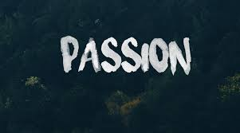

# 열정을 다시 생각하다

예전 (2016년경) [구글캠퍼스 리쿠르팅 데이](http://jojoldu.tistory.com/124)에 참석하였다.  
  
선배 개발자님의 경력관리 이야기나, 잘나가는 스타트업의 채용이야기등을 재밌게 듣고 같이 온 동생들과 그들의 지인들이 모여 행사장안에서 맥주를 마시고 있었다.  
  
얘기 도중 생전 처음 보는 여성 두 분이 우리의 자리로 다가왔다.  
  
"저 혹시 저희가 따로 드릴 말씀은 없는데 옆에 앉아서 하시는 얘기 듣기만 해도 될까요?"  
  
으응?  
  
"좋은 말씀 있는데 한번 들어보실수 있으신가요? " 도 아니고, **가만히 옆에서 듣기만 하겠다니**?  
  
"그러세요" 라고 대답하고 얼떨떨한 마음을 뒤로한채 하던 이야기를 계속 했다.  
  
그리 길지 않은 시간이 지나, 하던 이야기가 끝난 후 질문을 하였다.  
  
"어떻게 알고 저희쪽으로 오신거에요?"  
  
"아까 맥주 기다리면서 네 분이서 이야기하는 걸 살짝 들었는데, 잘 모르겠지만 개발에 대한 이야기를 하시는것 같아서 무작정 말 걸었어요!"  
  
"아 두 분은 친구사이이신가요?"

"아뇨, 저희도 여기서 처음 봤어요!"

으응??

그 두 분도 여기서 처음 보고 그 여학생분이 저기서 저 분들 이야기하는걸 같이 들어보는게 어떠냐고 해서 온 것이였다.  

"저는 XX대학 경영학과 학생인데, 복수전공으로 컴퓨터 공학을 선택하고나니 아는 선배들이 없어 답답함이 많았어요. 그러다가 이런 행사가 있다는 걸 알게되서 오게 됐는데, 아까 맥주 기다리면서 하시는 얘기 듣다가 너무 저한테 필요할 것 같아서 무작정 오게 됐어요"

정말 깜짝 놀랬다.

내가 본 그어떤 사람보다 열정적으로 보였다.

물론 **순간의 폭발적인 열정이 있다고 해서 개발자로서 성공을 보장할 순 없다**.

오히려 지치지 않고 계속 나아가는 꾸준함이 더 필요하다.

네트워킹파티 시간이 끝나고 그분들과 헤어지고 같이 온 동생들과 이런 저런 얘기를 하다가 다음과 같은 말을 했던 기억이 난다.  

"행사도 재밌었지만, 저분들 만난게 더 자극이네요"
"저분들 진짜 잘됐으면 좋겠네요"