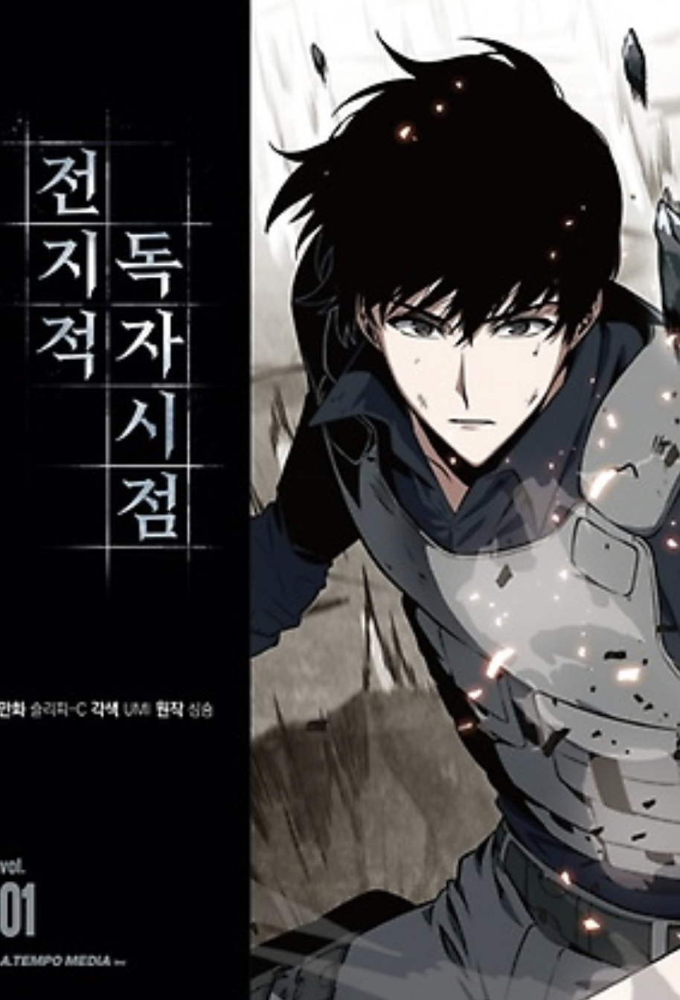

# 영웅의 서사

웹 소설 [전지적 독자 시점](https://comic.naver.com/webtoon/list?titleId=747269)을 몇 번이나 다시 읽을 정도로 좋아한다.  
  

이 소설의 세계관이 너무 마음에 들기 때문인데,  
**그 인물이 어떤 서사를 쌓아왔는지에 따라 강함이 결정 된다**.    
  
세계관 속 인물의 타고난 강함이 있더라도,  
계속해서 서사를 쌓지 않으면 그 인물은 계속해서 약해지기만 하며 시간이 더 지나면 소멸한다.  
  
더 많은 모험을 즐기고, 더 많은 사건을 거친 인물일수록 더 강해지고 오래오래 살 수 있다.  
그래서 12과업을 달성한 헤라클래스나 제천대성, 필마온등으로 수많은 이야기를 쌓은 손오공 등이 최강의 캐릭터로 묘사된다.  
  
이 세계관 속 주인공과 동료들은 어마어마한 험난한 여정을 걸어간다.  
  
더이상 스테이지를 클리어하지 않아도 평화롭게 지낼 수 있는 스테이지를 스스로 무너뜨려야 한다거나  
동료들에게 죽임을 당해야만 다음 스테이지로 갈 수 있다거나  
친 어머니와 싸워야 한다거나  

"이렇게까지 말도 안되는 상황이 있나" 싶은 스테이지들을 주인공과 그 동료들은 하나씩 해결해나간다.  
  
자신을 죽일뻔한 적을 동료로 맞이하기도 하고  
타인에게 큰 오해를 받아 나쁜 사람이 되기도 하고  
동료를 위해 대신 죽임을 당하기도 하는 등  
**주인공의 여정은 다른 신화 속 주인공처럼 많은 굴곡이 있었고,  
종국에 본인이 원하는 여정의 끝**을 얻는다.  
  
3번째 직장에서 심적으로도, 체력적으로도 굉장히 힘든 때가 있었다.    
"내가 왜 굳이 여기서 이렇게 힘들게 다녀야하지" 라는 생각을 자주 했고, 주변 동료들에게 말은 안했지만 혼자서 퇴사에 대한 고민도 몇번 했었다.  
  
그때 이 책을 보게 되고 출근 길, 퇴근 후 자기 전 시간에 이 책을 읽는것이 당시의 낙이였다.  
말도 안되는 상황에서, 불합리하다고 싶을 정도의 역경을 계속해서 이겨내는 주인공을 보고 현실에서의 용기를 꽤나 얻었다.  
  
그리고 **주인공이 겪는 역경에 비하면 현실의 내가 겪는 역경 정도는 역경도 아니라는 생각**도 들었다.  
  
"내가 주인공처럼 판타지 세계로 넘어가진 못하지만, 현실에서의 삶을 판타지 속 세상처럼 지내보자"    
"소설 속 주인공처럼 나의 서사를 만들어가자"  
는 생각을 하게 되니 **삶의 모든 일들이 에피소드**가 되었다.  
  
이걸 계기로 3번째 회사를 꽤나 오래 다닐 수 있었고,  
회사의 Exit과 원하는 레벨로의 승진, 동료들과 완주한 경험까지 등을 모두 다 해볼 수 있었다.  
  
["창준님의 워크샵 - 당신은 영웅의 여정을 걷고 있습니까"](https://www.facebook.com/cjunekim/posts/pfbid0gMzwwmkYd4zjp9qFH1CEWpKdzny5wCa6Ubrnxwxpp8CEUtehraNdQQ2CfVrsuhq4l)에 참석한 적이 있다.  
  
해당 워크샵에서 이와 유사한 이야기를 소개해주셨다.  
"**본인의 삶이 소위 영화나 소설에서 보는 영웅의 여정과 유사하다고 느낄수록 삶의 의미가 높다**"는 연구 결과가 있다는 것이였다.  
  
신기해서 찾아보니 정말 있었다.  

- [Seeing Your Life Story as a Hero’s Journey Increases Meaning in Life](https://www.researchgate.net/publication/367377960_Seeing_your_life_story_as_a_Hero's_Journey_increases_meaning_in_life)  

<전지적 독자 시점> 의 <김독자> 처럼
<소라의 날개> 의 <소라> 처럼  
<원피스> 의 <루피> 처럼  
<드래곤 퀘스트 타이의 대모험> 의 <타이> 처럼  

**내가 겪는 모든 사건 사고, 고난들을 영웅들이 겪는 모험의 여정과 같다고** 생각한다면 내 삶의 의미가 높다는 것이였다.  
많은 이야기속 영웅들처럼 내 삶을 바라보고 노력하는 것이 더 삶을 유의미하게 살 수 있다는 것이다.  
  
주인공처럼 이를 잘 이겨낼 힘이 본인에게 있고,  
그걸 이겨낸다면 또 하나의 서사가 쌓이는 것이고,  
이겨내기 힘든 일이라면 또 다른 새로운 선택에서 새로운 서사가 쌓일 것이다.  
  
중요한 것은 **이야기 속 주인공처럼 내가 겪는 모든 일들을 에피소드처럼 생각하고, 앞으로 나아가는 것**이다.  
  
최근에 ['묻지마 칼부림'을 제압한 대만의 한 남성](https://www.hankyung.com/article/2024060694147) 의 인터뷰를 봤다.  
  
무서운 흉기 앞에서 이 남성은 어떻게 용기를 냈는지에 대한 인터뷰를 마지막으로 소개한다.

> 쉬 씨는 흉기 3개를 휘두르는 범인을 저지하려다 얼굴을 다쳤지만, 물러서지 않고 다가가 흉기를 빼앗고 가세한 다른 승객들과 함께 범인을 제압한 것으로 알려졌다.  
> 
> **그는 왼쪽 얼굴에 9cm가 넘는 상처를 입고 광대뼈가 부러져 병원에서 수술을 받았다**.  
> 
> 쉬 씨는 "**'힘멜이라면 그렇게 했을 것이다'라는 (만화 속) 대사가 나에게 용기를 줬다**"며 "그때로 돌아가도 내 생각은 마찬가지였을 것"이라고 당시 인터뷰에서 밝혔다.  
> 
> 일본의 판타지 만화 ‘장송의 프리렌’에 등장하는 **용사 ‘힘멜’은 고결한 성품과 굴하지 않는 용기, 어려움에 처한 사람을 돕는 헌신의 상징**과도 같은 캐릭터다.  
> 
> **만화 속 동료들은 어려운 상황에 처할 때마다 “힘멜이라면 그렇게 했을 테니까”** 라고 입버릇처럼 말한다.

나도, 주변도 모두가 그런 주인공들의 여정을 밟고 있길 바래본다.  

## 함께 보면 좋은 글

- [소설에 몰입하기](https://jojoldu.tistory.com/735)

