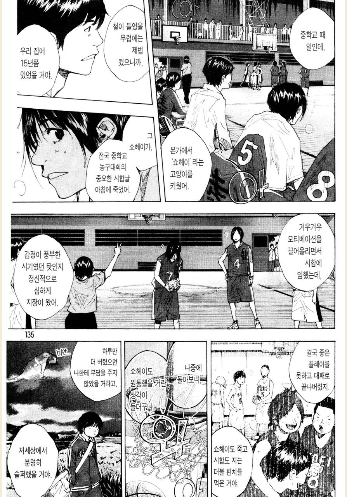
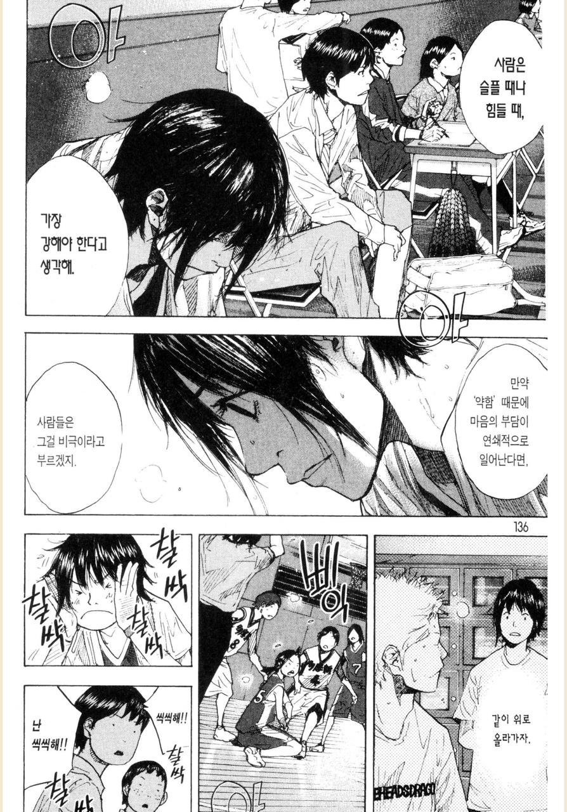

# 좋은 오프보딩

온보딩의 반대말로 오프보딩이 있다.  
조직을 나가는 직원에 대한 퇴사 절차를 의미한다.  
  
보통 퇴사 이후에도 회사에 대한 좋은 이미지를 남겨주기 위해 좋은 방향으로 퇴사절차를 밟는다.    
여기서 중요한 것은 **절차**에 집중한다는 것이다.  
  
이런 절차도 물론 중요하겠지만,  
그 팀원이 정말 좋은 팀원이였다면 **떠나는 이가 미안해 하지 않도록 하는 것이 중요**하다.  
그리고 이를 위해 **떠난 이후에도 조직이 계속해서 더 잘되는 모습을 보여줘야한다**.  
  
[소라의 날개 31권](https://product.kyobobook.co.kr/detail/S000000488375)에서도 비슷한 이야기가 나오는데 많이 공감되었다.  
(오른쪽에서 왼쪽방향으로 읽어야 한다.)  
  

떠나는 팀원이나 남은 팀원이나 **서로에게 소중한 시간을 함께한 동료였다면 부정적인 감정이 전파되길 바라지는 않을 것**이다.  
그래서 각자 자기의 자리에서 잘 되는 모습을 보여줘야한다.  
우리가 함께 했던 시간이 무의미하지 않았고 굉장히 유의미했음을 알려줘야하는 것이다.  
  
돌이켜보면 나에게도 가장 좋은 오프보딩은 **내가 떠난 뒤에도 그 회사가 너무 잘되어서 내 커리어에 두고 두고 자랑할 수 있게 해준 것**이였다.  
  
전 회사를 다닐때 당시에는 부정적인 감정이 생길때도 종종 있었지만, 끝나고 나서 이 회사가 진심으로 더 잘되기를 바랬다.  
  
내가 떠난 것에 대해 다들 아쉬워하고, 빈 자리가 더 크게 느껴지길 바라는 등의 생각도 잠깐 했었다.  
다만, 그 생각은 잠깐 하고 이후에는 하지 않았다.  
  
심리적으로는 나와 함께 여정을 보낸 동료들이 여전히 회사에는 많이 남아있었고 그 분들에겐 감사한 마음이 더 크기 때문이였다.    
그래서 더 힘들어지기 보다는 **지금보다 훨씬 더 행복하게 일하길 바랬다**.  
  
실리적으로는 **내가 다녔던 회사가 더 잘될수록 내 커리어도 훨씬 더 좋아지기 때문**이다.  
내가 거쳐간 회사들마다 끝이 좋지 않거나, 더이상 성장하지 못한다면 과연 나라는 사람은 회사에 이득이 되는 사람인가? 라는 생각이 들었다.  
그래서 내가 다녔던 모든 회사들은 더 잘되기를 항상 바랬다.  
그래야 그렇게 잘 된 회사에서 경험한 내 경험도 더 인정 받을 수 있다고 생각했다.  
(물론 타인이 인정해주냐 마냐는 크게 중요하진 않지만 말이다.)  

전 회사는 내가 떠난 이후에도 계속해서 성장하여 [연매출 1조원의 회사가 연매출 3조원의 회사](https://zdnet.co.kr/view/?no=20240207095354)가 되었다.  
나는 새로운 회사에서 재밌게 일을 하면서도 갑자기 연매출 3조원의 회사 출신의 시니어 엔지니어가 된 것이다.  
퇴사 이후 멈춰있던 과거의 커리어를 계속 성장시켜준 것이다.  
  
그래서 떠난 이후에 역대 최고 성적을 계속해서 갱신해내는 전 회사를 보면서 부럽기도 하면서 되게 감사했다.  
지금 **최고의 성적을 내는 저 사람들과 함께 했던 내 시간이 결코 잘못된 시간이 아니였고**, 정말 멋진 회사에서 멋진 동료들과 함께 했음을 증명해주고 있기 때문이다.  
    
그래서 떠나는 동료가 정말 좋은 동료였다면,  
더 잘되어가는 모습으로 보답하는 것이 가장 좋은 오프보딩이자 선물이다.  
  
서로가 서로에게 미안하지 않고,  
다시 만나도 웃으면서 과거 이야기를 할 수 있으니 말이다.  
  

