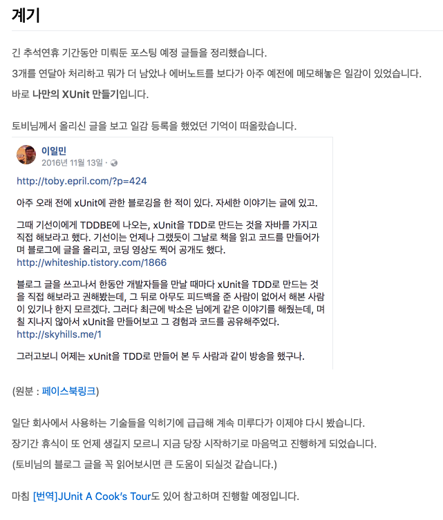

# 2025년 추석 완강 챌린지

주니어일때 명절은 밀린 공부를 몰아서 할 수 있는 행복한 시간이였다.  
주말까지 껴있는 경우 거의 8~10일을 출근하지 않고 공부할 수 있으니 Todo 목록에 있는 대부분의 개인 프로젝트들, 블로그에 정리해야할 것들, 밀린 책들을 다 보는 시간으로 가졌다.  
  
특히 2017년 추석이 역대급 황금연휴였는데, 10.02 에만 휴가를 쓰면 09.30 ~ 10.09 까지 총 10일을 쉴 수 있었다.

이때 진짜 너무 행복하게 시간을 보내서 **추석 연휴 동안 5개의 기술 블로그 글을 발행**했다.  

당시 팀에 새로 합류한 분들을 위한 Spock 관련된 1,2편의 글이나 코드리뷰로 종종 언급했던 메소드 파라미터, eslint적용 등 여러 내용들을 정리하고 추가로 학습했다.  
밀린 공부와 글감들을 다 발산하는데 10일 내내 도파민이 넘쳐흐르는 것 같았다.  
  
특히 토비님이 추천하신 TDD로 xUnit 만들기를 이때 진행했었고, 그 과정도 상세히 정리하는 시간을 가졌다.

- [JUnit 만들어보기](https://jojoldu.tistory.com/231)
  
결혼 이후에는 예전처럼 개인 공부하는데 모든 시간을 쓸 순 없지만 그럼에도 여전히 명절 연휴는 나에겐 성취감을 주는 귀한 시간이다.    

혼자서 긴 시간 공부하다보면 지루할때도 많았다.  
그럴때는 지인들과 스터디 까페에 모여서 하루종일 모각코를 진행하기도 했다.  
  
아침 8~9시 사이에 모여서 공부하다가 잡담도 하고 점심시간에 밥도 같이 먹으면서 공부했던 것들을 공유하고 각자 일정에 맞춰 퇴근도 하면서 완전히 자유롭게, 다만 외롭지 않게 공부했다.  
  
건강한 식단과 규칙적인 운동을 하고나면 건강과 체력이 좋아지는 것 처럼,  
긴 연휴를 알차게 보내면 그만큼의 마음 건강이 단단해졌다.  
그래서 이렇게 시간을 보내고 나면 아무리 긴 연휴기간이였어도 회사 복귀가 전혀 힘들지 않았다.  
  
---  

코로나 기간이후로 이렇게 다 같이 추석 연휴때 모여서 각자가 공부하고 싶은 주제를 공부하고 이야기 나누는 모임은 없어졌다.  
그러다보니 이제 연휴에 혼자서만 계속 공부하고 있다.  
  
올해 추석은 2017년처럼 또다시 황금연휴다.  
10.10일만 휴가를 쓴다면 총 10일을 연속해서 쉴 수 있는 긴 시간이다.  
  
이 시간을 코로나 전처럼 건강하게 보낼 순 없을까?

---

그래서 이번에 이 긴 추석 연휴동안 온라인으로 많은 사람들이 모여서 함께 공부하는 시간을 준비했습니다.

> 저는 이번 추석때 [강병진님의 회사에서 바로 쓰는 업무자동화 AI 에이전트 (w. n8n, LangGraph)](https://inf.run/6qxhv) 를 완강하려고 합니다 :)