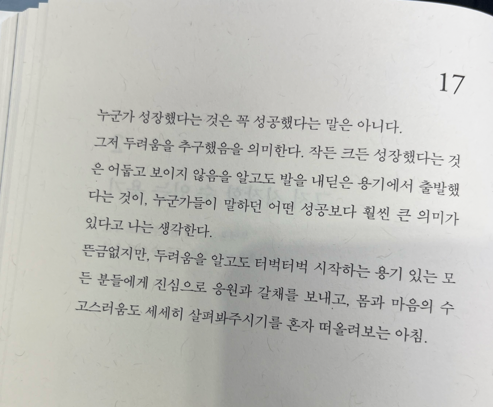

# 두려움을 추구하는 용기

> 누군가 성장했다는 것은 꼭 성공했다는 말은 아니다.
그저 두려움을 추구했음을 의미한다. 작든 크든 성장했다는 것은
어둡고 보이지 않음을 알고도 발을 내딛은 용기에서 출발했다
는 것이, 누군가들이 말하던 어떤 성공보다 훨씬 큰 의미가
있다고 나는 생각한다.

뜬금없지만, 두려움을 알고도 터벅터벅 시작하는 용기 있는 모
든 분들에게 진심으로 응원과 갈채를 보내고, 몸과 마음의 수
고스러움도 세세히 살펴봐주기를 혼자 떠올려보는 아침.

