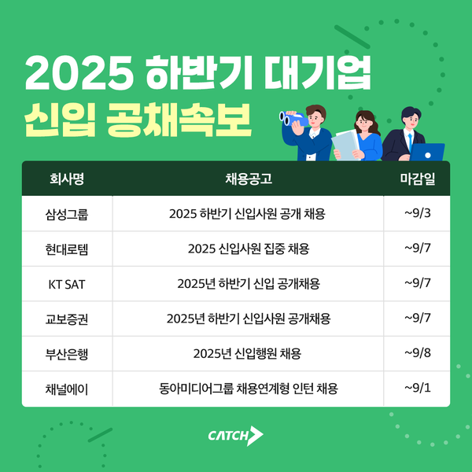
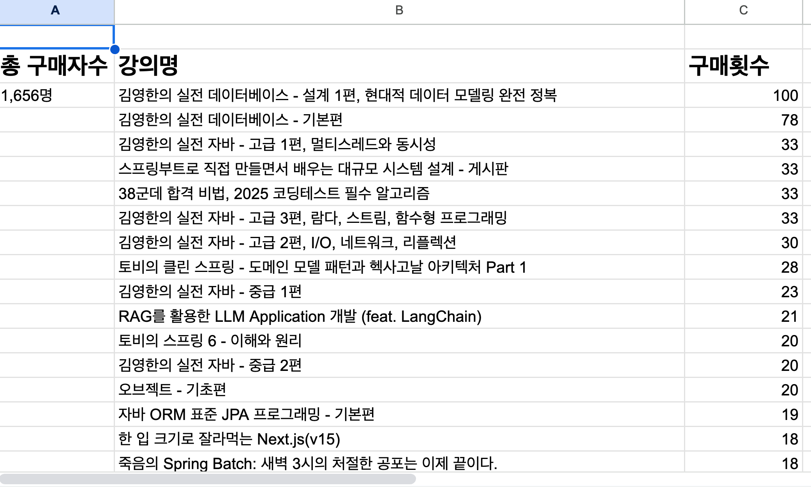

# 2025년 추석 챌린지 첫번째 라이브

안녕하세요
이번 챌린지의 진행자인 향로입니다 🙂
500분이 넘는 분들이 참여해주셔서 너무 재밌게 라이브를 진행했습니다.

이번 추석 이벤트를 어떤 것들을 할까 고민하다가,
최근에 카카오의 신입 공채를 비롯해서 대기업들의 공채가 본격적으로 추석 연휴를 기점으로 시작한다는 것을 알게 되었습니다.

그러다보니 제가 취업준비 하던때가 생각나더라고요 🙂

제 주변 친구들은 모두 다 취업이 된 상태에서, 혼자 대학교 5학년이 되어서 명절 연휴에 취업준비를 하게 되었어요.
혼자서 까페를 가서 개발을 하고 책을 보는데 저만 웬지 이렇게 공부하는 것 같다는 느낌을 받으니깐 참 외롭다는 생각을 많이 했습니다.  
물론 취업 준비 이후에도, 이직할때도, 승진 준비를 할 때도 긴 연휴는 항상 공부를 해야하는 시간이였습니다.

물론 그 시간이 있었기 때문에 지금의 제가 있기에 전혀 아깝지 않은 시간이였지만 그때의 그 외로움은 기억에 계속 남아있었습니다.

그래서 이번 공채 시즌에도 예전의 저처럼 취업을 위해, 이직을 위해, 승진을 위해 혹은 그 어떤 이유로 묵묵하게 공부하실 분들이 많을 것 같단 생각이 들었어요.  
  
**어차피 해야할 공부라면, 외롭지 않게 공부하실 수 있게** 도와드리고 싶다는 생각에 부랴부랴 이번 챌린지를 시작하게 되었습니다.

챌린지는 크게 어렵지 않습니다.
내일부터 매일매일 강의 하나씩 들으시면 인증샷을 미션으로 제출해주시면 됩니다.
다만 그 과정에서 외롭지 않게 저도, 그리고 저 외 나머지 1,655명의 동료들과 함께 응원하면서 공부해보시죠 🙂

여러분의 모든 여정을 인프런은 응원하고 있습니다.
이 외에도 다양한 형태로 **행복하게 성장하실 수 있도록 노력하겠습니다** 🙂

---

아참, 라이브때 공유드렸던 이번 챌린지 참여 강의들을 정리해서 전달드립니다.
이번 챌린지에는 총 1,644명이 참여해주셨는데, 아래와 같이 750개의 다양한 강의들로 참여를 해주셨습니다.  

- [구매 시트](https://docs.google.com/spreadsheets/d/15BE8vi1DkZQhZenbdhJMAzdUmNiY9rfvXxkPFAfW9rs/edit?gid=0#gid=0)

혹시나 남은 추석 기간동안 어떤 강의들을 들을지 고민이시라면 이 시트가 도움이 되시길 바랩니다 🙂