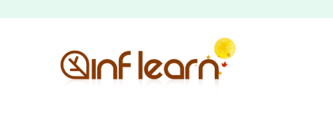

# 2025년 추석 챌린지 미션은 어떻게 만들어졌나

추석 연휴가 3일남은 화요일입니다.  
다들 즐거운 추석 연휴 보내고 계신가요?  
  
3일부터 6일까지 제출하신 미션들 보면서 저도 더욱 알차게 추석 연휴를 보내고 있습니다.  
  
요 며칠간 계속 미션을 제출하면서 좀 해야할 것이 많구나? 라는 생각도 들고,  
어제 미션을 제출하신 분들은 이 챌린지에는 되게 특이한 미션들이 몇가지가 있구나? 라는 생각도 하셨을 것 같아요.  

오늘은 왜 이런 특별 미션들을 추가했는지, 기본 미션은 왜 그렇게 구성했는지를 이야기 드릴려고 합니다.  
  
보통 이런 챌린지 혹은 코호트 교육에서는 참여를 독려하기 위해 가능하면 미션에 대해서는 허들을 좀 낮추고, 가능하면 쉽게 할 수 있는 방법들을 택하는데요.  
  
저희는 이번 미션을 좀 더 해야할 것이 많게 해두었어요.  

- `강의명`
- 강의 화면 혹은 학습 환경 `캡쳐`
- 수강 중인 강의 `링크`

아무래도 그냥 인증샷만 올림 되는데 왜 이렇게 해야할 것이 많은가 싶어서 귀찮으셨을 것을 같아요.  
실제로 저 항목을 다 채우지 못하고 제출하신 분들도 계셔서, 그런 부분도 감안해서 미션 피드백을 드리고 있기도 하구요.  
  
조금은 귀찮더라도 이렇게 매일 매일 달성해야할 미션에 링크와 공부 화면까지 캡쳐를 요청 드린 이유는 이 **챌린지가 끝나고 나서의 뿌듯함을 더 크게 드리고 싶었기 때문**입니다.  
  
저는 무슨 일이든 **시작할때의 감정 보다는 끝났을때의 감정이 중요**하다고 보는 편인데요.  
이를테면 `쉬는 날 아침 일찍 헬스장에 가서 운동을 하는 행위` 는 시작할때는 너무 힘듭니다.  
가기 싫어서 이불 속에서 몇분을 뒤척이기도 합니다.  
근데 끝나고 나서는 기분이 너무 좋아서 그날 하루 전체를 기분 좋게 보낼 수 있습니다.  
  
그래서 어떻게 하면 이 챌린지의 끝에도 좋은 감정을 줄 수 있을까? 생각 했습니다.  
물론 연휴 내내 공부를 했다는 사실 하나만으로도 충분히 챌린지의 끝은 긍정적인 기분을 가져간다고 생각합니다.  
다만, **눈에 보이지 않는 내면만 쌓이면 그 끝이 조금은 아쉬움**이 있을 것 같다는 생각이 들었습니다.  
  
모든 일에는 항상 **액션과 결과 사이에 시간 간격이 있었습니다**.  
액션을 취하자마자 바로 결과가 나오는 일들도 있지만,  
우리가 지금 하고 있는 공부/성장이라는 것은 거의 대부분 결과가 당장 나오지 않습니다.  
  
코테 공부를 바로 했다고 해서 바로 모든 코테를 통과한다던가, 갑자기 모든 서류 과정을 합격한다던가 하는 일은 잘 없죠.  
  
그러다보면 '아 이렇게 공부하는게 맞나?', '이 길이 맞나?',  '그냥 놀걸 그랬나?' 라는 여러가지 생각이 들게 되죠.  
  
하지만 당장 눈에 결과가 보이지 않더라도 꾸준히 해오신 분들은 언제냐의 문제이지, 결국엔 어떤 형태로든 좋은 결과를 얻어가시는 것을 자주 목젹했어요.  
  
그렇다면 **어떻게든 당장 눈에 결과가 보이지 않더라도 꾸준하게 공부하고 성장할 수 있는 방향으로 이끌어 나가는 것이 중요**하다고 생각했어요.  
  
그래서 이 챌린지도 당장의 결과가 나오지 않더라도, **연휴 내내 꾸준히 무언가를 했음을 스스로도 알 수 있도록 증거를 남기는 방향**으로 설계하게 되었습니다.  
  
감사하게도, 많은 분들이 이 미션을 좀 더 유의미하게 남도록 남겨주셔서 준비한 저희도 대단히 기뻤습니다.

특별 미션은 이와는 조금 다른 의도가 있었는데요.  
어제 처음 제출하셨던 특별 미션을 비롯해서 이 챌린지에는 총 3개의 특별 미션이 있습니다.

- 보름달 찾기
- 강의 질문 남기기
- 수강평 작성하기
  
저희 인프런 로고는 매 기념일마다 로고를 기념일에 맞춰 변경을 해둡니다.  
그래서 이번 추석때도 보름달 로고를 사용을 했죠.  

앞으로도 이런 챌린지 혹은 함께 공부하는 무언가가 계속 있을텐데 그때마다 그 챌린지 혹은 행사 자체만 기억 나기 보다는 이번 연휴가 어떤 연휴이길 그래도 기억하셨으면 하는 마음에 첫번째 특별 미션을 준비했습니다.  
  
나머지 2개의 미션은 인프런이 추구하는 바를 좀 더 넓게 전달하고자 했습니다.  
  
인프런은 타 서비스와 달리 "**수강평과 질문/답변 내용 모두를 전체 공개**" 하는 플랫폼입니다.  
투명하게 수강생분들이 남긴 내용을 공개하는 것인데요.  
  
이는 강의를 수강하기 전, 최대한 많은 분들에게 속임수가 없는 구매 경험, 학습 경험을 주기 위함이 큽니다.

결국 이 강의를 들어보신 분들의 수강평이나 이 강의를 들으면서 남긴 질문, 그에 따른 지식공유자분들의 답변등이 모여서 좀 더 투명한 정보가 공유되고 **정보 격차 없는 학습 환경 조성**이 가능하다고 믿고 있어요.  
그럼 이후에 수강을 고민하시는 분들에게 더욱 도움이 되리라는 것도 말이죠.  
  
그리고 AI가 답변해주는 이 시대에도, 결국은 **가장 신뢰할만한 사람이 남긴 답변**의 가치는 훼손되지 않는다고 믿고 있습니다.  

그런면에서 질문을 작성해서 지식 공유자분들께 답변을 받아보는 것은 AI에게 답변을 받는 것과는 전혀 다른 경험이라 이 역시도 경험시켜드리고 싶었습니다.  
  
결국은 
- 10일간의 열정을 눈에 보이는 어떤 결과물로 남겨드리고 싶은 마음
- 성장에 집중하지만 그럼에도 이 연휴기간이 어떤 연휴였는지 한번은 상기시켜드리고 싶은 마음
- 투명한 정보 공개를 통해 정보 격차 없는 학습 환경을 조성하고 싶은 마음
- AI 시대에도 신뢰할만한 사람에게 답변을 받아보는 경험을 시켜드리고 싶은 마음

이 4가지가 모여서 이번 챌린지의 미션이 계획 되었습니다.  
  
이 4가지의 마음이 챌린지에 참여하시는 분들께도 잘 전달되었으면 하는 바램입니다.  
  
이 챌린지는 참여해주신 분들의 피드백에 따라 이후에도 계속 진행할지 말지를 결정할 것 같습니다.  
그러니 미션에 대한 피드백, 과정에 대한 피드백, 챌린지 자체에 대한 후기 등 무엇이든 좋으니 편하게 말씀주세요 :) 
저희는 언제든 감사한 마음으로 피드백을 받겠습니다.
