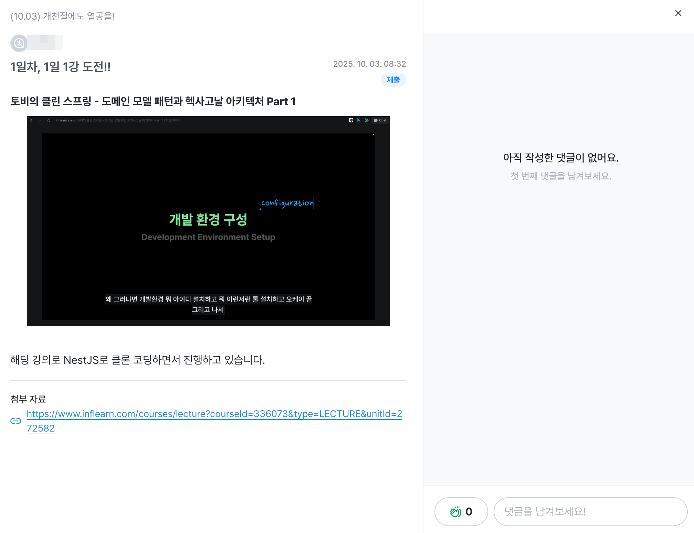
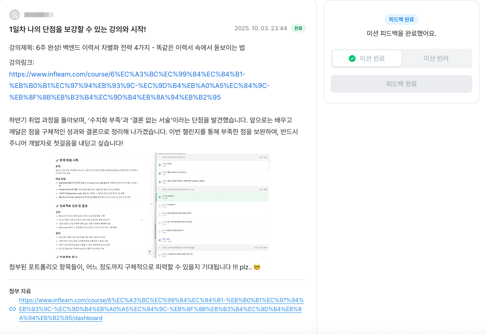
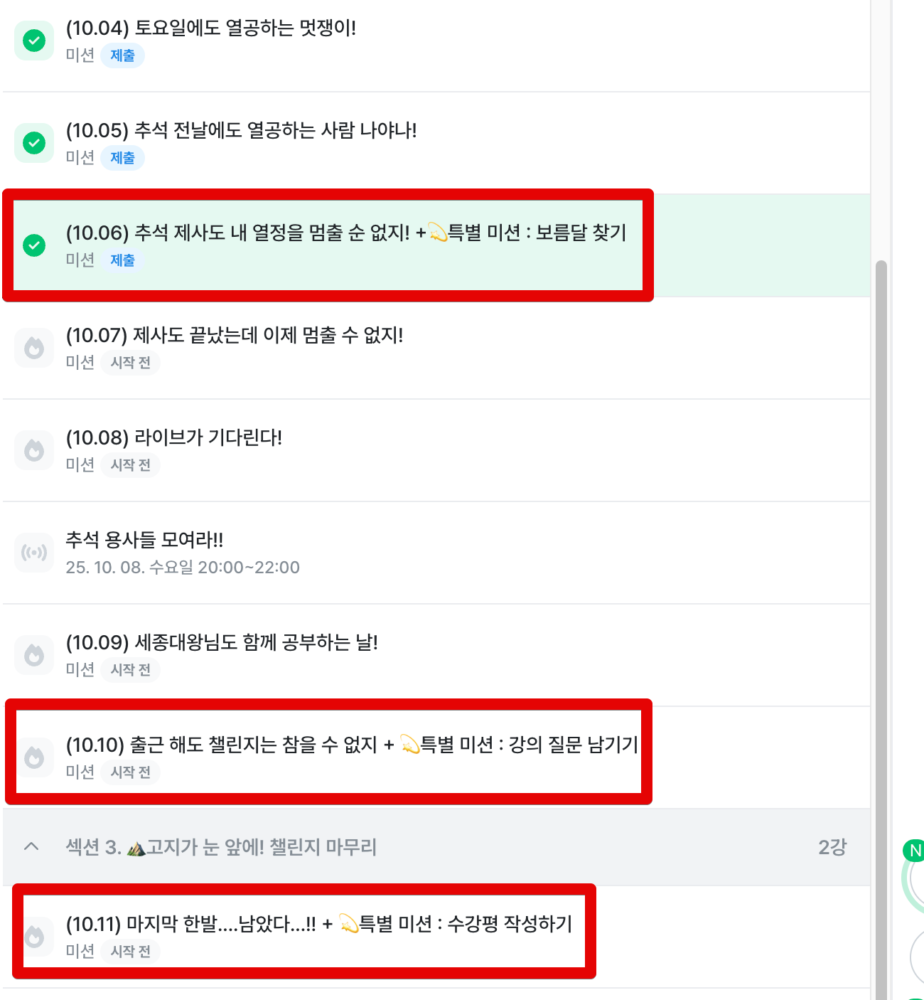

# 2025년 추석 챌린지 미션은 어떻게 만들어졌나

추석 연휴가 3일남은 화요일입니다.  
다들 즐거운 추석 연휴 보내고 계신가요?  
  
3일부터 6일까지 제출하신 미션들 보면서 저도 더욱 알차게 추석 연휴를 보내고 있습니다.  
  
요 며칠간 계속 미션을 제출하면서 좀 해야할 것이 많구나? 라는 생각도 들고,  
어제 미션을 제출하신 분들은 이 챌린지에는 되게 특이한 미션들이 몇가지가 있구나? 라는 생각도 하셨을 것 같아요.  

오늘은 왜 이런 특별 미션들을 추가했는지, 기본 미션은 왜 그렇게 구성했는지를 이야기 드릴려고 합니다.  
  
보통 이런 챌린지 혹은 코호트 교육에서는 참여를 독려하기 위해 가능하면 미션에 대해서는 허들을 좀 낮추고, 가능하면 쉽게 할 수 있는 방법들을 택하는데요.  
  
저희는 이번 미션을 좀 더 해야할 것이 많게 해두었어요.  

- `강의명`
- 강의 화면 혹은 학습 환경 `캡쳐`
- 수강 중인 강의 `링크`

아무래도 그냥 인증샷만 올림 되는데 왜 이렇게 해야할 것이 많은가 싶어서 귀찮으셨을 것을 같아요.  
실제로 저 항목을 다 채우지 못하고 제출하신 분들도 계셔서, 그런 부분도 감안해서 미션 피드백을 드리고 있기도 하구요.  
  
조금은 귀찮더라도 이렇게 매일 매일 달성해야할 미션에 링크와 공부 화면까지 캡쳐를 요청 드린 이유는 이 챌린지가 끝나고 나서의 뿌듯함을 더 크게 드리고 싶었기 때문입니다.  
  
저는 무슨 일이든 **시작할때의 감정 보다는 끝났을때의 감정이 중요**하다고 보는 편인데요.  
이를테면 `쉬는 날 아침 일찍 헬스장에 가서 운동을 하는 행위` 는 시작할때는 너무 힘듭니다.  
가기 싫어서 이불 속에서 몇분을 뒤척이기도 합니다.  
근데 끝나고 나서는 기분이 너무 좋아서 그날 하루 전체를 기분 좋게 보낼 수 있게 됩니다.  
  
마찬가지로 추석 연휴 동안 매일 공부를 하긴했지만, **눈에 보이지 않는 내면만 쌓이면 그 끝이 조금은 아쉬움**이 있을 것 같다는 생각이 들었습니다.  
  
모든 일에는 항상 **액션과 결과 사이에 시간 간격이 있었습니다**.  
액션을 취하자마자 바로 결과가 나오는 일들도 있지만,  
우리가 지금 하고 있는 공부/성장이라는 것은 거의 대부분 결과가 당장 나오지 않습니다.  
  
코테 공부를 바로 했다고 해서 바로 모든 코테를 통과한다던가, 갑자기 모든 서류 과정을 합격한다던가 하는 일은 잘 없죠.  
  
그러다보면 '아 이렇게 공부하는게 맞나?', '이 길이 맞나?',  '그냥 놀걸 그랬나?' 라는 여러가지 생각이 들게 됩니다.  
  
하지만 당장 눈에 결과가 보이지 않더라도 꾸준히 해오신 분들은 시간이 지나서 꼭 좋은 결과를 얻어가셨습니다.  
  
그렇다면 어떻게든 당장 눈에 결과가 보이지 않더라도 꾸준하게 공부하고 성장할 수 있는 방향으로 이끌어 나가는 것이 중요하다고 봤습니다.  

특별 미션도 비슷합니다.  
어제 처음 제출하셨던 특별 미션을 비롯해서 이 챌린지에는 총 3개의 특별 미션이 있습니다.

- 보름달 찾기
- 강의 질문 남기기
- 수강평 작성하기
  

저희 인프런 로고는 매 기념일마다 로고를 기념일에 맞춰 변경을 해둡니다.  
그래서 이번 추석때도 보름달 로고를 사용을 했죠.  

왜 이런 미션을 만들었냐.  

질문을 작성해서 내가 그간 학습한 지식 공유자분들께 답변을 받아보는 것은 AI에게 답변을 받는 것과는 전혀 다른 경험입니다.  

수강평의 경우 마지막 강의 평가까지가 이어져야 

결국 이 모든 과정은 이후에도 참여할 많은 학습자분들께 더 도움이 되는 정보를 남기기 위함입니다.  
  
누군가에겐 이번의 수강평, 질문이 

인프런은 타 서비스와 달리 "수강평과 질문/답변 내용 모두를 전체 공개" 하는 플랫폼입니다.  
투명하게 수강생분들이 남긴 내용을 공개하는 것인데요.  
  
이는 강의를 수강하기 전, 최대한 많은 분들에게 속임수가 없는 구매 경험, 학습 경험을 주기 위함이 큽니다.