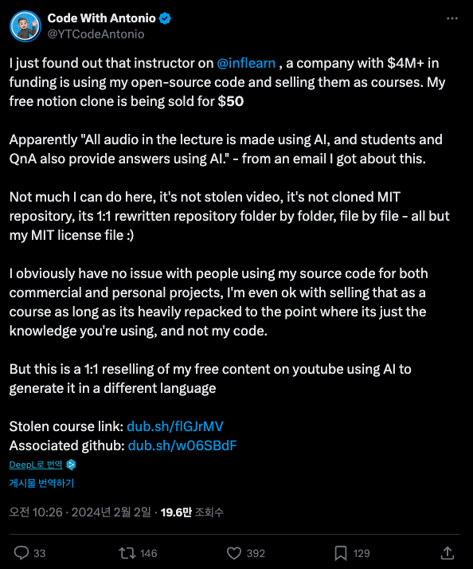

# 실수에서 더 나은 시작으로

미생이란 컨텐츠는 스토브리그와 더불어서 회사생활을 어떤 시각으로 바라봐야하는가에 대해 좋은 힌트를 많이 줬다.  
웹툰과 드라마 모두 다 봤지만, 특히나 드라마에서는 연출이 더 극적이라 그런지 감정과 생각이 잘 전달되었다.  
  
드라마 13화는 주인공 장그래가 속한 영업 3팀이 `문제가 생긴 사업을 좋은 사업으로 전환` 하는 에피소드이다.  
  
같은 팀 박종식 과장이 요르단 중고차 사업을 맡은 후 현지에 친인척 이름으로 페이퍼컴퍼니를 설립하고 중고차 수입을 밀어주는 형식으로 비리를 저지른다.  
비리가 발견되고 나서 회사는 박종식 과장을 해임하고, 회사의 오점인 요르단 중고차 사업을 지운다.  
  
하지만 영업 3팀의 입장에서는 박종식 과장이 비리를 저지르긴 했지만 **요르단 사업 그 자체만 봤을때는 너무나 좋은 사업**이라고 판단했다.  
  
이 사업을 다시 시작하고 싶은데, 이미 비리로 인해 여러 사람이 해임되고 회사에서 쉬쉬하는 상황에서 어떻게 다시 이 사업을 해야한다고 임원들을 설득할 수 있을까?  
  
오상식 차장은 요르단 중고차 사업을 다시 시작해야한다고 설득해야하는 프레젠테이션 자리에서 임원진들에게 **그간 비리로 인해 그만두었던 사업들**에 대해 이야기한다.

> "문제가 생기자 회사는 각 사건을 신속하고 정확하게 해결했습니다.  
> 깔끔하게 정리한 것입니다.  
> **그리고 그 사건을 지워버렸습니다**."  
> ...
> "문제가 생긴 사업에 대해서 두 번 다시 입 밖에 꺼내지 않는 것은 우리가 선택하고 회사가 결정한 일입니다.  
그렇다면 우리가 지워버린 그 사업들은 어디에서 어떻게 되었는지 아십니까?  
**지금부터 보실 내용은 우리가 생각하기도 싫어 지워버렸던 그 사업을 가져간 타 업체들의 실적**입니다"
> ...
> "죄를 처벌했으니, 그 일은 잊혀져야 맞는 것입니까?
**저희는 ‘죄’만 들어내기로 했습니다**."  
> 출처: [ [#미생] 13화 13분만에 몰아보기](https://www.youtube.com/watch?v=BcMR3Ym2Tu0)

10년이 지났지만 생각이 날 정도로 이 에피소드는 내 회사 생활에 큰 영향을 줬다.  

"**실수, 실패라고 불렀던 그 지점을 새로운 시작점으로 전환**" 하게 만드는 이야기에 보는 내내 두근거렸다.  
언젠간 나도 저렇게 실패를 새로운 시작으로 전환하는 일을 해봐야지 같은 생각을 하면서 말이다.  

---
  
2024년 2월, 인프런이 글로벌하게 트위터에서 언급된 적이 있다.  
전 세계 개발자들이 구독하는 유명 유튜버 [codewithAntonio](https://www.youtube.com/@codewithAntonio)님이 우리 플랫폼에 대해 언급한 것이였다.

> “I just found out that instructor on @inflearn, a company with $4M+ in funding is using my open-source code and selling them as courses.”  
> — [원문 트윗 보기](https://x.com/YTCodeAntonio/status/1753228303924670731)

인프런에 올라온 한 강의가 Antonio님의 유료 강의와 똑같다는 것이었다.  
완전히 처음 겪는 일에 잠시 멍해졌다.  
  
주말임에도 급하게 해당 강의를 확인했다.  
그 와중에 CS 문의들이 쏟아지기 시작했다.  
Antonio님의 팬인 수강생분들이 하나둘씩 “내가 너무 좋아하는 Antonio 강의인데, 이 강의랑 구조가 하나도 빠짐없이 똑같다”는 제보를 보내셨다.  
쏟아지는 CS에 대해 답변드리고, Antonio님께 사과 메세지를 전달드리고, 내부적으로는 실제로 그런 일이 맞는지 검토하는 등 정신 없는 주말을 보냈다.  
  
강의 내용을 검토한 결과, 의심의 여지 없이 복제 강의였다.  
지식 공유자분께서 업로드한 강의였기에 혹시나 Antonio님과 사전에 논의된 적이 있었는지 확인을 요청드렸다.  
  
모든 내용을 확인해보니 결국 두 분의 소통 과정에 문제가 있었고, Antonio님 입장에서는 전혀 생각하지 못했던 협업이였다.  
  
플랫폼을 운영하는 입장에서 가만히 있을 순 없었다.  
곧바로 강의를 삭제하고 강의를 결제한 수강생분들께는 사과의 말씀과 함께 **전액 환불**을 했다.  
  
내부적으로 모든 내용이 정리가 되고나서는 대표님께서 직접 [공식 사과문](https://www.inflearn.com/notices/1184396)을 게시했다.  
  
이제 막 글로벌 전환을 하고 있었기에 이번 사건이 너무 크게 다가왔다.  
글로벌 개발자분들께는 "인프런? 거기 강의 훔쳐서 만드는 곳이잖아" 라는 인상을 드린 것은 아닐까 하는 걱정과 앞으로 어떻게 이런 문제를 사전에 잡아낼 수 있을지에 대한 고민이 함께 생겼다.
  
전세계에서 만들어지는 모든 컨텐츠를 우리가 다 확인할 순 없는데 어떻게 검수할 것인가.  
수많은 트위터 댓글과 인용에 남긴 부정적 의견들을 어떻게 전환할 수 있을까 등등.  
    
여러가지 생각과 고민을 하던 중 믿기 힘든 문의가 올라왔다.  

> “강의 철회 안내 메일을 받았습니다.  
> 그런데 저는 이 강의가 너무 좋았어요.  
> 이번 진행중인 프로젝트를 완료 하고나서 열공하려고 했거든요 ㅜㅜ
> 끝까지 보고 싶습니다.”  

강의를 환불받은 수강생분들의 문의였다.  
  
미생 13화 요르단 사업 PT가 다시금 떠올랐다.  
이대로 Antonio님과 죄송한 관계로 끝난다면 해외의 많은 개발자들분들은 인프런을 여전히 카피캣 강의 서비스로 기억할 것이다.  
복사된 강의를 봤던 한국의 수강생분들은 저 좋은 콘텐츠를 더이상 한국어로는 보지 못한다.  
  
그래서 **'죄'는 들어내고 콘텐츠만 봤다**.  

---

Antonio님은 다양한 주제의 서비스 구현 강의들이 있었다.  
듀오링고, 구글 Docs, 트위치, 넷플릭스, 스포티파이, 글로벌 이커머스 등 새로운 서비스를 구현 해야 한다면 이 중에 하나쯤은 있을 것 같은 주제의 강의들을 거의다 가지고 계셨다.  
  
**실수는 있었지만, 그것을 더 나은 시작으로 바꾸기로 했다**.  
  
글로벌 플랫폼으로 전환하고 나서 곧바로 Antonio님께 연락을 드렸다.   
인프런을, 우리를 어떻게 생각할지 걱정도 앞섰지만, 그럼에도 이 콘텐츠를 꼭 한국의 개발자분들께 더 많이 알리고 싶었다.

> Hello Antonio,  
> I’m the CTO at Inflearn...  
> (중략)  
> **This collaboration is our way of making amends for the previous incident** and ensuring your invaluable content gets the recognition it deserves...

Antonio님은 놀라울 정도로 성숙하게, 따뜻하게 답해주셨다.

> “Hi Donguk,
> Thank you for reaching out!
> 
> I understand that managing content across a large platform can be challenging, and I truly appreciate the steps you're taking to improve your internal processes. No hard feelings on my end, and I’m glad to see the positive changes you're implementing. 🙂”

그리고 Antonio님과 같이 협업을 시작하게 되었다!  
Antonio님은 항상 [강의의 유료 자료 전체를 구매하는 방식](https://www.codewithantonio.com/pricing)으로만 판매하셨다.  
평생 구독 같은 느낌이다.  
  
다만, 이런 All or Nothing 의 판매가 국내에서는 이해하기 힘든 모델일 것이라고 봤다.  
딱 하나만 들으면 되는데 모든 콘텐츠를 구매하는 것은 부담스러울 수 있을 것 같다는 의견을 나눴다.  
  
그래서 이번에 **우리와의 협업에서는 단건 구매가 가능하도록 각각의 강의를 아주 저렴하게 판매**하기로 했다.  
  
그리고 그렇게 많은 논의 끝에 나온 첫 주제는 대표작 [YouTube Clone 프로젝트](https://inf.run/aXdYT) 이다.  
  
Next.js 15 & React 19 기반 최신 스택을 기반으로 비디오 플레이어, 컨텐츠 피드, 구독, 좋아요 등을 다 만들어보는 강좌이다. 

그의 뜻에 따라 기존 가격도 낮게 설정하고, 얼리버드 할인 역시 큰 폭으로 진행하게 되었다.  
  
가격을 떠나 요즘 풀스택 구현을 원하시는 분들에게 필요한 대부분의 내용이 포함되어 있었다. 

- 🚀 Next.js 15 & React 19 기반 최신 스택
- 🗄️ DrizzleORM 기반 PostgreSQL 
- 💅 TailwindCSS와 ShadcnUI를 활용한 세련된 UI 구성
- 🤖 AI 기반 제목, 소개, 썸네일 자동 생성
- 📊 조회수, 좋아요, 트래픽을 확인할 수 있는 크리에이터 스튜디오

등 단순히 “유튜브처럼 생긴 무언가”를 만드는 수준을 넘어서 지금 우리가 매일 쓰는 유튜브의 핵심 기능들을 하나하나 직접 구현하면서 배워나가는 구조다.

이 모든 것을 한 프로젝트 안에서 경험할 수 있는, 그야말로 **현업형 풀스택 클론 코딩 강의**였다.  
  
---
  
우리는 실수를 했다.  
하지만 그 실수를 투명하게 인정하고,  
바로잡고,  
나아가 **진짜 제작자분과 제대로 된 기회를 만들 수 있었다.**  
  
앞으로도 우리는 계속 실수할 수 있다.  
다만, 그 실수는 실수에서 끝나지 않고, 항상 더 나은 시작으로 만들 수 있을 것 같다는 자신이 생겼다.  

그리고 당당하게 Antonio님의 강의를 이제는 한국의 많은 개발자분들께 소개할 수 있게 되어서, 너무 기쁘다.

