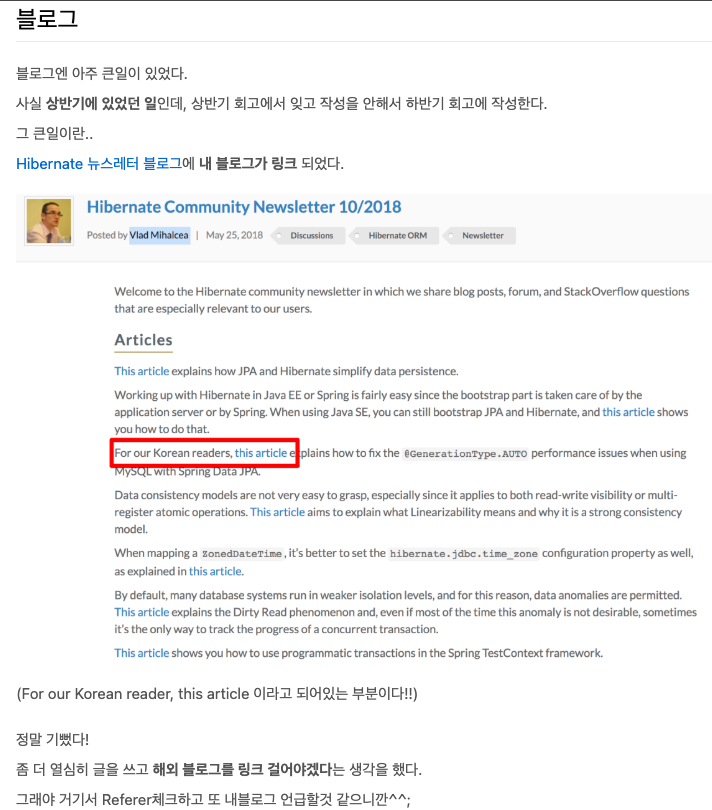

# Vlad Mihalcea와의 인연

> 유튜브나 블로그를 하다 보면 예상치 못한 인연들이 생긴다.  
지금까지 10년 가까운 시간을 블로그를 하면서 큰 동력이 된 사건이기도 하다.  

운이 좋게도 2014년부터 다녔던 회사는 Hibernate를 사용하는 회사였고, 그 당시 iBatis, MyBatis를 쓰는 것디 대부분인 상황에서 Hibernate를 실무에서 사용해볼 수 있었다.  
다만, 처음 사용해보는 기술이니 이걸 더 잘 쓰기 위해서 공부를 하고 싶은데 공부할 수 있는 컨텐츠가 없었다.  
한국어로 된 컨텐츠의 대부분은 iBatis, MyBatis였기 때문이다.  
  
다행히 기선님이 번역해주신 [개빈 킹의 하이버네이트 완벽가이드](https://product.kyobobook.co.kr/detail/S000001514367)가 있었지만 나 같은 초보 개발자에겐 너무나 어렵게 느껴져 한줄 한줄 밑줄 그어가며 이해하려고 노력했다.  
[영한님의 Java ORM에 대한 DevOn 발표 자료](https://www.slideshare.net/slideshow/devon-2012-b4-orm/14729452)도 발견하게 되고 이후엔 [영한님의 책](https://product.kyobobook.co.kr/detail/S000000935744) 까지 보면서 Java ORM에 대해 훨씬 쉽게 다가갈 수 있었고 실무를 하는데 있어서 충분히 많은 지식을 쌓을 수 있었다.  
  
이후에도 계속 JPA, Hibernate를 실무에서 계속 사용할 수 있었는데, 구글링 할때마다 항상 만나는 블로그와 스택오버플로우의 답변 유저가 있었다.  
그게 바로 [Vlad Mihalcea](https://vladmihalcea.com/)였다.  

> 나중에 알고 보니 그는 [자바 챔피언](https://blogs.oracle.com/java/post/new-java-champions-in-2017)이자 [Hibernate Top Committer](https://github.com/hibernate/hibernate-orm/graphs/contributors) 였다는 것에 "역시..." 라는 생각을 했다.
  
당시에는 "와 역시 해외는 어마어마한 개발자들이 많구나. 영어 공부 진짜 열심히 해야겠다" 라는 생각을 하면서 열심히 그의 글을 탐닉했다.  
새로운 글이 올라오면 항상 챙겨보고 그게 진짜 맞는지 성능 테스트를 진행해보고 효과를 확인 한뒤에는 회사에 적용하는 등 그의 지식을 어떻게든 내 것으로 다 흡수하고 싶었다.  
그의 책 [High-Performance Java Persistence](https://www.amazon.com/High-Performance-Java-Persistence-Vlad-Mihalcea/dp/973022823X)는 사무실 책상 위에 항상 펼쳐져 있었다.  
  
그렇게 몇년의 경력이 쌓이던 중,
2018년 갑자기 블로그의 트래픽이 폭발적으로 늘어나는 일이 있었다.  
  
어디서 이렇게 유입된 건지 찾아보다가 [Hibernate 공식 커뮤니티 뉴스레터 2018년 10호](https://in.relation.to/2018/05/25/hibernate-community-newsletter-2018-10/)에서 내가 작성한 ["Spring Boot Data JPA 2.0 에서 id Auto_increment 문제 해결"](https://jojoldu.tistory.com/295)을 소개한 것을 발견했다.  
**전세계 Java 개발자들이 구독하고 있는 Hibernate 뉴스레터에서 언급된 것**이다.  
그 뉴스레터는 내가 매일 방문하던 Vlad Mihalcea가 작성한 것이기에 믿기지 않는 순간이였다.

> 이때의 기억이 강렬해서 "와 블로그 진짜 오래오래 해야겠다" 라는 다짐을 했었다.  
그리고 10년 넘게 블로그를 운영하게 되었다.  

그 날 이후로는 기술적인 글 외에도, Vlad Mihalcea 라는 개발자에 대해서도 관심을 가지기 시작했다.  
그의 기술적인 노하우 뿐만 아니라,  
'이 사람은 도대체 어떤 커리어를 밟아왔을까?'  
'어떻게 자바 챔피언이 되었을까?'  
'어떻게 이렇게 한 분야에서 세계적인 전문가가 되었을까?' 등등.  

- [How to become a Java Champion](https://vladmihalcea.com/how-to-become-a-java-champion/)

책 외에 또 배울 수 있는 것들이 없을까 싶어 [그의 온라인 스토어](https://vladmihalceastore.teachable.com/)에서 판매하는 온라인 강의들도 찾아서 들었다.  
Java Persistence 에서의 성능 개선 노하우나 Java 환경에서의 SQL 성능 개선 등 **자바 개발자 뿐만 아니라 ORM을 사용하는 개발자로서 필요한 대부분의 성능 개선 노하우**를 얻을 수 있었다.  
  
ORM과 SQL 양 쪽에 맞는 가장 적절한 성능 튜닝 사례들을 배울 수 있었고, 이때 배운 지식들은 수십억건의 데이터들 사이에서도 복잡한 도메인들을 처리하는데 큰 힘이 되었다.  
  
다만, 강의를 수강하는게 수월하지는 않았다.
- 영어로만 강의가 제공되어서 하나의 강의를 수강하는데 하나하나를 번역해서 보는데 너무 많은 힘이 들었고
- 결제 오류가 빈번해서 결제하기가 쉽지 않았고
- 강의를 수강하는데 있어서의 편의 기능이 많이 부족했다. (모바일 플레이어, 자막 등등)
  
그래도 좋았다.  
이것마저 없으면 그의 양질의 컨텐츠를 볼 수 있는 방법이 없는데, 이렇게라도 볼 수 있으니 말이다.  
  
이렇게 쌓인 노하우는 이후에 전 직장 첫번째 컨퍼런스에서 아낌없이 쏟아낼 수 있었다.

- [[우아콘2020] 수십억건에서 QUERYDSL 사용하기](https://www.youtube.com/watch?v=zMAX7g6rO_Y)
  
이 세션은 [(갓)영한님의 세션](https://www.youtube.com/watch?v=BnS6343GTkY) 다음으로 가장 높은 조회수가 나와서 많은 개발자분들이 좋아해주셨다.  
그동안의 공부와 경험이 전혀 잘못되지 않았다는 것을 느끼게 해주었다.  
  
이런 경험으로 성장을 해왔기에,  
**현재 회사로 이직하고 나서 우리팀 백엔드 개발자분들에게 Vlad의 강의를 너무 소개해주고 싶었다**.  
꼭 JPA 뿐만 아니라 모든 ORM과 SQL을 사용하는 개발자들에게 필수적인 내용을 담고 있기 때문이다.  
우리 같이 Node.js가 주력인 개발팀에는 언어나 프레임워크에 상관없이 이런 강의가 대단히 필요하다.  
  
하지만, 위에서 언급한 "언어의 장벽이나 결제, 학습 편의성" 등을 생각하니 "**우리 팀 분들에게도 나처럼 힘들게 공부하시라**" 라고 이야기하기 어려웠다.  
  
어떻게든 우리팀에 이 지식들을 가장 편하게 전달하고 싶었다.  
어떡하는게 좋을까....?

---

그래서 Vlad Mihalcea에게 연락을 드렸다.  
**당신의 강의를 한국어로, 일본어로, 베트남어로 듣고 싶다고**.  
Vlad는 너무나 쿨하게, 너무나 멋지게 이 협업을 받아들여 주셨다.

그리고 드디어!  
**Vlad Mihalcea의 공식 강의 2개가 인프런에 오픈**되었다.

- 🔗 [High-Performance Java Persistence](https://inf.run/5bS4d)  
- 🔗 [High-Performance SQL](https://inf.run/A24MX)

> 💡 이 강의들은 **한국어, 일본어, 베트남어, 영어**로 자막 및 더빙이 제공됩니다.  
> 즉, 아시아권 개발자 누구나 언어 장벽 없이 수강하실 수 있도록 준비되어 있습니다.

더욱 감사한 것은 **오픈 기간 동안40% 할인까지도** 동의해주셨다.  

- [Vlad Mihalcea 님의 오픈 이벤트](https://www.inflearn.com/tag-curation/common_tag/vlad2504)

"실무에서 성능과 구조 모두를 고려해야 하는 상황에서 무엇을 기준으로 선택할 것인가" 를 알려주는 강의를 이제 우리 팀원들에게도 알려줄 수 있게 되어서 너무나 기뻤다.  

우리 팀 외에도 특히 다음과 같은 분들께 추천드리고 싶다:

- JPA, Hibernate 등을 사용하지만 내부 구조를 분석하고 근본적인 이해를 높이고 싶거나
- 실무 환경의 Java Data Access 계층에서 발생하는 성능 문제를 해결하는 방법을 배우고 싶거나
- ORM 을 적극적으로 쓰는 환경에서의 SQL 성능 개선 방법을 배우고 싶거나

이런 분들이라면 이번 Vlad의 강의를 적극 추천하고 싶다.  
전세계 Java 개발자들이 Vlad의 컨텐츠를 좋아하고 강의를 듣는 이유가 무엇인지 잘 알 수 있다.  
  
지금 Java 개발을 시작하는 분들은 나처럼 영어 문장 하나 하나를 직접 번역해가며, 여러 해외카드들을 교체해가며 결제하는 등의 불편함 없이 배울 수 있게 되었다는 것이 훨씬 기쁘다.  

Vlad 외에도 세상엔 너무나 훌륭한 개발자분들과 그들의 강의들이 있다.  
이 강의들을 모두 다 **언어와 결제, 학습의 제약 없이** 듣는 것을 꿈꾸고 있다.  
그리고 출간을 준비하고 있는 **High-Performance Java Persistence 2판**도 인프런에서 만나볼 수 있게 되기를 기대한다.  