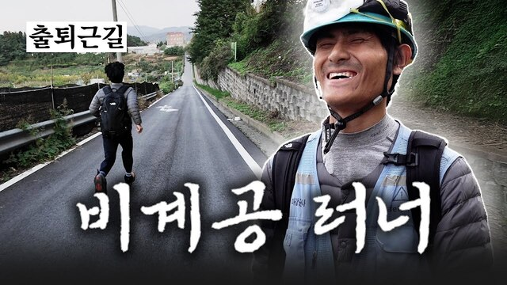
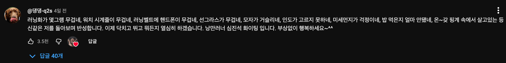

# 낭만러너 심진석

안녕하세요 여러분! 잘 지내시죠?

추석 챌린지에 이어 '향로'윈 챌린지까지 마무리 되고 벌써 10일이 지났네요.  

다들 열정의 아궁이가, 물밑 속 벽돌을 하나씩 쌓고 계신가요?

최근에 팀원분의 소개로 [낭만러너 심진석님의 영상](https://www.youtube.com/watch?v=vYy6QUHVbJo)을 보게 되었습니다.  

심진석님은 2025년 3월 1일부터 8월 23일까지 불과 5개월여 만에 마라톤 대회 '종합 입상 20연승'을 달성한 러너이신데요.  
놀라운건 전문 선수가 아니라, **평일에는 건설현장의 비계공으로 일하고, 주말에만 마라톤에 참여**하는 마라토너였습니다.  
  
건설현장에서 오랫동안 일하신 분들도 비계공으로 일하는 것이 너무 힘들어 혀를 내두른다고 하는데요.  
어떻게 매일 이렇게 힘든 일을 하면서도 매번 마라톤 대회를 나갔다하면 1등 ~ 2등을 하는지 너무 궁금했습니다.  
  
심진석님의 일상을 담은 영상에서 하루 하루를 어떻게 보내는지를 알 수 있는데요.  
비계공 일을 하기 위해 새벽부터 출근해야하다보니 훈련할 시간을 별도로 만들기 어려워 출/퇴근 길을 훈련에 사용합니다.  

매일 새벽 5시에 일어나 출근길을 훈련 삼아 작업복, 작업화를 신고 신고 달립니다.  
스마트워치 대신 낡은 카시오 시계를 차고, 도로 표지판으로 페이스를 맞추며 8km를 뛰어서 지하철역까지 뛰어갑니다.  
비가 오는 날에는 우비를 쓰고 뛰어간다고 합니다.

오늘 아침에 컨디션이 좋지 않아서 병원에 다녀왔는데 감기라고 하더라고요.  
심한 감기는 아니지만 하루는 쉬는게 좋겠다는 의견에 저도 그런 것 같아서 쉬던 중 이 영상을 보는데 저는 저 스스로에게 얼마나 많은 핑계를 대고 있었나 반성하게 되더라고요.   

물론 프로로서 좀 더 나은 성과, 성취를 위해 장비나 주변 환경을 개선하는 것도 당연히 해야한다고 생각합니다.  
다만, 어떤 일을 하기로 결심하고 나서 중간 중간 어떤 이유로 쉴때 **그 이유가 진짜 쉴 만큼의 이유였나?** 라는 생각은 들었습니다.  

그래서 부랴부랴 이 글을 쓰게 되었습니다.  
생각이 들었다면, 어떤 장비나 환경이 갖춰진 뒤에야 시작하는게 아니라 지금 현재 상황에서 할 수 있는 어떤 형태로도 실행에 옮기는 것이 낭만이 있다는 걸 알게 되었으니깐요.

예전에 저희 팀원분이 저에게 뉴스레터를 해보면 어떻겠냐는 제안을 주셨는데요.  
뉴스레터 구독 페이지를 만들고, 뉴스레터 자체를 홍보하는 것은 뭔가.... 또 일을 주저하게 만드는 것 같습니다 :) 
평소 저에게 감명을 준 콘텐츠나 생각들이 있다면 이렇게 새소식으로 챌린지에 참여하신 분들께 전달하는 것으로 바로 시작해보겠습니다.

다들 오늘도 고생 많으셨습니다.  
올 한해가 49일 밖에 남지 않았네요.  
남은 49일 동안 미뤄둔 목표가 있다면 한번 바로 시작해보시죠.
작업복, 작업화를 신고 매일 8km 출근 시간을 마라톤 연습에 사용하시는 심진석 선수처럼요 :)   
저도 미뤄둔 일들을 다시 시작해보겠습니다.

> 2번의 챌린지 마지막 라이브를 녹화해둔 상태입니다.
> 각각의 마지막 라이브들을 20~30분 분량으로 편집해서 다른 분들이 보실 수 있게 공개할 예정입니다 :)
> 편집 영상들이 준비 되면 다시 공유드리겠습니다.
