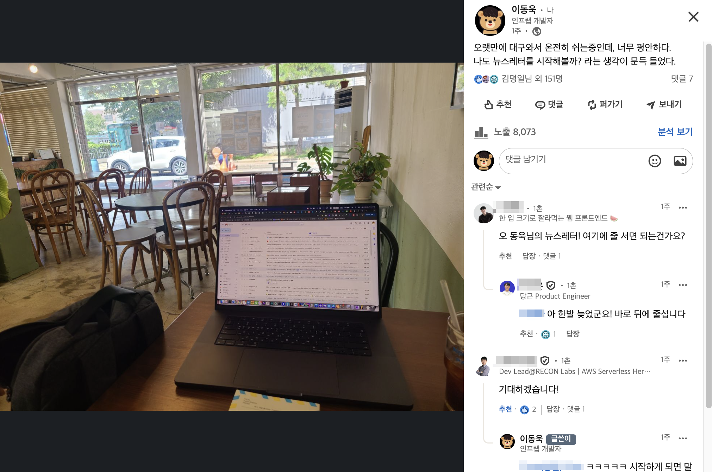

# 뉴스레터를 시작합니다.

안녕하세요, 향로입니다.  
  
최근 지인의 소개로 [거북목편지](https://product.kyobobook.co.kr/detail/S000216934482) 책을 보게 되고 너무 제 취향에 맞아서 이 책의 출판사인 터틀넥프레스의 책들을 하나씩 다 읽어보고 있어요.  
  
터틀넥프레스는 김보희님의 1인 출판사인데요.  
보희님은 "책 때문에 거북목이 된 사람들에게 보내는 편지" 라는 컨셉으로 매주 "목"요일에 뉴스레터를 보내주고 계세요.  
(그리고 그 뉴스레터들을 모아서 낸 것이 이번 '거북목편지' 라는 책이구요)

- [거북목편지 뉴스레터](https://turtleneckpress.stibee.com/)

원래도 여러 뉴스레터들을 구독하면서 재밌게 매일 아침의 메일함을 열어보곤 했는데, '거북목편지' 뉴스레터는 예전에 편지를 주고 받던 느낌을 줄 정도로 사적이고, 개인적이면서도 소소한 이야기가 잘 담겨 있어서 잔상이 오래 남게 되었어요.  
  
최근 광복절을 낀 연휴 기간 동안 고향인 대구에서 쉬는 동안 이 책을 다 보게 되었는데, 그러다가 문득 "나도 뉴스레터를 써보고 싶다" 라는 생각을 하게 됐어요.

창문 밖 날씨가 너무 맑아서 들뜬 기분에 그랬는지,  
아무도 없는 종요한 까페에 저 혼자 있어서 갑자기 센치함이 생겨서 그랬는지,  
평소 가보지 않던 동네의 까페에 오니 뭐든 새롭게 해보고 싶은 마음이 들어서 그랬는지 아무튼 알 순 없지만요.  

인프런을 운영하고 개발하다 보면 크고 작은 사건들이 참 많이 생깁니다.
새로운 기능을 준비하면서 설레기도 하고, 예기치 못한 문제 때문에 당황하기도 하고요.
그 과정에서 배우고 느낀 것들을 그냥 흘려보내기보다는, 함께 나누면 더 의미 있겠다는 생각을 하게 됐습니다.

그래서 이번에 뉴스레터를 시작하려고 합니다.

⸻

매주마다 일주일간 고민했던 내용들이나 제가 읽었던 책에서의 인상깊은 내용들을 담아서 전달하려고 합니다.  
아니면 평소 생각하는 주제들에 대해서도 될 수 있을 것 같구요.

뉴스레터에는 이런 이야기들을 담을 예정입니다.

- 인프런을 운영하고 개발하는 과정
  - 어떤 고민과 선택들이 있었는지, 시행착오와 배운 점까지
- 인프런에서 새로 나온 콘텐츠 이야기
  - 단순 홍보가 아니라 “왜 이 강의가 필요한가?”라는 배경까지
- 제가 요즘 하고 있는 고민과 생각
  - 리더로서, 개발자로서 부딪히는 주제들을 솔직하게
- 최근 읽은 책에서 얻은 인사이트
  - 혼자 아끼기 아까운 문장과 아이디어를 같이 나누고 싶습니다

⸻

왜 뉴스레터일까요?

블로그나 SNS 글은 조금 더 다듬어서 올리게 되는데,
뉴스레터는 그보다 더 편하게, 일상적으로 생각을 전할 수 있다고 생각했어요.

딱딱한 글보다는, 구독해 주시는 분들과 직접 대화하는 느낌으로
“아, 요즘 이런 생각을 하고 있구나” 정도로 가볍게 읽히면 좋겠습니다.

⸻

앞으로는

아직 정확한 발행 주기는 정해두지 않았습니다.
일주일에 한 번이 될 수도 있고, 격주일 수도 있지만
꾸준히, 그리고 솔직하게 보내드리는 걸 목표로 하고 있습니다.

혹시 첫 구독자가 되어 주신다면 큰 힘이 될 것 같아요.
