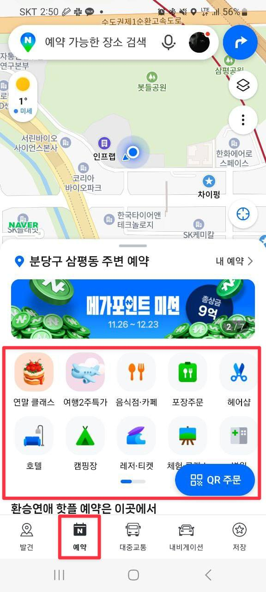
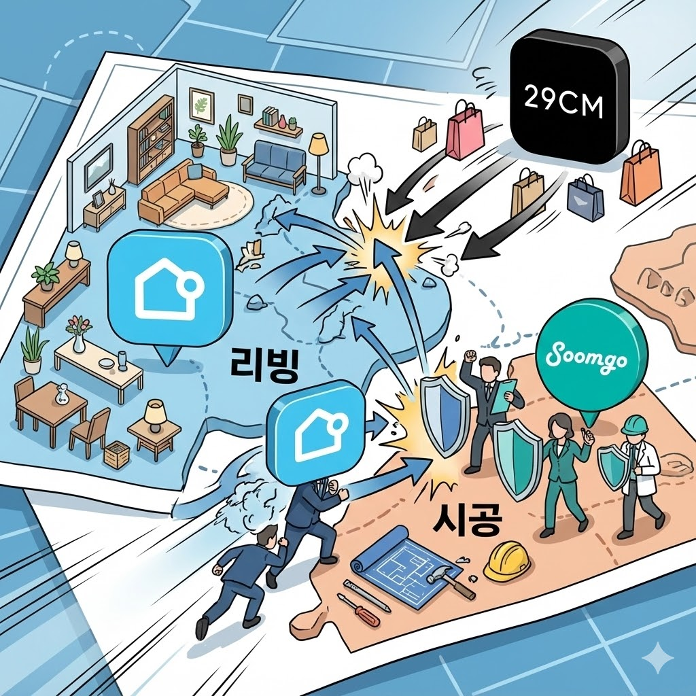

# 버티컬 벗어나기

최근 잇섭님의 테슬라 FSD 영상을 시청했는데 조회수가 158만인걸 보고 깜짝 놀랬다.

[테슬라 자율주행 진짜 미쳤나? ㄷㄷ FSD 한국 공식 오픈 기념 무한 테스트](https://www.youtube.com/watch?v=6qyQqxPsz20)

자동차 관련된 여러 유튜브 채널보다 IT 유튜버인 잇섭의 테슬라 영상이 조회수가 훨씬 높았기 때문이다.
이젠 자동차 전문 유튜버 채널이라고 해도, IT 유튜버들의 경쟁을 받아야하는 상황이 된 것이다.

최근에 엄지용 커넥터스 대표님의 네이버지도에 관한 이야기가 생각났다.
DAN 25 행사에서 최승락 네이버 플레이스 프로덕트 부문장님이 밝힌 “네이버 지도가 모든 오프라인 생활의 첫 번째 인터페이스가 되겠다” 는 포부에 관한 것이다.

위치를 찾기 위한 용도였던 지도 앱이 이제는 오프라인 생활의 모든 시작점이 되겠다는 것이다.
모텔/호텔 예약을 야놀자에서 네이버지도에서 바로 할 수 있도록
음식점 예약을 캐치테이블에서 네이버지도에서 바로 할 수 있도록
출발지와 도착지를 이동하기 위한 택시 예약을 카카오T 에서 네이버지도에서 바로 할 수 있도록
모든 오프라인 여정의 시작을 네이버 지도로 하겠다는 것이다.

이는 거의 대부분의 분야의 버티컬 서비스들과 모두 다 부딪치겠다는 것이다.
‘네이버페이’ 까지 있으니 더더욱 강력할 것이고 말이다.

지도의 No1이였던 네이버 지도가 이젠 오프라인 예약의 모든 영역을 다 침투하게되는데, 이는 네이버 지도만 그런것은 아닌 것 같다.
(‘네이버페이’ 도 간편결제를 넘어 테이블 오더, 포스, 키오스크 등 오프라인 결제로 확장하면서 계속 부딪치고 있기도 하고)

최근에 29cm와 컬리가 리빙으로 영역을 확장한다는 기사를 봤다.
29cm과 컬리가 리빙으로 영역을 확장하면서 오늘의 집과 부딪치고 있다.
오늘의집은 리빙 영역에서 시공으로 영역을 확장해서 숨고와 부딪치고 있다.

버티컬하게 움직이는 많은 제품들이 이제는 다른 버티컬로 과감하게 나간다.
한국이라는 시장은 크기의 한계 때문에 버티컬에서 1등을 유지하는 것만으로는 안되는 것 같다.
대부분의 제품들은 자기만의 버티컬에서 ‘확고’한 1등을 목표로 하지만,
국내 1등이 되고 나서는 더 확고해지기 보다는 다른 버티컬로 ‘확장’ 하는 방법을 선택하고 그러다보니 각 분야별 1등이 계속해서 부딪친다.

그래서 제품의 방향성, 로드맵을 결정하는 것은 어렵다.
날카롭고, 뾰족하게 가져가야한다곤 하지만,
국내에선 크기의 한계로 아무리 뾰족해도 결국은 넓게 여러 분야를 침투해야하는데 그게 기존의 제품과 연결성을 갖고 있어야 하니 말이다.

요즘은 이런 소식들을 많이 접하다보니 제품 전략에 대해 많은 고민들이 있다.
이런 고민을 먼저 해보고 여러 시도들을 해본 선배들과 이야기를 많이 나누는데, 이런 고민은 비단 나만 하진 않을 것 같다.

내일 퍼블리/커리어리/위하이어의 창업자이신 박소령 대표님과 라이브 토크를 진행한다.
이런 내 고민을 많이 여쭤보고, 소령 대표님은 어떻게 생각하시는지, 과거에 어떤 결정들을 어떤 기준으로 하셨는지 많이 여쭤봐야겠다.

📅 일정 안내
신청페이지: https://inf.run/vTDJ8
신청 기간: ~ 12월 4일(목) 까지
라이브 행사: 12월 5일(금)
