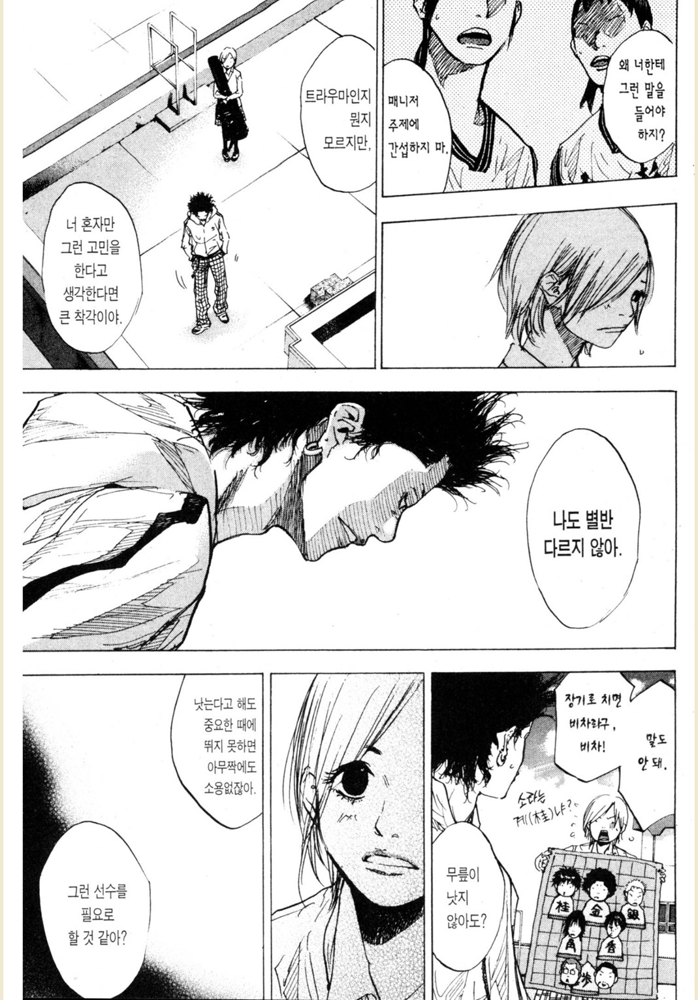
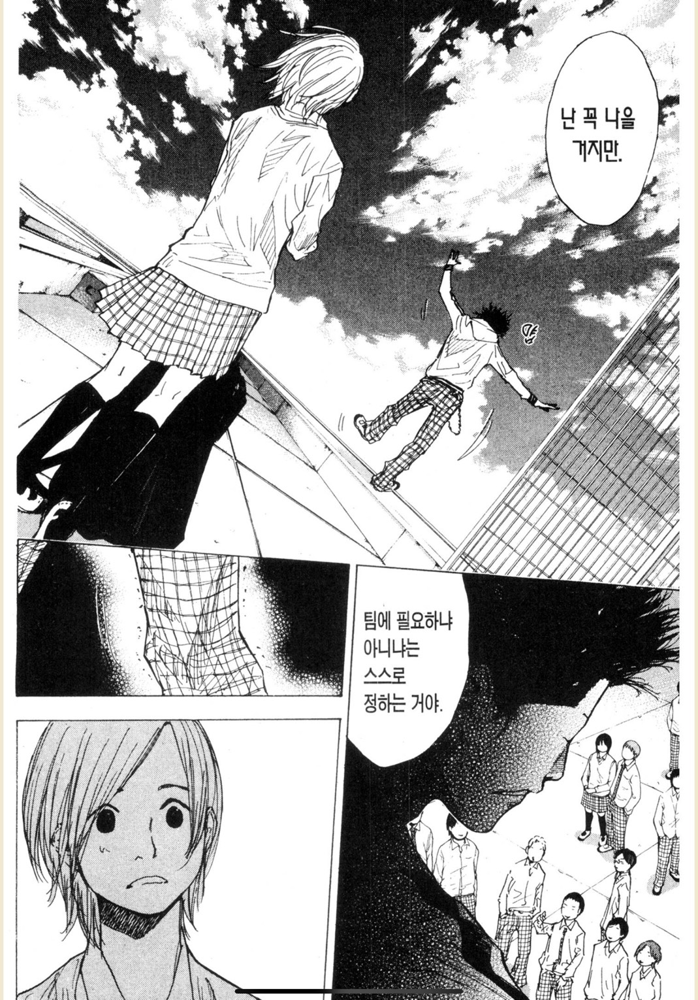
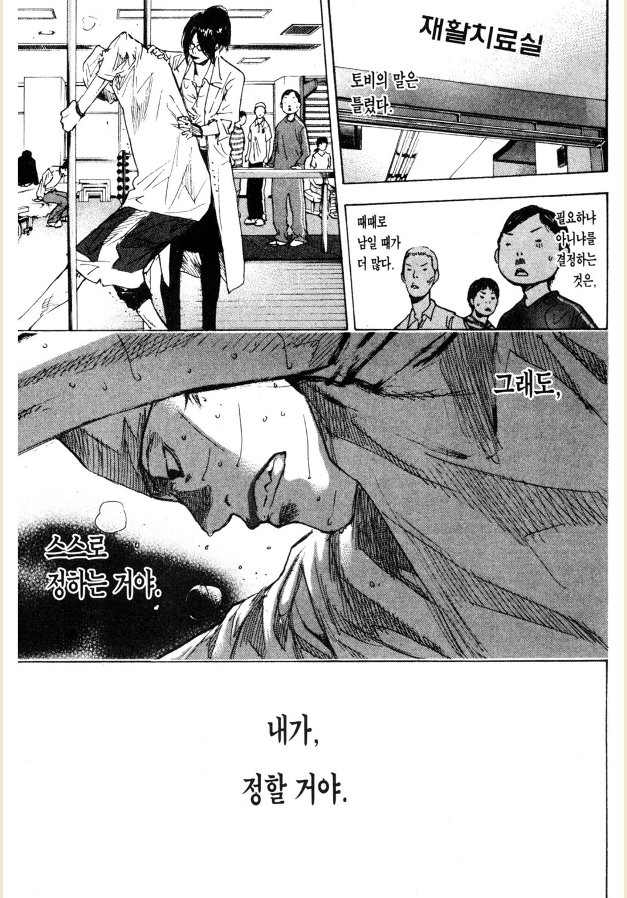

# 이춘운

최근에 "재능이 너무 없고, 지금 이정도 실력이면 개발을 포기하고 다른 직업을 찾아보라는" 는 멘토님의 피드백 때문에 개발자의 길을 포기했다는 글을 보았다.  
  
예전에 비슷한 피드백을 받아본 입장에서 한 두명의 의견으로 본인이 선택한 길을 포기하는 것이 너무 안타까워 이메일로 내 생각을 전달드렸다.  
  
[개발자 되기 좋은 성향](https://jojoldu.tistory.com/835)이 따로 있다고 생각하진 않는다.  
어떤 특성과 강점을 가진 개발자가 있을 뿐이지, 개발자에겐 어떤 재능이 무조건 있어야 한다고 생각하진 않는다.  
  
다만, 그런 내 생각과 달리 누군가는 직업별로 적합한 재능이 있을 수 있다고 생각할 수 있다.  
운명같은 재능과 직업이 만나는 드라마틱한 상황이 나에겐 없다고 생각한다면 좌절감이 든다.  
근데 그 운명이라는게, 재능이라는건 무엇일까?
  
---

대학생 시절 아사다 지로 작가님의 "창궁의 묘성" 이라는 작품에 빠져 읽었다.  

> 창궁의 묘성은 전체적으로 1~3권까지만 주변에 추천 한다.
> 이토 히로부미를 아시아를 지킨 영웅으로 표현하는 등 후반부 들어서서 동의하지 않는 부분이 너무 많다.  
> 1~4권 중 4권의 경우 급하게 마무리한 티가 많이 난다.  
> 1~3권까지는 정말로 몰입감이 높다. 

이 작품에는 크게 2명의 주인공이 등장한다.
양문수와 이춘운 이라는 인물로, 이 중 이춘운은 마을에서 똥을 주워 팔며 간신히 살아가는 인물이다.  
이 둘은 한 번도 틀린 적이 없다는 점성술사 백태태에게 자신들의 운명을 물어본다.  
  
양문수의 점괘는 천하의 재상이 되는 운명이였다.  
백태태는 양문수에게는 점괘 그대로 전달한다.  
  
하지만 **며칠 내로 굶어 죽을 운명을 가진 이춘운에게는 너무나 가여워 차마 그대로 말하지 못하고 처음으로 거짓 점괘**를 말한다.  
너는 세상의 모든 보물을 다 가질 운명이라고 말이다.

> 가난한 이씨 집안의 넷째아들, 샤오리야. 너의 수호성은 오랑캐의 별, 묘성.  
> 그날 밤, 하늘과 땅을 가르는 북두칠성의 자루부분은 하늘 꼭대기에서 찬란히 빛나는 묘성으로 향하고 있었지.  
> 그것은 곧 천자가 사는 자미궁을 그 국자로 퍼내라는 명령이 아니겠느냐.  
> 너는 반드시 천하의 모든 재물과 금은보화를 한 손에 거머쥐게 될 게다.  
> 두려워마라.  
> 너에게는 항상 천궁을 다스리는 오랑캐의 별, 묘성이 함께할 테니까

**춘운은 백태태는 절대 틀리지 않는다는 말을 되뇌며** 거세를 하고 환관이 된다.  
실제 운명과는 다른 가짜 점괘였지만,  
이춘운은 그걸 **진짜라고 믿고 스스로 운명을 개척해나가 결국 보물이 가득한 궁으로 들어가 마침내 권력의 정점에 이른다**.  
  
가짜 점괘를 진짜라고 믿고 개척해나가는 이춘운의 모습이 너무 인상 깊어서 설령 **사실이 아니더라도 스스로가 확실하게 믿는다면 그게 곧 운명이 된다**고 생각하게 되었다.

> "진실이든 거짓이든, 믿어버리면 인생이 변해. 나는 내 생각대로 살고 싶어"
> 1권 p291

---

어떤 선택이든 남이 아니라, 내가 선택해야 한다.  
남의 의견은 남일 뿐이다.  
나에겐 그걸 잘해낼 힘이 충분히 있다고 믿는 사람들이 해내는 놀라운 일들을 주변에서 많이 보았다.
그러니 누가 뭐라하든 스스로를 믿어보자.

--- 

이번 추석은 10일이나 되는 긴 기간입니다.  
저는 요번 기간 동안 부족하다고 생각했던 몇개 강의들을 진득하게 공부 할 예정입니다.  
이춘운처럼 저도 제가 더 훌륭한 리더가 될 수 있다고 믿어보려고요.  
  
추석에도 열정을 태우고 싶으신 분들이라면 이번 추석에 서로 응원해보는 알찬 시간을 함께 하면 좋겠습니다.

- ['향로' 와 함께하는 추석 완강 챌린지](https://www.inflearn.com/challenge/x27%ED%96%A5%EB%A1%9Cx27-%EC%99%80-%ED%95%A8%EA%BB%98%ED%95%98%EB%8A%94-%EC%B6%94%EC%84%9D-%EC%99%84)

## 함께 보면 좋은 글

- [개발자 되기 좋은 성향](https://jojoldu.tistory.com/835)
- [소설에 몰입하기](https://jojoldu.tistory.com/735)