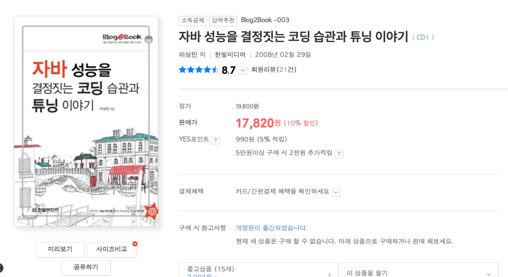
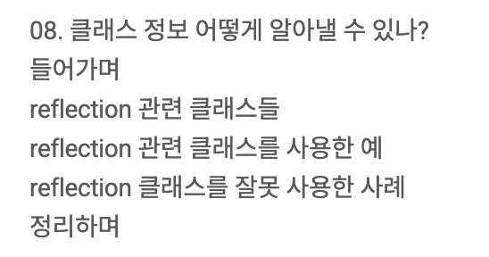

# 한 문장을 얻기 위한 독서

국비학원을 통해 Java 와 웹 개발을 처음 배울때, 이걸 어떻게 해야 빠르게 흡수할 수 있을까 고민을 많이 했습니다.  
단순히 선생님의 설명을 듣는 것 만으로는 전혀 이해가 되지 않았기에 여러 방안들을 고민했죠.  
  
그 중 가장 저한테 효과가 좋았던 방법은 "학원 동기들을 가르치는 것" 이였습니다.  
매일 수업 시간 (오전 9시부터 오후 4시까지) 에 배운 내용들을 정리해서 1~2시간 안에 요약해서 학원 동기들을 가르치는 것이죠.  
**남을 가르치기 위해 무언갈 공부하는 것이 정말 잘 배울 수 있음을 알게 되었습니다**.  
  
스프링 프레임워크의 AOP에 대한 내용을 배우던 시간에 리플렉션에 대해 설명을 들었는데, 이해가 잘 안되었습니다.  
이게 도대체 어디에 필요하지? 어떻게 활용되지? 사용하면서 주의해야할 것은 없나? 등등이였죠.  
어찌됐든 수업시간에 언급은 되었기에 이걸 동기들에게 가르치긴 해야해서 갖고 있던 책들에서의 설명을 몇번 더 읽어보았습니다.  
개념적으로 이해는 되는데 이걸 사용하면서 주의해야할 점들은 뭐가 있을지가 궁금했습니다.  
스터디 시간에 누가 질문을 할 수도 있으니깐요.  
  
그래서 "이걸 실제 실무에서 사용할때 조심해야할 부분은 뭐지?" 라고 생각하면서 관련된 책을 검색 하던 중 이상민님이 쓰신 [자바 성능을 결정짓는 코딩 습관과 튜닝 이야기](https://product.kyobobook.co.kr/detail/S000001223452) 을 발견하게 되었습니다.  

리플렉션을 실무에서 어떨 때 사용해야하고, 어떤 점을 주의해야하는지에 관한 목차가 있었죠.

이거다 싶어서 수업을 마치자마자 강남 교보문고로 달려가 바로 구매해서 내용을 정리했습니다.  
자바의 정석, 열혈강의 자바, 토비의 스프링과 함께 이상민님의 "자바 성능을 결정짓는 코딩 습관과 튜닝 이야기" 까지 여러 책들에서 리플렉션에 관한 내용들을 모두 모아 정리했습니다.  
  
정리된 내용을 기반으로 동기분들께 그날의 수업 내용들을 요약 정리해서 전달했는데, 그 내용들이 너무 좋았는지 스터디가 끝나고 이 내용들을 어디서 찾은것인지 많이들 궁금해했습니다.  

신난 저는 방금 사온 따끈따끈한 이상민님의 책을 소개 했었습니다.    
**수백페이지에서 고작 열 몇 페이지를 보려고 2만원을 쓰는** 저를 동기들은 되게 신기하게 봤습니다.  
(당시엔 자장면이 4천원대였으니깐요)  
  
리플렉션 챕터는 24개 챕터 중 하나이기에 단순 계산으로만 보면 **4% (1/24) 의 내용만 확인하려고 100%를 지불**하는 비합리적인 선택을 한 셈이죠.  
그래도 전혀 아깝다는 생각은 들지 않았습니다.  
필요했던 지식 한 줄은 얻었으니깐요.  

그 이후에도 "**이 한 문장을 얻으려고 이 책을, 이 강의를 샀구나**" 를 자주 경험했습니다.  

> “아, 이 한 문장을 얻으려고 이 책을 샀구나.”  
> “이 한 줄을 위해 이 강의를 들었구나.”

무언가가 머리에 ‘딱’ 박히는 그 순간.  
한 권, 한 편이 아깝지 않게 느껴진다.  
그리고 그건 항상  
**능동적으로 공부했을 때** 찾아왔다.

지금도 나에겐 그날의 경험이 선명하다.  
무엇이든 하나는 얻겠다는 각오로  
책을 사서 달려가던 그 마음.

올해 할로윈,  
그때처럼 **하루를 온전히 배움에 써보는 건 어떨까?**

- 한 편의 강의로  
- 단 하나의 문장을 얻기 위해  
- 온전히 스스로를 위한 시간

