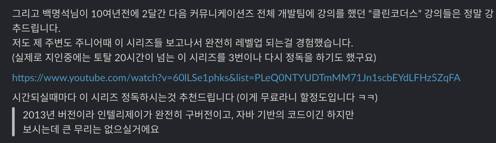

# 클린 코더스

그 시절의 취준생이라면 대부분 그렇겠지만 네이버, DAUM 2개 회사를 너무 입사하고 싶었다.  

두 회사에 인턴을 한 컴공과 친구 (난 컴공과가 아니여서 친구의 친구를 통해 찾아갔지만) 가 있으면 "인턴해보니 어떠냐" 와 같은 질문을 하고 인턴 경험을 들으면서 대리 만족 하고,
괜히 서울 갈 일이 있으면 목적지에서 2시간 거리여도 일단은 두 회사의 사옥 구경도 하고, 주변 산책도 하면서 여기에서 근무한다는건 어떤 기분일까 같은 상상을 하기도 했다.  

취업을 하고 커리어를 쌓아나가면서 두 회사가 업계 전체에 뿌린 기술적 씨앗들이 얼마나 컸는지 새삼 느끼게 되었다.
선배 개발자분들과 기술적인 이야기를 할 수 있는 기회가 상대적으로 적었던 입장에서 네이버와 DAUM 의 기술 공유는 두 회사에 대한 동경을 키웠다.
특히 DAUM의 수많은 개발자분들을 대상으로 2개월간 진행된 사내 교육인 백명석 님의 클린 코더스가 무료로 유튜브에 공유되고나서 정말 반복해서 시청했다.
(요즘의 엉클밥에 대한 평가는 아쉽지만) 
당시 클린 코드 책을 보고 난 뒤 뒤라서 명석님의 클린 코더스 유튜브 영상들은 2번 3번씩 봐야할 내용들로 가득찬 느낌이였다.
"세상에 이런 교육을 사내에서, 무료로, 직접 받아볼 수 있다니?" 
"저런 내용의 교육이 도대체 사내에서 얼마나 많이, 자주 공유되고 있을까?" 
"외부에 공개되지 못하는 사내 교육도 있을텐데 거기선 또 어떤 내용들이 공유되고 있을까?"
"교육을 해주시는 명석님과 같은 분들과 같이 일한다는건 어떤걸까?"
등등 
두 회사에 대한 동경이 더 커졌다.

이후에 다른 책들, 실제 업무에서 얻은 경험들을 통해 스스로 어떻게 코드를 작성해야할지 갈무리해나가면서도 종종 명석님의 영상들을 다시 보면서 그 감각을 잃지 않으려고 했다.

신입으로 입사하시는 개발자분들에게 항상 명석님의 클린 코더스 영상들은 꼭 보라고, 첫 PR 보내기 전에 클린 코더스는 먼저 꼭 보라는 이야기를 항상 했다.

재밌던 것은 이후에 배민 입사하고나서 친해지신 분들과 대화하다보니깐 클린 코더스 영상들을 다들 보셨다는거다.
어떤 분들은 3번 보니깐 코드가 아예 달라졌다는 이야기도 하면서 말이다.
(물론 배민 전체가 그런건 아니라, 대화를 자주 나누는 분들에 한했지만)

지금의 조직에 합류하고 나서도 개발팀에는 클린 코더스 영상을 가능하면 시간 내서 꼭 1회독 하라고 이야기 드린다.
이미 11년 넘게 지난 내용들이라 안맞는 부분이 있기도 하겠지만,
여전히 지금 봐도 좋은 내용들이 가득하기 때문이다.

다만, 너무 오래전 영상들이라 화질이 조금 아쉽다.  
480p 화질의 영상들이라 요즘의 고해상도 환경에서는 명석님께서 작성하시는 코드 내용이나 텍스트들이 깨지거나 흐릿하게 보여서 시청하기에 조금 어려움이 있다.  
그래서 우리 팀원들이 학습하는데 방해되는 요소가 없도록, 우리 팀원들이 학습하는데 방해되는 요소가 없도록, 다른 주니어 개발자분들이 보시는데도 불편함이 없도록 하기 위해 백명석님께 허락을 받아 사내에서 자체적으로 구축한 **AI 기반 영상 업스케일링 파이프라인**을 통해 명석님의 [클린 코더스 영상들을 1080p 해상도로 업스케일링해서 무료로 강의를 런칭](https://inf.run/szkUi)하였다.  

그간의 커리어를 쌓아오면서 나를 채워주었던 많은 학습 자료들은 지금 커리어를 시작하시는 분들이 봐도 좋을 것들이 많다.
이런 학습 자료는 계속해서 인프런에서 부활 시켜서 오래오래 사랑받도록, 성장을 가속화 할 수 있도록 도움을 주고 싶다.