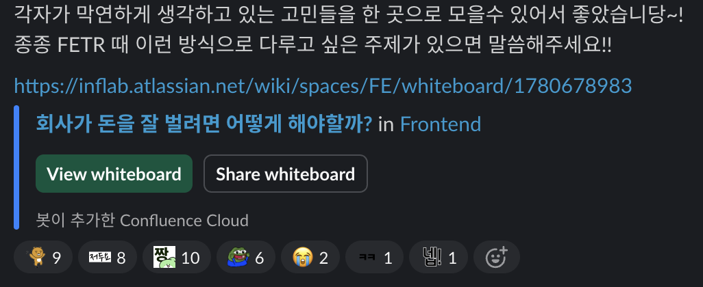

# 회사가 돈을 잘 벌려면 어떻게 해야할까?

예전에 훌륭한 커리어를 통해 얻은 경험을 갖고 이제는 여러 스타트업과 개발자, 개발팀에게 멘토링을 해주시는 분과 이야기를 나눈 적이 있다.  

"수십개의 스타트업에 사내 강연을 갔는데, 강연이 끝나고 질의응답 시간에 대부분은 개인의 커리어, 기술적 성장 등 '성장'에 집중해서 질문을 하셨다.  
일부 소수의 회사 구성원들만 '성과' 에 대해 질문을 하는데 그 회사들은 혹한기에도 계속해서 매출을 내고 있었다"  

회사의 상황, 방향 등에 대한 고민을 하다보면 특정 시기에는 기술력 자체가 중요한 것이 아님을 자연스레 알게 된다.  
회사의 맥락이라는 것을 직무에 상관없이 모두가 이해하고 있는 팀이 진짜 좋은 팀이 아닐까 생각하게 되었다.  

최근 프로덕트 타운홀 미팅이 일찍 끝나고 개발팀분들끼리 모여서 회의실 한쪽에서 아래 주제에 대한 이야기를 했다는 것을 알게 됐다.

"회사가 돈을 잘 벌려면 어떻게 해야 할까?"

개발팀이 기술 스터디를 하는 것 보다 
"왜 저 서비스는 높은 매출을 낼 수 있었나?" 
"잘 되는 서비스는 무엇이 다른가?" 등에 대해 관심을 가지게 된 것이다. 

그게 나는 몹시 부끄러웠다. 
대부분의 조직에서 개발팀은 '돈' 이라는 매개체와 가장 멀리 있는 팀이다. 
사업개발, 마케팅, MD, Sales 등의 조직과는 역할이 다른 팀이 개발팀이다.

이건 일종에 회사에 장애가 많이 나서 
브랜딩팀도, 마케팅팀도 "서비스가 장애가 안나려면 어떻게 해야할까?" 를 고민하는 것과 비슷하다.

해당 RnR이 아닌 조직 조차도 이제는 신경써야 한다면 그건 매출의 제 1책임자인 C레벨들의 역량이 그만큼 부족했다는 것을 의미한다. 
그래서 이에 대한 반성을 많이 하게 되었고, 
팀원분들께도 죄송하다고 말씀드렸다. 
  
한편으론 “우리 팀도 많이 성숙해졌구나” 싶었다.

사실 개발팀이 매출에 대한 얘기를 꺼낸다는 건 흔한 일이 아니다.  
그만큼 최근 몇 달 사이 많은 스타트업들이 겪고 있는  
‘혹한기’ 분위기가 팀에도, 구성원 개인에게도 전해지고 있다는 뜻일 테니까.

개발팀도 조직의 구성원으로서 회사의 상황에 맞는 고민을 해야한다고 생각한다.  
회사의 매출이 계속해서 감소하고 있다면 매출을 고민할 수 있어야 하고,  
브랜딩이 계속해서 훼손된다면 브랜딩에 대해 다시 한번 고민할 수 있어야 한다.  
  
회사의 여러가지 어려움은 남겨두고, "우린 개발팀이니깐 개발 스터디만 계속 할거야" 를 외치는 것도 좋지 못한 현상이다.  
회사의 맥락을 전혀 모르고 align 되어있지 않다는 증거니깐.   

---

예전에는 개발팀에서 중요한 건 속도와 안정성이라고 생각했다.  
하지만 요즘은 그저 잘 만드는 것만으로는 부족하다는 걸 다들 느끼고 있다.

- “내가 만든 이 기능이 실제로 매출로 이어지고 있나?”
- “우리 제품, 고객이 돈 주고 쓸 만큼 가치 있나?”
- “회사의 생존에 내가 기여하고 있는가?”

이런 질문들이 예전보다 훨씬 가까운 곳에서 들려온다.  
비단 우리 팀만의 이야기가 아니라, 많은 개발팀이 지금 비슷한 고민을 하고 있을 거다.

그래서 이번에 **혹한기에도 매출 22배 성장**를 이루고 계신 고위드의 CEO 김항기 대표님과 함께 라이브를 준비하게 되었다.  

> 📅 6월 21일 토요일 저녁 8시  
> 📺 [개발바닥 유튜브 라이브](https://www.youtube.com/@devbadak)

김항기 대표님은 법인카드, 자금관리, 회계·세무 등 스타트업에서 겪는 많은 문제를 기술로 풀고 있는 분이다.  

그리고 무엇보다 대단한 건 **실제로 회사를 성장시키고 있다는 것**이다.    
지난해 고위드는 **매출 1,494억 원**, 전년 대비 **22배 성장**이라는 놀라운 성과를 냈다.

이번 라이브에서는 김항기 대표님에게  
그런 질문들을 직접 던질 예정이다.

- 좋은 제품, 좋은 팀인데 왜 매출은 안 나올까?  
- 개발자도 사업을 알아야 하는 걸까?  
- 매출로 이어지는 제품은 뭐가 다를까?  

개발자이면서 동시에 **비즈니스에도 관심 있는 사람**,  
제품을 잘 만들지만 **회사 성장에 기여하고 싶은 사람**,  
그리고 지금 **커리어 방향을 다시 잡고 싶은 사람**에게  
이 자리가 좋은 계기가 될 거라고 생각한다.

나도 이번 인터뷰를 통해 리더로서의 관점을 더 넓히고 싶다.

