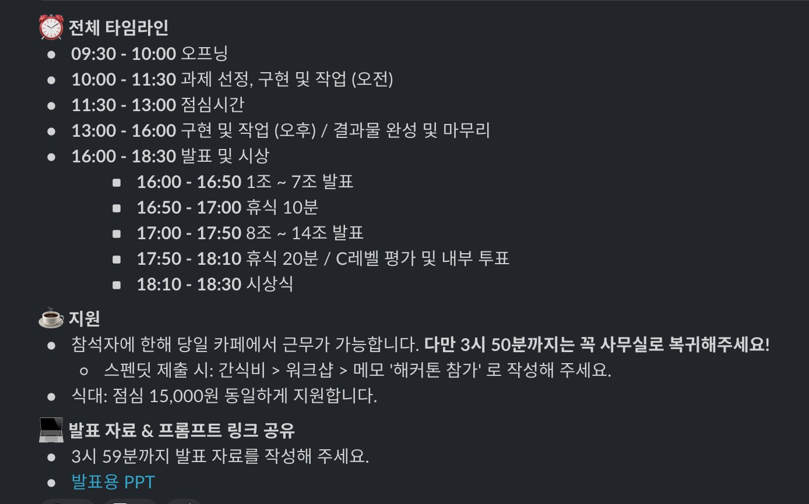

# AI 해커톤

오늘 전사 AI 해커톤을 진행했다.

주제는 "이게 되네? AI 인프톤", 
목적은 "AI가 어렵거나 특별한 기술이 아닌, 누구나 쉽게 쓸 수 있는 업무 도구라는 것을 직접 경험"하는 것이었다.

AI를 활용하는 일반적인 해커톤과 비슷하지만, 이번엔 두 가지 제약을 뒀다.

운영/사업 1명 + 개발자 1명으로 조를 편성하되, 
"개발자는 절대 코드를 작성하지 않고 페어인 운영/사업팀 분이 모든 구현을 한다 ", 
"CLI는 절대 사용하지 않고 클로드 데스크탑 앱으로만 구현한다".

제품 직군(개발/디자인/PM)은 AI를 적극적으로 쓰지만, 
운영/사업 쪽에 계신 분들에겐 여전히 AI가 어렵다. 
그리고 이건 집체 교육으로 풀 수 있는 문제가 아니라고 생각했다.

AI가 어렵지 않다는 걸 느끼게 해주는 가장 좋은 방법은 "일상 업무에서 발생하는 답답함을 AI를 통해 본인의 손으로 직접 해결하는 경험"이라고 생각했다. 
직접 해결하되, 막힐 때마다 옆자리 개발자 동료가 조언과 힌트를 준다. 
단, 개발자가 직접 손대는 건 절대 안 된다. 
앞으로도 이렇게 직접 AI와 함께 풀어나가시길 바랐다. 
CLI를 금지한 것도 같은 이유다. 
CLI는 너무 어려운 도구니까.

점심시간, 발표시간, 시상식을 빼고 나니 실제 해커톤 시간은 4시간 30분(오전 1시간 30분, 오후 3시간)이 전부였다. 

그래서 이번 해커톤도 'AI 찍먹', '개발팀과의 유대감 형성' 정도로 끝나지 않을까 싶었다.

근데 웬걸.
깜짝 놀랄 만한 결과물이 너무 많았다. 
일부는 오늘부터 담당 팀에서 바로 쓰기 시작했고, 
일부는 조금만 더 다듬으면 전체 팀원이 쓸 수 있었고, 
일부는 개발을 전혀 모르는 사람이 4시간 만에 어디까지 할 수 있는지 한계를 돌파한 것 같은 결과물도 있었다. 

물론 이 경험으로 "개발자가 다 대체된다", "모두가 개발자가 될 수 있다" 같은 호들갑/설레발을 치고 싶진 않다. 
(그렇게 생각하지도 않고.)

다만, 놀라웠던 것은 해커톤의 주 타깃이었던 운영/사업팀보다 서포터에 가까웠던 개발자들이 훨씬 더 많은 인사이트를 얻었다는 점이다.

어떤 팀에선 마케터 분이 제안한 기능을 두고, 페어를 이룬 개발자가 "이 시간 안에는 어렵겠다"며 좀 더 낮은 스펙을 제안한 뒤 잠깐 화장실을 다녀왔다고 한다. 
그 사이에 마케터 분이 AI와 뚝딱뚝딱 하더니, 안 될 거라던 그 기능을 만들어냈다. 
돌아온 개발자가 너무 놀랐다며 그 경험을 공유해주셨다.

다른 분은 "개발자는 '이 시간 안에 어디까지가 현실적으로 가능한지' 계산할 수 있는 사람들이라, 그 제약을 먼저 고려할수록 오히려 AI를 제대로 못 쓰게 되는 것 같다." 는 이야기도 해주셨다.

호들갑 떠는 걸 선호하지 않음에도, 이번 해커톤 경험은 정말 좋았다.

사실 이번 해커톤은 대표님의 제안으로 시작되었고, 나는 처음엔 반대였다.

5월에 출시 예정인 제품들이 많았고, 그 제품들이 정말 기대됐다. 하루라도 더 빨리 내고 싶은데 해커톤을 하면 일정이 더 밀리고, 5월엔 연휴도 많아서 어영부영하다 한 달이 끝날 것 같았다.

근데 대표님이 "정식 제품 출시가 더 지연되더라도 이번 해커톤은 그만큼의 가치가 있다"고 이야기해주셨다. 
이 정도로 확신을 갖고 계신다면 해야겠다 싶어서 진행했다.

그동안 본 많은 해커톤들에서 실제 고객이 쓰거나 사내에서 계속 사용되는 제품을 만들기보다는 단기간의 무형 가치(서로 다른 조직간의 유대감 형성, 새로운 기술 찍먹, 일상에서 벗어난 몰입 경험 등)를 만드는 이벤트로 끝나는 걸 봐왔다. 

근데 그것도 이젠 선입견이라는 걸 이번 해커톤으로 많이 깨달았다. 요즘 시대에 내가 가장 갇혀 있는 사람이었구나 싶었다.

형식에 대한 걱정도 많았다. 
개발자는 서포터로만 참여해야 하니 답답할 것이고, 운영/사업팀은 같은 조인데도 본인이 하나부터 열까지 다 해야 하니 그것대로 답답할 것 같았다. 
(물론 해커톤 참여 자체는 자율이었다.)

근데도 다들 너무 웃으면서, 즐겁게, 몰입감 있게 참여해주셨다. 
끝나고 "또 하고 싶다"는 이야기들을 해주셨는데, 그게 정말 큰 힘이 됐다.

개인적으로 너무 좋은 경험이었기에, 이런 방식의 해커톤을 많은 분들께 추천드리고 싶다.

> 이번 해커톤의 제대로 된 후기와 결과물은 따로 정리해서 올릴 예정이다.

