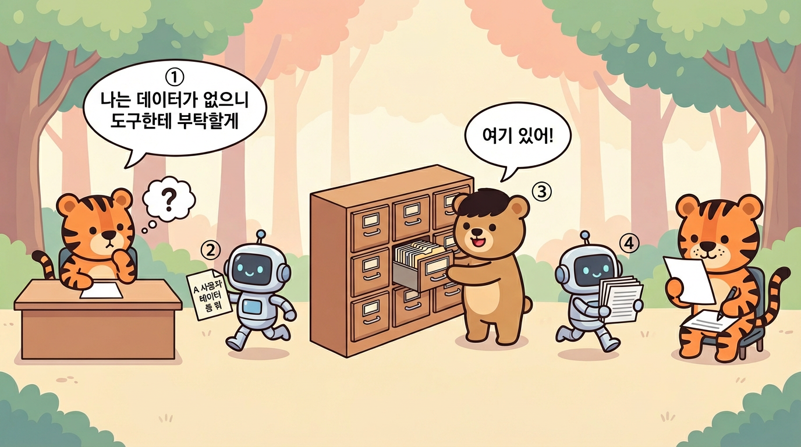
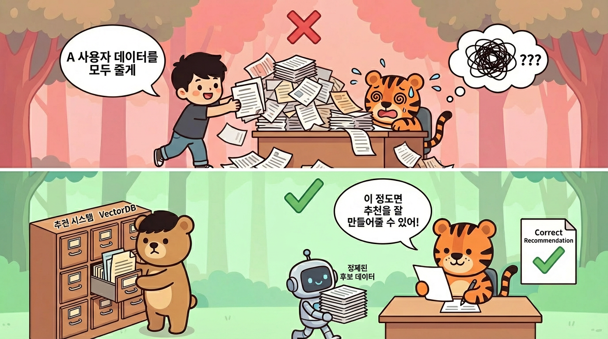

# LLM은 데이터베이스가 아니다

"우리 서비스에 LLM한테 추천 기능을 넣으면 되지 않아?"

요즘 CTO님들과 미팅을 하거나 밋업에 참가하면 이런 이야기에 고민하는 CTO님들을 정말 자주 뵙는다.
CEO, PM, PO, 사업 리더 할 것 없이 LLM이 마치 우리 서비스의 모든 데이터를 꿰고 있는 만능 추천 엔진인 것처럼 이야기한다.

그 기대의 이면에는 하나의 오해가 깔려 있다.
**LLM이 데이터베이스처럼 데이터를 저장하고 있다가, 질문하면 그 안에서 꺼내주는 것**이라는 오해 말이다.

이 오해가 생기는 이유는 간단하다.
**겉으로 보면 둘이 똑같기 때문이다**.

- 데이터베이스에 SQL을 던지면 답이 나오고, 
- LLM에 프롬프트를 던져도 답이 나온다.

"질문하면 답해준다"는 경험이 동일하니, 안쪽에서 무슨 일이 일어나는지는 신경 쓰지 않게 된다.

하지만 안쪽은 근본적으로 다르다.
데이터베이스는 **이미 저장해둔 데이터 안에서 찾아서** 답한다.
LLM은 **사전에 학습한 일반 지식과, 우리가 프롬프트에 함께 넣어준 정보를 토대로 추론해서** 답한다.
하지만 그 어디에도 우리 서비스의 데이터는 없다.
저장소에서 꺼내오는 것과, 건네받은 정보로 추론하는 것은 완전히 다른 일이다.

결론부터 이야기하면, LLM은 데이터베이스가 아니다.
LLM은 **거대한 함수**다.
  
데이터베이스는 데이터를 **저장**한다.
우리 서비스의 사용자 정보, 구매 이력, 상품 목록, 클릭 로그 등을 체계적으로 보관하고, 질의(Query)를 통해 정확하게 꺼내온다.  

"지난 30일간 A 사용자가 구매한 상품 목록" 이라고 질의하면, 정확히 그 목록이 반환된다.
저장된 범위 안에서 질의 조건에 맞는 결과를 반환한다.

LLM은 **우리 서비스의 데이터를, 데이터베이스처럼 정확하게 조회 가능한 형태로 갖고 있지 않다.**  

물론 LLM이 아무것도 모르는 것은 아니다.
학습 과정에서 인터넷에 공개된 텍스트들의 **패턴**을 익혔기 때문에, "배달의민족이 뭐야?" 같은 일반 상식에는 답할 수 있다.  

하지만 이건 백과사전을 읽고 감을 잡은 것에 가까울 뿐, 우리 서비스의 사용자 행동 로그, 실시간 재고, 거래 내역 같은 **비즈니스 데이터**는 알지 못한다.
  
대규모 파라미터로 이루어진 거대한 수학 함수가, 입력(프롬프트)을 받으면 가장 그럴듯한 출력(응답)을 **생성**하는 것이다.

그래서 LLM에게 "A 사용자에게 맞는 상품을 추천해줘" 라고 물으면, LLM은 이렇게 반응한다.

"A 사용자가 누군데요? 어떤 상품이 있는데요? 그 사용자가 뭘 샀는데요?"

**LLM은 우리 서비스의 데이터를 모른다.**
우리 데이터베이스에 접속해서 데이터를 조회하는 것이 아니기 때문이다.

---

LLM의 기본 동작은 **매번 기억을 잃는 구조(비상태, Stateless)** 다.
함수라는 것은, 입력을 넣으면 출력이 나오는 기계를 뜻한다.
`f(x) = y`, 여기서 `x` 가 프롬프트이고 `y` 가 응답이다.

**매번 기억을 잃는다**는 것은, 이 함수가 이전에 무엇을 처리했는지 기억하지 않는다는 뜻이다.
매 호출이 독립적이다.
어제 A 사용자에 대해 물어봤어도, 오늘 다시 물어보면 어제의 대화를 기억하지 못한다.

> 채팅 기록이 이어지는 것처럼 보이는 것은, **이전 대화 내용을 매번 입력에 통째로 다시 넣어주기 때문**이다.  
> 실제 제품에서는 이전 대화를 다시 넣거나 외부 메모리를 붙여서 상태를 가진 것처럼 만들 수 있지만, LLM 자체가 기억하는 것은 아니다.

반면 데이터베이스는 **한번 저장하면 계속 남아있는 저장소(상태 유지, Stateful)** 다.
한번 저장한 데이터는 명시적으로 삭제하지 않는 한 영구히 보존된다.
어제 저장한 A 사용자의 구매 이력은 오늘도, 내일도, 1년 뒤에도 정확히 그대로 남아있다.
그래서 데이터베이스에 "어제 저장한 A 사용자의 구매 이력 보여줘" 라고 질의하면, **정확하게** 그 데이터가 나온다.

"그러면 우리 데이터로 학습시키면 되잖아" 라고 할 수도 있다.
모델이 데이터를 학습해서 똑똑해진 거니까, 우리 데이터도 학습시키면 우리 서비스를 아는 LLM이 되는 것 아니냐는 논리다.

결론부터 말하면, **학습은 기억이 아니다.**

설령 추가 학습(파인튜닝)을 통해 일부 도메인 패턴을 학습시킬 수 있다 하더라도, 최신 사내 데이터를 저장하고 조회하는 수단으로 쓰는 것은 적절하지 않다.
"A 사용자가 3월 15일에 구매한 상품 목록" 을 정확히 기억하는 LLM이 만들어지는 것은 아니다.
**패턴을 익힌 것이지, 데이터를 저장한 것이 아니기 때문**이다.
일부 학습 데이터가 재현되는 현상은 실제로 관찰되지만, 그것은 데이터베이스처럼 정확히 조회 가능한 저장과는 다르다.
우리 서비스의 비즈니스 데이터를 정확하게 꺼내주는 것과는 거리가 멀다.

게다가 우리 서비스의 데이터는 매일 바뀐다.
오늘 품절된 상품이 내일 다시 입고되고, 매 시간 새로운 사용자 행동 로그가 쌓인다.  
일주일 전에 학습시킨 내용은 이미 낡은 정보다.
LLM 재학습(파인튜닝)은 상당한 시간과 비용이 들고, 모델 규모와 방식에 따라 편차도 크다.
매일 바뀌는 재고, 매 시간 쌓이는 사용자 행동 로그를 매번 학습시킬 수는 없다.

> 게다가 파인튜닝은 보통 특정 베이스 모델에 종속된다.
> **모델이 업그레이드되면 재학습이나 재평가 비용이 추가로 생길 수 있다**.

매번 LLM에게 우리 데이터를 외우게 시키는 것은 비현실적이다.
필요할 때 데이터를 꺼내서 LLM에게 건네주면 되는 일이다.
그 **데이터를 꺼내주는 것이 바로 데이터베이스의 역할**이다.

---

"그럼 LLM에게 추천하는 것은 불가능하다는건가?", "요즘은 AI가 알아서 DB 데이터를 가져와서 사용하잖아" 라고 생각할 수 있다.

LLM에게 추천받는 것은 당연히 가능하다.  
하지만 그 구조는 "LLM한테 추천하게 하면 돼" 같은 단순한 구조가 아니다.

요즘 LLM은 외부 도구를 대신 호출하는 기능(Function Calling, 도구 호출)이나 외부 연동 프로토콜 등의 기술을 통해 데이터베이스를 직접 조회하는 것처럼 동작할 수 있다.  

하지만 이것도 결국 구조를 뜯어보면, 
**LLM이 도구를 호출하면 -> 그 도구가 데이터베이스에서 데이터를 가져와서 -> LLM에게 넘겨주는 것**이다.  

LLM이 직접 데이터베이스를 조회하는 것이 아니라, **중간 도구가 데이터를 가져와서 프롬프트에 넣어주는 것**이다.

그 도구가 일하려면? 데이터베이스가 있어야 하고, 데이터가 정리되어 있어야 한다.
결국 **데이터 인프라가 먼저**라는 결론은 똑같다.

그렇다면 올바른 구조는 무엇일까.
예를 들면 두 가지 방식이 있다.

첫째, **기존 추천 시스템의 결과를 LLM에게 넘기는 방식**이다.
구글, AWS 등 클라우드사가 제공하는 추천 서비스나, 이미 구축된 협업 필터링(비슷한 취향의 사용자들이 좋아한 것을 서로 추천해주는 방식) 시스템을 통해 **개인화된 추천 후보를 넓은 범위로 뽑아온다**.
**그 후보군을 LLM에게 넘기면, LLM이 사용자의 맥락에 맞게 순서를 조정하거나 추천 이유를 자연어로 설명**해주는 역할을 한다.

둘째, 후보 생성의 한 방법으로 **VectorDB(의미 기반 검색 전용 데이터베이스)로 먼저 추리는 방식**이다.
우리 서비스의 데이터를 의미를 담은 숫자 배열(벡터)로 변환해서 저장해두고, 사용자의 질문이나 관심사와 의미적으로 연관도가 높은 데이터를 먼저 추려낸다.
수만 개의 상품 중에서 연관도 높은 수십 개를 먼저 골라내는 것이다.
그렇게 추려낸 후보군을 LLM에게 넘겨서, 최종 추천을 만들어내는 구조다.

어느 쪽이든 핵심은 같다.

LLM에게 전체 데이터를 쏟아붓는 것이 아니라, **LLM이 소화할 수 있는 크기로 데이터를 추려서 넘겨주고, LLM이 추려진 후보 위에서 추론하는 것**이다.

너무 많은 정보를 한꺼번에 넣으면 오히려 LLM의 정확도가 떨어진다.

결국 LLM을 활용한 추천의 품질은 **LLM의 성능이 아니라, 우리가 넘겨주는 데이터의 품질**에 달려있다.

특히 전통적인 추천 시스템이 이미 잘 돌아가고 있다면, 이걸 LLM으로 교체할 이유가 없다.

기존 추천 시스템은 사용자의 **모든 행동 데이터**를 먹고 자란다.
어느 페이지에서 얼마나 머물렀는지.
어떤 상품 페이지를 몇 번 클릭했는지.
어떤 검색어를 입력했는지.
장바구니에 넣었다가 뺀 상품은 무엇인지.
미리보기만 재생하고 떠난 강의는 어떤 것인지.
이 수천만 건의 행동 로그가 수치화되어 모델에 반영된다.

만약 LLM 단독으로 A 사용자에게 강의를 추천하려면 어떤 데이터가 필요할까.
A 사용자의 모든 행동 데이터, 모든 사용자들의 구매 데이터, 우리 서비스가 갖고 있는 모든 강의 목록, 각 강의의 리뷰 데이터, 모든 주문 정보 등을 프롬프트에 함께 넣어줘야 한다.
그래야 LLM이 그 안에서 골라서 추천할 수 있다.

그런데 이건 한 번만 이렇게 하면 되는 것이 아니다.
**A 사용자에게 다시 추천해달라고 하면, 방금 넣었던 그 데이터를 또 다시 넘겨야 한다**.
LLM은 이전 요청을 기억하지 못하기 때문이다.
**매 요청마다 그 방대한 데이터를 항상 같이 넘겨야 한다.**

이 데이터를 매번 다 넘기는 것은 사실상 불가능하다.  
- LLM이 한 번에 읽을 수 있는 텍스트 양에 제한(토큰 수 제한)도 있고, 
- 비용도 있고, 
- 무엇보다 수천만 건의 행동 로그를 텍스트로 변환해서 프롬프트에 넣는다는 것 자체가 비현실적이다.

**LLM은 텍스트 맥락을 이해하는 데 뛰어나지, 수천만 건의 수치화된 행동 로그를 실시간으로 분석하는 데 적합한 것은 아니다.**

기존 추천 시스템이 수년간 쌓아온 사용자 행동 분석을 LLM이 대체할 수는 없다.
이 사용자는 Python 강의를 자주 수강하지만 프론트엔드는 건너뛰고, 저 사용자는 할인 쿠폰이 있어야만 결제한다는 것까지 빼곡히 기록되어 있다.
LLM이 왔다고 이 시스템을 걷어내는 것은 의미가 없다.
LLM에게 이 데이터를 정제해서 넘겨주면서 "이 정보를 참고해서 추천을 구성해줘" 라고 하는 것이 올바른 활용이다.

비용과 속도 이야기도 빼놓을 수 없다.
전통적인 추천 시스템은 한 번의 추천에 수 밀리초가 걸리고, 비용도 거의 들지 않는다.
반면 LLM 기반 추천은 모델과 처리하는 텍스트 양에 따라 다르지만, 지연과 비용 모두 전통 추천 대비 자릿수가 다를 수 있다.
하루에 수백만 명의 사용자가 접속하는 서비스에서, 매번 LLM을 호출해서 추천한다면?
응답은 느려지고, 비용은 천문학적으로 올라간다.
모든 추천 요청에 LLM이 직접 나서야 할 필요는 없다.

---

LLM은 거대한 함수이지, 거대한 저장소가 아니다.
**추론하는 역할과 저장하는 역할은 분리되어야 한다.
LLM은 추론을, 데이터베이스는 저장을 맡는 것이 올바른 구조다.**
그 위에 LLM을 얹는 것이지, LLM이 그 모든 것을 대체하는 것이 아니다.

"AI를 도입하겠다" 는 좋은 방향이다.
다만 그 전에 먼저 물어야 할 것들이 있다.

우리 서비스의 사용자 행동 로그가 제대로 쌓이고 있는가.
추천에 필요한 데이터가 무엇인지 정의되어 있는가.
그 데이터를 꺼내서 LLM이 소화할 수 있는 형태로 정제해서 넘겨줄 수 있는 구조가 갖춰져 있는가.

이 질문에 답할 수 없다면, LLM을 도입하기 전에 할 일이 먼저 있는 것이다.
LLM에게 추론을 맡기기 전에, 우리가 추론하기에 적절한 크기로 적합한 데이터를 전달할 수 있는 환경부터 만들어야 한다.
