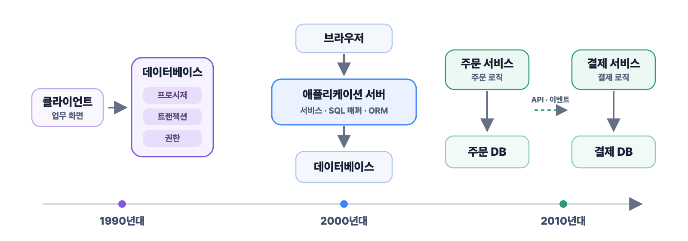
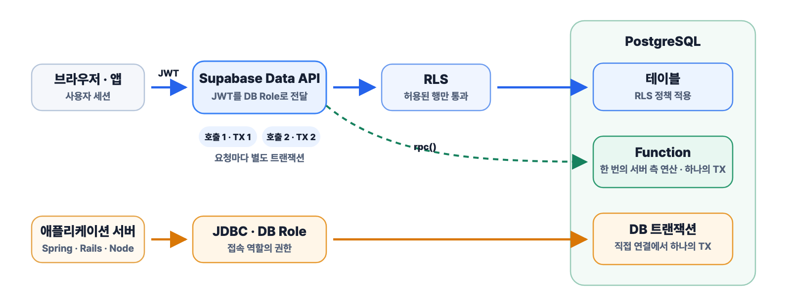
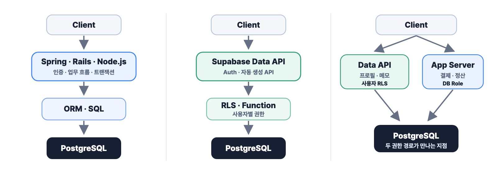

# 2026년, 데이터베이스는 어디까지 알아야 할까

바이브 코딩 이야기를 하다 보면 Supabase가 자주 나온다.
데이터베이스와 인증, API, 스토리지가 이미 붙어 있으니 애플리케이션 서버부터 만들지 않고도 제품을 시작할 수 있다.
AI가 코드를 만들어주는 지금은 프론트엔드와 Supabase만으로 작은 서비스를 완성하는 일도 더 쉬워졌다.

"Supabase가 있는데 ORM을 굳이 배워야 할까?"

ORM을 건너뛸 수 있다면 더 오래된 데이터베이스 기술은 어떨까.

"요즘 개발자가 스토어드 프로시저까지 배워야 할까?"

결론부터 말하면 SQL과 제약조건, 트랜잭션은 어떤 도구를 선택해도 배워야 한다.
ORM과 스토어드 프로시저는 현재 맡은 시스템에 따라 필요한 깊이가 달라진다.

이 질문을 따라가다 보니 두 기술이 한쪽을 고르는 대체 관계도 아니라는 생각이 들었다.
ORM은 관계형 데이터와 애플리케이션 모델 사이의 매핑과 데이터 접근을 돕는다.
Hibernate 같은 ORM은 객체 상태까지 관리한다.
스토어드 프로시저는 데이터베이스 안에서 여러 SQL과 절차형 로직을 실행하는 방법이다.
Supabase는 PostgreSQL 주변에 인증과 API, 스토리지를 붙여 애플리케이션 서버의 일부 역할을 대신한다.

**데이터베이스를 다루는 책임은 어디까지 애플리케이션이 맡아야 할까?**

## 데이터베이스가 곧 애플리케이션 서버였던 1990년대

1990년대의 기업 시스템은 지금과 구조가 달랐다.
사용자 PC에 설치된 프로그램이 사내 데이터베이스에 직접 연결하는 클라이언트-서버 방식이 흔했다.
지금처럼 그 사이에 애플리케이션 서버가 있는 것이 당연하지 않았다.

네트워크도 느렸다.
업무 하나를 처리하기 위해 클라이언트가 SQL을 여러 번 보내면 그만큼 네트워크를 여러 번 오가야 했다.
주문을 생성하고 재고를 차감하는 데 SQL이 여러 번 필요하다면 통신 비용도 그만큼 늘어났다.
그 SQL 묶음을 데이터베이스 안에 저장해두고 한 번에 호출하는 방식이 스토어드 프로시저였다.

프로시저의 장점은 단순히 "미리 컴파일돼서 빠르다"는 데 있지 않았다.
네트워크 왕복을 줄이면서 주문 생성과 재고 차감을 하나의 트랜잭션으로 묶을 수 있었다.
애플리케이션에는 테이블을 직접 수정할 권한을 주지 않고 프로시저 실행 권한만 줄 수도 있었다.

여러 프로그램이 같은 업무 규칙을 사용해야 할 때도 괜찮은 선택이었다.
창구 프로그램과 배치, 관리자 도구가 같은 프로시저를 호출하면 계산 규칙을 한곳에 둘 수 있었다.

Oracle은 버전 6에서 PL/SQL을 도입했고, 1992년에 출시한 Oracle7에서 PL/SQL 스토어드 프로시저와 트리거를 지원했다.
당시의 기술 환경에서 데이터베이스 안에 업무 로직을 두는 것은 낡은 선택이 아니라 꽤 합리적인 선택이었다.
그 시기의 변화는 [Oracle Database의 역사](https://docs.oracle.com/cd/E29505_01/server.1111/e25789.pdf)에도 남아 있다.

한국의 금융·공공·대기업 시스템에도 이 시기에 만들어진 프로시저와 배치 자산이 지금까지 남아 있다.
이 시스템들이 지금까지 남은 것을 두고 단순히 개발 문화가 뒤처졌다고 보기는 어렵다.
돈과 정산, 계약처럼 한 번의 오류가 큰 사고로 이어지는 시스템은 이미 검증된 로직을 새 구조로 옮기는 위험이 더 클 수 있다.

프로시저 중심 설계는 당시의 제약에 대한 답이었지만, 이후의 모든 환경에 그대로 맞는 답은 아니었다.

## 3계층과 SQL 매퍼가 함께 자리 잡은 2000년대

웹이 보편화되면서 클라이언트와 데이터베이스 사이에 애플리케이션 서버가 들어왔다.

```text
브라우저 → 애플리케이션 서버 → 데이터베이스
```

로직을 둘 수 있는 새로운 장소가 생겼다.

애플리케이션 코드는 버전 관리와 테스트, 여러 서버로의 배포가 수월했다.
데이터베이스마다 다른 프로시저 언어를 배우지 않고 Java나 Ruby 같은 언어로 업무 규칙을 작성할 수 있었다.
무상태 애플리케이션 서버는 상태를 가진 데이터베이스의 쓰기 계층보다 여러 대로 늘리기도 쉬웠다.

데이터베이스 안에 있던 업무 로직이 애플리케이션 서버로 이동한 이유는 성능이 나빠서만은 아니었다.
버전 관리, 테스트, 배포, 디버깅, 채용 같은 개발과 운영의 조건이 바뀌었다.

주문 생성과 재고 차감도 이제 Java 서비스가 트랜잭션을 열고 여러 SQL을 실행하는 방식으로 작성할 수 있었다.
그 SQL을 다루는 방법은 ORM만 있지 않았다.

한국의 Java 웹 개발은 프로시저에서 ORM으로 한 번에 이동하지 않았다.
iBATIS와 MyBatis를 통해 SQL은 개발자가 직접 작성하고, 업무 흐름은 Java에 두는 방식이 오랫동안 사용됐다.
iBATIS는 2004년 Apache Software Foundation으로 옮겨졌고, 2010년에는 MyBatis라는 이름으로 다시 출발했다.
자세한 과정은 [MyBatis의 역사](https://blog.mybatis.org/p/about.html)에서 확인할 수 있다.

프로시저와 ORM 사이에는 직접 SQL을 애플리케이션 코드와 함께 관리하는 SQL 매퍼라는 선택지가 있었다.
기존 스키마와 복잡한 쿼리를 그대로 활용하면서도, 업무 흐름과 배포 단위는 애플리케이션 쪽으로 가져올 수 있었다.

그래서 한국에서는 프로시저가 사라진 뒤 ORM이 등장한 것이 아니다.
기존 프로시저, MyBatis의 SQL, 애플리케이션 서비스 코드, ORM이 시스템마다 다른 비율로 계속 공존했다.

## ORM이 해결하려던 것은 SQL 작성이 아니었다

주문을 조회해 상태를 바꾸고 연관된 결제와 배송을 함께 다루려면 애플리케이션 안의 객체 상태를 관리해야 한다.
같은 행을 두 번 조회했을 때 같은 객체로 볼 것인지, 변경된 필드를 언제 UPDATE 할 것인지, 연관 데이터는 언제 가져올 것인지도 정해야 한다.

Hibernate의 영속성 컨텍스트와 변경 감지, 쓰기 지연은 이런 문제를 다룬다.
[Hibernate 문서](https://docs.jboss.org/hibernate/orm/current/userguide/html_single/Hibernate_User_Guide.html)도 데이터베이스 프로시저가 업무 로직의 중심인 시스템보다 Java 중간 계층에 업무 로직이 있는 시스템에 더 잘 맞는다고 설명한다.

ORM은 주문과 재고 객체의 상태를 관리해주지만 새로운 문제도 만들었다.

간단해 보이는 객체 탐색이 수십 번의 SQL로 이어지는 N+1 문제가 생겼다.
지연 로딩이 트랜잭션 밖에서 실패하기도 했다.
데이터베이스가 잘할 수 있는 집계와 조인을 애플리케이션에서 풀어내느라 더 복잡해지기도 했다.

ORM을 쓰면서 SQL을 몰라도 된다는 생각은 오래가지 못했다.
추상화 아래에서 실행되는 것은 여전히 SQL이다.
ORM이 만든 비용도 결국 쿼리와 데이터베이스 지표에서 드러나는 경우가 많았다.

## 하나의 데이터베이스를 넘어간 2010년대

서비스가 여러 애플리케이션과 데이터베이스로 나뉘면서 질문의 범위도 넓어졌다.
로직을 데이터베이스와 애플리케이션 중 어디에 둘 것인지에 앞서, 어느 서비스가 데이터를 소유하고 어디까지를 하나의 트랜잭션으로 볼 것인지 정해야 했다.

주문과 결제가 서로 다른 데이터베이스에 있다면 프로시저와 ORM 모두 자기 데이터베이스의 경계까지만 책임질 수 있다.
경계를 넘는 흐름은 애플리케이션이 중복 요청을 막고 실패를 재시도하며, 전달되지 않은 이벤트와 어긋난 데이터를 다시 맞출 방법까지 준비해야 한다.



## 오픈소스 데이터베이스가 넓힌 선택지

초기 웹 서비스는 MySQL 같은 오픈소스 데이터베이스와 함께 성장했다.
고가의 상용 데이터베이스와 그 안의 전용 언어에 의존하기보다, 애플리케이션 코드에 로직을 두고 필요한 SQL을 직접 실행하는 방식이 자연스러웠다.

PostgreSQL은 오픈소스 데이터베이스이면서도 점점 더 많은 일을 데이터베이스 안에서 할 수 있는 방향으로 성장했다.

JSONB와 전문 검색, 행 단위 보안인 RLS를 지원하고, 확장을 통해 공간 정보와 벡터도 다룬다.
[PostgreSQL이 소개하는 기능](https://www.postgresql.org/about/)만 보더라도 예전보다 맡을 수 있는 역할이 넓어졌음을 알 수 있다.

PostgreSQL에는 오래전부터 함수(Function)와 PL/pgSQL이 있었다.
2018년에 출시된 [PostgreSQL 11](https://www.postgresql.org/docs/release/11.0/)부터는 함수와 별도로 `CREATE PROCEDURE`와 `CALL`도 지원한다.

처음부터 문서 DB와 검색엔진, 벡터 DB를 각각 도입하지 않고 PostgreSQL로 제품을 검증할 수 있는 구간도 길어졌다.
한국어 검색 품질과 복잡한 랭킹 자체가 경쟁력이 되는 시점에는 전문 검색엔진을 검토하면 된다.

## Supabase가 다시 데이터베이스 가까이로 간 이유

PostgreSQL의 역할이 넓어진 시점에 Supabase가 등장했다.

[Supabase](https://supabase.com/docs/guides/database/overview)는 프로젝트마다 PostgreSQL을 제공하고 그 위에 Auth, Data API, Realtime, Storage, Edge Functions를 붙인다.

브라우저와 모바일 앱은 PostgreSQL 소켓에 직접 연결하지 않는다.
PostgREST 기반의 Data API를 거치고, 사용자 JWT와 데이터베이스 역할, 권한, RLS 정책을 통해 접근할 수 있는 행을 제한한다.
[Supabase 문서](https://supabase.com/docs/guides/api)도 Data API를 직접 사용하는 방식과 자체 API 서버를 함께 사용하는 방식을 모두 안내한다.

애플리케이션 서버가 담당하던 CRUD API는 스키마로부터 만들어지고, 사용자별 권한은 RLS 정책에서 다룰 수 있다.
개인 메모처럼 한 행을 읽고 쓰는 기능이라면 이 구조만으로도 충분할 수 있다.

RLS는 관리자 권한으로 SQL을 한 번 실행해보는 것으로 검증되지 않는다.
비로그인 사용자와 사용자 A·B, 서버의 강한 권한 경로를 나눠 A가 B의 행을 읽거나 수정하지 못하는지까지 테스트해야 한다.

주문 생성과 재고 차감은 다르다.
Data API를 두 번 호출하면 각 요청은 별도의 트랜잭션으로 실행된다.
둘을 반드시 함께 반영해야 한다면 PostgreSQL 함수(Function)로 묶어 한 번에 호출하거나 애플리케이션 서버가 데이터베이스에 직접 연결해 트랜잭션을 열어야 한다.

Supabase의 `rpc()`가 호출하는 것은 PostgreSQL 함수다.
프로시저(Procedure)는 최상위 `CALL`이 명시적인 트랜잭션 블록 밖에서 실행되는 등의 조건에서 [내부 트랜잭션을 제어할 수 있다](https://www.postgresql.org/docs/current/xproc.html).
Data API와 JWT, RLS가 그 앞에서 API와 권한 경계를 맡기 때문에 과거의 단순한 2계층 구조와도 다르다.



## 2026년, PostgreSQL 위에 무엇을 둘 것인가

선택지는 애플리케이션 서버 중심, Data API 중심, 둘을 섞는 방식으로 나뉜다.

**애플리케이션 서버 중심**

Spring 애플리케이션은 인증과 업무 흐름, 트랜잭션을 맡고 Hibernate는 영속 객체의 상태를 관리한다.
여러 상태와 외부 시스템을 함께 다루는 서비스라면 이런 구성이 자연스럽다.

Rails의 Active Record는 Rails의 규칙 안에서 모델과 저장 행위를 가깝게 둔다.
PostgreSQL 고유 기능이나 직접 SQL을 비교적 자연스럽게 섞는 문화도 강하다.

Node.js에서는 같은 ORM이라는 이름 아래에서도 해결하려는 문제가 다르다.
Prisma는 타입 안전하고 명시적인 데이터 접근에 가깝고, TypeORM은 Entity와 Repository를 중심으로 한다.
MikroORM은 Unit of Work와 Identity Map을 전면에 두기 때문에 팀이 관리하려는 상태와 쿼리의 성격에 따라 선택이 달라진다.

**Data API 중심**

Supabase는 데이터베이스 스키마에서 Data API를 만들고, 권한과 RLS를 보안 경계로 사용한다.
PostgreSQL 함수는 여러 SQL을 한 번의 서버 측 연산으로 묶을 때 쓴다.
사용자별 CRUD와 빠른 가설 검증에서는 애플리케이션 서버 도입을 뒤로 미룰 수 있다.

**혼합형**

혼합형에서는 Supabase의 PostgreSQL에 Spring이나 Rails, Node.js 애플리케이션 서버가 직접 연결한다.

Spring Security가 Supabase JWT를 검증해도 Hibernate가 보내는 SQL에 사용자별 RLS가 자동으로 붙지는 않는다.
Spring 애플리케이션은 인증을 처리하지만, JDBC 쿼리는 연결에 사용한 PostgreSQL 역할의 권한으로 실행된다.
사용자 JWT의 RLS를 그대로 적용하려면 Data API에 JWT를 전달하거나 요청의 사용자 정보를 데이터베이스 연결에 안전하게 전달하는 별도 설계가 필요하다.

Data API의 [서버용 Secret 키](https://supabase.com/docs/guides/getting-started/api-keys)나 기존 `service_role` 키는 RLS를 우회하는 강한 권한을 가진다.
사용자 JWT가 [Authorization에 전달되면](https://supabase.com/docs/guides/troubleshooting/why-is-my-service-role-key-client-getting-rls-errors-or-not-returning-data-7_1K9z) 그 JWT의 역할과 클레임을 기준으로 RLS가 적용된다.
JDBC 쿼리는 접속한 PostgreSQL 역할로 실행되며, 슈퍼유저와 `BYPASSRLS` 역할, `FORCE ROW LEVEL SECURITY`를 적용하지 않은 테이블 소유자는 [RLS를 우회한다](https://www.postgresql.org/docs/current/ddl-rowsecurity.html).
두 경로를 함께 쓴다면 사용자 권한 검사를 어디서 맡을지 명확히 정해야 한다.

개인 메모와 프로필은 Data API와 RLS로 처리하고, 결제와 정산은 애플리케이션 서버에서 처리하는 식으로 두 경로를 섞을 수도 있다.
이때 먼저 볼 것은 같은 규칙을 RLS와 서비스 코드 양쪽에 적고 있지는 않은지, 트랜잭션의 끝을 누가 책임지는지, 장애가 났을 때 어느 계층부터 확인해야 하는지다.



## 스토어드 프로시저와 ORM을 어디까지 배워야 할까

모든 백엔드 개발자가 스토어드 프로시저를 능숙하게 작성할 필요는 없다.
대신 배움의 깊이를 나눠볼 필요가 있다.

**1. 개념을 이해하는 수준**

프로시저가 어디에서 실행되고, 여러 SQL을 어떻게 묶으며, 어떤 권한으로 실행되고 어떤 데이터를 바꾸는지 이해한다.
이 정도는 데이터베이스를 사용하는 개발자라면 알아두는 편이 좋다.

**2. 기존 코드를 읽고 추적하는 수준**

프로시저를 호출하는 애플리케이션 코드와 내부 SQL을 읽고 데이터가 변경된 이유를 추적한다.
Oracle 기반의 금융·공공·기간계를 맡거나 데이터베이스 함수가 많은 시스템에서 일한다면 이 능력이 필요하다.

**3. 직접 설계하고 운영하는 수준**

버전 관리와 테스트, 배포 순서, 권한, 장애 시 복구까지 책임진다.
현재 시스템이 프로시저를 업무 로직의 중요한 실행 단위로 사용할 때 깊게 배워도 늦지 않다.

Oracle 기간계에서는 PL/SQL이 현재 업무를 실행하는 언어다.
PostgreSQL과 Supabase를 사용한다면 Oracle 문법보다 SQL과 RLS, 함수 권한, PL/pgSQL을 먼저 보는 편이 맞다.
Spring과 Hibernate 중심의 신규 서비스라면 직접 프로시저를 설계하는 우선순위는 낮아도 기존 프로시저를 호출하고 분석하는 법은 알아둘 만하다.

Supabase로 사용자별 CRUD를 만드는 동안에는 ORM을 미룰 수 있다.
Supabase 클라이언트와 Data API, RLS만으로도 제품을 시작할 수 있기 때문이다.

제품을 만드는 데 ORM이 당장 필요하지 않다는 것과 취업을 준비하며 ORM을 배우지 않아도 된다는 것은 다른 이야기다.
지원하려는 팀이 JPA와 Hibernate를 사용한다면 Supabase로 만든 포트폴리오와 별개로 그 도구가 관리하는 객체 상태와 SQL을 공부해야 한다.

결제와 배송처럼 여러 상태와 외부 시스템을 묶기 시작하면 애플리케이션 계층이 다시 필요해진다.
그 계층에서 데이터를 다루는 방법은 ORM만 있는 것이 아니다.
Hibernate나 Active Record를 쓸 수도 있고, MyBatis나 Query Builder, 직접 SQL을 선택할 수도 있다.

**Supabase가 ORM을 없앤 것이 아니다. ORM이 필요하지 않은 요청 경로를 늘렸다.**

데이터베이스 안에 두는 기술도 역할이 서로 다르다.

값과 참조 관계를 항상 지켜야 한다면 `NOT NULL`, `UNIQUE`, `CHECK`, 외래 키 같은 제약조건을 먼저 검토한다.
사용자별로 읽고 쓸 수 있는 행이 다르다면 RLS가 그 경계를 맡을 수 있다.
여러 변경을 한 트랜잭션으로 묶으려면 애플리케이션 트랜잭션이나 함수 등을 사용할 수 있다.
독립적인 `CALL`로 실행하면서 내부에서 트랜잭션을 제어해야 할 때는 프로시저를 검토한다.
트리거는 어떤 호출 경로에도 적용되지만 실행 흐름을 숨기기 때문에 더 신중해야 한다.

재고를 차감하는 일도 데이터베이스 함수만이 답은 아니다.
조건부 UPDATE와 제약조건, 애플리케이션 트랜잭션으로 풀 수 있고, 필요한 경우 함수로 묶을 수도 있다.
수억 건의 집계는 일반 SQL이나 Materialized View, 분석용 저장소가 더 적합할 수 있다.

매달 바뀌는 할인 정책과 화면 노출 규칙은 애플리케이션에 두는 편이 수정하고 테스트하기 쉽다.
외부 결제나 메일, 배송을 연결하는 흐름도 애플리케이션이나 워크플로 계층에서 다뤄야 한다.
화면 표시 규칙까지 데이터베이스 함수에 넣을 이유는 없다.

로직의 위치를 정한 뒤에는 그 로직을 누가 소유할지도 정해야 한다.
RLS 정책과 함수, 제약조건도 배포되는 코드이므로 마이그레이션으로 버전을 남기고 애플리케이션과의 배포 순서를 맞춰야 한다.
실패를 어디에서 발견하고 이전 상태로 어떻게 되돌릴지 설명할 수 없다면 위치만 정한 것으로는 부족하다.

관계형 모델링과 SQL을 시작으로 제약조건, 트랜잭션, 인덱스와 실행 계획을 공부해야 이런 판단을 할 수 있다.
스키마를 안전하게 바꾸는 방법과 데이터 접근 권한도 그다음에 이어진다.
처음에는 이 기반과 현재 사용하는 데이터 접근 도구 하나를 함께 공부하면 된다.

그래서 나는 모든 개발자에게 스토어드 프로시저를 깊게 배우라고 말하고 싶지는 않다.
Supabase로 첫 서비스를 만드는 사람에게 PL/pgSQL 문법부터 외우라고 하는 것은 순서가 이상하다.
반대로 금융 시스템의 정산 배치를 맡았다면 프로시저를 읽지 못하고는 일을 시작하기 어렵다.

모든 도구를 배울 필요는 없다.
지금 생략한 계층이 맡던 일을 누가 대신하고 있는지는 설명할 수 있어야 한다.
그 설명이 막히는 지점이 있다면, 나는 거기서부터 공부해야 한다고 본다.
