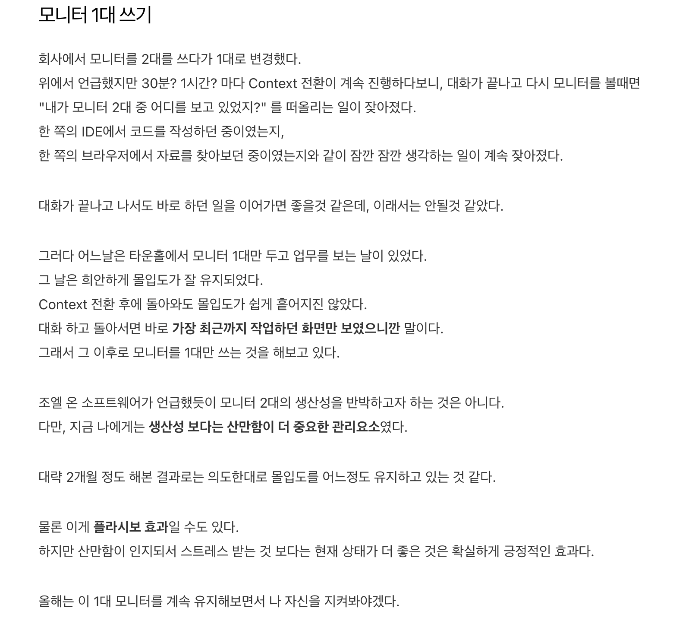

# 바이브 코딩과 ADHD, 몰입

[꽤 오래전부터 모니터 1대만 사용](https://jojoldu.tistory.com/696)해서 업무를 진행했다.

높은 몰입감을 유지하는데 있어서 모니터가 2대일때와 1대일때의 몰입감이 완전히 달랐기 때문이다.  
근데 요즘 다시 모니터 2대를 사용하고 있다.  
산만하기는 싫지만,  
AI Agent들과 함께 병렬 작업을 하는데 있어서는 결국은 듀얼 모니터가 가진 생산성이 너무나 뛰어났기 때문이다.  
동시 수행하는 AI Agent 들의 개수가 계속해서 늘어남에 따라 모니터 1대가 가진 한계가 뚜렷했다.  
  
하나의 모니터에는 분산되 여러 에이전트들의 실행화면들이 있고,  
다른 하나의 모니터로는 문서 작성, 발표 자료 준비, 슬랙 답변 등 내 개인업무를 처리하고 있다.

---

코딩 에이전트들 여러개 돌리다보면 성인 ADHD를 가속화 시키는 느낌이다.  
Zone에 들어가듯이 IDE 에서 몰입상태로 일하는 것이 너무 좋았는데,  
지금은 에이전트들 여러개 실행해놓고 끝나는 대로 하나씩 결과 확인하고 수정해서 다시 요청하고,  
기다리는 동안 시간이 비니깐 기존 에이전트들 외 추가로 더 에이전트들을 실행해서 일감을 주고 돌리는 이 과정이... 프로젝트에는 도움이 되어도, 나한테 좋은건가?? 싶은 생각이 계속 든다.  
  
내가 주도하면서 에이전트 1개의 도움을 받으며 만드는 과정은 페어프로그래밍하는 것 처럼 몰입감 유지가 가능한데,  
여러 에이전트를 동시에 돌리면서 진행하는 과정은 당장의 결과물을 내는데 도움은 되는데, 없던 ADHD도 발병시킬 것 같다.  
  
아닌가? 이제 그냥 ADHD 인이 되는게 당연한 시대가 되버린건가?  
  
독서, 일기 등 의도적으로 싱글 스레드로 하나에만 몰입하는 시간을 가지지 않으면 안될 것 같다는 생각이 들었다.