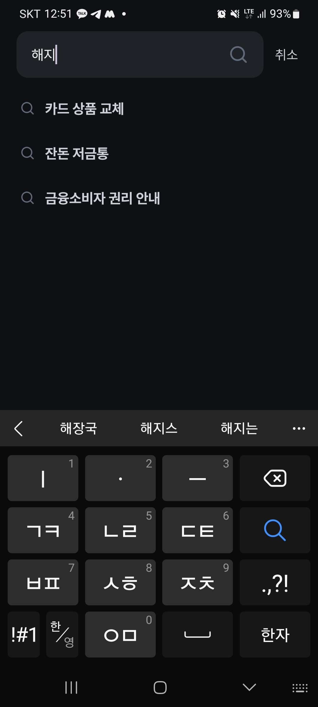
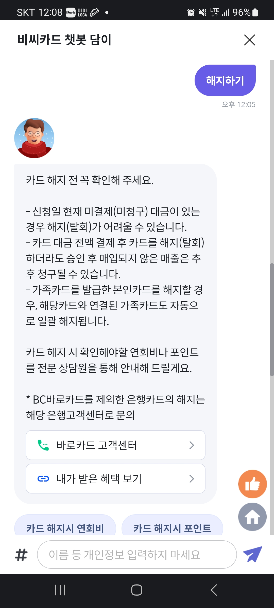
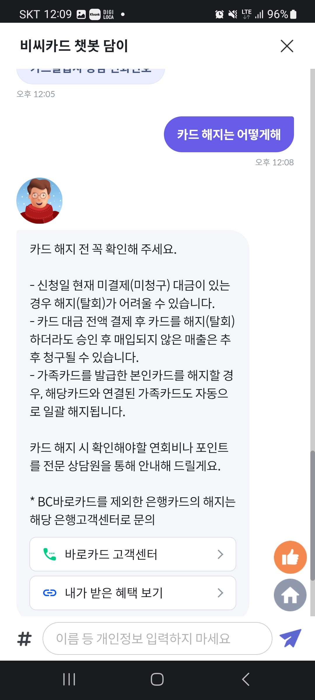
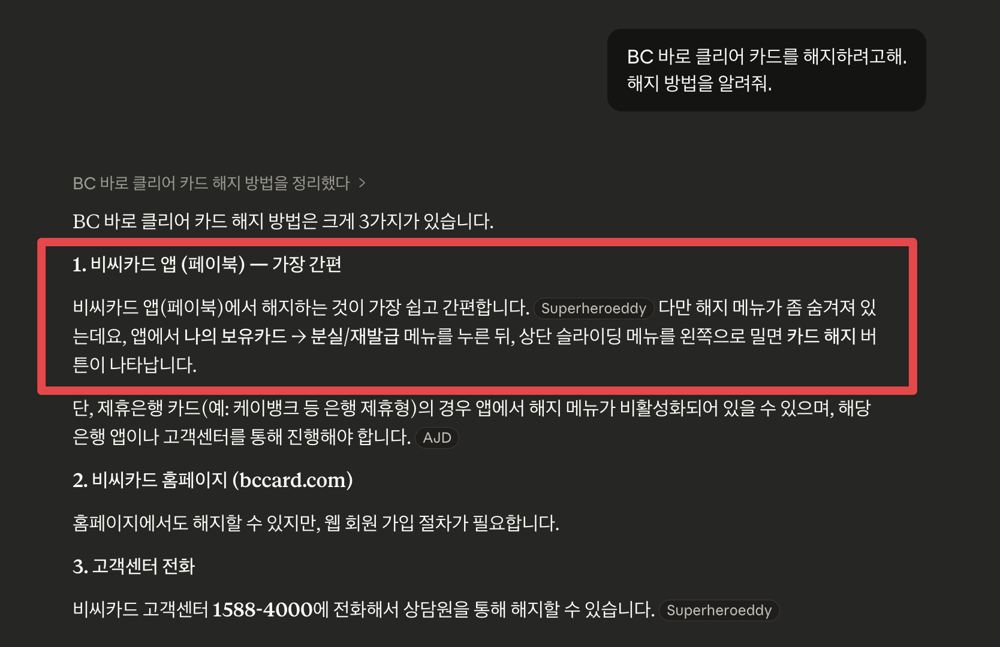
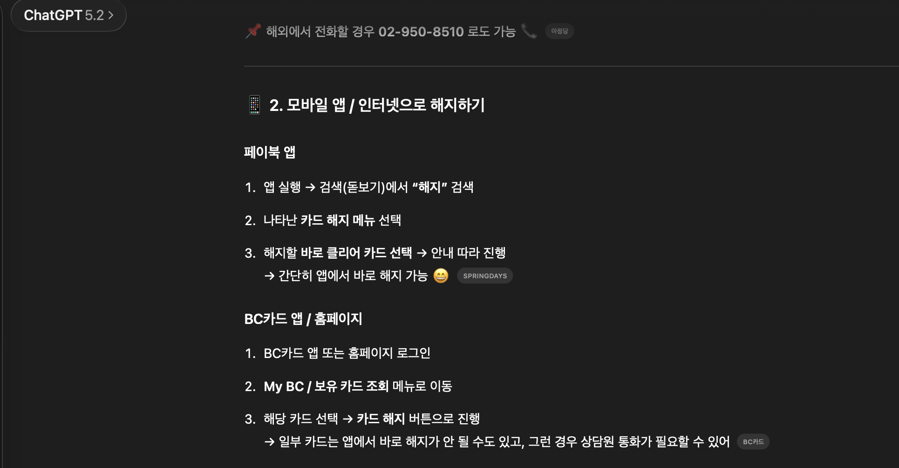
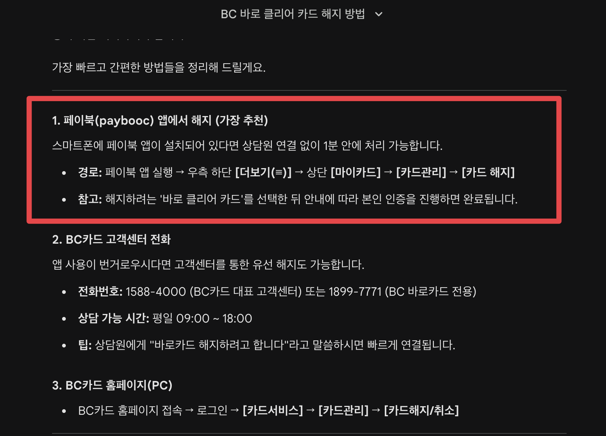
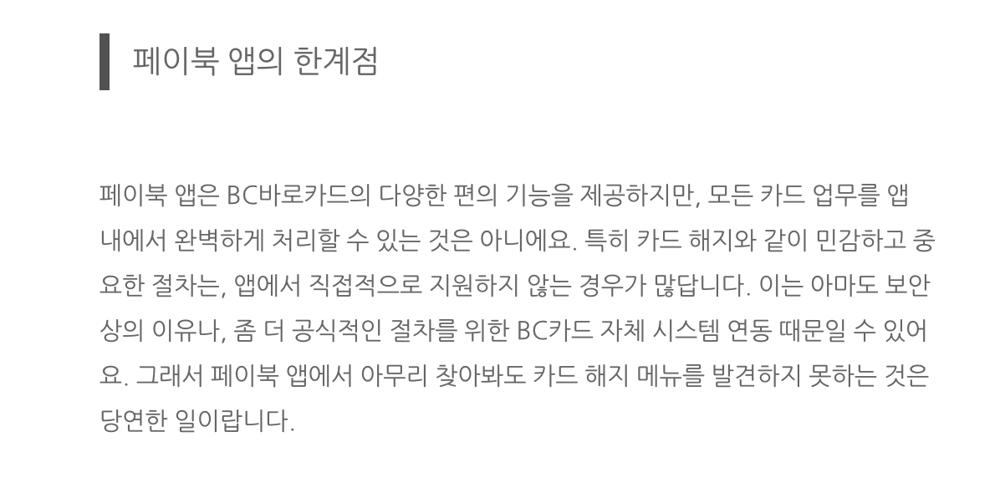

# 어떤 글을 소비하고 작성할 것인가

최근에 BC 신용카드를 해지하려고 했다.  
BC 카드는 페이북이 공식앱이라 여기서 해지를 하려고 했다.  
근데 아무리 찾아봐도 해지가 없었다.  

주말이라 고객센터 연락이 안 될 것 같아 앱 내에서 지원하는 AI 챗봇에게 물어봤다.

구체적인 해지 방법을 안내해주지 못하고 카드 해지 주의 사항에 대해서만 계속 안내했다.

답답한 마음에 습관처럼 여러 AI 도구들에게 해지 방법을 물어봤다.

Claude에게도

GPT에게도

Gemini에게도

> 참고로 3개 AI 서비스 모두 가장 높은 Mode로 질문했다.

모두가 계속 바로카드/페이북 앱 내에 해지가 있다고 안내했다.  

BC 카드는 예전에 BC카드 앱이 별도로 있다가 페이북 앱으로 전환이 되었다.
그리고 과거의 페이북 앱에는 직접 해지가 있었지만, 최근의 페이북 앱에는 해지 기능이 없어졌다. 

  
그래서 대부분의 블로그 글이 과거의 BC카드 앱으로의 해지 방법이나 과거의 페이북 앱 기준으로 작성된 글이 많았다.  
  
가장 최신의 방법을 찾으면 되니, 최신 기준으로 네이버 검색을 다시금 했다.  
  
근데 **가장 최신의 글들도 대부분이 AI가 작성한 블로그 글들이였고, 그 AI는 예전에 작성한 글을 참고해서 여전히 과거의 해지 방법을 소개**하고 있었다.  
  
최신순으로 검색해도 내가 원하는 정보를 못찾는 상황이 된 것이다.  
  
결국 Claude 에게 내가 원하는 조건의 해지 방법을 갖고 있는 네이버 블로그 글을 탐색하도록 시키고, 혹시 몰라 나도 하나씩 읽어보면서 찾아봤다.  
  
결국엔 [디지털 ARS로는 해지가 가능하다](https://blog.naver.com/yuretomo9/224108014416) 는 것을 알게되서 디지털 ARS로 해지를 신청했다.  
  
신용 카드 하나 해지하는데 2시간을 보냈다.

---

예전에도 내가 원하는 정보를 찾는 것은 대단히 어려웠다.  
근데 이젠 최신 작성된 글 조차도 과거의 글을 무단 복제와 대량 생산되는 경우가 많다.

실제로 그 일을 하지 않고도 그 일을 한 것처럼 과정을 공유하는 것이 너무나 쉬워져서 정말로 내가 필요한 정보를 찾는데 들어가는 시간이 훨씬 더 길어졌다.  
  
과거의 정보 기반으로 만들어진 것들이 너무 많기 때문에 기존의 서비스가 변경되었을 때 그걸 실제로 해보고 누군가 블로그로 남겨주지 않으면 오히려 엉뚱한데서 시간을 다 소비하게 될 확률이 높아졌다.  

실제로 그걸 수행해본 사람이 작성한 글이 더 중요해졌다.  

결국은 작성자가 신뢰할만한 사람이냐가 더 중요해진 것 같다.

"저 사람은 항상 자신이 직접 하는 사람이야, 실제로 본인이 해본 것을 위주로 남겨주는 사람이야."

경험담 위주의 글이 점점 소중해지는 시기이다.

앞으로 내가 쓸 글도 이런 경험 기반이어야만 사람들은 볼 것이다.

나라는 온라인 크리에이터의 평판이 훨씬 더 중요해진 시기가 되었다.

작성자 보다는 콘텐츠가 중요하다고 하는 시기도 있었지만,
이제는 작성자가 훨씬 더 중요하다.

그럴듯하게, 진짜인것처럼 포장해서 쓰기는 훨씬 더 쉬워진 시대가 되었으니 말이다.