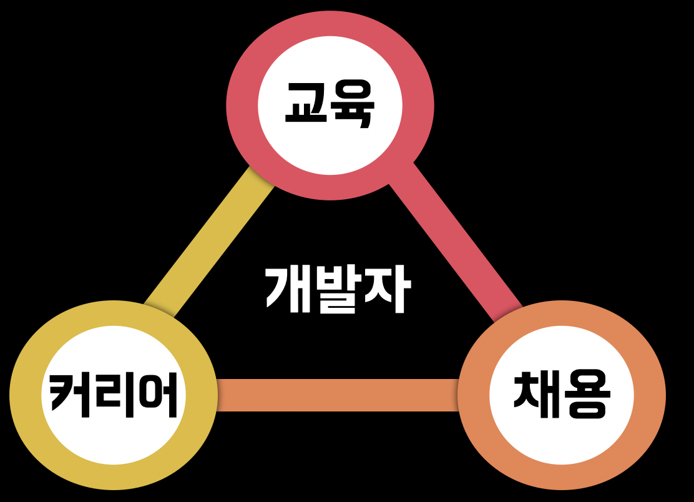
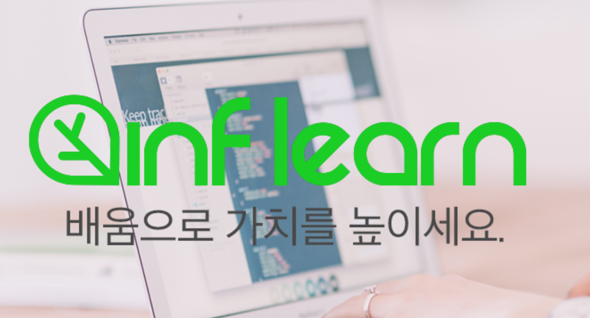
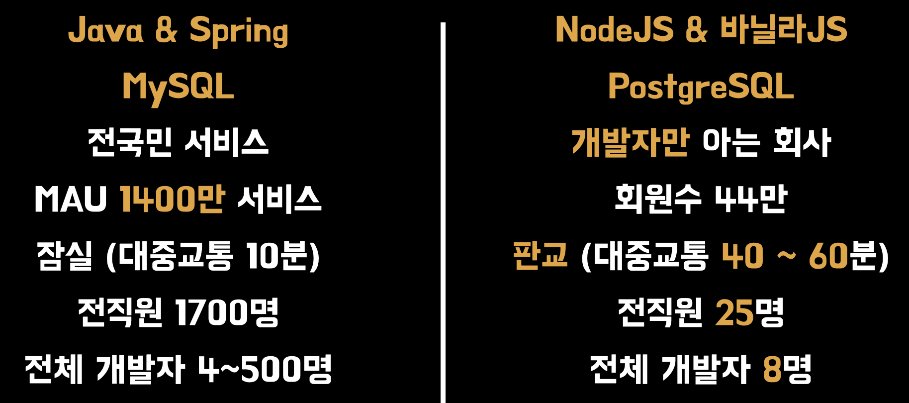
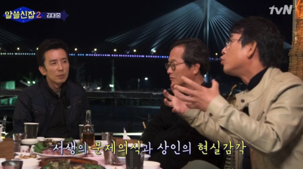
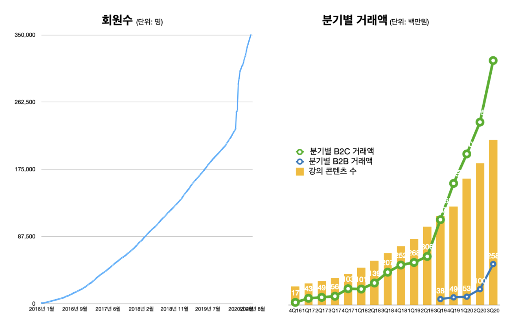
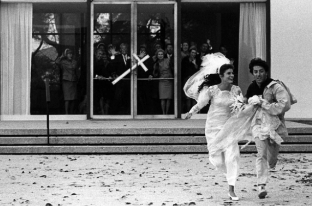

# 2. 우아한형제들 부검 - 어디로 가는지

> [이전 글](https://jojoldu.tistory.com/562)에서 이어집니다.  
> 이 글은 **사내 블로그에는 기재되지 않았습니다**.

## 4. 앞으로의 계획

여기까지 읽으신 분들이라면 "그래서 도대체 어딜가는데?" 라고 궁금해하실텐데요.  
  
일단 서두에서 말씀드린 것처럼 2가지 조건의 교집합인 회사인데요.

* Seed 단계의 작은 스타트업
* 제가 좋아하는 비지니스모델

여기서 제가 좋아하는 비지니스 모델에 대해서 조금 설명이 필요합니다.  
  
저는 2016년부터 개발자의 커리어/교육/채용에 대해서 굉장히 관심이 많았는데요.
  
그래서 사이드 프로젝트로 이와 관련된 여러가지들을 진행해왔습니다.

* [주니어 개발자 채용 정보](https://github.com/jojoldu/junior-recruit-scheduler)
* [초보 개발자 모임](https://www.facebook.com/devbeginner)
* [개인블로그의 생각정리](https://jojoldu.tistory.com/category/%EC%83%9D%EA%B0%81%EC%A0%95%EB%A6%AC)

이외에도 다양한 사이드 프로젝트를 실패했고, 일부는 반응이 너무 낮아서 포기하기도 했습니다.  
  
그럼에도 이 비지니스 모델에 대해서는 항상 갈망하던게 있었습니다.  
그래서 이번에는 이 3가지가 중심인 회사를 원했습니다.

이 3가지를 하는 하는 회사 중에서 저는 [인프런](https://www.inflearn.com/)을 선택했습니다.

인프런을 모르시는 분들은 인프런이 어느 정도 크기의 회사인지 궁금해하실텐데요.  
현재의 기준으로 우아한형제들과 비교하면 다음과 같습니다.

(좌측이 우아한형제들 / 우측이 인프런)  
  
기술 스택이 Java/Spring에서 NodeJS 기반으로 변경되다보니 가장 많이 받는 질문이 있습니다.

### Q. 가서 자바로 전환하시는거죠?

아뇨.  
아마 몇 년간은 자바로 전환할 일은 없을 겁니다.  
  
현재의 인프런 사이즈에서는 굳이 Java/Spring이 필요한 단계가 아닙니다.  
그렇다면 **제가 익숙하지 않다고, 서비스 전체를 개편**하는 바보같은 선택을 할 이유가 전혀 없음을 의미합니다.  
Java/Spring으로 전환해야하는 이유에 대해서 **합당한 이유**와 **사내 전체 구성원들의 동의**가 있으면 그땐 진행할 수 있을것 같습니다.  
  
굳이 개발팀의 동의뿐만 아니라 전 구성원의 동의가 필요한 이유는 시스템 개편을 하는 동안 그 외 **나머지 부분에 대해서 소홀할 수 밖에 없음**을 의미하는데요.  
지금 당장 feature를 추가하는것, 개선하는 것들을 포기함으로서 **타직군분들의 불편함을 감수**해야하는 것에 대한 동의가 있어야 한다고 보기 때문입니다.  
  
그래서 개발팀 외 다른 부서간의 동의도 있다면 그때 아마 Java/Spring 전환을 시도할 것 같습니다.  
  
제가 그동안 익숙하고 가장 자신있는 Java/Spring 전환에 크게 의미 부여를 하지 않는 이유 중, **개인적인 이유**가 하나더 있는데요.  
  
흔히들 언어와 프레임워크는 도구일뿐 거기에 종속되면 안된다고들 합니다.  
헌데, 저는 **경력 내내 Java/Spring만 다뤄왔습니다**.  
  
그래서 이왕 도전 하는 김에 제가 익숙한 환경에서 벗어나 **위기감을 조성**해보자는 생각이 있습니다.  
여태 쌓은 자바 개발자로서의 커리어가 아깝지 않다면 거짓말이겠죠.  
  
근데 미래에 정말 좋은 개발자가 되기 위해서는 한번은 **컴포트존을 벗어날 필요**가 있었습니다.  
저한테 있어서 **Java / Spring / JPA / MySQL은 컴포트존**이라서요.  
불편한 환경으로 가서 거기서 다시 오픈소스에 기여할만큼의 성장을 한다면 개발자로서 지금까지와는 다른 **새로운 성장**을 해볼 수 있을것 같았습니다.

### Q. 연봉 협상은 잘 되셨나요?

> 이 질문은 일단, 인프런 대표님과 사전에 어디까지 공개할지 다 합의가 된 상태임을 먼저 말씀드립니다.

앞에서도 서술했지만 저는 현 회사에서 좋은 대우를 받고 있습니다.  
네카라쿠배 라는 흔히 말하는 1 Tier 기업에서 좋은 대우를 받는 개발자라 하면 연봉이 꽤나 높습니다.  
이 금액은 인프런 정도의 작은 회사에서 **감당하기에는 아주 큰 괴리감**이 있습니다.  
  
특히나 연봉을 제외하더라도 다양한 현금성 복지도 무시못하는 요소인데요.  
(막간을 이용한 [우아한형제들](https://www.woowahan.com/#/recruit/tech) 자랑)

* 주 35시간
  * 주 40시간으로 환산시 대략 14% 연봉 상승
* 비포괄
  * 바쁜 시기에는 야근비가 월 100만원 이상
* (양가)부모님 실비보험 (연 수백만원)
* 복지포인트 (연 200만원)
* 무제한 도서지원비
* 전세대출이자 지원
* 재택지원비 (월10만원)
* 모든 외부 교육비의 80% 지원
* 사이닝 or 리텐션 보너스

이 글을 보시는 분들이 생각하시는 것보다 훨씬 더 **현금**에서 큰 차이가 있습니다.  
  
그래서 이 부분을 처음 인프런의 대표님과 이야기를 했을때 대표님은 "제가 동욱님 입장이면 여기로 안올것 같다" 고 하셨던게 기억이 납니다.(되게 솔직하시구나 싶었습니다.)  
  
얼마나 큰 차이가 난다면 이직을 제안한 회사의 대표님이 이런 이야기를 할까 정도로 봐주시면 좋을것 같습니다.  
  
그래서 이런 부분에 대해서는 **그 차이만큼의  랜덤박스**를 받기로 했습니다.  

이 랜덤박스 안에 집행검이 들어있을지, 단검이 들어있을지는 **앞으로 하기 나름**입니다.  
당연하게도 저는 **미래의 집행검**이 나올것에 좀 더 무게를 주었습니다.  
  
당연히 이 랜덤박스가 깡통일수도 있겠지만 회사의 비전에 동의하고, 실제로 그렇게 될 것 같다는 믿음이 있다면 충분히 미래 투자 가치가 있다고 판단했습니다.

### Q. 인프런이 좀 더 성장한 뒤에 만나면 되지 않나요?

만약 시간이 흘러 인프런이 시리즈 B,C가 되었을때 합류한다면 시리즈 C~E는 인프런에서하고 Seed에서 시리즈 B를 경험하기 위해 또 떠나야 합니다.  
  
헌데, 어차피 Seed 라운드는 **인력/복지/보상/프로세스 모든 것이 부족한 단계**인데요.  
여기서 **서비스 마저 내가 좋아하는 것이 아니라면** 그 단계를 버틸수 있는 기댈 곳이 없습니다.  
  
현재의 인프런은 제가 원하는 시점 / 원하는 규모 / 좋아하는 도메인 이 3개가 모두 일치한 상태라서 어차피 Seed 혹은 시리즈 A 경험이 필요하다면 지금의 인프런이 딱 맞는 상황이라고 봤습니다.

### Q. 다른 코딩 기관도 많은데 왜 인프런인가요?

저는 제가 업으로 삼고 있는 개발자라는 직업도 그렇고, 제가 일하는 회사도 그렇고 유시민 작가님이 해주시는 **서생의 문제 의식과 상인의 현실 감각** 을 항상 겸비해야 한다고 생각하는데요.

서생의 문제 의식은 스타트업의 **비전**이 될 것이고, 상인의 현실 감각은 **재무제표**라고 줄곧 생각해왔습니다.  
  
그런 점에 있어서, 인프런은 **비전도 공감되면서 재무제표도 탄탄**하다고 판단했습니다.  
별도의 투자를 받지 않더라도, 매년 **영업이익만으로 회사를 확장시킬 수 있는** 재무제표를 가지고 있었습니다.  

([인프랩 2020년 4분기 시작](https://www.hyungjoo.me/%ec%9d%b8%ed%94%84%eb%9e%a9-2020%eb%85%84-4%eb%b6%84%ea%b8%b0-%ec%8b%9c%ec%9e%91/))
  
개인적으로는 투자금을 태워서 압도적인 성장을 하는 회사들(유니콘)도 멋지다고 생각하지만, 척박하지만 현실성 있는 성장과 재무제표를 유지하는 기업 (낙타)들을 원했습니다.  

> TTime의 [유니콘은 잊으시라. 이제는 낙타다](http://www.ttimes.co.kr/view.html?no=2020051218417788614&daum) 글을 한번 읽어보시면 좋습니다.

> ps. 개발자에서도 좋은 아키텍처/좋은 개발문화등 이상적인 이야기만 하면서 정작 제품 개발에 소홀하거나 **현실의 문제에 집중하지 못하는** 분들도 제가 선호하는 유형은 아닙니다.

이외에도 인프런은 **다양한 데이터를 활용**하기에 좋은 구조입니다.  
대부분의 회원들이 IT 현업 종사자 이거나 IT 현업을 준비하는 학생들이라 엣지있게 데이터를 관리하고 활용할 수 있다고 판단했습니다.  
  
여러면에서 인프런은 제가 생각해왔던 모델을 이미 하고 있고 같은 비전을 가진 사람들이 모여있는 집단이라 (제 기준으로는) **현재의 보상을 포기하고 갈만큼의 매력**을 가지고 있었습니다.

### Q. 지금 기분이 어떠신가요?

누군가는 이제 좋아하는 일을 할 생각에 신나지 않냐고 기대에 찬 질문을 하시기도 했는데요.  
  
사실 저는 결정을 내렸을때, 마녀사냥의 허지웅님이 언급하신 영화 [졸업](https://ko.wikipedia.org/wiki/%EC%A1%B8%EC%97%85_(1967%EB%85%84_%EC%98%81%ED%99%94))이 떠올랐습니다.  
  
더스틴 호프먼과 캐서린 로스의 청춘 영화 졸업 엔딩을 보면 **모두가 반대하는 상황속에서** 주인공 둘은 결혼식에서 도망치고 본인들이 원하는 삶 (여기서는 버스)으로 가는데요.  
  

이렇게 뛰어가서 탄 **버스안에서의 짧은 시간**이 이 영화의 실제 엔딩이라는 해석이 저는 참 와닿았습니다.

퇴사전까지는 기대감을 안고 있겠지만, 막상 현실은 또 어떤 어려움이 있을지 점점 걱정이 되기도 합니다.  
  
그렇지만 성공하든 실패하든 모든 과정들이 저에게 있어서는 이야기거리라서 손해보진 않을것 같다는 생각을 합니다.  
  
그래서 4/19일에 퇴사 후, 익일인 4/20일에 바로 새 회사로 출근을 합니다.  

> 어서 가서 시스템을 뜯어 보고 싶네요!

## 5. 마무리

시간이 흘러 결국엔 제 도전이 잘 안되서 다시 롤백할 수도 있습니다.  
(물론 회사에 무릎 꿇고 싹싹 빌어야겠죠?)  
  
롤백을 하면 가장 먼저 쓸 기술 블로그의 짤 역시 벌써 준비해 두었습니다.

([하용호님의 Slideshare](https://www.slideshare.net/yongho))  
  
제가 이런 선택을 했다고 해서, 주변에 이를 종용하진 않습니다.  
그렇지만 (부모님 보시면 혈압으로 쓰러지시겠지만) **효자중에 성공한 사람은 없다**고 항상 생각합니다.  
  
올 설 연휴때 이 이야기를 했을때 가족들의 반대가 좀 있었는데요.  
어른들(?)이 반대하는데는 그만큼의 이유가 있겠죠?  
그렇지만 너무 하고 싶을때는 어쩔 수 없는것 같습니다.

([소라의 날개](http://www.yes24.com/Product/Goods/1415779))

지난 4년간 많이 배울 수 있었습니다.  
많은 기회와 권한을 주셔서 정말 감사했습니다.  
  
아직 배민에는 좋은 개발자분들이 많으신데요.  
그 분들 못지 않게 더 성장하겠습니다.
