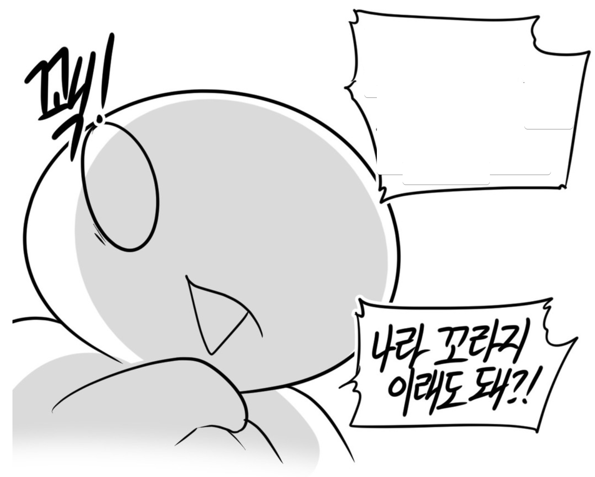

# 짬이 찰수록 더 못해지냐

마음속 장독대에 담고 있는 트라우마가 여러 있는데, 최근들어서 스물스물 기어나오는 트라우마가 하나 있다.  
  
군대에 있을때 이야기인데.... (라뗴는 말이야)  
  
태생이 빠릿빠릿한 사람이 아니라서 자대배치 받고 엄청 혼이 많이났었다.  
그래서 덜 혼나기 위해서 성실하게 행동했다.  
  
수첩과 펜을 항상 지참하고 다니면서 할일들이나 선임이 이야기했던 것들을 매번 기록해서 일을 처리하곤 했다.  
  
그러다보니 고참들한테 칭찬을 많이 받았다.  
  
그러다 사간이 한 1년쯤 지났을때?  
크게 혼난적이 있다.  
  
(그전부터 작게 작게 혼나고 있었다.)  
  
후임중 한명이 해야할 일을 깜빡하고 안했던 것이다.  
당연히 일병들 전체를 관리하던 나까지 불려서 소대 내무실에서 머리박고 혼났었다.  
  
혼내던 선임이 했던 마지막 멘트가 이 글의 핵심이다.  
  
"**넌 어떻게 짬이 찰수록 일을 더 못하냐**"  
  

이병, 일병일때 칭찬 받았던 방식이 상병이 되고부터는 전혀 

요즘 들어 계속 그때 그 말이 계속 떠오른다.  
  
이젠 회사에서 그런 말을 듣게될까봐 겁난다.  
  
"넌 어떻게 짬이 찰수록 일을 더 못하냐"  

> ps 1. 나 떄리던 그 고참들 교대생/사범대생이더라...

> ps 2. 여기서 혹시나 군대 어디나오셨냐, 어디서 근무했냐 이런거 질문하는 분들은 없으시길..