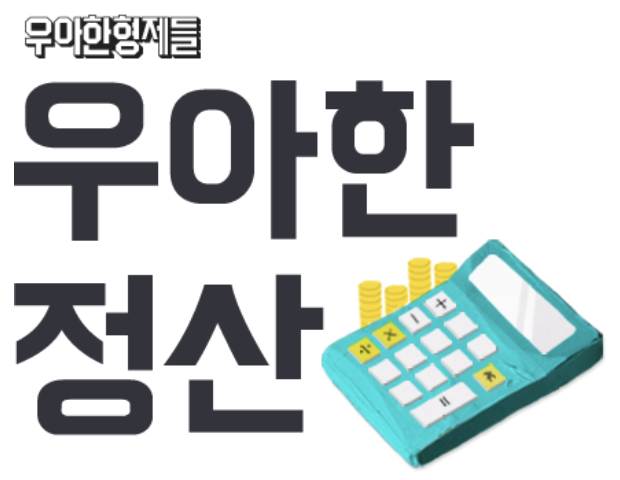
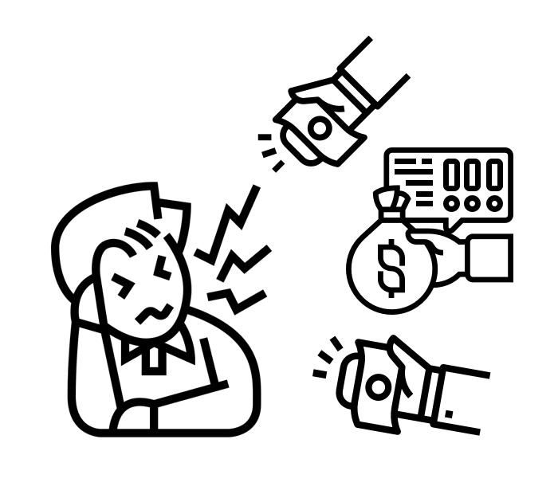

# 정산시스템팀을 소개합니다.

1. 들어가기 전에
2. 정산이 어렵다고요?
3. 정산시스템팀은 이렇게 돌아가고 있어요
    1. 팀은 이렇게 구성되어 있어요
    2. 정산시스템팀에서 하는 업무는?
    3. 우리는 이렇게 일해요
    4. 팀 문화는 이렇답니다
4. 마무리

**1. 들어가기 전에**

안녕하세요. 우아한형제들 정산시스템팀에서 기획 업무를 하고 있는 김석환이라고 합니다.

처음 우아한형제들에 대해서 알게 되었을 때, "우와 저런 회사에서 일하면 정말 일할 맛 나겠는걸?" 하고 생각했던 게 엊그제 같은데, 우아한형제들에 합류하여 생활한지 벌써 2년 반이 넘었네요. 시간 참...ㅎㅎ

전혀 다른 문화를 가진 회사에서 근무하다가 오게 되어 기대 반 걱정 반으로 합류했지만, 현재 매우 즐겁게(진심!!) 생활하고 있습니다. 그래서 그 동안 우아한형제들에서 경험한 정산시스템팀은 어떤 업무를 하고 어떻게 생활하는지 소개해 보고자 합니다. 
(팀 홍보용 글 맞으니 널리 널리 퍼트려주셔도 됩니다~! 😁)

**2. 정산이 어렵다고요?**

우선 '정산'이라는 단어만 들어도 어려워하시는 분들이 정말 많은 것 같습니다. 근데 그렇게 어렵지 않아요. 그 이유는 저도 하고 있기 때문이죠~(하하하~ 죄송합니다!!😅)

사실 대부분의 사람들이 일상에서 정산을 밀접(가계부 정리, 카드 내역 확인, 연말 정산, 대출이자 납입등등)하게 접하고 있지만, 그리 가깝게 느끼지는 않는 것 같습니다. 실제 한 달의 생활비를 정리하다 보면 어딘가 펑크가 나고 "이만큼 돈이 비는것 같은데 어디에 썼을까?" 매일 정리하지 않고 가끔 정리하면 놓치는 부분들이 있기에 "으윽... 골치 아프구먼ㅠ" 이러고 넘어가기 마련이죠. 

기업에서는 이렇게 놓치는 금액들이 생기면 문제가 발생하죠. 그래서 매일 금액 변동에 대해서 관리하게 됩니다. 정산시스템팀은 이 중에서도 배달의민족을 통해 발생되는 주문으로 인한 자금 흐름에 대해서 관리하고 있습니다. 이렇게 매일 관리한다면 골치 아픈 일도 거의 발생하지 않을 겁니다 ㅎㅎ

그럼 이제 정산시스템팀은 어떤 역할을 수행하는지 소개해 볼 테니, "아하~ 이게 바로 배달의민족에서 일어나는 정산이군~" 하시면서 좀 더 친밀해지는 계기가 되길 바라겠습니다.

**3. 정산시스템팀은 이렇게 돌아가고 있어요**

**3.1. 팀은 이렇게 구성되어 있어요**

정산시스템팀은 목적 중심(애자일)의 조직으로 운영/기획/개발이 모두 한 팀으로 구성되어 있습니다.

동일한 목적을 가진 구성원이 한 팀에 모여 매우 기민하게 움직이고 있습니다. 입사 당시에는 기획과 개발이 다른 조직으로 나뉘어 있었습니다. 그때도 매우 협업이 잘 되어 좋은 퍼포먼스를 보여주었지만, 정산이라는 목적성을 갖고 하나의 팀으로 구성된 이후에는 더 높은 퍼포먼스를 보여주고 있습니다.

- 기획파트: 5명
- 개발파트: 5명

각 파트 별 동일한 인원으로 구성되어 있으며, 기획 1명/개발 1명 이렇게 업무를 맡아 주도적으로 진행할 기회도 많이 주어진다는 장점이 있습니다.

프로젝트 초기부터 기획/개발이 서로 많은 논의를 하기에 확정된 기획안 변동이 최소한으로 발생하도록 하고 있습니다. 팀원 모두 업무를 진행함에 있어서 매우 활발하게 논의를 수시로 진행하기에 가능한 부분이라고 생각합니다.

정산시스템팀의 최고 강점이 이러한 팀 내 커뮤니케이션이라고 생각되네요. 헤헤~ 자화자찬입니다. 😎

~~백엔드 레퍼런스를 제대로 쌓고 싶다면 어디~~?? 정산시스템팀!!!!!! (함성~~ 꺄아아아아~~)  죄송합니다.~~

**3.2. 정산시스템팀에서 하는 업무는?**

출처: 영화 돈(2018) 포스터

정산시스템팀은 배달의민족을 통해 가게를 운영하시는 사장님에게 발생한 매출액 즉, 돈(=정산 서비스 💵)을 전달하는 역할을 하고 있습니다. 

정산시스템의 가장 중요한 역할은 두 가지로 얘기할 수 있을 것 같습니다.

- ☝️ 첫 번째, 매일 발생되는 주문 데이터를 저장하고 이를 기반으로 정산금액을 계산하는 일이에요..
    - 정산금액은 어떻게 산출되는지 아래 유튜브 영상에서 자세하게 소개하고 있으니 한번 보신다면 이해가 쏙쏙 되실 겁니다.😉
        - [배민광고는 어떻게 정산될까요?](https://www.youtube.com/watch?v=tQwg7CsSe44&list=PLRNt8LoHCABpnHG3lZHjdolth8WqWPqIj&index=6)

- ✌️ 두 번째, 지정된 일자에 각 사장님들에게 정산금액을 지급하는 일이에요..
    - 배달의민족은 2019년 4월에 [업계 최초로 일정산을 도입](http://daily.hankooki.com/lpage/industry/201904/dh20190402113335148020.htm)하여 휴일을 제외한 모든 영업일마다 정산금액 지급 요청을 은행에 직접 하고 있으며 이슈 발생 시 대응 업무까지 수행하고 있습니다.
    - 설, 추석같이 연휴가 너무 긴 경우에는 사장님의 가게 운영을 위해 [일정을 앞당겨 정산금액을 지급](http://biz.newdaily.co.kr/site/data/html/2020/09/28/2020092800201.html)하기도 한답니다.

"아하~ 정산시스템은 주문금액에서 수수료 등을 제외하고 사장님한테 지급하는 거구나!!"

네 맞습니다!! 이게 바로 정산시스템의 가장 중요한 역할입니다. 

매우 간단한 작업으로 보일 수도 있지만, 돈!돈!돈!💸 을 다루는 팀이다 보니 한 치의 오차도 발생하지 않아야 한다는 막중한 책임을 갖고 있습니다.

하루에 많게는 수백만 건이 발생되는 대량 주문 데이터 처리와 1원의 오차도 발생하지 않는 비지니스 로직을 적용하기 위해 항상 많은 고민을 하고 끊임없이 개선을 해나가고 있습니다.

그 외에도 많은 역할을 수행하고 있는데요. 이렇게 매일 생성된 정산내역과 지급여부 등의 정산 정보를 배민사장님광장을 통해 사장님들에게 제공하고 있어요

사장님들의 부가세 신고에 도움을 드리고자 배달의민족 앱에서 발생한 매출(사장님들의 매출), 매입(사장님들이 우아한형제들에 지불한 금액) 자료를 만들어 제공하고 있습니다.

출처: 배민사장님광장 - 셀프서비스

이 외에도 매출 관리, 채권 관리, 회계 데이터 생성 등 여러 가지 역할 또한 수행하고 있습니다.
근데 여기서 더 깊게 들어가면 길어지니 딱 여기까지... 더 자세한 얘기는 저희 팀에 합류하신다면 알려드리는 걸로... 흐흐흐~ 🤓

**3.3. 우리는 이렇게 일해요**

**스프린트 회의**

높은 퍼포먼스를 보여줄 수 있는 시작점이 바로 스프린트 회의입니다. 2주에 한 번씩 팀 전체가 모여서 앞으로 진행해야 할 과제들을 리스트 업하고 우선순위를 결정합니다. 그리고 해당 시간에 가능하다면 바로 담당자 지정까지 진행되죠~

담당자 지정이 안된 경우에는 하루 이틀 내에 파트별 논의를 하여 지정하고 바로 공유를 합니다. 스프린트 회의를 하고 나면 모두 각자 본인이 2주 동안 해야 할 업무와 목표를 명확히 가져가게 됩니다.

스프린트를 하면 단기간의 과제 뿐만 아니라 장기 과제에 대해서도 다시 한번 다같이 인지하면서 장기적인 PLAN까지 인식하게 됩니다. 2주면 짧은 호흡일수도 있지만, 이렇게 2주 단위로 업무로 집중할 수 있는 분위기를 형성할 수 있기에 상당히 속도감있게 업무가 진행됩니다.

**정산시스템팀에서 기획파트는 어떤 업무를 수행할까요?**

정산시스템팀 기획파트는 운영과 기획 업무를 수행하고 있습니다. 운영과 기획업무에 대해서 상세하게 설명하도록 하겠습니다.

**정산 운영**

정산시스템팀의 가장 큰 역할은 사장님들에게 정산금액을 지급하는 것입니다. 

하루 수백만 건의 주문이 각 사장님들에게 모두 정상적으로 지급받을 수 있도록 정산금액을 검증하고 지급이 완료되는 시점까지 관리하고 있습니다. 팀에 근간이 되는 가장 중요한 업무로 매일 반복적으로 수행하지만 그 무엇보다 중요한 업무입니다. 그 외에도 회계 처리 등 다양한 이슈와 문의 대응도 담당하고 있습니다.

**정산 운영 업무**

- 정산시스템 모니터링
- 정산금액 검수
- 정산지급 관리
- 채권 관리
- 운영 문의 및 데이터 요청 대응
- 이슈 발생 시 대응
- 회계감사 대응
- ....

**정산 기획**

정산시스템은 정산 플랫폼 기획을 하고 있습니다. 정산 플랫폼은 백엔드 시스템으로 사장님들에게 정산 서비스를 제공하고 있습니다. 하루에 수백만 건의 주문이 발생하기 때문에 안정적으로 데이터를 관리하는 방안까지 개발파트와 매우 심도 있게 논의하며 비지니스 적용 방안을 고민하고 있습니다.

점점 더 다양한 서비스들이 출시되고 있어 백엔드 기획이지만 프론트의 비지니스까지 상당 수준 이상의 이해도를 갖고 있어야 합니다. 뒤에서 묵묵히 받쳐주는 시스템 및 프로세스를 기획하지만 배달의민족 앱에서 발생되는 비지니스와 회계 처리까지의 모든 데이터의 흐름을 이해하고 적용하는 업무를 수행하고 있습니다.

**정산 기획자의 서비스 런칭 과정**

정산시스템은 고객에게 제공되는 서비스를 지원하는 시스템으로 기존 비지니스의 변경 또는 새로운 비지니스 적용 시에 검토 요청이 옵니다.

예를 들어 신규 서비스 런칭 시에 정산시스템은 서비스 특성에 맞춘 정산 서비스를 제공해야 합니다. 신규 서비스 런칭 시에 어떤 식으로 업무가 이루어지는지 설명드릴게요

- 신규 서비스 검토 요청
    - 신규 서비스 분석
        - 어떤 서비스인지
        - 주문 배송 방식은 어떻게 되는지
        - 수수료 기준은 어떻게 되는지
        - 현 정산서비스에 영향도는 어떻게 되는지
        - 등등 그 외 상세 기준 및 스펙
- 정산 기획 수행
    - 상위기획
        - 서비스 특성에 맞는 정산 프로세스 수립
            - 기존 정산 프로세스 적용 가능한가
            - 새로운 정산 프로세스 구현이 필요한가
                - 새로운 프로세스는 어떤 모델로 구현할지
    - 상세기획
        - 유관부서 및 개발 협의
        - 일정 수립
        - 운영 프로세스 수립
        - 기획서 작성
        - 기획안 리뷰
    - QA
    - 오픈

기본적으로 위와 같은 Flow로 업무를 수행하고 있습니다. 

그러나 각 업무 특성에 따라서 위와 다른 방식으로 진행되는 경우도 있기에 기획자는 어떤 상황에서도 유연하게 대처할 수 있는 능력이 필요합니다.

기획 업무 진행 중에는 활발한 팀 내 소통을 필수적으로 하고 있습니다. 운영, 기획, 개발 인력이 모두 한 조직에 있기에 업무 틈틈이 서로 신속한 공유와 피드백이 이루어지고 이로 하여금 소통 과정의 지연을 최소화, 즉각 반영이 용이하도록 하고 있습니다.

**정산 기획파트에서 요구하는 역량은?**

정산 운영/기획 업무를 수행하기 위해 기본적으로 갖춰야 할 사항은 세 가지로 얘기할 수 있을 것 같습니다.

- ☝️ 첫 번째, 정확함
    - 확인, 확인 또 확인
    - 돈(💰)을 다루는 만큼 정말 꼼꼼하게 확인하여 오차가 발생되지 않도록 해야 해요!
- ✌️ 두 번째, 전체 서비스에 대한 이해
    - 정산에 대한 지식은 기본
    - 정산은 비지니스 성격에 맞춰 제공이 되기에 서비스 전체에 대한 이해도가 매우 높아야만 업무 대응이 가능해요!
- ✌️ 세 번째, 커뮤니케이션 스킬
    - 정말 많은 부서와 협업이 이루어져요
    - 원만한 협업을 위한 커뮤니케이션 능력은 필수랍니다!

위의 사항은 사실 어떤 업무를 하더라도 필요한 역량이라고 생각합니다.

정산시스템팀에서 같이 업무를 하게 된다면 자연스럽게 다양한 능력이 팍! 팍! 향상되는 것을 느껴보실 수 있을 겁니다. 한 번 믿어보시겠어요? 😉

**정산시스템팀 개발파트에서는 어떤 업무를 수행할까요?**

개발 업무 수행에 대해서는 개발 리드를 하고 계신 [jojoldu 이동욱 님](https://jojoldu.tistory.com/)이 너무나도 잘 설명해 주신 글이 있으니 꼭 읽어보시기 바랍니다.

"우와!! 정산시스템팀에서는 개발 업무를 이렇게 하고 있구나" 하고 바로 이해할 실 수 있을 거에요.

- [정산시스템팀에서는 이렇게 개발하고 있어요](https://woowahan.oopy.io/60a06399-3f95-4fec-a436-000ad6baff40)

**3.4. 팀 문화는 이렇답니다.**

정산시스템팀은 마냥 바쁘게 업무만 하는 팀이 아니에요. 팀이라는 조직의 중요성을 매우 중요시 여기고 모두가 같은 목표를 향해 달려가기 위해 노력하고 있습니다.

이미 알려질 대로 알려진 동욱님을 제외하고는 초상권 보호를 위해...

주기적으로 워크샵을 통해 팀의 로드맵을 같이 그리며, 팀의 방향성을 위한 논의를 활발하게 진행하고 있습니다. 어느 한 사람이 끌어가는 것이 아닌 팀원 한 분, 한 분 모두의 의견을 수렴하여 모두가 공감하고 같은 목적을 갖는 것을 매우 중요하게 생각하고 있습니다.

팀에 이야기꾼들이 많아서 한 번 시작하면 쉽게 끝나지 않습니다. 회의실 예약시간이 다 되어 빈 회의실을 찾아다니며 계속 떠들던 기억이... 😅

그뿐만 아니라 팀워크 향상을 위해서도 많은 논의 자리를 만들어 서로 갖고 있는 생각들을 공유하며 맞춰나가기 위한 노력도 끊임없이 하고 있습니다.

**즐거운 정산이들**

즐겁게 일할 수 있는 분위기를 지향하고 있습니다. 그러다 보니 모여서 무엇인가 얘기하기 시작하면 웃음소리가 끊이지 않는답니다. 일할 때는 정말 집중하여 프로답게.. 그 외는 서로 가벼운 잡담을 나누다 보니 자연스럽게 서로를 이해하며 편안한 분위기 속에서 즐겁게 생활하고 있답니다.

리액션은 기본이죠!!

**4. 마무리**

간단하게 소개를 해보고자 했는데 어느새 긴 글이 되어 버렸네요. 사실 정말 하고 싶은 얘기는 더! 더! 더! 많이 있지만 줄이고 줄여서 이 정도로 마무리하게 되었습니다.

우아한형제들은 목적 중심의 팀들이 있다고 하는데 어떻게 일을 하는지도 알리고, 생소할 수 있는 정산 플랫폼을 운영하는 저희 팀에 대해서도 알리고 싶었습니다.

이 글을 읽고 저희와 한배를 타고 싶다고 생각하는 분이 단 한 명이라도 있다면 충분히 의미가 있다고 생각합니다.

배달 앱 시장은 점점 경쟁이 치열해지면서 모든 경쟁사들이 더 좋은 서비스를 제공하기 위한 노력을 아끼지 않고 있습니다. 그런 부분이 실제 고객에게 보이는 부분 뿐만 아니라 이렇게 보이지 않는 영역에서도 치열하게 이루어지고 있다는 것을 기억해 주셨으면 합니다.

감사합니다.