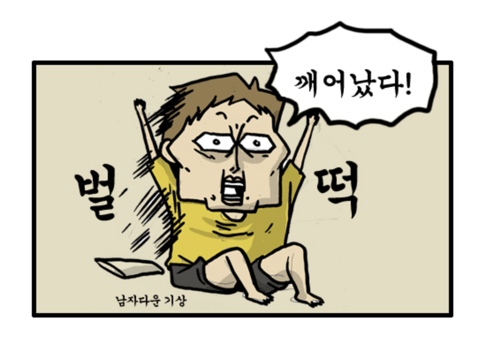

# 오늘의 질문 2018.12.17

## Q.1

Q. 수면시간은 어떻게 되시는지?

A. 하루에 6 ~ 7시간은 꼭 자려고 해요  
학교 다닐때는 바쁠때 하루 걸러 자기도 했는데, (하루 안자고 하루만 자기) **30대가 되니 체력이 떨어지는게** 느껴졌어요.  
  
물론 열심히 운동하고 체력 관리하신 분들은 30대에도 체력이 빵빵하시겠지만 저 같은 집돌이는 체력이 정말 떨어집니다ㅠㅠ  
  
그러다보니 잠을 줄이면 하루가 너무 힘들어서 적정 수면시간을 지키고 있어요.  
취침은 12시전에 하고, 기상은 7시 전에 해서 회사에 7시 30분 ~ 8시쯤 도착하는 생활을 유지하고 있어요.  
저녁에 하는 일을 줄이면 8시간 정도 잘수있지 않을까? 라고 계획만 하고 있는 상태입니다.

## Q.2

Q. 저녁이 아닌 아침에 개인코딩을 하시는 이유?

A. 아침에 하는 습관은 첫회사에서부터 이어졌는데요.  
당시엔 회식이 정말 많았고, 특정 프로젝트에 따라 보여주기식 야근을 해야 하는 경우도 있었어요.  

> 참고: [3번째 직장에 오기까지 - 3. 첫 직장, 첫번째 이직](https://jojoldu.tistory.com/279)

특히 보여주기식 야근의 경우 다들 남아 있었고, 거기서 혼자서 공부하고 블로그에 글 쓰기는 너무나 눈치가 보였어요.  
공부하고 있으면 "개발보다는 영업이 더 중요하다"는 이야기를 하시니 공부하기가 쉽지 않아 자연스레 아침에 일찍 오게 되었어요.  
  
첫 회사를 10개월만에 퇴사하고, 두번째 회사로 이직했는데요.  
두번째 회사는 회식은 많이 없었지만, 개발자 수가 절대적으로 부족해 **맡아야할 서비스가 많았습니다.**   
그러다보니 야근하는 일이 많아 어쩔수 없이 아침에 공부하는 습관을 계속 유지하게 되었습니다.  
  

  
주말에도 출근하는 일이 많았어서 **평일처럼 아침에 일찍와서 공부하고 10시부터 회사 일**하는 삶을 지냈습니다.  
한 1년간은 주말 하루는 꼭 출근했던것 같네요.  
그 이후엔 개발자분들이 계속 합류하셔서 좀 편하게 지냈던것 같아요.  
  
현재 3번째 회사를 다니고 있지만, 아침에 코딩하는 습관을 바꾸진 않고 있어요.  
저녁 시간은

* 야근을 할때도 있고
* 사람들과의 약속이 생기기도 하고
* 여자친구와 데이트도 있습니다

그러다보니 저녁 시간은 변수가 너무 많아서 아무도 없는 조용한 아침이 가장 좋다고 생각하게 되었어요.  
특히 회사와 집 간에 거리가 걸면 얼마나 시간이 아까운지 경험해봤던터라 

> 1시간~2시간 정도의 출근거리면 하루에 버리는 시간이 정말 많더라구요 ㅠ

회사를 옮길때마다 항상 이사를 해요.  
웬만하면 출근 거리가 30분이내인 곳에서 살려고 노력합니다.  
그래야 아침 시간을 많이 챙길수 있거든요.  
출근 시간이 1시간 30분인데 1시간 여유 시간을 챙기려면 **아침 6시에 집에서 출발해야만 가능**해요.  
이건 물리적으로 너무 힘들잖아요?  
그래서 저는 **비용이 비싸더라도 웬만하면 회사 근처에서 자취** (도보 25분정도) 해요.  
지금도 잠실 근처에서 자취하고 있어요.  
  
추가로 취침 시간을 조금씩 당기고 있는데, 언젠가는 3시간의 아침 시간을 만들고 싶어요.  
무라카미 하루키를 개인적으로 존경하는데 보통 새벽5시에 기상해서 4시간동안 글을 쓴다고 하더라구요.  
직장인이 그만큼 아침시간을 챙기는게 쉽지 않겠지만, 최대한 따라가보려구요^^;

