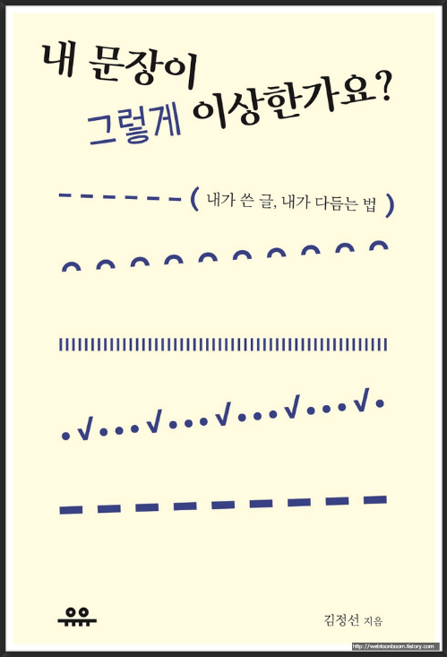

# 오늘의 질문 2020.08.16

## Q.1

Q. 매번 동욱님 글을 볼때마다 "인텔리제이에 이런 기능이 있었어!?",  "스프링 / JPA에 이러한 이슈가 있다니.." 라고 놀랍니다.  
개인적으로 공부하는것에 있어서 정보를 어디서 얻는지 궁금합니다!

A. 음, 일단 저는 철저하게 **회사 중심의 개발자**라서요.  
  
주제의 대부분은 (거의 80%이상?) **회사에서 개발하면서 만난 문제**들 입니다.  
(저 혹은 제 주변의 개발자분들이 만난 문제들)  
  
이를 해결하기 위해 공부하고 정리한게 블로그에 올라온다고 생각하시면 되는데요.  
  
이를테면, 인텔리제이와 같은 개발환경에 관한 것들은 업무를 진행하면서 "아 불편한데 이런 기능은 없나?" 라는 마음에 찾아보게 되고, 발견하게 되면 정리합니다.  
  
스프링/JPA 등과 같은 기술에 관해서는 철저하게 **지금 팀의 문제를 해결하기 위한 것**들을 찾아보고 팀에 적용하기 전에 테스트 용도로 정리합니다.  
  
계속해서 더 좋은 프로젝트 / 더 좋은 개발팀이 되기 위해서만 고민하고 있기 때문에 **핫한 기술의 튜토리얼**에 관해서는 그렇게 끌리지는 않습니다.  
  
예전에도 몇번 블로그에서 언급하긴했지만, **실제 업무에 적용해본 것과 아닌 것의 깊이에는 큰 차이**가 있습니다.  
  
## Q.2 

Q. 블로그 글을 쓰실때 정말 잘 정리되어 있다는 느낌을 받는데, 글을 쓸 때 기준은 어떻게 정하시고 한 글을 위해서 얼마의 시간을 쓰시는지, 또한 따로 글 쓰는법을 배우신건가요? 글쓰는 노하우가 있다면 알고 싶습니다!  
  
A. 먼저 블로그 글 좋게 봐주셔서 감사합니다 ^^;  
한번에 너무 많은 질문을 주셔서 정리를 하면 3개로 정리할 수 있을 것 같은데요.

1) 글을 쓸 때 기준은?
2) 한 글을 위해서 얼마의 시간을 쓰시는지
3) 따로 글 쓰는 법을 배우신건지 & 글 쓰는 노하우가 있으신지

1번 질문의 경우엔 Q.1 에서 답변드린것으로 대신할 수 있을것 같습니다.  
회사 업무를 하면서 만난 문제들 / 앞으로 적용해야할 것 같은 기술들 위주로 정리하는 편입니다.  
이 글을 볼 사람들은 **우리팀의 개발자분들**이라는 가정하에 작성합니다.  
지금 같이 있는 분들 뿐만 아니라, 이후에 입사하실 분들도 볼 수 있도록 **왜 이게 필요한지 / 현재 어떤 문제인건지**를 서두로 시작하며, 글을 진행합니다.  
  
2번 질문에 대한 답변은 **주제 마다 다르다**인데요.  
정말 글 마다 차이가 납니다.  
이를 테면, 별도의 실험이 필요하지 않고 샘플 코드가 적은 글의 경우 하루 2~3시간 * 2~4 일 정도로 총 4~12시간정도 소요됩니다.  
반대로 성능 테스트 / 인프라 / 새로운 기술 등은 작업시간이 길어서 1~2주간 작업을 하기도 합니다.  
  
3번의 답변을 드리자면, 글쓰기에 대해 **따로 배운 적이 없습니다**.  
다만, **기술 글 역시 컨텐츠**라고 생각을 계속하고 있습니다.  
  
그래서 좋은 컨텐츠 & 좋은 기사 & 좋은 글을 쓰는 것에 대한 컨텐츠 (+ 책) 는 자주 챙겨보곤 합니다.  
  
여러 좋은 컨텐츠가 많지만, 그 중에서도 특히나 많이 도움 된 컨텐츠는 "[내 문장이 그렇게 이상한가요](https://coupa.ng/bIg7gn)" 라는 책이였습니다.  

이 책을 통해서 매끄러운 글 작성 방법을 많이 배울 수 있었습니다.

> 물론 지금 글을 잘쓴다는 이야기는 아닙니다 ^^;  
> 딱딱하게 글을 쓰던 입장에서 조금 나아졌다정도로 보시면 될 것 같습니다.

## Q.3

Q. 다른 회사에서 의뢰한 서비스를 제작하는 일을 하고 있습니다.  
의뢰한 회사측은 개발에 대한 부분은 전혀 관련되어 있지 않은 회사입니다.  
보통 개발을 진행할때 간략한 설명과 화면설계서만 주시고 그 안에서의 비즈니스 로직개발은 제가 아는대로 만드는 중입니다.  

타사 측에서 원하는 방향으로 틀을 잡고 개발을 진행하고 결과물을 보여줄때마다 수정사항이 무더기로 나오는 상황을 매번 겪게 됩니다.  
  
그래서 처음에는 "우리가 충분한 논의가 되어있지 않은가?"에 의문이 들어서 회의를 많이 하게되고 그 회의에서 방향을 잡고 하는데 돌아보면 "회의가 충분히 되었고 유익했는가?" 라고 생각하면 더 좋은 프로세스나 회의 방법에 대해 고민이 듭니다.  
  
동욱님께서 속하신 회사들 중에서는
팀안에 어떠한 직책들이 있고, 그 직책분들은 어떠한 업무를 맡으시는지, 개발자가 아닌 직군과 소통을 어떻게 하는 방법이 좋은지 알고 싶습니다.  
  
A. 제가 속한 회사는 아무래도 질문자분이 속해 계신 회사와는 서비스 유형에 차이가 있습니다.  
  
이를테면 질문자분의 고객은 프로젝트 발주를 하는 발주처가 되겠지만, 저희는 서비스를 이용하는 일반 소비자 / 사장님들 두 유형의 고객분들이 계십니다.  
그러다보니 원하시는 답변과 결이 다를 수도 있다는 점 먼저 말씀드립니다.  
  
현재 제가 속한 팀은 **개발/기획/운영이 모두 한 팀**에 속해 있습니다.  

> 당연히 **같은 회사에서도 팀 마다 차이**가 납니다.  
> 즉, 저희 회사에서도 저희와 같은 구조인 팀이 있기도 하고, 아니기도 합니다.

한 팀에 서로 다른 직군이 있다보니 팀장님 1분에 직군 파트장 (기획파트장 / 개발파트장)이 있습니다.  
  
일단 수십개의 팀이 존재하다 보니, 각 팀간의 논의 와 회사의 큰 프로젝트 등이 자주 있을 수 밖에 없는데요.  
그래서 이런 팀 밖의 커뮤니케이션을 팀장님이 진행해주십니다.  
  
각 파트별 업무/스케줄/담당자 관리는 파트장들이 진행합니다.  
그에 따른 설계/프로젝트 기획 등 **팀 내부에서 논의**가 필요한 부분들은 파트장과 파트원들간에 이루어집니다.  
  
개발 직군과 개발 외 직군의 소통은 양 쪽에서 서로 배려를 많이 하는 편인데요.  
이를테면 저희 팀의 기획 & 운영이신 분들은 기본적인 웹 서비스에 대한 이해와 깊은 도메인 이해도를 갖고 계십니다.  
  
그래서 추상적인 단어 보다는 최대한 도메인 용어를 이용해서 커뮤니케이션 하다보니 오해할 요소가 적은 편입니다.  
  
개발직군도 당연히 최대한 **개발자가 익숙한 용어보다는 보편적인 용어와 상세한 배경 소개**를 전제로 회의를 시작합니다.  

직군별 노력 외에, 팀 내부에서는 **도메인 용어**에 대해서 서로가 어떻게 이해하고 있는지 점검하기도 하는데요.  
  
이를테면 "지급금" 이란 단어를 누구는 "지급예정금액"으로 이해하고 있고, 누구는 "지급된 금액"으로 이해하고 있기도 합니다.  
개발자들은 이를 Give 로 표현하고 사용 합니다.  
  
그러다보니 회의때마다 오해하기도 하고, 문맥을 맞추는데 시간이 걸리기도 합니다.  
그래서 서로가 갖고 있는 도메인 용어를 일치시키는 작업을 합니다.

> 보통 이렇게 서로 이해하고 있는 용어들을 정리한 공통의 언어를 [유비쿼터스 언어](https://bcho.tistory.com/360) 라고 합니다.

그리고 이건 개인의 노력도 중요한데, 위키 시스템 (Confluence)과 이슈 관리 시스템 (Jira) 이 필요합니다.  
  
어떤 회의가 있으면 그 회의에서 나온 내용은 위키 혹은 메일로 회의록을 공유하고, 이슈가 발생하면 이슈 시스템에 캡쳐와 함께 이슈를 등록하여 **명확한 사실 관계하에** 진행을 합니다.  
  
위키와 이슈 관리 시스템이 좋은 이유는 **댓글이 지원** 되는 것인데요.  

작성한 내용에 대해 누군가 의문이 있거나 이해가 안되면 댓글을 통해 이야기가 진행되고, 이는 이후에 관련해서 궁금한 사람들 역시 언제든 확인해서 이해에 도움이 됩니다.  
