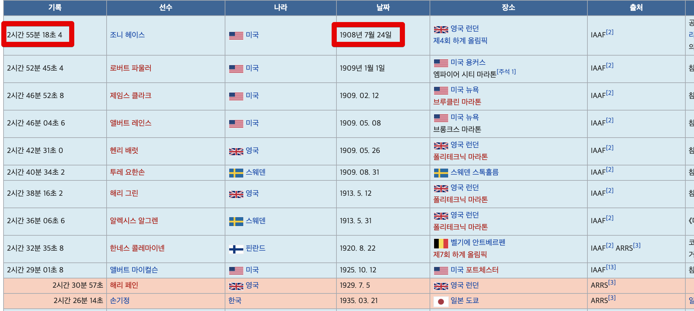
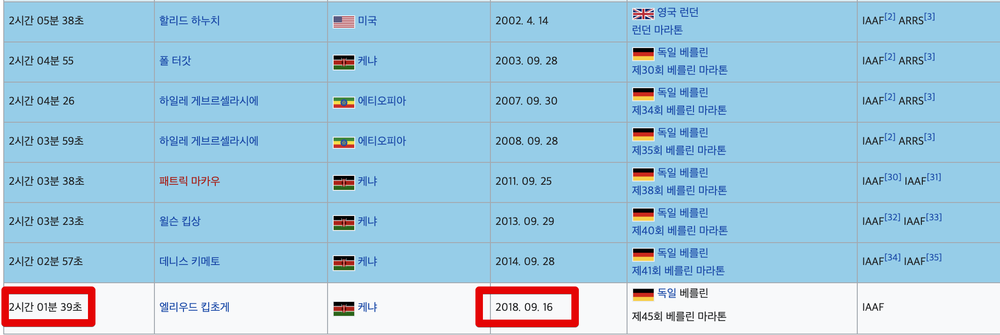

# 오늘의 질문 2020.11.23

## Q.1

Q. 안녕하세요.  
현재 구직중인 취준생 개발자입니다.  
여러 회사를 지원하면서 느낀 것이 이만큼의 요구사항이 진짜 신입으로서 당연히 해야하는 것인지 의문이 듭니다.  
  
자바와 같은 프로그래밍언어, 데이터베이스, 자료구조, 알고리즘 등까지는 이해합니다.  
헌데, 알고리즘 코딩 테스트만 준비해야할게 아니라 스프링/JPA와 같은 현업에서 사용하는 프레임워크라던가, 테스트코드, DDD등에 대한 지식까지 요구하고 Github 관리, 블로그 관리등까지 요구하는데 이걸 다 할 수 있는지 의문입니다.  
더군다나 이게 다 충족되어도 100% 합격이 아니라는게 너무 절망스럽습니다.  
  
지금 신입 개발자로 취업하기 위해서는 과거에 비해 너무 많은 준비가 필요한것 같습니다.  
PHP, MySQL로 게시판만 만들줄 알면 취업하던 때에 들어간 선배들이 지금와서 높은 취업 조건을 이야기할때면 억울한 마음이 들기도 합니다.  
지금 면접관으로 계신 분들이 본인들 올챙이 시절은 잊고 고스펙에 높은 기준치를 신입 분들에게 요구하는걸 보면 이해가 안됩니다.

A. 음 먼저 저 역시도 현재 면접관으로 들어가는 입장이다보니 아무래도 질문자분께서 이야기하는 기성세대(?) 의 입장에서 이야기할 수 밖에 없다는 점 미리 말씀드립니다.  
  
질문하신것에 대해 하나씩 제 의견을 말씀드리자면,  
"현재의 신입 개발자 요구치가 과거에 비해 너무 높다"는 것에 대해서는 저도 **동의**합니다.  
그래서 이에 대해서는 어느정도 좀 더 합리적인 평가 방식이 필요하고, 기업들이 계속 그 방식을 찾아가는 과정이라고 봐주시면 좋을것 같습니다.  
  
다만, "선배들이 올챙이 시절을 기억하고 채용을 해야지" 에 대해서는 조금은 동의하기가 어려운데요.  
  
아래는 제가 종종 찾아보는 마라톤 기록입니다.

([마라톤 세계 기록 추이](https://ko.wikipedia.org/wiki/%EB%A7%88%EB%9D%BC%ED%86%A4_%EC%84%B8%EA%B3%84_%EA%B8%B0%EB%A1%9D_%EC%B6%94%EC%9D%B4))  
  
1908년의 세계 신기록이 2시간 55분입니다.  
2018년의 세계 신기록은 2시간 1분입니다.  
  
그리고 최근 2018년 대구 마라톤 대회의 **아마추어 일반부** (마스터즈)의 기록을 보면 최상위가 2시간 30~40분대라고 합니다.  
즉, **1908년 ~ 1930년도의 세계 우승자가 현재는 아마추어 대회 우승도 어렵다**는 것입니다.  
  
이는 "현재의 선수들이 과거의 선수들 보다 재능이 더 높다" 으로 치부하기에는 어려울정도로 큰 차이인데요.  
  
너무나 당연한 이야기겠지만, 시간이 가면 갈수록 더 체계적인 훈련방법, 더 효율적인 식단, 더 효율적인 자세 등등 계속 발전하니 점점 더 선수들의 기량이 좋아질 수 밖에 없고 그만큼 **우승을 위한 기준이 더 높아질 수 밖에 없음**을 의미합니다.  
  
만약 현재 예선 통과를 못한 마라톤 선수가 "아! 내가 2010년도가면 세계우승자인데!" 라고 얘기하면 어떤 생각이 드시나요?  
저라면 "당연한거 아닌가?" 라고 생각이 들 것 같습니다 :)  
  
물론 질문자분이 "어떤 시기에 태어났느냐만으로 이렇게 불공평해도 되냐" 라고 느끼실 수 있겠죠.  
근데 현재에 너무 쉽고 흔한 기술이 **과거에는 공부하기 어려운 기술**이였습니다.  
지금처럼 인터넷이 있는것도 아니고, PC사양이 높아서 빠르게 결과를 볼 수 있는것도 아닌 환경이다보니 **교체투수 없이 혼자서 연장 15회, 18회까지  던져야하는 투수**처럼 파고들 수 밖에 없었습니다.  
(물론 저도 그 시절의 개발자는 아니지만요^^;)  
  
현재 질문자 분이 Git을 비롯해서 자바/스프링/알고리즘/자료구조/컨테이너 등을 쉽게 배우는 것은 이미 앞서 나간 선배님들이 부딪치고 깨져서 얻은걸 다시 한번 재정리하고 공유했기 때문이라고 봅니다.  
  
즉, 점점 더 체계적인 훈련 방법이 발전되면서 마라톤 기록이 높아지는것처럼, 개발자들 역시 점점 더 자료와 개발환경이 발전하면서 개발자에 대한 요구치가 높아질 수 밖에 없다는 것 입니다.  
  
제 개인적인 생각이지만, 앞으로 "개발자"라는 직업의 **신입으로서의 기대치는 계속해서 높아질거라고** 봅니다.  
  
그래서 과거와 비교하시지 마시고, 현재 같이 구직을 준비하는 분들이 얼마나 잘하는지, 그들과 비교해서 나는 어떤 우위가 있고 부족한게 있는지를 확인해보셔야 한다고 생각합니다.  
  
> ps. 혹시나 주변 선배님들이 "A만 할줄알면 취업돼" 라고 자꾸 기준치를 낮추는 뉘앙스의 이야기를 해주신다면 **위로**정도로만 받으시고, **본인 스스로는 높은 기준치를 계속 유지**하시길 추천드립니다.  
> 경력 개발자에 대한 기준치도 계속 높아질거고 봐서요 :)

