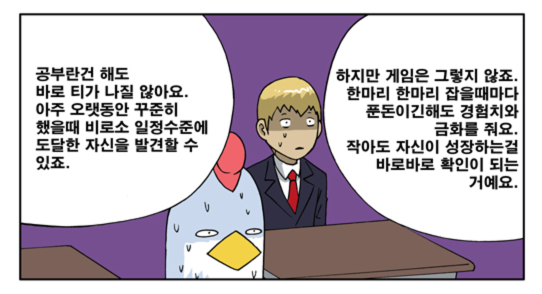
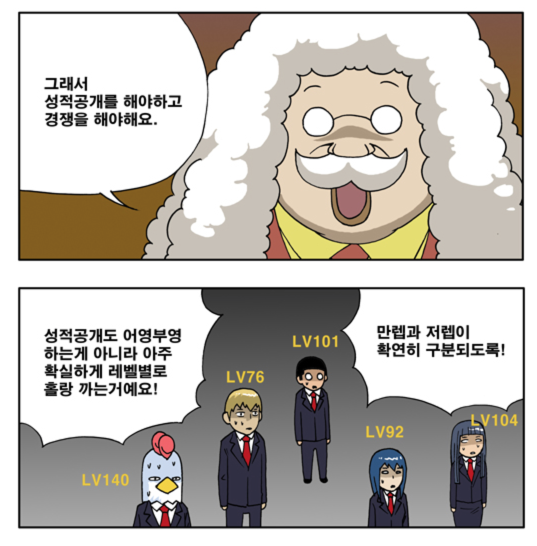
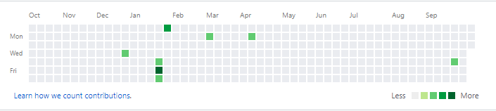
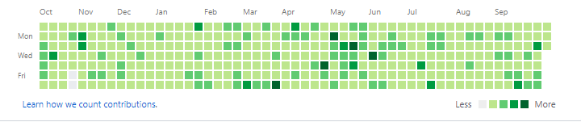

# 일일커밋의 효용성

(일일커밋 그래프)  
  

주변의 친한 개발자분들은 다들 아시겠지만 나는 현재 일일커밋 진행중이다.  
일일커밋에 대한 자세한 소개는 [outsider님의 블로그](https://blog.outsider.ne.kr/1141)를 보면 될것 같다.  
이런 나에게 자주 오는 질문이 하나 있다.  
  
> 일일커밋하면 좋나요?  
  
그래서 이 질문에 대한 명확한 답은 아니지만, 나름의 생각을 이야기하고 싶다.  
  
  
중학생시절 리니지1에 완전 빠져지냈다.  
  
지금이야 대부분의 온라인 게임이 부분 유료라 게임 플레이 자체는 무료로 할 수 있지만, 당시 리니지의 경우엔 월 29,700원을 지불해야만 할 수 있었다.  

[[ad]]

너무 하고 싶은데 중학생에게 3만원이란 금액이 적은 금액도 아닐뿐더러, 과금 자체가 힘든 구조라 (계좌이체만 가능했었다) 엄마를 졸라서 여름방학때 처음으로 월 정액을 들어 집에서 게임을 해볼 수 있었다.  
  
막상 게임은 시작하게 되었는데 레벨도 낮고 아이템도 없던 내 케릭터는 뭔가 많은걸 할 수 있는 상태가 아니였다.  
이것저것 실험해보다가 한가지 방법을 찾았는데, 늑대인간 & 라이칸스로프라는 초급 몬스터들만 집중적으로 잡는것이였다.  
계산해보니 고급몬스터 1마리를 잡는데 들어가는 시간과 비용이면 이런 초급 몬스터들은 10마리도 잡을수 있었기 때문이다.

(추억의 늑대인간 & 라이칸스로프)  
  
방학내내 매일 14~16시간동안 이 몬스터들만 잡았다.  
초보 사냥터라 사람도 없어서 시간당 70~100마리 정도 잡았으니 하루에 족히 수백마리는 잡았던것 같다.  
  
리니지는 스타크래프트처럼 다이나믹한 게임도 아닌지라 매일 매일이 마우스 클릭만 하는 단순 작업의 반복이였다.  
  
어제도, 오늘도, 내일도, 주말에도 계속 같은 몬스터, 같은 사냥터, 같은 행동을 한다고 생각해보자.  
너무 지겹지 않을까 생각이 들지만, 당시엔 **하나도 지겹지가 않았다**.  
왜 그럴까 곰곰이 생각해보니 한가지 결론이 나왔다.  
  
**10원, 0.001%의 경험치라도 오르는게 눈에 보이기 때문**이다.  
  
경험치나 돈이 증가하는게 눈에 보이지 않았으면 과연 그 지겨운 노가다를 계속 할 수 있었을까?

(이렇게 극단적으로 갈필요는 없지만..)  
  
일일커밋하는 이유?  
간단하다.  
  
**결과가 눈에 보이기 때문**이다.  
  
처음 내 Github 커밋 히스토리는 텅텅 비었었다.  

이랬던 커밋 히스토리가 하루하루 쌓이더니

현재는 이렇게 채워졌다.  
  
오늘 뭐라도 하나 했다는 것,  
조금씩이나마 진행되는게 있다는 것,  
어제보다 나아지고 있다는 것,  
경험치가 쌓이듯이 차곡차곡 쌓이는게 있다는 것  
  
**일일커밋은 완벽하진 않지만 이를 보여준다**.  
  
나한테 일일커밋은 공부/자기개발이 아니라 그냥 게임일 뿐이다.  
레벨업하듯이, 게임속 화폐를 모으듯이 차곡차곡 쌓이는게 보이는 RPG게임 같은거라 정말 중독성있다.  
  
굳이 꼭 일일커밋일 필요는 없다.  
본인 페이스북 페이지의 좋아요가 될수도 있고,  
블로그의 조회수가 지표가 될 수도 있고,  
Github 저장소의 Star가 지표가 될 수도 있다.  
  
뭐가 됐든 **결과가 눈에 보이는 지표**를 찾자.  
  
눈에 보이는 지표가 있다면, 눈에 보이는 목표치도 정할 수 있게 된다.  
  
[[ad]]

100일 커밋,  
좋아요 300개,  
일일 조회수 500,  
Star 100 등등  
  
뭐가 되도 좋으니 본인의 목표치를 정하고 달성하기 위해 매일 매일 뭔가 진행하고 결과를 확인하자.  
  
코드를 작성하는 것이 재미가 있어야지 이렇게 딱딱하게 할 필요가 있나라고 생각할수도 있겠지만,
**프로 스포츠 선수들 중에 재밌을때만 훈련하는 사람들**이 있는지 생각해보자.  
  
그들에겐 재미있든 없든 매일 하는 것이 훈련이라면, 우리에겐 코드를 작성하는 것이 훈련의 대상 아닐까 싶다.  
  
그리고 일일커밋은 그런 지겨운 반복속에서 나름의 재미를 주는 장치라고 생각한다.  
  
꾸준히 코드를 작성하고 싶은데 잘 안된다면 일일커밋을 한번 해보자.  
개인프로젝트, 스터디 등은 지표가 없어서 쉽게 지칠수 있다.  
주객이 전도되는 것처럼 보일 수 있겠지만, 커밋 히스토리를 채우기 위해 코드를 작성하는 것도 나쁘지 않다.  
  
일단 시작해보자.  
중간중간 못할때도 있고, 편법을 쓸수도 있다.  
그래도 계속 하자.  
그렇게 꾸준히 하다보면 어느새 가득 채워진 커밋 히스토리와 매일 코드를 작성하는 자신을 볼수 있을 것 같다.

