# 2021 CTO 회고

개인 회고와 별개로 CTO로서 구체적으로 기록을 남기고 싶어서 CTO회고는 별도로 빼서 작성하게 되었다.  

> 개인회고에 같이 담으니깐 양이 너무 많았다.  
> 개인 회고는 별도로 쓸 예정이다.
  
나와 비슷한 상황 혹은 CTO로 합류 하는걸 고민하시는 등 그 분들에게 조금이나마 도움이 되지 않을까 싶었다.

> 나중에 내가 다시 시드 ~ 시리즈 A 회사의 CTO로 혹은 기술 리더로 합류할때 도움이 될 것 같기도 하고

## 합류 전

합류 전 대표인 형주님과 나눈 조건 중에 하나는 **CTO로 합류 보다는 시니어로 입사 후 구성원들의 인정을 받으면 CTO로 올라가는 것**이였다.  
그러니깐 **조건부 CTO**였던 것이다.  
  
이 조건을 듣고 주변에서는 (솔직하게) 황당해했다.  

* 왜 니가 거기가서 다시 증명을 해야하는거냐?
* 여기 남든, 다른 회사 가든 그런식의 조건을 달고 이야기를 하는 곳이 있냐?
* 거기가서 CTO가 안되면 그냥 단순 시니어가 되는건데 그럼 굳이 거기 왜 가냐? 
* 여기서도/다른회사에서도 더 좋은 대우로 / 더 많은 사람에게 영향을 주는 게 더 낫지않냐?

등등 진짜 친한 지인들 몇명에게만 이야기했다보니 눈치 안보고 이야기를 해줬다.

그리고 실제로 **CTO가 안될수도 있기 때문에** 대부분의 지인들에게는 CTO로 간다고 얘기안했다.  
(안되면 넘 부끄러우니깐)  
  
근데 그럼에도 조건부가 크게 고려요소는 아니였다.  
이건 인프랩이란 회사의 특수성에 기인했기 때문이라 납득할 순 있었기 때문이다.

* 회사가 20명이 될 때까지 한번도 C레벨은 커녕 **시니어 조차 채용해본적이 없었던 상황**
* 외부에서 합류한 시니어는 어떤 역할을 하는 것인지 감도 없는 상황
* 시니어는 조직 전체에 큰 영향을 줄 수 있다는 것으로 인한 **두려움**

한번도 시니어를 뽑아본적이 없었던 조직에서 처음 뽑는 시니어가 C레벨인 것은 누구나 두려워할만하다고 생각했다.  
C레벨이라하면 결국 조직 전체를 뒤흔들 권한을 가지기 때문이다.  

그리고 이건 내가 배민이라는 회사를 다니면서 가지고 있었던 나 자신에 대한 의심을 해결할 수 있는 기회이기도 했다.  
  
내가 배민에 합류할 당시에 경력이 3년채 안되는 (2년 10개월) 주니어였다.  
근데 하필 성과내기 좋은 팀에 합류를 하게 됐고, 만난 모든 팀장님들과 실장님들이 계속해서 많은 힘을 실어주고 권한을 위임해주셨다.  
  
즉, **직속 상사의 전폭적인 지지하에** 많은 성과를 낼 수 있었던 것이다.  
  
그래서 이렇게 지지를 받지 못하는 상황에서 **온전히 내 힘으로 인정**받고 성과를 낼 수 있는 사람인지에 대한 의구심을 계속 가지고 있었다.  
  
그런 지지기반이 없는 상황에서 나라는 사람은 얼마나 유의미한 성과를 낼 수 있을까?  
이걸 시험해볼 수 있는 기회라고 생각했다.

## 합류 후

퇴사전에 실장님이셨던 기호님이 해주신 조언이 있다.  
**가서 바로 무언갈 하려고 하기 보다는 1~2달은 가만히 지켜만 봐라** 라는 것이다.  
  
그래서 가자마자 약 **한달간은 지켜보고 분석**하는 시간을 가졌다.  
실제로 **코드리뷰도 한달은 거의 참여하지 않았다**.  
인프랩이 그동안 해온 코드 방향이 **내가 생각한 방향과는 전혀 맞지 않았기 때문**이다.  
충분한 Context에 대한 이해도 없이 내가 가고자 하는 방향대로 함부로 얘기해서는 안된다고 생각했다.  
  
이것들을 지금처럼 해서는 안된다는 것을 굉장히 우회해서 이야기를 하고, 하고 싶은 이야기를 제대로 하지 못하기도 했다.  
  
이 과정이 사실 답답한 것도 조금은 있었다.  
빠르게 성장해야하는 스타트업에서 **설득하는 과정이 길어져서는 제대로 속도를 낼 수 없다**는 생각이 있기 때문이다.  
하지만, 그런 설득 과정이 없으면 **기존 멤버들에게 상처를 주게 된다**.  
  
그러다보니 지인들과의 술자리에서 하소연도 조금했다.  
차라리 **권한이 있었으면 좋겠다**고 말이다.  
그럼 차라리 권한으로 밀어붙여서 속도를 낼 수 있으니깐.  
**권한은 없는데 증명을 해야하는 자리**가 바로 이 자리구나 싶었다.  
  
그래서 초기 3~4개월은 **상처 주지 않은 설득**하는 방법을 배우고 시험하는 시간이였다.  
  
그래도 내 가치에 대해서 잘 증명하게 되어 **7월 23일부로 CTO로 진급**했다.

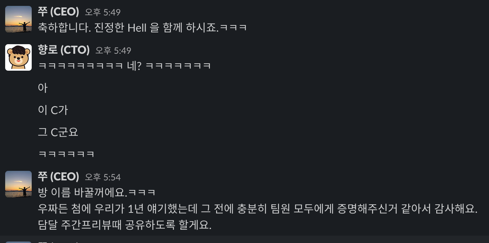

그래서 나는 사원증이 2개다

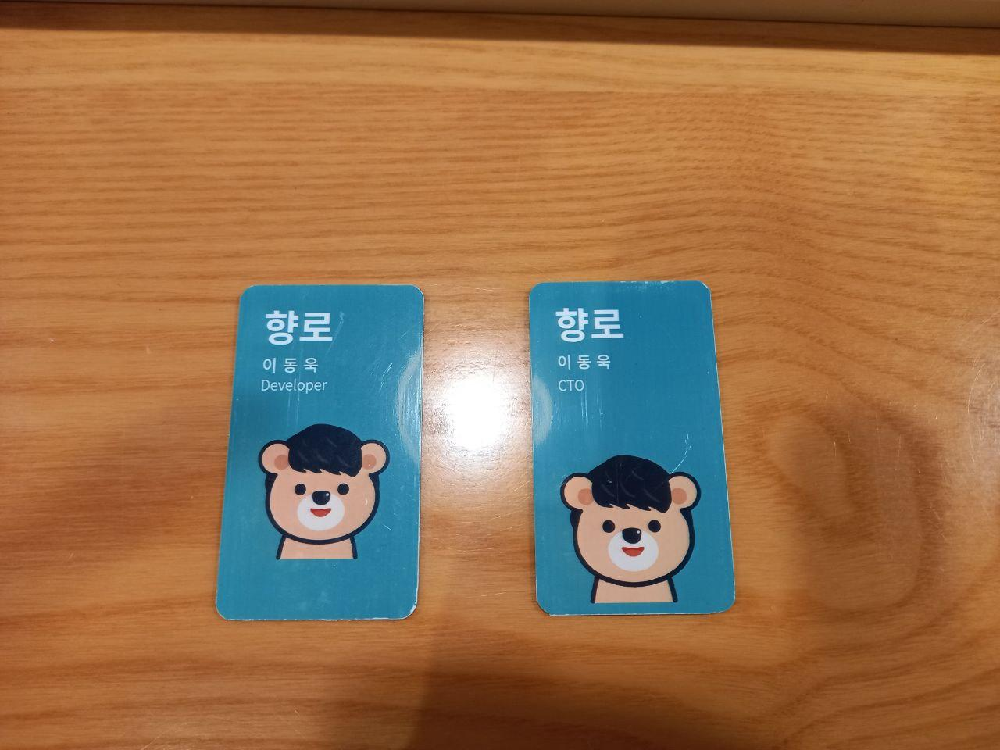

아래부터는 그 과정에서 어떤 일들을 했는지를 정리했다.

## 서비스 상황 분석

기존에는 제대로 모니터링과 로깅이 되지 않았다.  
모니터링/로깅이 없다는 것은 당장의 문제 해결 그 이상의 의미가 있다.  
**과거로부터 배우지 못한다는 것**을 의미한다.

* 어느 시점 / 어느 리소스에서부터 문제가 시작 된 것일까?
* 사전에 그 징후를 알 수 있는 방법은 없었을까?
* 우리 시스템의 임계점은 어느지점일까?
* 장애가 발생했는데 우리가 모르고 있던적은 없었던걸까?
* 3개월전에 배포한 코드의 문제가 조금씩 누적되서 이번에 큰 장애로 발생한건 아닐까?

그래서 일단 과거의 장애 내역들을 조사했다.

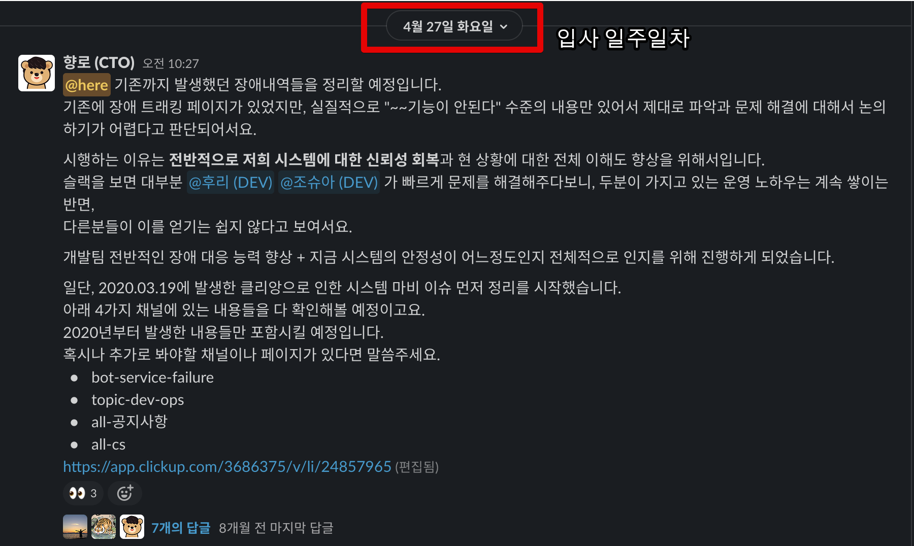

조사한 내용들을 차례로 문서화를 진행해서 **장애 회고**를 할 수 있게 했다.

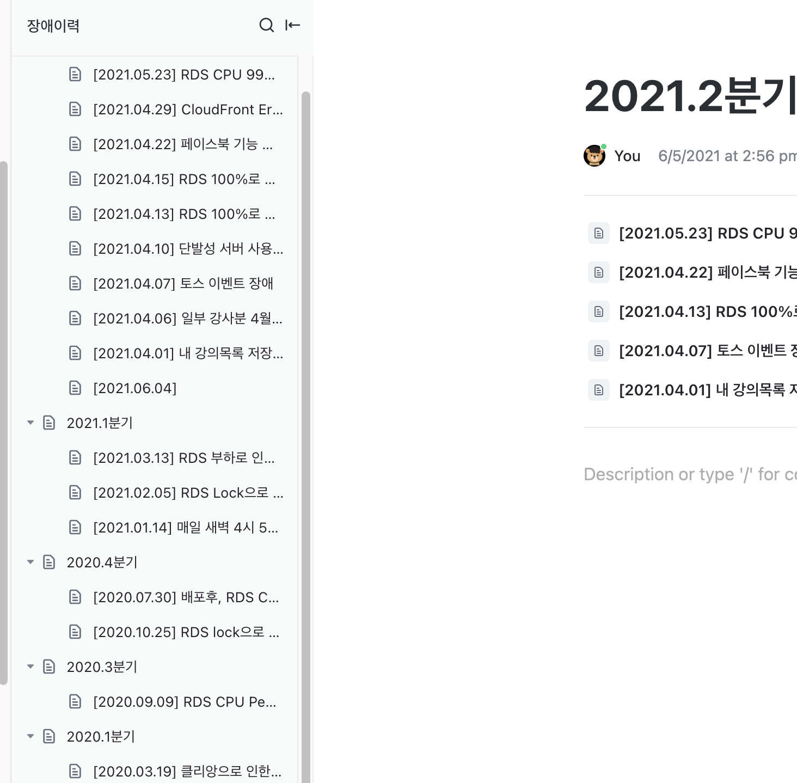

그리고 이를 토대로 대표님과 개발파트를 모아서 공유를 했다.

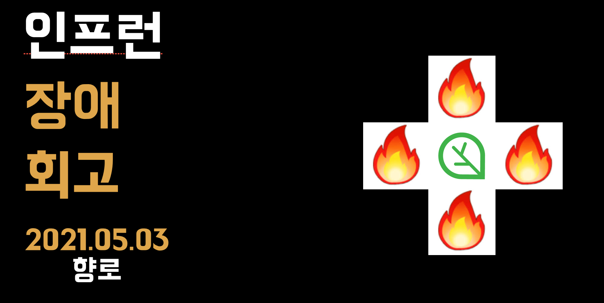

이들을 공유하면서 여러 이야기를 나눴다

* 우리가 지금 얼마나 불안한 서비스 상태인지
* 지금처럼 한다는게 얼마나 기술 부채를 만드는 것인지
* 지금 당장 보강해야할 것들은 무엇들인지

그리고 데브옵스 파트 한분과 함께 아래 내용들을 빠르게 적용했다.

* RDS PostgreSQL -> Aurora PostgreSQL 로 마이그레이션
  * 하필 사내에서 사용중인 PostgreSQL은 10.15 인데 6월전까지 Aurora PostgreSQL은 10.14까지만 지원중이였다.
  * 그래서 마이그레이션을 바로 못하고, 10.16 버전의 Aurora가 나오자마자 바로 마이그레이션을 했다.
* 쿼리 로깅 & 슬로우 쿼리 알람
  * 쿼리에 대한 로그를 보관하고, 3초이상 쿼리들에 대해서 무조건 알람이 오도록 구성했다.
  * 이렇게 발견된 **슬로우 쿼리들을 모조리 튜닝**했다.
* APM 도입
  * Datadog / Splunk 등 여러 도구를 검토했는데, 가장 많은 회사가 사용중인 Datadog를 선택했다.
  * 근데 Datadog도 결국 NodeJS는 JVM 만큼의 상세하게 모니터링을 지원해주진 못하는 점은 큰 실망이였다.
* Redis Cache 정리
  * 과도하게 Redis Cache로 처리하는 부분이 많았다.
  * Cache Hit율을 봤을때 굳이 Redis 에 써야하나?? 하는 부분들은 Redis에서 모두 제외했다.  

## 기술 부채

합류할 당시의 인프런의 장점은 다음과 같다.

* 인프런 서비스 초창기부터 지금까지 쭉 함께하신 (거의 5년?) 개발자분이 아직 남아 계셨다.
  * 모든 기획과 코드의 히스토리를 알고 계셔서 여쭤보기 편했다.
* 데브옵스/프론트엔드/백엔드가 분리가 되어있었다.
* 배포 자동화가 구성되어있었다
  * 테스트 자동화가 없는 배포 자동화는 CI/CD라고 부르지는 않는다.

다만, 그 외에는 개선해야할 포인트가 많았다.

* 프레임워크 없이 구성된 프로젝트
  * Java로 치면 Servlet/JSP로만 프로젝트가 구성되어있는 상태였다
* 신규 입사자들이 쉽게 적응하기 힘든 코드 스타일
  * 일반적으로 얘기하는 클린코드/클린소프트웨어/리팩토링과는 거리가 멀었다.
* 배포 방식
* Git 사용법
* 테이블 설계
* 모니터링
* 이메일 발송등을 비롯한 메세지큐 활용 방식
* 시스템 아키텍처

등등.  
  
이 기술 부채를 어떻게 해결해야하나 고민이 많았다.  
하지만 이게 문제라고 생각하진 않았다.  
어차피 이 과정은 사실 **어느 스타트업이나 겪는 과정**이기 때문이다.

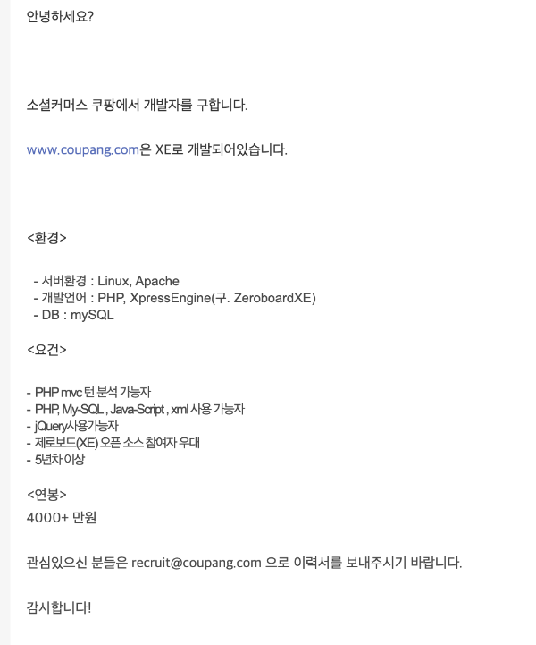

(이제는 전설처럼 떠도는 초창기 쿠팡의 제로보드 개발자 구인 공고)  
  
그래서 "와 진짜 제대로 찐 스타트업 경험하겠다" 생각을 했다.  
위에서도 언급했지만, 우리가 기존에 해오던 방식을 유지할 순 없다.  
최대한 우회해서 이야기했지만, 아무리 돌려얘기해도 그 본질이 변하진 않는다.
  
**기존 프로젝트를 다른 방식으로 개선/개편**해야한다는것 말이다.  
  
이게 초기 스타트업 개발팀에는 **역린**이다.  
왜냐하면 **지금까지 해오던 방식을 전면 부정**당하는 것과 다를바 없기 때문이다.  
  
실제로 올해 연말 회고때도 이 이야기가 언급되기도 했다.

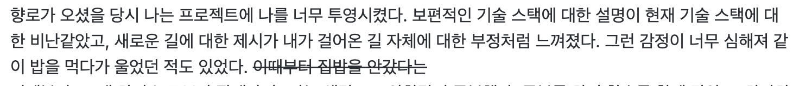

(기존 구성원분의 회고글)  
  
나는 **동시대를 살아가는 개발자들의 흐름**을 놓치지 말아야 한다는 생각을 갖고 있다.  
  
아래 글은 내가 2018년도에 본 글인데, 몇 년이 지난 지금도 기억할정도로 강하게 뇌리에 남아있다.  
(내용 전체가 좋기 때문에 꼭 다 읽어보길 추천한다)

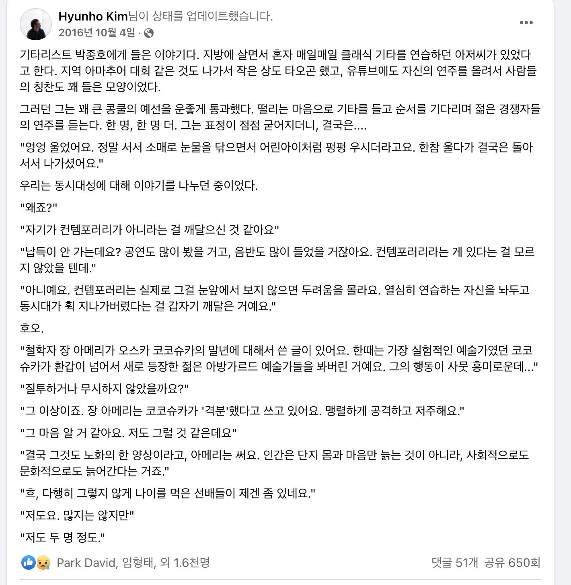

[원 글](https://www.facebook.com/hyunho.kim.9465/posts/1184925318240273)

윗 글에서도 나왔지만, "**열심히 연습하는 자신을 놔두고 동시대가 휙 지나가버렸다는걸**" 뒤늦게 깨닫게 될때의 절망감은 말로 표현하기 어렵다.  
그렇게 되면 사랑스러웠던 회사와 서비스도 더이상은 사랑할 수 없게 된다.  
  
내가 속한 조직의 구성원들이 **동시대를 살아가는 개발자가 아니게 될까봐** 정말 많은 걱정이 되었다.  
  
이 문제가 전문성을 가지고 있는 개발자에게 정말로, 정말로 중요하다.
  
* 서비스는 성장하는데 구성원이 성장하지 못하는 상황
* 종국엔 아무 회사에서도 받아주지 않는 사람들만 남게되는 상황

이런 상황이 **바깥 세상과 단절하고 우리만의 힙함을 강조하는 스타트업**에서는 비일비재하게 발생한다.  
  
내가 리드했던 조직의 구성원이, 내가 오기전부터 헌신했던 조직원이 떠날때 원망과 후회가 있어서는 안된다고 생각했다.  
  
그래서 나한테는 이게 정말 큰 위기감으로 다가왔다.

서비스가 성장하면 개인도 같이 성장하는거 아니냐고?  
아니다.
서비스가 성장하는데도 개인이 성장하지 못한 케이스는 너무나 많다.
서비스의 성장과 개인의 성장이 비례한다면 **그 많은 빅테크 스타트업의 개발자들이 특정 라운드가 되면 대대적으로 인력 교체**가 왜 일어날까.  

이 부분에 대해서는 조금 강하게 이야기 했다.  

* 우린 NodeJS 잘 하는 팀이 아니다.
* **동접 1000명만되도 죽는 서비스를 만들고선 직접 문제를 다 해결하겠다는 것은 굉장히 오만한 생각**이다
* 지금 이렇게 코드 작성 계속하면, **아무리 좋은 사람을 데려와도 3개월도 안되서 다 퇴사**한다.  

상처가 될 수는 있겠지만, 이것만큼은 현실 직시 할 필요가 있었다.  
  
그리고 본격적으로 **동시대성을 갖추기 위한 과정**을 구성했다.

* 채용 과정에서 **실제 웹 서비스를 만드는 과제 테스트**를 추가했다.
  * 이렇게 하게되면 외부의 개발자들은 **어떤 구조로 / 어떤 형태로 코드를 작성**하는지 완전히 체감할 수 있다.
* [채용 공고](https://inflab.notion.site/NodeJS-4a7668d2564a4180a0721a2135f97840)에 **앞으로 우리가 갈 길을 기존 개발자분들에게 명시**하는 방향으로 작성했다.
* 9월부터 시작하는 새 프로젝트에 기존 스택을 1도 사용하지 않고 완전히 새롭게 구성했다
  * BE: TypeScript & NestJS & TypeORM & 테스트코드
  * FE: TypeScript & React & 테스트코드 & Redux / Mobx / Recoil
* [리팩토링2](https://www.aladin.co.kr/shop/wproduct.aspx?ItemId=236186172)를 기반으로 스터디를 진행했다

여기서 특히나 중요한게 바로 리팩토링2 책을 기반으로한 스터디였다.  
좋은 코드에 대한 기준이 **바깥의 방향과는 많이 달랐다**.  

> FP냐 OOP냐 혹은 JavaScript냐 Java냐의 문제가 아니다.

JavaScript로 되어있으면서 좋은 코드에 대해 신뢰할만한 책이 필요했는데, 그게 딱 리팩토링2였다.  
  
처음엔 스터디를 하다가 2시간동안 1페이지만 진행되기도 했다.  
안좋은 코드와 좋은 코드에 대한 이야기가 나올때면, 서로 그동안 가지고 있던 불만들을 책의 내용은 인용해서 표출했기 때문이다.  
그럼 또 그 반대편 의견을 가진 분들이 거기에 다시 또 반발을 하는 일의 연속이였다.  
  
그렇게 4~5주를 보내고 나니, 그때부터 제대로 진도가 나가기 시작했다.  
  
스터디를 진행하면서 **일반적으로 좋은 코드는 이런 형태다**라는 걸 이야기 하면서 해주고 싶었던 여러 개념들/설계에 대한 내용들도 첨부했다.  
레이어드 아키텍처 / 도메인 모델 / OOP / Public 인터페이스 / 회귀테스트 등등.  
  
이런 밑작업(?) 들이 결국 9월부터 시작된 신규 프로젝트에서 완전히 이해되었다.  
  
실제로 지금은 신규 프로젝트에 한해서는 무조건 테스트 코드를 작성하고, 훨씬 나은 코드를 작성하고 있다.

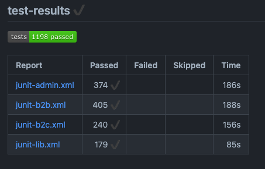

## 1 on 1

1 on 1을 정말 자주 했다.  
1인당 2~3회씩했다.  
  
어떤 일을 하는데 있어서 **그게 설령 맞는 말이라도 누가 했느냐에 따라 사람들은 반대를 하기도 한다**

일을 하는데 있어서 상호 유대감을 얼마나 쌓아놓느냐가 일을 할때 정말 중요하다는 것을 알고 있다.  
  
그래서 처음에는 나와의 **유대감 형성**을 위해 진행했다.  
  
이후부터는 **대표님에게는 말 못했던 개인의 고민**들에 대해 많이 이야기를 끌어내려고 노력했다.  
이 점에 있어서 오히려 CTO로 합류하지 않고, 같은 팀원으로서 합류한게 도움이 많이 되었다.
초기부터 C레벨이였으면, 대표님 면담과 마찬가지로 다들 자신의 속마음을 터놓고 이야기하기는 어려웠을 것이다.  

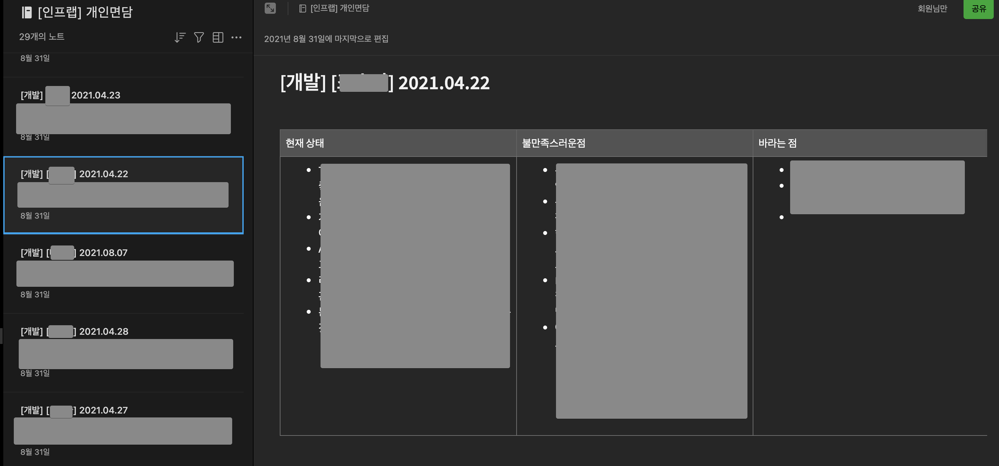

[레몬베이스](https://lemonbase.com/) 라는 리뷰/성과 관리 서비스를 HR에서 도입해주었다.  
그래서 6개월마다 하는 셀프 평가의 질문지를 변경해서 개발파트에만 시범적으로 도입했다.  
  
팀으로서/개인으로서 성장을 위해 필요한 질문들 6개를 만들었고, 이를 기반으로 면담을 진행해봤다.  
확실히 좀 더 개발자에게 맞는 형태로 구체화된 질문이 되니 답변 역시 구체적이였다.  
이 질문지는 계속해서 개선해나갈 예정이다.

## 문서화

인프런은 내부적으로 [Clickup](https://clickup.com/) (클릭업) 이란 서비스를 메인 문서 도구로 쓰고 있었다.  
  
써보면서 느낀 클릭업의 장점은 다음과 같다

* 자동화
  * 외부 연동이 어느정도 잘 구성되어있었다.
* 카드 기반의 관리
  * 트렐로와 같은 카드 기반의 티켓/문서 관리가 가능했다.
* 티켓 관리와 문서 관리가 한 곳에서 가능

다만 이걸 앞으로 본격적으로 사용할 문서화의 도구로 쓰는 것에는 거부감이 컸다.

* 빈약한 에디터
  * 표(테이블) 병합이나 스타일 변경 등 표에 대한 기능이 없다.
  * 에디터 단축키가 없어서 일일이 마우스 클릭을 해야만 한다
* 가독성
  * 에디터가 부실하다보니 가독성이 빈약하다
* 마크다운 문법을 지원하지 않는다.
* 부실한 검색 기능
  * 검색의 필터나 디테일한 검색 기능이 빈약하다
* 커뮤니티 부재
  * 우리나라에서 인프랩이 클릭업 제일 잘쓸 것이다. (다른 회사는 안쓰니깐)
* 성능 이슈
  * 작성된 문서의 내용이 길면 페이지 로드 속도가 기하급수적으로 늘어난다
* Draw.io와 같이 전문화된 도구의 미지원
  * 다이어그램, 마인드맵, 아키텍처 설계등을 전혀 그릴 수 있는 도구를 지원하지 않는다.
  * 그래서 이런 경우 구글 Docs에서 만들어 이를 링크걸어서 사용한다.
* 동시 문서 편집 버그
  * 동시에 여러 사람이 한 문서를 편집해야하는 경우 제대로 입력이 안된다.
* 한글 입력 오류
  * 다음과 같이 **입력 버그**가 발생할때가 종종 있다. 
  * 이때 작성자에게 급격한 스트레스를 준다

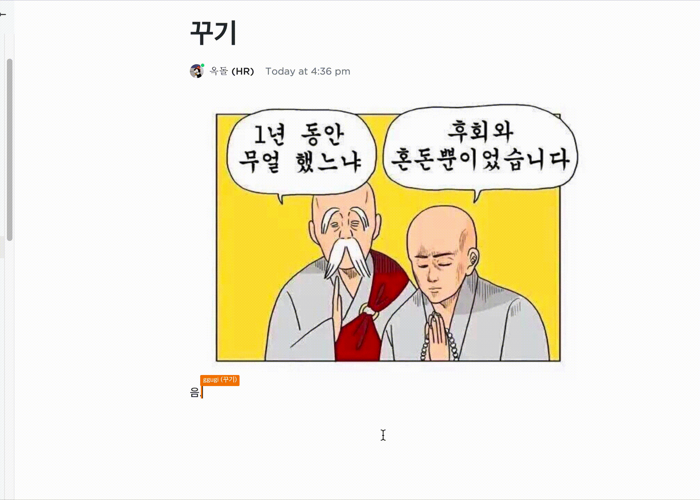

특히나 큰 문제는 **클릭업의 기능이 부족해서 구글 Docs와 함께 문서화가 되고 있다는 것**이다.  

* 내용이 제법 길 경우
* 표 (테이블) 등 단순 텍스트 그 이상의 내용 작성이 필요한 경우
* 동시에 여러 사람이 문서를 작성해야하는 경우

등의 상황에서 구글 Docs가 추가로 사용되었다.  
  
문서화가 계속 파편화 되다보니 **링크를 포함시킨다 해도 결국 구글 Docs에 포함된 내용으로는 검색이 불가능**하다.  
그러다보니 신규 입사자가 들어와서 업무를 하는데 기존 문서를 찾아서 일하기가 어렵다보니 **기존 멤버들의 기억에 의존해서** 하는 일이 잦게 된다.  
(clickup도 검색하고, 구글드라이브도 검색해야하니)  
  
그럼 "그냥 옮기면 되지않냐" 라고 할 순 있는데, 그러기엔 몇가지 문제가 있다.

* 인프랩 초창기에 Jira / Confluence를 썼을때 안좋은 경험을 했었음
* 이미 기존의 **많은 자동화가 클릭업과 연동**되어있다.
* Confluence에 익숙한 구성원이 별로 없다
  * 경력직이 거의 없고, **구성원의 대부분이 여기가 첫 직장**이다보니 다른 문서도구를 써본 경험이 거의 없다
  * Confluence 와 Jira를 배워야한다는 부담감을 다들 조금씩 갖고 있다.

그래서 일단 프로덕트 파트 (개발/PO/디자인 파트)에서만 먼저 Confluence & Jira를 도입했다.  
  
디자인 파트는 슬슬 적응단계이고, PO파트는 이미 예전부터 써오던 것들이라 신나게 문서화를 했고, 개발파트는 조금은 어색해하다가 지금은 잘 쓰고 있다.  

> 웬만한 IT 서비스 회사들은 Confluence & Jira 사용중이여서 PO/개발은 따로 적응할 것도 없긴하다.

내년에는 이 부분을 좀 더 확대해볼 생각이다.

## 채용

채용쪽은 정말 할 애기가 많다.

### 채용 공고 리뉴얼

백엔드 / 프론트엔드 개발자 채용 공고를 완전히 다시 작성했다.  
(Notion으로)

* [백엔드 개발자](https://inflab.notion.site/NodeJS-4a7668d2564a4180a0721a2135f97840)
* [프론트엔드 개발자](https://inflab.notion.site/React-VanillaJS-297e778f28334a50b5e68b8a898de569)

이것에 대해서 대표님과 토론을 했다.

* 기존의 인프런 채용 공고가 있는데, 굳이 다시 쓸 필요가 있는지
* 채용 공고를 굳이 Notion을 써야할 이유가 있는지
  * 새로 작성하더라도, 기존 채용공고 페이지에다가 쓰지 않고 또 새로운 관리 도구를 추가해야하는지
* Notion으로 한번 사내 문서화를 시도했다가 크게 실망한 과거의 경험

채용을 하는데 있어서 채용 공고가 정말 중요하다는 것을 알고 있기 때문에 절대 양보할 수는 없었다.  
  
내가 원하는 수준의 채용 공고 양식과 내용을 작성하기 위해서는 **좋은 도구를 써야만 한다**.  
  
그래서 다음과 같이 대표님을 설득했다.

* 현재 인프런 서비스로는 에디터/Viewer의 한계로 충분히 매력적인 공고를 쓰기 어렵다
  * **채용 공고의 퀄리티와 지원자의 퀄리티는 비례**한다는 점을 말씀드렸다.
* 이미 수많은 스타트업들이 채용공고를 Notion으로 사용하고 있다.
  * 최고의 도구는 아니지만 그래도 Notion이면 단순 컨텐츠 사이트로서는 충분한 역할을 한다.
  * 더군다나 사용법이 개발을 몰라도 될 정도로 쉽다.
  * 그만큼 국내에 활용법이 많이 공유되어있다.
* Notion 은 오로지 **외부에 공개될 정적 사이트**로서의 역할만 한다
  * 딱 한정된 역할로서만 사용 한다.
  * 그 외 현재 사내 문서 도구를 대체할 일은 전혀 없도록 한다. 
* [oopy](https://www.oopy.io/) 를 통해서 Notion 역시 일반적인 웹 사이트처럼 커스터마이징할 여지도 굉장히 많다.

놀라웠던 점은 지원율도 높아졌지만, **지원자의 이력서/자기소개의 퀄리티도 높아졌다**는 것이다.  
  
일례로 어떤 지원자분은 **우대사항 항목 하나하나에 대해서 이런 경험이 있다**는 것을 작성해서 보내주시기도 했다.

이 채용 공고 리뉴얼의 성과가 너무 좋아서, 전체 채용 공고를 Notion 기반으로 리뉴얼 작업을 진행했다.

* [인프랩 Notion 채용 공고](https://inflab.notion.site/inflab/d96215b0d4d44f62ba65c88120c999c5)

이렇게 개편한 채용 성과는 어떨까?

### 채용 성과

결과적으로 개발파트에 한정해서 6개월간의 채용 결과는 다음과 같다

* 백엔드
  * 4명 -> 10명 (1월 입사예정 1명)
* 프론트엔드
  * 3명 -> 8명 (1월 입사예정 1명)
* 데브옵스
  * 1명 -> 2명
* 전체
  * 8명 -> **20명**

연차별로는 6년차 / 4년차 / 3년차 / 2년차 / 신입 (1년차) 으로 골고루 채용 되었다.  
  
완전히 **경력이 없는 신입분도 2분을 채용**했는데, 결과적으로 너무 잘한 선택이였다.  
요즘의 신입은 예전의 신입과 달리 이미 충분히 많은 교육을 받았다.  
그래서 **좋은 시니어가 피드백과 방향성만 잘 해준다면** 그 몫을 충분히 할 수 있다.  

> 오히려 고인물처럼 성장할 마음이 없는 시니어를 채용하는 것 보다 훨씬 낫다고 생각한다.

새롭게 합류하신 분들이 수습회고에서 만족도를 굉장히 높게 해주셔서 개인적으로 상당히 뿌듯했다.

* 코드리뷰/테스트코드를 한다는 채용공고에 맞게 실제로 그렇게 일이 진행되고 있다
* 코드에 대한 의문이 있을 때 동료들과 같이 코드를 보는 과정이 즐겁다
* 레거시를 개편하는 경험를 꼭 해보고 싶다
* 피드백을 받을때마다 조금씩 성장하는게 느껴져서 뿌듯하다

등등의 내용은 현재의 방식에 확신을 많이 심어주었다.

> 아 물론 100% 다 좋을 순 없다고 생각한다.  
> 회고에 남기지 못한 단점도 있을 것을 감안하고 있다.  
> 다만, 위에서 언급한 장점외에 **단점도 다들 언급해주셔서** 어느정도는 솔직하게 작성된 것으로 봐도 되겠다고 느꼈다.  
> (단점도 적나라하게 얘기해주셔서 ㅠ)

### 채용 후기

채용 공고만 리뉴얼 했다고 이렇게 개선된건 아니다.  
결국은 [유튜브(개발바닥)](https://www.youtube.com/channel/UCSEOUzkGNCT_29EU_vnBYjg)과 [개인 블로그](https://jojoldu.tistory.com/)의 덕이 굉장히 컸다.  
(위 2개를 통해 지원하신분들이 **50%이상**이였다.)  

아래는 [조엘 온 소프트웨어 시즌2 - 똑똑하고 100배 일 잘하는 개발자 모시기](http://www.kyobobook.co.kr/product/detailViewKor.laf?ejkGb=KOR&mallGb=KOR&barcode=9788995856482&orderClick=LAG&Kc=) 의 챕터2 - 최고수준의 소프트웨어 개발 인재 발굴 편에서 나온 이야기이다.

> 독자적인 공동체를 형성하라  
> 우리가 포그 크릭에서 근무하고 있는 저 많은 인재들을 발굴할 수 있었던 것도 다름아닌 내 개인 웹사이트인 '조엘 온 소프트웨어'를 통해서였다.  
> 내가 이 사이트에 올리는 글을 무려 수백만 명이나 읽고 있는데, 대다수가 최소한 어느정도 이상의 실력을 갖고 있는 소프트웨어 고급 개발자들이다.  
> 필요할 때마다 골라서 쓸 수 있는 이런 대규모의 인재 풀을 갖고 있으므로, 내가 홈페이지에 어떤 자질을 갖춘 직원을 찾는다는 글을 올리기만 하면 언제나 최상위급 인재들의 이력서를 무더기로 받아볼 수 있다.

이미 수십개에 달하는 채용 서비스들이 있는 상황에서 **우리 회사의 채용공고를 어디에 올릴 것인지는 중요하지 않다**고 생각한다.  
  
결국 **우리 회사가 원하는 개발자들이 모이는 커뮤니티를 만드는 것**이 중요하다는 것이다.  
마치 수많은 쇼핑몰이 있지만 무신사에 사람들이 몰리는 것처럼 말이다.  
  
그런면에서 [유튜브(개발바닥)](https://www.youtube.com/channel/UCSEOUzkGNCT_29EU_vnBYjg)과 [개인 블로그](https://jojoldu.tistory.com/)는 **강력한 채용 마케팅 도구**였다.  
  
다만, 이 강력한 도구들은 **신입 ~ 7년차까지에는 효과적** 이였지만 그 이상의 경력을 가진 시니어분들에게는 그렇게 효과적이지는 못했다.  
(물론 이건 **Node 스택**이라서 그런걸 수도 있다.)  
  
시니어분들의 채용은 이제 한분씩 찾아뵙고 이야기를 하는 방식으로 할 예정이다.  
  
"난 개발만 할거야!" 라는 분은 인프랩이 원하는 시니어상이 아니다.  
주니어를 어떻게 성장시킬것인지, 전체 방향성은 어떻게 할 것인지, 팀으로서의 성장을 어떻게 할 것인지 등등 기술적 리더십을 발휘할 수 있는 분들을 원한다.

> 지금 이렇게 CTO 회고를 쓰는 것도 공동체 형성의 일환이라고 생각한다.

### 마이스터고

합류 시점에 사내에는 마이스터고를 졸업하고 바로 입사해서 일을 하시는 분들이 2분 계셨다.  
(백엔드 / 프론트엔드 1분씩)  
  
그리고 현재는 데브옵스 (만 3년), 프론트엔드 (신입) 을 추가로 채용해서 현재 **마이스터고 졸업생만 4분**이 계신다.  
  
결론적으로 너무나 만족했다.  
(4년제 컴공 졸업생처럼) 모든 마이스터고 분들이 잘하는 것은 당연히 아니다.  
하지만, [네카라쿠배토당야](https://namu.wiki/w/%EB%84%A4%EC%B9%B4%EB%9D%BC%EC%BF%A0%EB%B0%B0)와 같은 회사들이 넘치는 현 상황에서 마이스터고를 통해 신입을 채용하는 것은 굉장히 좋은 전략이였다.

> 우아한 테크코스를 통해 신입을 받을 수 있다면 가장 좋겠지만, Node를 하는 우리 회사에서는 우아한 테크코스 졸업생 분들에게 애초에 선택지가 될 수 없다.

특히 마이스터고 분들은 동기들간에 커넥션이 잘 되어있어서 추천 받기가 굉장히 좋았다.  
실제로 데브옵스 (만 3년)분을 뽑을때도 기존 마이스터고 분의 학교 동기였고, 추천을 통해 소개를 받을 수 있었다.  

> 당시 전교회장 & 전교 1등이였다는 이야기와 함께 실제로 여러가지 이야기를 나눴을때 너무 마음에 들어서 4시간을 티타임을 하면서 설득하는 시간을 가졌다.
  
지금은 전국에 마이스터고가 많이 신설되어 입학 경쟁율이 1: 1.1 ~ 1.2 정도라고 한다.  
그래서 예전만큼(경쟁율 1:4, 1:5) 은 졸업생들의 경쟁력이 없을 수도 있다는 이야기도 들었다.  
  
그럴 수도 있지만, 결국 **우리 회사에 지원하는 개개인의 실력이 중요**하다.  
우린 이미 4명의 마이스터고 분들을 뽑았고, **그 분들을 기준 삼아서 채용**하면 되기 때문에 기수별 전체 평균에 대해서는 크게 신경쓰지 않는다.

### 퇴사 면담

18명으로 구성된 개발파트에서는 1명의 퇴사자도 올해 발생하진 않았다.  
다만, 다른 파트에 속하신 분이 퇴사를 하게 되었고 티타임을 하면서 많은 부분을 배울 수 있었다.

* 혼자만 속해 있는 파트는 회사에서 정말 많은 관심을 가져주어야만 한다.
* 1명만 있는 파트는 어떻게든 2명을 만들어주는 것을 파트내 최우선 과제로 삼아야한다
* 만약 추가 채용이 늦어진다면, 성과에 대해서 확실하게 표현해줘야한다.
  * 그렇지 않으면 당사자는 지금 본인이 잘하고있는지 아닌지 전혀 알 수가 없어서 답답함만 가중시킨다.

## 프론트엔드

내가 직접적으로 전문성을 발휘할 수 없는 (기술적 리더십이 어려운) 프론트엔드 파트에게 어떻게 하면 좋은 기술적 경험을 쌓게할 것인지가 고민이였다.  
  
물론 데브옵스 파트도 전문영역은 아니다.  
다만, 전 팀의 특성상 **결제/정산 인프라를 2년정도 팀에서 직접 관리**하다보니 실제 상용 서비스의 인프라 환경을 운영해본게 있다보니 상대적으로 이야기는 가능하다.  
(ISMS 심사도 받고, 회계감사도 받고, 클라우드 마이그레이션도 하고)  
  
반면에 프론트엔드의 경우 2015~2016년에 줌인터넷 포탈 서비스의 JavaScript 를 다루던 것 이후로는 사용자가 많은 서비스의 프론트엔드를 다뤄본적이 없다.  
항상 **어드민 영역의 프론트엔드만** 다루었기 때문이다.  
(백엔드 개발자로서 전문성을 쌓는 시기이기도 했다.)  
  
그런 수준으로 프론트엔드파트를 기술적으로 리드한다는건 너무 웃긴일이였다.  
(그리고 마크업을 다룰수 없으면 이미 FE를 잘한다고 하기에도 어렵다.)  
  
그래서 다같이 토론하고 성장하는 문화를 만드는 방향으로 전략을 선택했다.  
  
아샬님이 진행하시는 [코드숨 리액트](https://www.codesoom.com/courses/react) 과정을 프론트엔드 파트원들과 함께 수강하기 시작했다.  
(아직 ing...)  
  
이 스터디를 하면서 별도의 채널에서 서로 받았던 리뷰에 대해 공유하고 자신이 알게된 점을 이야기하는 문화가 구성되었다.

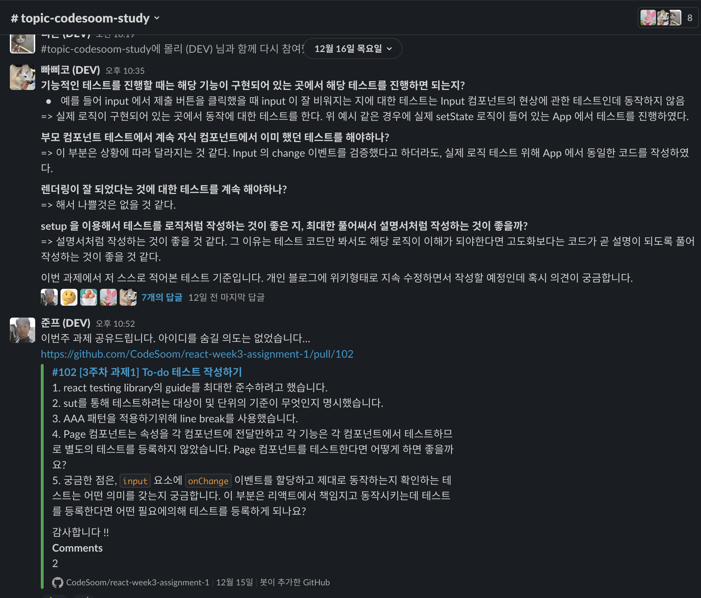

그리고 이를 활용해서 매주 화요일에 전주에 진행한 서로의 과제들을 리뷰하는 시간도 가졌다.  
이 리뷰하는 시간에 한가지 주제로 기술적 토론이 발생하다보니 서로의 Context를 맞출수 있었다.  
  
추가적인 부수효과도 있었다.  
의도한 것 중 하나가, 이 과정을 듣는 다른 분들에게 **인프런이라는 회사는 이렇게 구성원 전체가 성장하는 습관**을 가지고 있음을 어필하는 것이였다.

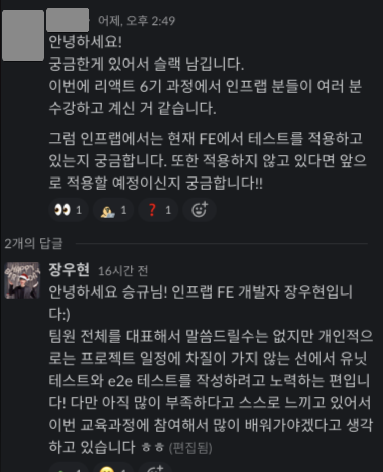

이 부분 역시 조금 효과를 본 것 같아서 내심 뿌듯했다.

## 총평

4월부터 12월까지 해왔던 점들을 곱씹어본다.

### 잘했던 점

* 첫 한달동안 뭔가 보여줄려고 나대지 않았던 점
  * 초장부터 이 코드는 이렇게 작성하면 안된다, 아키텍처가 이래선 안된다 라고 했으면 구성원들의 신뢰를 못얻었을것이다.
* 개발파트 전체 인원의 1 on 1을 2~3회 진행했던 점
  * 충분히 많은 대화를 자주 해서 좀 더 가까운 관계를 형성했다고 생각한다.
* 기술 부채 개편에 대한 전략을 자주 공유했던 점
  * "이 기술 부채에서 빠져나갈 수 없을 것이다" 라는 생각이 들어서 퇴사하는 스타트업 개발자들을 많이 봤다.
  * 이 기술 부채들은 해결가능하고, 어떻게 해결할 것인지 구체적으로 로드맵을 자주 공유했다.
  * 솔직히 배민 기술 부채에 비하면 이건 기술 부채도 아니다.
    * **배민의 시니어들이 여기 없다는 것이 함정**이지만
* 대표님과 끝까지 토론을 이어나간 점
  * 대표님과 충돌나는 부분에 대해서 결국 둘 중 하나가 완전히 설득될때까지 끝까지 토론했던 점이 좋았다.
  * 이게 없었다면 찜찜한 마음으로, 미지근한 마음으로 일을 추진했을 것이기 때문이다. 
  * 이 부분에 대해서는 [사내 회고](https://doc.clickup.com/d/3gfz7-5843/log/3gfz7-85685/%ED%96%A5%EB%A1%9C)에 자세히 나와있다.
* 신규 스택에 대해서 직접 다 구성해보고 개선해본 점
  * 코드리뷰나 조언을 할때 뇌피셜로 하지 않고, 실제로 다 해본 것을 토대로 이야기를 해줄 수 있었다.

### 잘못한 점

* 프로덕트 파트 (개발/PO/디자인/데이터) 전체를 챙기지 못하고 개발 파트에만 치우쳐져 있었던 점
  * 차라리 다 힘들면 모를까, 개발파트가 하나씩 정리되고 성장하는걸 다른 파트는 옆에서 실시간으로 보고 있었다.
  * 시니어가 없는 파트는 상대적 박탈감을 더 느끼게 됐다.
* 프로젝트 구성원의 건강 체크를 소홀했던 점
  * 프로젝트 진행 중에 한분이 병원에 입원하게 되었다.
  * 개인이 느낀 부담감과 스트레스가 이유라고 듣긴 했지만, 안색을 살피거나 잡담을 자주 하면서 상태 체크를 자주 했었어야 했다.
    * 지금은 완전히 회복하셨다.
* 나의 건강 관리를 잠깐 소홀했던 점
  * 신규 프로젝트의 막바지 (12월)쯤 되어서 멀미와 두통으로 1.5일을 그냥 날렸다.
  * 몰아치고 망가지는 것 보다는 평소에 꾸준한게 더 좋은 방식인걸 알고 있음에도 막상 프로젝트 일정이 뒤로갈수록 더 빡빡하게되서 놓쳐버렸다. 
* 재택 보다 **오프라인 출근이 더 성장하기 좋다는 분위기**를 만들어 버린 점
  * 출근하면 직접 모니터링을 보면서 내가 어떻게 IDE를 사용하는지부터 좀 더 디테일한 설명까지 포함해서 코드리뷰가 진행되었다.
  * 반면에 온라인 코드리뷰는 그만큼의 Context가 없었고 코드에 대해서만 다루다보니 전체적으로 출근하는 것이 더 성장하기 좋다는 뉘앙스가 은연중에 팀에 정착되어버렸다.

여러 잘한점들은 언급했지만, 구성원분들에게 **기대가 되는 미래를 보여줬다**는 건 정말 잘한이라고 생각했다.

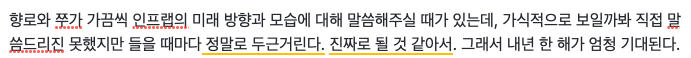

진짜로 언급했던 미래의 모습이 되도록 할 예정이다.

## 마무리

내년에는 CTO로서 추진하는 크게 3가지가 있다.

* 기술 블로그 활성화
* 외부 개발자분들을 모셔서 정기 사내 세미나
* 시니어 개발자 채용

이것외에도 신규 프로젝트들도 줄비하다.  
내년에는 더 할 얘기가 많을것 같다.  
벌써 2022년 1월 1일이다.  
초보 CTO 2년차 시작이다.