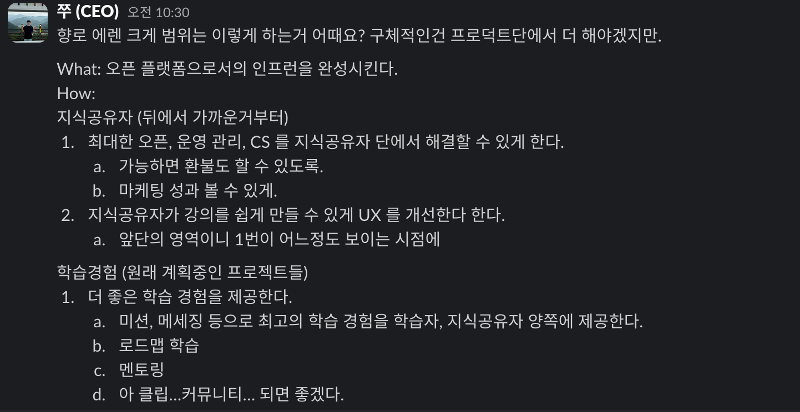
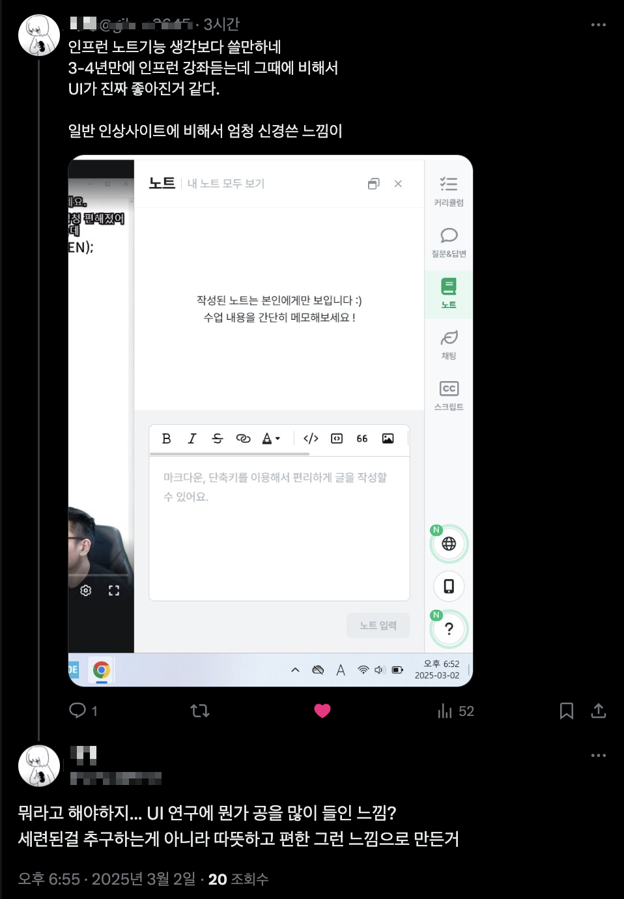
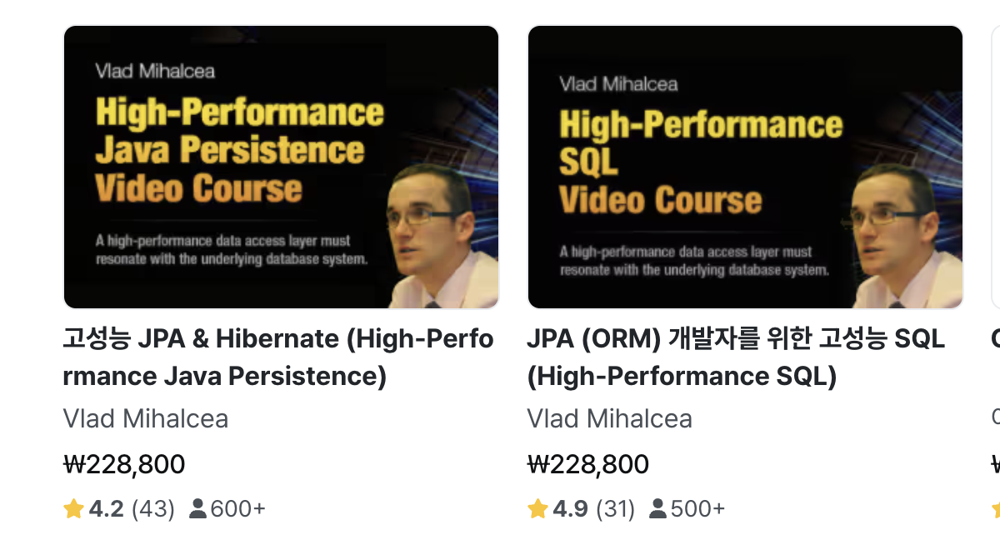
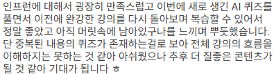
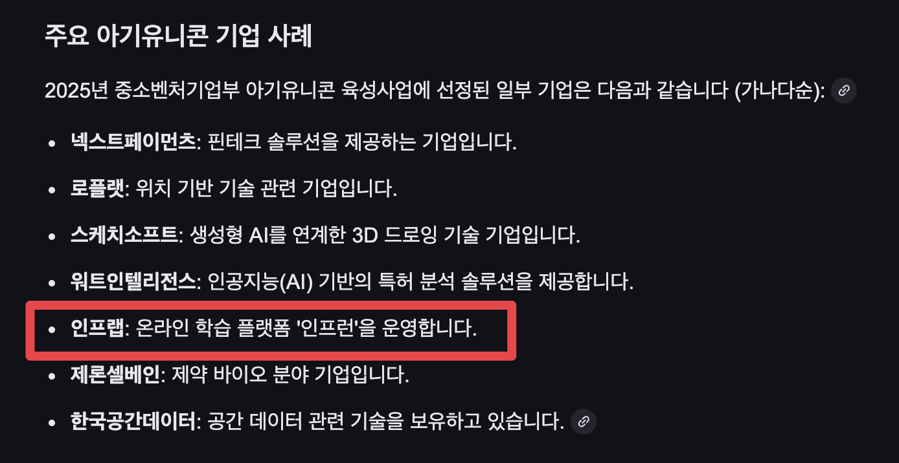
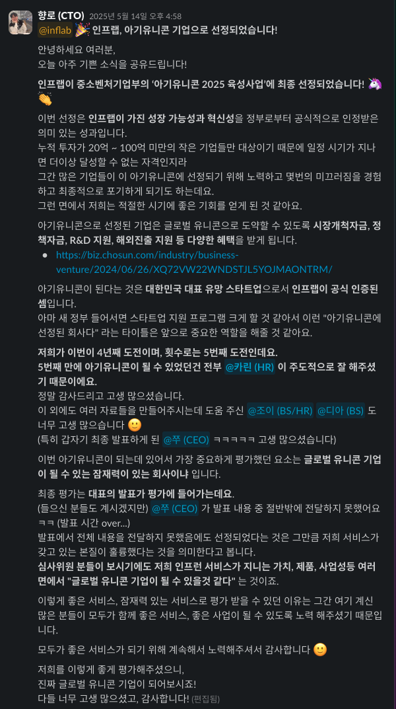
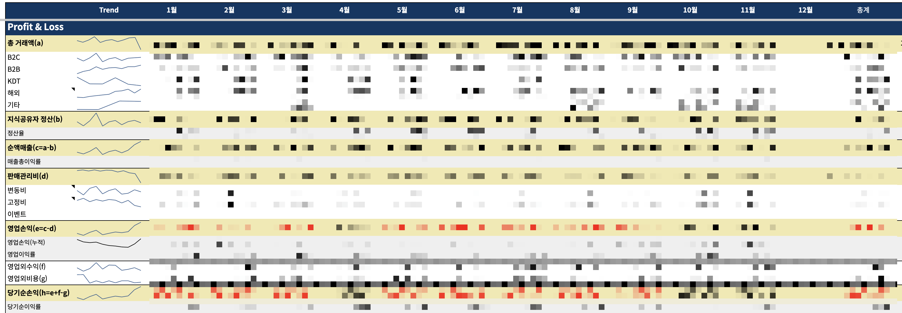
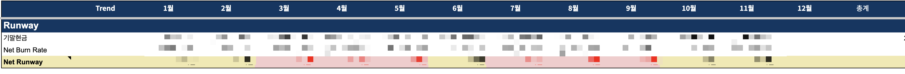
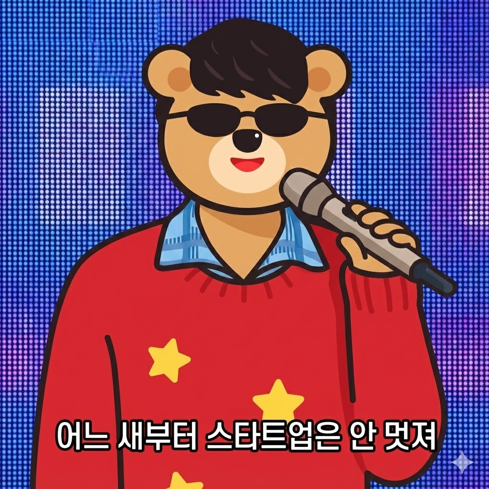

# 2025년 CTO 회고

올 하반기 지인에게서 책 하나를 선물 받았다.  
그 책의 제목에 이끌린 와이프가 먼저 읽어 봤다.  
절반정도 본 와이프는 "남을 위로하기 위해 썼지만, 정작 본인도 아직 우울증을 극복하지 못한 것 같아. 그래서 더 못보겠어." 라며 더이상 그 책을 펴지 않았다.  
  
...

올해 내 회고가 읽는 사람으로 하여금 같은 느낌을 주진 않을까 하는 생각이 들었다.  

타인을 위해 회고를 쓰는 건 아니지만, 굳이 부정적인 감정을 세상에 전파하는 건 좋지 않다고 생각한다.  

그럼에도 올해의 여러 감정선들과 결정들을 기록으로 남겨두는 것이 좋겠단 생각이 들어서 하나하나 정리하기 시작했다.

## 1월부터 12월까지

### 1월

- `페이팔` 결제수단 추가
- 노션, 링크드인 프로필 랠릿 import 기능 추가

데이원컴퍼니의 상장으로 성인 교육 시장에 대한 평가가 급물살을 타게 됐다.  
특히나 AI 발전으로 개발/프로그래밍 분야에 대한 교육 시장이 급격히 줄어들 것 같다는 위기감이 커졌다.  

개인적으론 **누구나 다 AI와 프로그래밍을 배워야하는 시대**로 전환되고 있어서 프로덕트 메이커로 한정된 시장에서 이제는 엑셀/파워포인트와 같은 모든 사람들을 위한 시장으로 더 커질 것으로 생각한다.  
다만, 장기적으로는 앞으로가 더 기회가 많을 것 같다고 보지만, 당장의 눈 앞의 시장 반응은 개발 교육, 성인 교육 시장의 위기로 보고 있으니 그에 대한 대응책이 필요했다.  
  
그래서 올해를 플랫폼 확장의 시작으로 잡았다.  
  
#### 영문 페이지 + 페이팔 오픈

2024년 동안 진행했던 글로벌 전환 프로젝트 (a.k.a Doctor Strange) 가 완전히 오픈되었고, 해외 카드 결제에 이어 페이팔 결제수단도 완전히 오픈 되었다.  

- 한글/영문으로 모두 사용할 수 있는 서비스
- 한국어/영어 2가지 버전으로 사용할 수 있는 자막/더빙 
- 해외카드/페이팔 결제수단

해외로 확장할 수 있는 최소한의 준비는 완성되었다.

#### 총액법 -> 순액법

티몬/위메프 미정산 사태로 회계상 매출 인식이 좀 더 명확할 필요가 있어서 기존 `총액법` 으로 관리되던 방식을 `순액법`으로 변경했다.  

정산 흐름을 변경하는 것도 필요하고, 회계 방식 변경도 필요했다.  
작년부터 준비를 조금씩 하다가 올해 시작을 기점으로 전환했다.  

- [매출 총액과 순액의 세계](https://www.venturesquare.net/875382)  

거래액이 줄지 않았지만 신고되는 매출이 총액 -> 순액이 되어서 서비스가 역성장한 것처럼 보였다.  
채용공고나 기타 회사 소개 자료에 총액 -> 순액으로 변환되었음을 함께 고지했다.

#### 인프콘

올해는 인프콘을 하지 않기로 결정했다.  
작년 12월 초까지는 작게라도 하는 것이 좋지 않을까 이야기하다가, 2024년 전체 실적이 결산되고 나서 올해 인프콘은 하지 않기로 결정했다.  
  
인프콘을 한번 하는데 필요한 회사적 에너지나 자본이 현재 시기에서는 투입하기 어려울 정도로 높다.  
그만큼 올 한해가 회사적으로 정말 집중해야할 시기가 되었다.  
  
다만, 한번도 인프콘을 경험하지 못한 신규 입사자들의 입장에서 기대감을 꺾은 것 같아서 죄송했다.  
회사가 좋은 실적을 내고 나서 성대하게 하자고 이야기 드렸다.

결정은 1월에 했지만, 서비스 공지는 6월에 했다.  
- [인프콘 2025 쉬어갑니다!](https://inf.run/Pj9vp)

3년간 진행된 인프콘을 쉴 만큼 올 한해는 좋은 실적을 내야만 하는 시기였다.

### 2월

- 인프런 일본어/베트남어 환경 오픈
- 앱 대시보드 개편
- 지식공유자용 쿠폰 발행 기능 개편
- 강의실 레이아웃 개편
- 앱 줌인/줌아웃 기능 추가

#### 베트남 & 일본 시장

영어에 이어 일본어, 베트남어로도 인프런을 사용할 수 있도록 국제화가 확장 되었다.  
베트남은 국내의 대기업들이 앞다투어 소프트웨어 센터를 확장하고 있는 국가이다.  
국내 대비 낮은 개발자 몸값과 근면성실한 사람들, 한국과 비슷한 가치관등으로 대기업들이 개발자를 확보하기 좋은 환경이다.  
  
한국 대기업들의 복지, 처우가 좋기에 베트남의 개발자들에겐 미국의 빅테크 다음으로 입사하기 좋은 기업들로 평가 받는다는 이야기를 들었다.  
그래서 한국의 소프트웨어 개발 방법론을 배우고자 하는 예비 개발자, 경력 개발자들이 많기에 우리의 개발 강의들이 충분히 수요가 있다고 봤다.  

영어, 일본어, 베트남어, 한국어를 포함한 4개 국어로 서비스를 사용할 수 있게 되어 본격적으로 글로벌 시장 확장을 시도할 수 있게 되었다.  
  
유니티, 언리얼과 같은 게임 개발과 자바/스프링으로 진행되는 JVM 백엔드 분야는 세계 어디와 비교해봐도 국내 개발자 분들이 경쟁력이 있다.  
그리고 이 2개는 국내에서 우리보다 더 좋은 콘텐츠를 가진 회사가 없기에 글로벌은 이쪽 부분에서 가능성이 있다고 봤다.  

#### 완전한 오픈 플랫폼 전환 시작

국내 시장이 워낙 작기에 버티컬로 1등을 했다면, 그 분야를 중심으로 확장해나가지 않으면 안된다.  
우린 국내에서 개발/프로그래밍에 한해서 1등이지만 그것만으로는 시장의 크기가 너무 작다.  
  
그래서 
- 개발/프로그래밍 분야로 글로벌 확장
- 개발/프로그래밍 분야 외 넓은 카테고리로 국내 시장을 확장 

투 트랙 전략을 취하기로 결정하고 사내에 공유했다.  

국내에서는 타 교육 서비스들처럼 MD/PD 가 제작에 강력히 참여하는 형태가 아닌 **완전한 오픈 플랫폼으로 카테고리 확장**을 해야만 한다고 봤다.    
카테고리 확장을 시도하되, 기존 서비스들처럼 MD/PD의 관여가 필요한 형태로는 해서는 안된다고 생각했다.  
  
MD/PD 주도하에 콘텐츠 생성하는 방향은 절대적인 단점들이 존재한다.

"콘텐츠 출시 속도가 MD/PD 의 인원수에 비례한다는 것"
"해당 분야의 지식이 있는 MD/PD가 없다면 사실상 해당 콘텐츠 출시가 어렵다는 것"
  
**일정 궤도에 오른 스타트업에서는 사람에 비례하는 속도로 성장하는 방향은 절대 하면 안된다**는 생각을 갖고 있다.  
스타트업으로서 계속 폭발력을 가지려면 사람에 비례하지 않는 성장 방향으로 결과를 내야한다.  
  
그러기 위해서 콘텐츠, 교육 서비스 치고는 드물게 전체 인원의 50%를 프로덕트 조직 (PM/디자인/개발) 으로 구성하고 있었다.  
폭발력은 제품력과 기술력이 있어야만 하고, 그게 경쟁사 대비 우리가 갖는 큰 장점이다.   
  
결국 유튜브나 인스타처럼 누구나 콘텐츠 기획자/MD의 관여 없이 출시할 수 있는 완전한 오픈 플랫폼으로 제공하는 것을 목표로 삼았다.  

내가 갖고 있는 지식을 나누고 싶을때 언제든 나누고 배풀 수 있는 자율성과 접근성을 가지되, 문제가 될만한 여지가 있는 콘텐츠는 자동으로 걸러낼 수 있는 시스템을 갖춘 플랫폼.  
  
이 목표를 위해 전사 프로젝트를 띄었다.  
프로젝트 이름은 A,B,C,D 다음인 E로 시작하는 Eren Yeager (에렌 예거)로 삼았다.

#### 2월의 실적

2월의 실적이 생각보다 좋지 않았다.
Bun Rate를 보면서 쭈와 이야기하는 빈도수가 점점 늘기 시작했다.

### 3월

- `식물 키우기` 오픈
- `멘토링 상세 페이지` UI/UX 개선
- `미션` 기능 오픈
- `로드맵 강의실` 기능 오픈
- `비인증 결제` 추가
- `채팅` 서비스 오픈

전사의 방향성이 정해지고, 기대하던 글로벌 전환도 끝나서 본격적으로 다시금 제품 고도화에 속도를 냈다.  

#### 식물 키우기

많은 앱 서비스들이 하는 XX키우기류를 인프런 앱에도 추가했다.  
인프런은 개인의 성장을 돕는 서비스이기 때문에 학습+자라나는 나무를 컨셉으로 잡았다.  

또우와 율무가 베타 시연을 해주는데 너무 이쁘게 잘나와서 다 같이 신나했다.  
빨리 이거 런칭하자고 주변에서 먼저 난리였다.  

인프런은 어떤 서비스인가를 굳이 대놓고 어필하기 보다는 이렇게 자연스럽게 버튼 하나, 기능 하나에서 느껴지게 하는 것이 좋은 제품 브랜딩이라고 생각한다.  
  
그런면에서 강의를 구매한 만큼이 아니라 학습한 만큼 나무가 자란다는 컨셉은 지금 봐도 브랜드 톤을 잘 유지한 방향성이라고 느꼈다.  
  
#### 트위터

콘텐츠 커머스가 아닌 교육 플랫폼이라는 것을 체감하시는 고객분들의 SNS 코멘트가 늘어났다.  

자주 트위터에 인프런을 검색하게 됐다.

#### 3월 실적

1분기 실적을 결산했다.  
2023, 2024와 비교해서 올해 1분기 실적이 가장 안좋았다.  
2년전 보다 못한 분기 실적을 달성하는 스타트업의 C레벨은 스물스물 비용 절감을 먼저 떠올린다는걸 체감하게 되었다.  
  
영업이익을 많이 남겨 현금 흐름이 괜찮지만 성장성은 포기한 기업을 스타트업이라고 부를 순 없다는 생각을 했다.  

비용 절감은 계속 뒤로 미루고 애써 실적을 더 키울 방법에 대해서 계속 더 고민했다.  

### 4월

- [Vlad Mihalcea 님의 강의](https://inf.run/j8dRN) 오픈
- 멘토링 목록 UI/UX 개선
- `AI 퀴즈` 오픈
- 강의실 `자동 메세지` 기능 추가

#### Vlad님 강의 오픈

자바 챔피언이자 하이버네이트 메인 기여자인 [Vlad Mihalcea 님의 강의](https://inf.run/j8dRN)를 런칭했다.  

 

[예전의 인연](https://jojoldu.tistory.com/825) 때문에 Vlad님의 강의를 항상 주변에 많이들 추천했다.  
그럼에도 생소한 플랫폼, 한국어 미지원 등으로 시작하기 어려웠다.  
인프런이 국제화가 끝나면 가장 먼저 소개해주고 싶었다.  
다행히 Vlad님과 협업을 하게 되어 한국, 일본, 베트남 모두에게 강의를 소개해줄 수 있게 되었다.  
루나, 애시, 오뜨, 제나, 제이크와 함께 단기 TF를 구성해서 짬짬이 시간내서 이벤트와 함께 강의를 오픈했다.  
MD, 마케팅, 콘텐츠 디자인, 개발 4개 직군이 사이드 프로젝트처럼 진행했을때의 파괴력을 봤다.  
  
높은 목표를 가지고 달렸음에도, 그 목표보다 더 높은 성과가 나와서 그 과정을 전사에 공유했다.

#### AI 퀴즈

자막, 번역, 더빙에 이어 **AI를 활용한 자동 퀴즈 생성 기능**을 런칭했다.  
학습-성장의 루프에서는 결국 `검증` 이 필요한데, 이걸 지식 공유자분들이 직접 생성하고 관리하시기에는 너무 귀찮은 일이 될 것 같았다.  
일단 내가 지식공유자 입장이라도 매 섹션마다 퀴즈를 만들어야 한다면 만들지 않을 것 같았다.  
또한 지식공유자분들이 직접 퀴즈 내용을 수정하고 답안을 수정하는 기능도 넣지 않기로 했다.  
  
생성, 수정 기능을 넣게되면 출시 일정을 늦춰야하는 것도 있었지만, 그 기능을 거의 사용하지 않을 것 같았다.  
퀴즈 내용에 오류가 있고, 잘못이 있다면 그건 그걸 만들어낸 플랫폼이 책임지고 대응하면 되는 일이고 그래야만 지식 공유자분들의 부담이 줄 것 같았다.  
만약 직접 수정하셔야하는 상황으로 가게 되면 오히려 다 OFF 해달라고 할 수도 있다고 생각했다.

지식 공유는 쉽고 편해야하는데, 자꾸 뭔가 해야하는 허들이 높아지면 카테고리 확장이라는 목표를 달성할 수 없다고 봤다.

강의 내용에 대한 이해를 평가하는 것 그 이상, 좀 더 생각할거리를 주는 그런류의 질문을 수강생에게 던지는 것이 지식 공유자분들의 몫이라고 생각했다.  
그리고 그건 이후에 출시할 `미션` 기능으로 해소해야한다고 봤다.  

그래서 지식공유자분들이 퀴즈를 생성하고, 수정하는 것은 초기 스펙에 넣지 않고 AI가 만들어내는 퀴즈의 퀄리티와 답변의 정확도를 높이는데 에너지를 많이 들였다.  
  
담당자인 구피가 엄청 많은 공을 들였다.  
구피의 경우 DevOps로 입사했는데, 회사의 사정상 **AI를 활용한 기능 개발**의 중심역할을 하다보니 본인의 역할에 대한 고민을 정말 많이 했었다.  
  
그럼에도 한번 맡은 역할에 대한 책임감이 대단히 뛰어나서 정말 좋은 퀄리티로 퀴즈 생성 엔진을 구현해주셨다.  

#### 자동 메세지

에렌의 여러 과제 중 하나인 자동 메세지가 런칭되었다. 

지식 공유자분들이 원하는 상황일 때 원하는 형태의 메세지를 노출 시켜줄 수 있는 것은 굉장히 큰 무기이다.  
유튜브의 우측 상단에 특정 시점에 클릭가능한 메세지를 노출시키는 것처럼 인프런 내에서도 활용할 수 있게 해준다.  
  
영상을 따라가다가 자주 실수하는 지점에서 실수할 부분을 미리 안내해주시기도 하고, 특정 소프트웨어 설치시 버전 이슈가 될 것 같으면 그에 대한 해결책 링크를 노출시키기도 한다.  
  
활용도가 너무나 높기에 꼭 해야할 프로젝트라고 봤다.  
  
진행 담당자인 학습 독려 Cell에서 많은 고민을 했던 프로젝트였다.  
이걸 왜 해야하느냐부터 꼭 강의실 내 노출로 가야하느냐, 꼭 이런 컨셉이어야 하느냐 등등 굉장히 다양한 의견이 있었다.  
**로마 격투장과 같은 토론의 장이 열리기도 했다**.  
(잘 지내시죠 빠삐코....?)  
   
논의는 길었지만, 결정이 되고나서 런칭까지는 빠르게 완료 되었다.  
런칭 후 정환님이 극찬해주셨다.  

#### 4월 실적

만우절 천원샵, 전사할인, [영한님의 신규 강의 오픈](https://inf.run/nPgFf), Vlad님의 강의 오픈 등 여러 겹경사가 겹쳐 높은 실적이 나왔다.  
2025년 통틀어 가장 높은 실적이였다.  
  
오랫만에 사내에 좋은 분위기가 흘렀다.

### 5월

- 강의 제작 여정 레거시 -> 신규 스택 (React/TS/Mantine) 완료
- `네이버페이 직연동` 전환
- 앱 내 질문/답변 기능 추가
- [아기유니콘 선정](https://zdnet.co.kr/view/?no=20250527084817)

#### 간편결제 직연동

토스페이먼츠의 결제위젯을 유지한채 주요 결제 수단들 (네이버페이, 토스페이) 은 직연동으로 전환하기 시작했다.  

토스페이먼츠의 결제위젯은 결제수단 하나하나를 연동하는데 들어가는 공수를 줄여주는 아주 좋은 결제 플랫폼이다.  
우리 같이 별도의 결제/정산 팀을 구축할 여력이 없는 팀에게는 결제위젯이 주는 운영/도입 편의성이 크다.  
  
다만, 그럼에도 아쉬운 점이 많았는데, 직연동에 비해 각 결제수단들의 혜택을 100% 활용할 수가 없었다.  
  
- 직연동이 아니면 후불결제(BNPL)를 사용할 수가 없다.
- 카드 + 머니/포인트와 같은 복합결제를 사용할 수 없다.
- 각 간편결제사의 결제 혜택 프로모션을 지원 받기 어렵다.

특히 법인카드나 교육비 환급이 지원되는 직장인 경우 1~5천원의 비용 초과로 강의 결제를 못하는 경우가 문제였다.  
  
카드로 5만원을 결제하고 나머지 소액은 충전형 머니/포인트로 결제하면 되는데 복합결제가 지원되지 않는 결제 위젯으로는 카드 or 머니/포인트로 밖에 할 수 없어서 위 같은 경우 계속해서 고객 이탈이 발생했다.  
  
운영/관리의 이슈가 발생하더라도 결제 이탈 유저들을 붙잡는게 중요하다 생각했다.  
  
네이버페이에서도 직연동에 대한 프로모션을 지원해주셔서 좋은 결제 혜택을 유저분들께 제공할 수 있었다.  

#### 아기 유니콘

카린의 하드캐리로 정부에서 선정한 아기유니콘이 되었다.

우리 팀은 정부 과제와 심사에 능숙한 팀이 아니다.  
그래서 이런 정부의 지원 프로그램은 최대한 배제한채로 움직였는데, 아기 유니콘의 경우 워낙 선정의 가치가 크다보니 얻고 싶었다.  
그래서 그 전부터 아기유니콘 심사를 계속 신청했지만 번번이 떨어졌다.  

그러다 다양한 경험을 갖추고 있는 카린이 팀에 합류하면서 정부 프로그램에 대해서도 경쟁력을 갖출 수 있게 되었다.
  
> 카린은 정부 프로그램뿐만 아니라 글로벌 콘텐츠 수급과 마케팅도 함께 하고 있다.  
스타트업에서 필요로 하는 다방면의 역량을 갖추고 있어서, 우리팀의 강력한 무기 중 하나라고 생각한다.

무조건 대표자가 발표를 해야하다보니 어쩔 수 없이 쭈가 발표를 하게 됐다.  
긴장한 나머지 준비한 모든 발표를 전달하지 못해서 걱정이 많았는데, 진정성이 잘 전달된 것 같다.    
  
선정되고나서 대대적으로 공지사항으로 전체 팀원에게 공유하고 축하의 전사 간식 시간도 가졌다.  

  
#### 5월 실적

4월의 높은 실적, 아기유니콘 선정 등 좋은 소식이 계속 이어졌지만, 5월 실적이 매우 좋지 않았다.  
**2022년 이후 최악의 실적이였다**.  
이런 실적이 2번만 더 나오면 회사가 망할 수도 있을 정도였다.  
  
회사가 추구하는 극도의 투명함이 오히려 불안함을 더 증폭시키고 있다고 느꼈다.  
  
우리팀은 극도의 투명함을 지향하고 있기 때문에 **전사의 재무제표**를 모두에게 공개하고 있다.  
**Bun Rate** 까지도 공개하고 있다.

그러다보니 팀원들 모두가 현재 회사의 사정이 어떤지 다 알고 있었고 그로 인해 불안감이 스물스물 올라왔다.  
  
그렇기에 좋은 소식들을 지속적으로 공유하지 않으면 팀 전체가 불안감에 잡아먹힐 것 같았다.  
  
5월 매출이 결산된 6월엔 빠삐코를 중심으로 FE 개발자들끼리 회사가 돈을 벌려면 어떻게 해야할까에 대해 이야기를 나눴다는 것을 알게 됐다.

쭈와 매주 함께하는 목요일 점심 식사 시간의 대화주제가 점점 변했다.  
성장, 플랫폼, 확장, 글로벌 -> BEP, Runway, 비용절감으로.  
  
쭈가 외부 미팅을 다녀온 뒤에 4분기 분기 흑자를 꼭 달성해야하는 상황이 되었음을 설명했다.  
남은 잉여현금으로는 18개월이상은 생존가능했지만, 이것과 상관없이 증명이 필요했다.  
  
4분기 분기 흑자 달성을 위해 필요한 것은 결국 비즈니스 모델의 확장이였다.  

좋은 학습 환경, 성장 환경에 대한 개선은 잠깐 속도를 줄이고, 비즈니스 모델을 확장하는 프로젝트를 시작하게 됐다.  

- B2B 구독제
- 마케팅 파트너스 (어필리에이트 마케팅)
- 챌린지

플랫폼이 충분히 파괴력이 생기기 전까지는 비즈니스 모델을 계속 확장해나가는 걸 최대한 피하고 싶었다.  
그럼에도 더 미룰 수 있는 상황이 아니였기에 극단적인 일정 단축과 MVP 로 프로젝트를 시작하게 됐다.  
  
회사의 위기감에 모두가 동조된 상태라 R&R에 상관 없이 할 수 있는 여력이 있는 Cell이 각 프로젝트를 맡아서 진행했다.  
  
특히 랠릿과 멘토링을 담당하는 커리어 Cell이 마케팅 파트너스를 담당하게 됐을 때 조직적으로 아쉬워하는 것이 느껴져서 죄송했다.  
PM인 라떼가 최대한 긍정적으로 상황을 해석하고 Cell원분들을 달래주셨다.  
  
지난 시간 동안 우주, 라비, 하루 등의 퇴사와 협업 등을 경험하면서 라떼가 굉장히 단단해지셨다는게 느껴졌다.  
  
각 조직의 PM 분들을 믿고 온전히 실적과 고정비 절감에 대해서만 집중하기 시작했다.

### 6월

- EKS 전환 완료
- 앱 내 더빙 추가
- [B2B 구독제](https://inf.run/w3BZV) 오픈
- 랠릿 `인재풀` 오픈
- `강의 개설` 완전 자동화

#### EKS 전환

선비의 하드캐리로 ECS EC2 -> EKS로 전환이 완료되었다.  
올해 초부터 선비가 EKS로의 전환을 계속해서 제안했다.  
난 시기상조라고, ECS EC2를 최대한 더 길게 사용하자고 거절했다.  
  
예전부터 선비는 조직이 항상 단단하게 기반을 다지는 것의 중요성을 얘기했다.  

반대로 나는 언제 어느때든 없어질 수 있는 것이 스타트업이고, 2년뒤, 3년뒤에 지금보다 더 서비스가 커질지 아예 축소될지 알 수 없기 때문에 미리 기반을 단단하게 작업하는 것에 대해서 이르다는 생각을 전달했다.  
  
뿐만 아니라 서비스 전체의 기반이 되는 플랫폼을 전환하는 것이 얼마나 큰 작업인지 알기에 DevOps의 리소스를 거기에 몇달간 투자하는 것은 큰 모험이였다.  
  
우리 팀의 DevOps는 **비즈니스 구현을 제외한 모든 것을 하는 조직**이다.  
DevOps, SRE로서의 역할을 하는 것은 물론, DBA/네트워크 엔지니어/보안팀, 더 나아가서는 사내 인터넷 관리, 출/퇴근 기기 관리, 아틀라시안과 같은 사내 SaaS 관리를 하는 IT 서비스팀으로서의 역할, 각종 서비스에 들어가는 AI의 코어 구현까지 하는 AI 엔지니어로서의 역할도 함께 한다.  
  
그러다보니 전체 개발자 30명 중 6명(20%) 을 DevOps로 둘 정도로 비중으로는 높게 있어도 항상 리소스가 부족하다.  
  
EKS로의 전환 보다는 더 비즈니스에 필요한 역할에 에너지를 쏟기 위해 계속해서 EKS로의 전환을 반대했다.  
  
내가 거절할때마다 선비는 더 조사하고, 더 공부하고, 더 숙련도를 높여서 더 나은 제안을 가져왔다.  
**본인 혼자서 해도 전체 인프라를 EKS로 전환하는데 2달 이내로 끝낼 수 있다**는 확신이 들었을 때 선비는 한번 더 제안을 했다.  

난 선비보다 EKS 전환에 대해 깊게 고민하는 사람이 아니였기에 선비 같은 판단력을 가진 사람이 이정도로 고민하고 준비했다면 그러면 밀어주는게 맞다고 생각했다.    

> 과거에도 IaC를 발전시켜나가는 과정에서 난 Terraform을 가능하면 계속 유지하자는 쪽이였고, 선비는 Pulumi로 전환하자는 파였는데, 결국 선비의 말이 맞았다.
  
물론 특정 개인이 열심히 했으니 노력에 대한 보상 차원에서 허락한다는 그런 유치한 감정은 아니다.  
**조직과 서비스에 결국 +효과가 얼마나 크냐가 항상 기준이였고, 선비의 마지막 제안 시점은 비용 절감이 핵심과제**가 될 때였다.  
  
이미 우리는 S3, CDN, RDB 에서는 줄일만큼 줄였다.  
더 줄일 여력은 EC2 쪽이였다.  
  
EKS로 전환이 완료되면 
- Karpenter 를 통한 극단적인 EC2 효율화 
- 서비스 매시로 인한 private 로드밸런서들의 정리 
- VPC/서브넷 정리 

등등으로 큰 비용효과를 볼 수 있었다.  
  
뿐만 아니라 완전한 GitOps 환경 전환, [PR Preview 도입](https://tech.inflab.com/20251121-pr-preview/)과 같은 전체 제품 출시 과정의 개선을 위해선 꼭 필요했다.
  
다만, 선비는 혼자서 가능하다고 했지만 조직적으로는 선비가 혼자서 100% 하는 것은 진행과정에서도, 완료 이후에도 리스크가 크다고 판단했다.  

- 선비가 갑자기 아프면 EKS 전환 과정 전체가 멈추게 되는 리스크
- 전환 이후에 선비가 부재이면 관리할 수 있는 사람이 없다는 리스크 

등등.  
  
그래서 제이스와 함께해서 2명이서 2달 이내로 전환하는 것으로 결정하고 나머지 조슈아, 제이크, 구피, 포카가 최대한 커버하기로 했다.  
  
선비, 제이스는 DevOps 내에서도 운영 티켓을 많이 처리하던 사람이였기에 이 시기에 구피, 포카가 운영 업무 숙련도를 쌓는 계기가 되기를 원한 것도 있었다.  
  
약속대로 선비는 제이스와 함께 6월에 EKS 전환을 완료했다.  
특별히 큰 장애 없이, 무중단으로 말이다.  

EKS 전환이 완료됨으로 AWS 비용이 크게 개선되었다.  
EC2/로드밸런서/VPC/서브넷에서 감소되는 비용이 높아서 1월 대비해서 연말에는 거의 30%가 절감되었다.  

쿠버네티스 환경으로 전환됨에 따라 특정 클라우드 벤더사에 종속되지 않고 다른 클라우드벤더, 온프레미스 환경까지도 쉽게 확장해서 쓸 수 있게 되었다.  
  
AI 자막, AI 더빙, (이후 진행된) AI썸네일, AI 강의소개 등을 모든 영상에다 작업하는 것은 큰 비용이 드는데 그럴때마다 클라우드 뿐만 아니라 온프레미스에서도 저렴한 GPU 서버를 구할 수 있을때마다 클러스터를 확장해서 저렴하게 AI 작업들을 수행했다.  
  
내 우려와 달리 이번에도 선비가 맞았다.  
선비는 항상 스스로 증명하는 사람이라서 매번 감사하다.  
  
#### B2B 구독제

[B2B 구독제](https://inf.run/w3BZV)를 런칭했다.  

단건 결제 (실비 정산)만 가능했던 B2B 서비스를 확장해서 기업이 구독으로도 인프런 교육을 들을 수 있도록 비즈니스 모델을 확장했다.  

구독제에 관한 이야기는 입사했던 2021년부터 계속 있었던 주제였다.  
콘텐츠, 교육이라는 도메인에서 결국은 기업, 단체에서 원하는 것은 **예상 가능한 교육비**였고, 그런 의미에서 단건 결제 (실비 정산) 방식은 교육비를 예상하기 힘들다.  
  
구독제가 없다는 것이 B2B Sales에서 항상 병목이였단걸 알지만, 쉽사리 도입하진 못했다.  
  
한 건이 판매가 되면 전체 강의 금액을 수취할 수 있는 것과 별개로 구독제는 재생시간에 비례해서 수강생의 구독료를 1/N 하는 방식이다.  
한 건의 판매로 온전히 수강료를 수취하는 것이 아니라, 수강을 해도 당장엔 적은 금액만 수취할 수 밖에 없다.  
  
그러다보니 지식공유자분들께 진짜 도움이 되는 비즈니스 모델인지에 대한 고민이 많았다.  
  
강의 학습 데이터를 확인하고, 좋은 콘텐츠는 수료 이후에도 계속 반복 학습 한다는 것을 알게 됐다.  
  
한 사람에게 5만원의 강의를 판매하고 이후에는 더이상 수익이 없는 것과 한 사람이 재생할때마다 일정 수익이 계속해서 발생하는 것을 생각해봤다.  

콘텐츠를 재생할때마다 계속 수익이 가능하니 시간이 길어질수록 더 높은 누적 수익을 드릴 수 있는 방법이였다.  
구독제도 수강생/지식공유자 모두에게 이득이 될 수 있다는 확신이 생겨서 프로젝트를 시작하게 됐다.   
  
프로젝트의 중심 축은 `정산`에 두었다.

- 어떤 방식으로 재생 시간을 추적하고
- 측정된 재생 시간을 기반으로 어떻게 정산해줄 것인가

이 2가지가 핵심이였기에 구독제 TF는 정산 PM인 로이와 강의 플레이어 PM인 보니를 중심으로 두고 진행했다.  
  
런칭 이후 여러 부트캠프와 KDT 교육 업체에서 기수별 구독을 가입해서 이용하길 원하셨다.  

요 최근 2년간 런칭했던 프로젝트 중 비즈니스 임팩트를 즉시 낸 몇 안되는 프로젝트여서 기뻤다. 

#### 6월 실적

4월의 실적이 좋았기에 2분기 합산 실적은 최근 2년 중에선 가장 좋았다.  
다만, 4월의 실적만으로 이루어진 셈이고, 5~6월은 오히려 더 줄었다.  
  
4월처럼 여러 이벤트가 겹경사로 생기는 일은 우리 통제 밖에 있는 경우가 많기에 하방선을 얼마나 단단하게 지킬 수 있냐가 중요했다.  
  
올해 2월, 5월 우리의 하방선이라 생각했던 지지선보다 훨씬 낮은 실적이 나왔다.  

쭈가 외부 미팅을 다녀올때마다 둘이서 이야기 나누는 시간이 길어졌다.  
  
B2B 구독제가 오픈되었지만, 당장 실적에 반영되기엔 시간이 필요했다.  
7~8월에 예정된 프로젝트들이 과연 4분기에 바로 성과를 낼 수 있을까?  
시간이 너무 부족하다는 생각이 들었다.  
  
내 급여를 얼마나 줄일 수 있는지 계산했다.  
30%를 줄인다면? 최저시급으로 줄인다면? 무급으로 줄인다면?  
지금 내 고정비에서 절대 빼지 못하는건 뭐가 있는지 정리했다.

### 7월

- `선물하기` 오픈
- 앱 내 무료강의 검색 
- [마케팅 파트너스](https://www.inflearn.com/tag-curation/common_tag/partners) (어필리에이트 마케팅) 오픈
- 강의 예약 오픈 기능 추가
- 송파 -> 성남 이사

#### 마케팅 파트너스

인프런의 어필리에이트 마케팅 서비스인 [마케팅 파트너스](https://www.inflearn.com/tag-curation/common_tag/partners)를 오픈했다.  
  
인프런 내부 커뮤니티는 충분히 활성화 되어있지만 (질문/답변, 스터디, 팀프로젝트, 수강평 등) 외부에선 여전히 확산되지 않은게 많았다.  
그런 면에서 유저가 직접 자발적으로 개인 커뮤니티와 SNS에 공유하는것을 독려하는 어필리에이트 마케팅 서비스는 확장성에 있어서 필수라고 봤다.  

> 콜린은 어소시에이츠프로그램의 잠재력을 간파했다.  
> 알면 알수록 수익성이 매우 뛰어난 비즈니스 모델로 보였다.  
> 당시에 이미 3만 개의 제휴업체가 있었고 프로그램은 빠르게 성장하고 있었다.  
> 제휴업체들은 우리가 제공한 매우 기초적인 도구를 가지고도 창의적인 마케팅을 했다.  
> 그렇게 아마존의 전체 트래픽과 매출 비중에서 그들이 차지하는 비율은 점점 늘어났다.  
> 콜린은 장차 어소시에이츠프로그램이 아마존 비즈니스에 매우 크게 기여할 것이라고 믿었다.  
> 다만 이 같은 거대한 잠재력을 발휘하려면 몇 가지 변화가 필요했다. 
> ...
> 콜린이 이 프로그램에 관여한 지 4년 만에 제휴업체의 수는 3만개에서 약 100만개로 급증했다.
> 출처: [순서파괴](https://product.kyobobook.co.kr/detail/S000001687204)

더군다나 기존의 마케팅 프로그램처럼 선 지급 -> 후 성과가 아닌 실제 매출이 발생한 건에 대해서만 지불하는 방식이기 때문에 재무적으로도 좋은 프로그램이였다.  
  
교육은 직관적으로 어떤 형태인지 알 수 있는 `물건` 보다 훨씬 더 정성적인 후기가 중요하다.  
그래서 그 교육을 수강하신 분들의 후기가 굉장히 중요한데, 그 후기를 독려할 수 있는 수단이였다.  
  
이건 실제 제품팀내에서만 고민해야할 것이 아니기 때문에 마케팅 리드인 데이지와 (지금은 떠난) 콘텐츠 MD인 고트와 함께 제품에 관한 여러 정책들을 결정하고 구현했다.  
고트의 경우 외부 마케팅 에이전시들과 어필리에이트 마케팅 업체들을 직접 만나 많은 조언들을 듣고 팀 내부에 공유해주셨다.  
  
이렇게 7월에 런칭한 마케팅 파트너스는 **10월이 되어서야 성과를 내기 시작했다**.  
  
즉, 7월에는 실적을 촉진시킬 무언가가 없었다.

#### 조언

어려운 결정을 해야하는 순간이 다가올수록 마음이 너무 답답했다.  
하드씽을 비롯해서 수많은 스타트업 서적들을 보는데도 결심이 잘 서지 않았다.  
결심을 해야하는데, 자꾸 결심을 못하는게 너무 답답한데 얘기할 사람이 없었다.  
  
바쁘신 것을 알지만 너무 답답한 마음에 범준님께 조언을 요청드렸다.

트위터에서 다음과 같은 글을 봤다.  

"세월호 사건은 159명이 죽은 '하나의 사건' 이 아니라, 
각각 자기의 인생을 살고 있던 한명 한명의 '죽음이 159번' 발생한 것이다"  

내가 앞으로 해야할 결정을 생각할 때마다 저 글이 계속 생각난다고 범준님께 털어놓았다.  
    
"그 사건이 얼마나 큰 사건인지 체감하지 못하는 사람들을 위한 글인 것 같다.    
사건의 당사자이자 생존한 단원고 학생이나 선생님께는 저렇게 이야기하지 못할 것이다.  
이미 그들에겐 너무 큰 사건이라 오히려 조금 더 거리를 둘 수 있도록 이야기할 것이다.  
동욱님도 당사자라는 것을 잊지 않았으면 좋겠다" 라고 답변해주셨다.  
  
현재 팀의 상황과 나와 쭈가 할 수 있는 여러 선택지에 대한 이야기를 나누고나서 범준님이 응원을 해주셨다.

"리더로서의 동욱님을 응원하고 있어요.  
팀원들에겐 정말 죄송한 일인 것도 맞지만, 동욱님이 이걸 피하지 않고 꼭 온전히 경험으로 가져가셨으면 좋겠어요."  
  
잘 이겨내고 싶다는 생각이 강하게 들었다.  

이후에 영재님, 현태님, 두현님, 성철님을 뵙고 이야기를 나눴다.  
  
영재님은 제품을 총괄하는 사람으로서
현태님은 실제로 같은 일을 실행했던 리더로서
두현님과 성철님은 리더가 아닌 개인으로서의 관점에서 조언을 해주셨다.  
  
조언을 구할 분들이 주변에 많이 계시다는 것에 감사했다.  
  
#### 이사

7월에 송파 -> 성남으로 이사했다.  

만약 내 급여를 최저시급까지로 줄인다면 가장 문제가 되는 부분이 무엇일까? 고민을 와이프와 함께 했다.  
  
제일 큰 건은 2개였다.

- 고정 생활비
- 양가 부모님의 용돈

양가 부모님의 용돈은 절대 줄일 생각이 없었기에 고정 생활비를 얼마나 줄일 수 있느냐가 중요했다.  

나는 차도 없고, 술/담배/게임 등 별도로 고정적으로 지출해야할 무언가가 있진 않았다.  
그래서 고정비에서 가장 크게 차지하는 것은 거주비였다.  
  
배민때부터 계속 송파구(잠실, 석촌, 송파등) 에서 거주했다.  
10년 가까이 지낸 동네를 떠나기 싫어서 가능한 송파구 안에서 거주비를 줄이고 싶었다.  
근데 한계가 있었다.  
  
결국은 동네를 이사하는 것이 가장 확실했다.  
비슷한 평수로 이사했음에도 월세 + 관리비로 거의 60만원이 절약되었다.  
  
우린 주말 부부로 매주 주말마다 서울에서 시간을 보냈다.  
와이프가 있는 전주에서는 할 수 있는게 제한적이기도 했고, 내 개인 활동으로 인한 주말 스케줄이 있다보니 서울을 신혼집으로 꾸리고 생활 하고 있었다.  
그러다보니 최소한의 집 크기가 필요하다보니 이사를 해도 줄일 수 있는 거주비에는 한계가 있긴 했다.  

만약 더 최악의 상황이 와서 무급으로 회사를 다녀야 하는 상황이 오면 지금 집에 있는 대부분의 짐은 모두 전주에 있는 와이프 집으로 옮기고 평일은 원룸에서, 주말은 전주에서 생활하는 것에 대해서도 이야기했다.  
  
와이프는 이젠 이런 결정에 익숙하다고 했다.  

줌인터넷에서 연봉을 깎고 배민으로 가는 것도,
배민에서 인프랩으로 이직하면서 연봉도 깎고, 전세 대출 이자 지원이 끊기게 되서 전세 보증금을 월세로 전환하는 것도 봤다.  
  
"그냥 쟤가 또 저러나보다" 라고 그러려니 했다고 한다.  

고정비를 더 줄여야 하면 "전주/익산에서 수서역까지 SRT타면 1시간 30분이면 가니깐 너가 잠 줄이고 전주에서 판교로 출퇴근하고 거주비를 0원으로 만드는 건 어떠냐"고 물어봤다.  
  
SRT 한달 왕복 기차표값이면 성남에 원룸 월세 구한다고 얘기하며 같이 웃었다.

- 특별한 일이 아니고서는 집에서 배달 음식은 시켜먹지 않기로 했다.
- 택시 타는 횟수를 줄였다.  
- 연 구독인 SaaS와 구독 제품들을 모두 월 구독으로 전환했다.  
- 주말마다 데이트 코스로 도서관을 다니기 시작했다.

매달 사던 성장주들을 다 팔고 배당주로 바꿨다.  
돈을 모아서 무언갈 하고 싶다는 그런게 딱히 없어서 어느정도 충분한 현금이 확보된 뒤로는 적금이 아닌 주식을 정기 매수 해왔다.   
지금은 내 고정비를 충당해줄 배당주가 훨씬 더 필요하다고 생각되서 이익이 나지 않은 주식들도 포함해서 전부 배당주로 교체했다.  

도서 구매 비용은 줄이지 않기로 했다.  
아끼기만 해서는 이 위기를 극복하는게 아니라 길게 연명만 하는 것 뿐이기 때문에, 결국 더 잘되려면 더 효율적으로 스스로를 성장시키는게 필요했고 그런 의미에서 줄이지 않기로 했다.  
더 많이 읽기로 했다.

### 8월

- `챌린지` 서비스 오픈
- 강의실 내 `스크립트 검색` 기능 추가
- `토스페이 직연동` 전환
- `수강바구니` UI/UX 개편
- 헤더 등 전체 서비스 UI 개선

#### 챌린지 

회사의 2번째 메인 모델인 코호트 교육 서비스 [챌린지](https://www.inflearn.com/challenges)가 오픈되었다.  

#### 8월의 실적

[이나모리 가즈오의 회계 경영](https://product.kyobobook.co.kr/detail/S000001687459) 과 [하마터면 또 회계를 모르고 일할 뻔했다!](https://product.kyobobook.co.kr/detail/S000200312103) 을 읽었다.

- 적자내지 않는 기업은 무엇이 다른가?
- 파산 위기에 놓인 기업을 흑자로 돌려세운 CEO는 무엇이 다른가?
- 매번 이익을 낸다는건 어떤 의미일까?

등등이 궁금했다.

올 한해 이처럼 다양한 주제의 책을 읽어봤을까?  
회사의 상황에 따라 "나에게 이런 역량이 있다면 얼마나 좋았을까" 하는 생각을 했다.

### 9월

- 회사 위기 공유
- `기기대수 제한` 추가
- `챌린지 라이브` 기능 추가
- [Micro DIPS 선정](https://zdnet.co.kr/view/?no=20250910084604)

#### 챌린지 라이브 기능 추가

챌린지가 코호트 교육으로 제대로 자리 잡기 위해선 라이브 스트리밍 기능이 필요했다.  
  
스타트업답게 유튜브 라이브나 Zoom등을 활용한 방법도 있겠지만, 임시방편으로 쓸 순 있어도 챌린지에서만큼은 쓰면 안된다 생각했다.
크게 3가지 이유 때문이였다.

- 코호트 
- 채팅/스트리밍 데이터의 유실

챌린지 내 VOD 강의를 듣다가 라이브가 시작되면 Zoom이나 Google Meet으로 이동했다가, 라이브가 끝나면 다시 인프런 강의실로 오고 가는 과정은 너무 불편하다고 생각했다.  

더군다나 챌린지를 운영하시는 지식 공유자분들이 어떤 라이브 스트리밍 도구를 쓰는지에 따라 수강생분들은 그것들 전체를 다 설치해야만 한다.  
PC/모바일 모두에 말이다.  
  
A 지식공유자분은 Zoom 으로 라이브를 하고
B 지식공유자분은 Google Meet으로 라이브를 하고
C 지식공유자분은 Discord로 라이브를 한다면 그 과정들을 모두 듣는 수강생은 해당 서비스 전체가 다 설치되어있어야만 한다.  
  
이걸 피하려면 운영 팀에서 모든 라이브에 관여해서 단일화된 플랫폼으로만 진행하도록 안내하고 운영해야하는데 그러면 결국 인력수에 비례한 서비스 성장 방법이기 때문에 이걸 선택해선 안된다.    

#### 위기 공유

급여를 30% 삭감하기로 했다.
(지금은 실적이 회복되어서 다시 원복했다.)
만약 더 실적 개선이 필요하면 가장 먼저 확보 쭈와 나의 급여를 줄이기로 했다.  
처음엔 30%, 더 필요하면 최저시급으로 근무하는 것도 이야기 나눴다.
이걸 전사에 공유드렸다.

내가 무너지지 않을까 쭈가 걱정을 많이 했다.
제품팀 한명 한명과 면담을 본인이 직접 해도 된다는 이야기도 해줬다.
다만, 그 이야기를 내 입으로 전하지 못하면 내 인생은 거기서 끝날 것 같았다.
좋을때는 직접 얘기하고 안좋을때는 도망치는 리더에게 누가 신뢰를 줄 수 있겠나 싶었다.

이번 크리스마스땐 어디를 가서 뭘 먹을까, 어디를 구경갈까와 같이 함께 하는 미래를 이야기하는 연인에게 헤어지자는 이야기를 꺼내야 한다면 거절당하는것만큼 거절하는 것에도 큰 용기가 필요하다.  
  
물론 어른이 되어가는 과정에서는 거절 당하는 것도, 거절하는 것도 경험해볼 필요가 있다.

헤어져야할 팀원들의 인원수를 확정짓는데 너무 오랜 시간이 걸렸다.  

둘 다 힘든 결정이면 더 심적으로 힘든 결정을 내리는게 장기적으로 좋다는 믿음이 있다.  

본인은 안전한 곳에 있으면서 주변 사람들에게만 도전해라, 회사의 성공에 베팅해라 하는 건 이상하다.  
내가 이 게임에 참가하고 있어야만 내 말에 힘이 실린다고 생각한다.  
내가 얼마나 이 게임에서 리스크를 지고 있는지에 따라 설득력이 달라질 거라 생각했다.  

엔젤투자자분이 Exit을 원하실 때 회사를 대신해서 그 주식을 매입했다.  
매년 스톡옵션 행사일이 되면 매번 샀다.  

지금 살고 있는 집의 보증금 보다 더 큰 돈이 
계산기를 두드려야할 때와 그렇지 않은 때가 있다고 생각하는데, 이 지점에서는 두드리면 안되는 것 같았다.  
그러면 인생의 경로가 크게 바뀔 것 같았다.

예금이자보다 못한 수익으로 끝날 수도 있고,  
0원이 될 수도 있다.  
난 이 여정 자체를 좋아하는 것 같다.  
왜 그런진 모르겠는데, 
그러면 나는 더이상 멋진 삶을 살기 힘들 것 같은 느낌이 들었다.

- 엔젤 투자자분의 주식 
[스킨 인 더 게임(Skin in the Game)](https://product.kyobobook.co.kr/detail/S000001813659) 이란 용어가 있다.  
자신이 내린 결정의 결과에 대해 '직접적인 이해관계나 위험(손실)을 공유하는 상태'를 뜻하는 용어이다.  
단순히 말로만 참여하는 것이 아니라, **결과가 나쁠 때 자신도 직접적인 타격을 입는 '자기 책임'과 '위험 부담'을 강조하는 표현**이다.

### 10월

- `페이코` 추가
- `클립` 오픈
- `베트남 마케팅 파트너스` 오픈
- `커뮤니티 통합 피드` 페이지 추가
- [향로 완강 챌린지](https://inf.run/uFeQ4) 시작

1년만에 2억달러 연간반복매출을 만들고, 100명의 직원이 800만명의 유저를 확보한 Lovable의 Growth 담당자가 스타트업에게 주는 5가지 조언에 대한 유튜브 영상이 있다.

- [The new AI growth playbook for 2026 | How Lovable hit $200M ARR in one year](https://www.youtube.com/watch?v=6qAB6aUMIeA)

> Notebooklm 에 넣어서 정리해보면 쉽게 노하우를 얻어갈 수 있다.
 

### 11월

- `영어/일본어 마케팅 파트너스` 오픈
- `조르기/대신결제` 오픈
- AI 기반 `강의 썸네일 자동 생성` 기능 추가
- AI 기반 `강의 소개 자동 생성` 기능 추가

### 12월

- [박소령 대표님과 챌린지 라이브](https://inf.run/5c6tN)
- 앱 오프라인 다운로드 기능 추가 
- 프로필 페이지 개편
- 강의 제작 과정 전체 다국어화
- [크리스마스용 프로필 꾸미기 미니 게임](https://www.inflearn.com/games) 추가
- `저품질 강의 자동 검수` 필터 추가
- `앱 푸시` 기능 추가

#### 박소령 대표님과 챌린지 라이브

실패를 통과하는 일의 저자이자 퍼블리 창업자이신 [박소령 대표님과 라이브 북토크](https://inf.run/5c6tN)를 진행했다.  

"상황에 대한 해석력이 되게 좋으신 것 같다" 라고 이야기를 해주셨다.

- 

올 한해 회고를 보는데 쭈와의 DM이 전부였다.  
구두로 나눈 내용도 많지만,  
주말이면, 평일 퇴근 이후면, 월요일 오전이면 쭈의 DM이 온다.  

- 인프콘을 안하기로 결정했다.

- 회사내의 개발 프로세스에서 내가 모르는 부분이 크게 늘어나기 시작했다.
  - 내가 모르기 때문에 아는 범위 내에서 하라고 할 것인가
  - 내가 모르기 때문에 그걸 찾아온 팀원에게 전적으로 위임할 것인가
  - 위임한다면 어디까지가 위임이고 어디까지가 방치인가

- AI 코딩
  - 여러 Agent들을 함께 사용하는 경험은 하나의 작동하는 제품을 완성시키기에는 좋았다
  - 수행하는 사람에게 성인 ADHD를 가속화 시킨다는 생각이 들었다.
  - 의도적으로 싱글 태스킹을 매일 수행하지 않으면 위험할 것 같단 생각이 들었다.
    - [한 가지만 하는 용기, 우리 뇌는 싱글태스킹이 필요하다](https://brunch.co.kr/@yeonjikim/728)

인프랩에서의 5년이 지나 6년차 생활이 시작된다.  

요즘은 시간이 남아도 개인 개발을 거의 하지 않고 있다.  
나한테 개발은 일종의 수행, 명상에 가까운 느낌이였다.  
몰입 혹은 플로우에 빠진 상태에서 머릿속에서 생각하는대로 타이핑해가는 과정 자체가 나를 별도의 세계로 넣는 느낌이였다.  
  
근데 AI로 인한 코딩

아마도 싱글 작업 

그렇다면 완성된 무언가를 만드는 그 행위 자체는 꼭 코드여야할 필요는 없는게 아닌가 싶었다.  

역할이 있다보니 당연히 요즘의 구현 과정 자체를 시간내서 할 수 밖에 없다.  
근데 예전같은 감정이 들진 않는다.  
더 좋은 도구를 사용할때의 희열이나 IDE를 커스터마이징하는 그 과정 자체가 의미가 없어지다보니 무엇으로 플로우에 빠질 것인가 하는 고민이 생겼다.  

그래서 더 글에 빠진다.  

더 중요한건 
AI로 인해 무언가를 완성하기가 더 힘들어졌다.  
예전에는 어떻게든 내 힘으로 끝낼 수 밖에 없으니 어떻게든 마무리해서 출시/출고를 했다면, 이제는 

## End, And

9~11월이 끝나고 주변에서 "왜 퇴사하지 않느냐"는 질문을 많이 받았다

  - 그런 느낌아닌 느낌은 있다
  - 이대로 이 여정을 끝내버리면 뭔가 내 인생이 틀어질 것 같은
  - 이상한 감각인데, 종종 중요한 결정이 필요할때면 이 감각을 굉장히 신뢰하는 편이다.
  - 이런 저런 선택이 필요한 순간에는 탐욕 알고리즘을 떠올리곤 한다.
    - 현재 순간의 최적해를 고르는 것인가, 인생 전체의 최적해를 고르는 것인가 같은 생각을 종종 한다.
- 4년 9개월이 되었다.
  - 회사 밖에서의 좋은 평가나 피드백이 오면 항상 어색한 웃음을 한다.
  - 회사 밖에서 보면 인프런에서의 개발문화, 제품 출시 과정, 제품력/개발력 등 여러 좋은 평가를 받을 

> 소프트웨어 알고리즘에서는 ‘탐욕 알고리즘(Greedy Algorithm)’이라는 것이 있다.  
> 이름 그대로 현재 상황에서 가장 탐욕스럽게 최고의 이익만을 쫓는 방식이다.  
> 이 알고리즘은 매우 강력하고 효율적이다.  
> 모든 경우의 수를 따질 필요 없이 눈앞의 최선만 고르면 되기에 계산 속도가 빠르고 설계하기도 쉽다.  
> 실제로 우리가 편의점에서 거스름돈을 받을 때 가장 적은 개수의 동전을 받는 상황이나, 효율적인 데이터 압축 방식을 찾을 때 이 방식은 완벽하게 작동한다.
> 하지만 이 효율적인 방식이 우리 인생의 문제로 넘어오면 종종 치명적인 함정이 되기도 한다.  
> 탐욕 알고리즘에는 ‘근시안적’이라는 결정적인 약점이 있기 때문이다.  
> 탐욕 알고리즘을 사용하면 매 선택이 그 순간에 대해서는 최적이지만, 그걸 종합적으로 봤을 땐 최적이라는 보장은 절대 없다.
> 매 순간 최적을 따라가면 1-1-1-100라는 순서로 가는데, 중간에 살짝 먼 길을 섞어서 2-3-10-10으로 움직이는 것이 전체적으로 더 짧은 길이 될 수 있으니 말이다
> 각 상황별로 가장 최적해를 선택했다고 하더라도 세월이 흘러 인생 전체를 놓고 봤을 때, 그 선택들이 모여 과연 ‘최고의 인생’을 만들었냐고 묻는다면 대답은 달라질 수 있다.
> 가장 하지 않는 선택을 하는 것이 전체적으로는 더 짧고 빠른 길이 되기도 한다.  
> 인생은 미분 가능한 함수가 아니기에, 지금 당장의 기울기가 가장 가파른 곳으로 간다고 해서 반드시 정상에 닿는 것은 아니다.  
> 때로는 계곡으로 내려가는 듯한 미련한 선택이 더 높은 산으로 향하는 입구일 수 있다.

- 그럼 `국소 최적해` 와 `전역 최적해` 인지 어떻게 구분하는가?
  - 이건 퇴사할때 범준님이 알려주신 방법이다.
    - (물론 그 범준님도 지금은 네이버에 계시지만...)
    - 언제나 할 수 있는 선택이라면 굳이 지금 하지 않는다.
    - 지금 밖에 못하는 선택이라면 그걸 한다
- 인생을 낭비하고 싶지 않다
  - 그래서 더더욱 전역 최적해를 고른다
    - 마케팅, 회계, B2B Sales 관련된 책을 보고, SNS에 강의 홍보글도 올려본다
    - 일머리, 센스 라는 단어에 퉁쳐지는 역량에 대해 자세하게 피드백을 주기 위해 여러 자료를 찾아본다
    - 
    - 주어진 역할에 최선을 다한다.
      - Team 에 도움이 되는 일이라면 뭐든 빠르게 배우고 실행에 옮긴다
    - 

- 영어 공부를 하자
  - 영어를 못한다.
  - 올해 젯브레인에서 VP 분이 한국에 방문하게 되어서 함께 패널토크를 진행했다.
  - MC였던 우성님의 통역이 항상 필요했다.
  - 그 외에도 여러 기회가 많은데 항상 영어로 대화가 어려우니 제대로 기회를 살리지 못했다.
  - 글로벌 서비스를 외치며 정작 나는 글로벌 서비스를 리드할 수 있는 역량을 갖추지 못했다.
  - IT에 관한 비즈니스 회화가 가능하도록 

- 올 한해 다들 고생 많았다는 의미로 Cell 티타임을 했다.
  - 인트는 힘들지 않았냐는 질문을 드렸는데
  - "난 이미 인프랩에서 너무 많은걸 받았어서 어떻게 이 여정이 끝나든 해피엔딩인 것 같다" 라고 했다.
    - 일에서는 T이면서 누구보다 F인 인트...

최근의 뉴스를 보면서 진짜 멋있었던 스타트업들이 더이상 안멋져 보이기 시작했다.
예전엔 스타트업이 멋 없어지는 시기가 초기 낭만이 있던 창업자분들이 이탈했기 때문이라고 생각해서 창업자가 얼마나 회사에 오랫동안 남아있냐가 중요하다는 생각을 했는데, 그런것도 아니라는걸 요즘 많이 보고 있다.

### 2026년
몰락한 가문을 주인공이 부흥시키는 클리쉐를 썩 좋아하는 편은 아니다.   
이야기가 너무 유치해서 취향에 맞지 않았다.

[멸망한 가문의 회귀자](https://comic.naver.com/webtoon/list?titleId=819946) 이란 웹 소설 기반의 웹툰을 봤다.    
  
스토리 자체는 너무 흔하디 흔한 회/빙/환류 이야기이다.  
주인공은 본인의 가문이 멸망하는 것을 겪고 회귀해서 가문을 부흥시키기 위해 노력하는 그런 이야기.  
  
근데 흔한 이야기라도 언제 어느떄 읽느냐에 따라 와닿는 바가 다르다.
  
주인공은 검사였지만, 세계 최고의 검사가 되어서 가문을 부흥시키지 않는다.  
가문을 부흥시키는데는 세계 최고의 검사보다 더 중요하고 필요한 것들이 훨씬 많음을 보여준다.

상인들을 활용해 시세 차익을 통해 일정 규모의 자산을 구축하고,  
그 구축한 자산으로 용병단을 구성하고,  
실력은 부족한데 교육을 잘하는 시니어 용병을 설득해서 훈련 교관으로 삼는다.  
타 영지와 전쟁하기에 부족할 때는 정치력을 발휘해서 전쟁을 지연시킨다.  
  
한 가문을 부흥시키는데는 단순한 무력 외에도 경제/교육/정치/세력 등 다양한 영역이 모두 다 필요한 것을 보여준다.  

올해는 이 웹툰 속 주인공에 많이 빙의했다.

위험은 최소화하려 한다. 위험도가 낮아지면 구매 과정에
서 두려움이 낮아지고, 서비스를 이용할지 말지 망설이는 시간도 단축
된다. 이는 마음의 장벽을 허무는 셈이다. 평가판을 제공하거나 할인해
주는 경우가 그렇다. ‘1개월간 무료 이용’은 좀 더 쉽게 서비스를 이용해
볼 의지를 갖게 한다. 1개월간 무료로 이용해보고 별로인 것 같으면 이
용하지 않으면 되기 때문이다. 이렇듯, 위험이 줄어들어 부담 없이 시도
할 수 있다.

인프런을 처음 사용하시는 분들이 느끼는 마음의 장벽을 대폭 낮춰서 시작할 계획이다.

