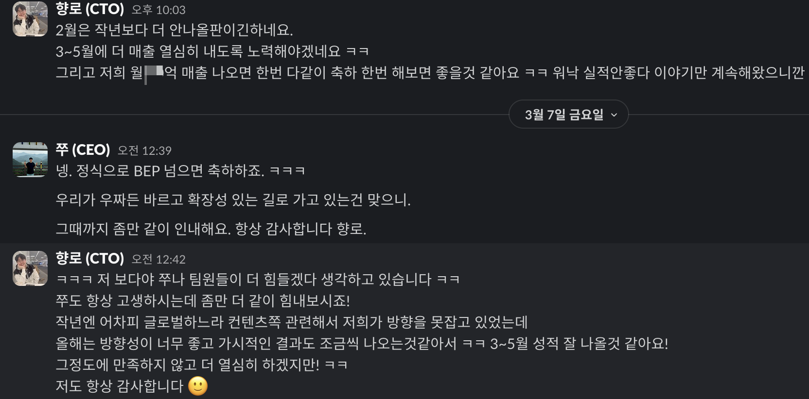

# 2025년 CTO 회고

올 한해 회고를 보는데는 대표인 쭈와의 DM이 전부였다.  
구두로 나눈 내용도 많지만,  
주말이면, 평일 퇴근 이후면, 월요일 오전이면 쭈의 DM이 온다.  

- 인프콘을 안하기로 결정했다.

- 회사내의 개발 프로세스에서 내가 모르는 부분이 크게 늘어나기 시작했다.
  - 내가 모르기 때문에 아는 범위 내에서 하라고 할 것인가
  - 내가 모르기 때문에 그걸 찾아온 팀원에게 전적으로 위임할 것인가
  - 위임한다면 어디까지가 위임이고 어디까지가 방치인가

[이나모리 가즈오의 회계 경영](https://product.kyobobook.co.kr/detail/S000001687459) 을 읽었다.

- 적자내지 않는 기업은 무엇이 다른가?
- 파산 위기에 놓인 기업을 흑자로 돌려세운 CEO는 무엇인 다른가?
- 매번 이익을 낸다는건 어떤 의미일까?

등등이 궁금했다.

올 한해 이처럼 다양한 주제의 책을 읽어봤을까?  
회사의 상황에 따라 "나에게 이런 역량이 있다면 얼마나 좋았을까" 하는 생각을 했다.

대표인 쭈가 내가 무너지지 않을까 걱정을 많이 했다.
제품팀에 어려운 이야기를 해야할 때면 본인이 직접 해도 된다는 이야기도 해줬다.
다만, 그 이야기를 내 입으로 전하지 못하면 내 인생은 거기서 끝날 것 같았다.
좋을때는 직접 얘기하고
안좋을때는 도망치는 리더에게 누가 신뢰를 줄 수 있겠나 싶었다.

이번 크리스마스땐 어디를 가서 뭘 먹을까, 어디를 구경갈까와 같이 함께 하는 미래를 이야기하는 연인에게 헤어지자는 이야기를 꺼내야 한다면 거절당하는것만큼 거절하는 것에도 큰 용기가 필요하다.  
  
물론 어른이 되어가는 과정에서는 거절 당하는 것도, 거절하는 것도 경험해볼 필요가 있다.

인프랩에서의 5년이 지나 6년차 생활이 시작된다.  

요즘은 시간이 남아도 개인 개발을 거의 하지 않고 있다.  
나한테 개발은 일종의 수행, 명상에 가까운 느낌이였다.  
몰입 혹은 플로우에 빠진 상태에서 머릿속에서 생각하는대로 타이핑해가는 과정 자체가 나를 별도의 세계로 넣는 느낌이였다.  
  
근데 AI로 인한 코딩

아마도 싱글 작업 

그렇다면 완성된 무언가를 만드는 그 행위 자체는 꼭 코드여야할 필요는 없는게 아닌가 싶었다.  

역할이 있다보니 당연히 요즘의 구현 과정 자체를 시간내서 할 수 밖에 없다.  
근데 예전같은 감정이 들진 않는다.  
더 좋은 도구를 사용할때의 희열이나 IDE를 커스터마이징하는 그 과정 자체가 의미가 없어지다보니 무엇으로 플로우에 빠질 것인가 하는 고민이 생겼다.  

그래서 더 글에 빠진다.  

더 중요한건 
AI로 인해 무언가를 완성하기가 더 힘들어졌다.  
예전에는 어떻게든 내 힘으로 끝낼 수 밖에 없으니 어떻게든 마무리해서 출시/출고를 했다면, 이제는 

### 1월

- 페이팔 결제수단 추가

### 2월

- 인프런 일본어/베트남어 환경 오픈
- 앱 대시보드 개편

### 3월

- 식물 키우기 오픈
- 멘토링 UI/UX 개선
- 채팅 서비스 오픈
- 강의 미션 기능 추가

### 4월

- AI 퀴즈 오픈
- 강의실 학습 메세지 오픈

### 5월
- 채팅 서비스 오픈

### 6월

- 강의 개설 자동화
- B2B 구독제 오픈
- 랠릿 인재풀 오픈

### 7월

- 선물하기 오픈
- 앱 내 무료강의 검색 
- 마케팅 파트너스 (어필리에이트 마케팅) 오픈

### 8월

- 챌린지 라이브 기능 오픈
- 헤더 등 전체 서비스 UI 개선

### 9월

- 회사 위기
- 챌린지 라이브 기능 추가
- 
### 10월

- 클립 오픈
- 페이코 추가
- 향로 완강 챌린지 시작

### 11월

- 조르기/대신결제 오픈
- 자동 썸네일, 소개 페이지 생성

### 12월

- 앱 오프라인 재생 
- 프로필 페이지 개편
- 강의 제작 과정 다국어화

